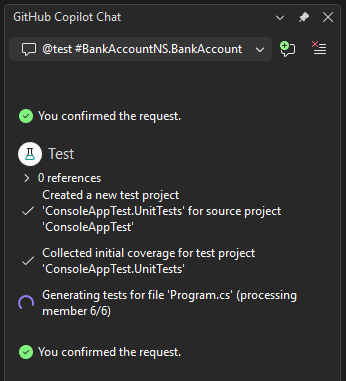

# Generate and run unit tests using GitHub Copilot testing for .NET

Boost confidence in your code quality and improve your test coverage by creating and running unit tests using GitHub Copilot testing for .NET.

Although Copilot can generate unit tests, you get extra testing capability by using GitHub Copilot testing for .NET in Visual Studio, including the following:

- Unit tests are generated in a separate project within the solution.
- Copilot generates tests deterministically, grounded in the C# compiler and language semantics, so assertions and edge cases are predictable and type-safe.
- GitHub Copilot testing builds the unit tests following test generation. If there are errors, the unit testing capability in GitHub Copilot for .NET tries to identify and fix errors, and then re-runs the tests.
- GitHub Copilot testing runs the tests using Test Explorer.

GitHub Copilot testing for .NET generates tests for C# projects only using the MSTest, NUnit, and xUnit frameworks. If the solution already has unit tests in NUnit or xUnit, GitHub Copilot testing for .NET generates new tests in the same unit testing framework. If there are no unit tests in the solution, new tests are generated using MSTest.

## Prerequisites

To get started, you need:

+ Visual Studio 2026 version 18.3 or later
+ C# project
+ [Sign in to Visual Studio using a GitHub account](../ide/work-with-github-accounts.md) with a paid [Copilot subscription](https://docs.github.com/en/copilot/about-github-copilot/what-is-github-copilot#getting-access-to-copilot)

> [!NOTE]
> GitHub Copilot testing for .NET requires a paid GitHub Copilot subscription (individual, business, or enterprise). Free Copilot subscriptions are not supported.

For an introduction to unit testing, see [Unit test basics](../test/unit-test-basics.md).

## Ways to start GitHub Copilot testing

You can start GitHub Copilot testing for .NET in several ways:

- From Copilot Chat, type `@Test` followed by a target or prompt in the Chat window.
- From the editor, right-click to open the context menu and select **Copilot Actions** > **Generate Tests**.
- In a new Copilot Chat thread, select **Write unit tests** from the Copilot Chat icebreaker suggestions.

> [!NOTE]
> The context menu and icebreaker options route to the `@Test` agent automatically when your IDE focus is on C# code. For non-C# projects, these options use a generic Copilot prompt instead.

## Prompt syntax

GitHub Copilot testing supports two prompting methods: structured syntax and freeform prompts.

### Structured syntax

Use the `@Test #<target>` syntax to generate tests for specific code elements:

```cmd
@Test #<target>
```

Where `#<target>` can be:

- A **member**, **class**, **file**, **project**, or **solution**
- A **git diff** to test your current changes (`#git_changes`)
- **Multiple inputs of the same kind** (for example, several classes or several files)

> [!NOTE]
> Mixed input types are not supported. For example, you cannot combine a file and a project in the same prompt.

**Examples**:

- `@Test #BankAccount` — Generate tests for the BankAccount class
- `@Test #git_changes` — Generate tests for your current uncommitted changes
- `@Test #MyProject` — Generate tests for all code in MyProject

### Freeform prompts

Use natural language to describe what you want to test:

```cmd
@Test <your prompt>
```

**Examples**:

| Prompt | Description |
|--------|-------------|
| `@Test class Foo` | Generate tests for a specific class |
| `@Test generate tests for the core logic in my #solution` | Target specific areas of your codebase |
| `@Test write unit tests for my current changes` | Generate tests for uncommitted git changes |
| `@Test fix my failing tests` | Ask Copilot to fix failing tests |
| `@Test class Bar, targeting 80% code coverage` | Specify a coverage target |
| `@Test use xUnit with FluentAssertions` | Specify testing frameworks and conventions |

> [!TIP]
> You can give specific instructions about testing frameworks, mocking libraries, assertion styles, and testing conventions in your freeform prompts.

## Additional commands

GitHub Copilot testing provides commands for help and managing preferences:

| Command | Description |
|---------|-------------|
| `@Test /help` | Display the help message with available commands and syntax |
| `@Test /clear-preferences` | Clear stored user preferences, including consent settings |

## Generate and run tests

1. Open an existing C# project that needs new tests.

   If you don't have an existing project, you can create a new project and then use the Bank sample application code to experiment with unit testing. Copy the starting sample code from [Create and run unit tests for .NET](../test/walkthrough-creating-and-running-unit-tests-for-managed-code.md#create-a-project-to-test) into `Program.cs`.

1. Build the project.

   Make sure the project builds without errors to simplify the process.

1. In Visual Studio, select **View > GitHub Copilot Chat**.

1. Use any of the prompting methods to start GitHub Copilot testing.

   For the Bank sample application, use one of the following:

   - Structured: `@Test #BankAccount`
   - Freeform: `@Test generate comprehensive tests for the BankAccount class`

   > [!NOTE]
   > You can be either in Ask mode or Agent mode when you enter the `@Test` command. The results do not differ.

   The Test command appears in the chat as follows, indicating that the command is recognized.

   

1. In the Chat window, select **Send**.

   GitHub Copilot testing for .NET initiates an iterative process of analyzing your code, creating a new project for the unit tests, generating tests, building, and running the tests.

   Test generation is a long-running process. Depending on the scope of your target (file, project, solution, etc.) it may take a while.

   

   When unit tests are generated, the tests appear in a separate test project in the solution.

   

   Test Explorer shows the results. If Test Explorer is not automatically opened by GitHub Copilot testing, select **Test** > **Test Explorer**.

   

   At this point, you can manually use Test Explorer to continue running tests, or chat with Copilot about the test results. You can also use Copilot to debug failed tests. For more information, see [Debug unit tests](../test/debug-unit-tests-with-test-explorer.md).
