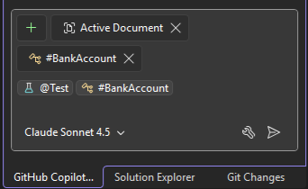
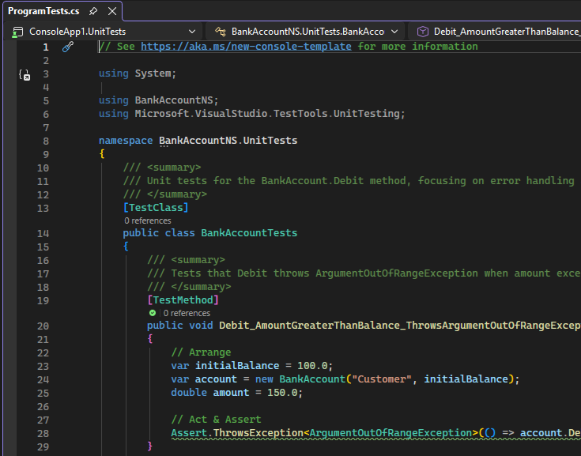
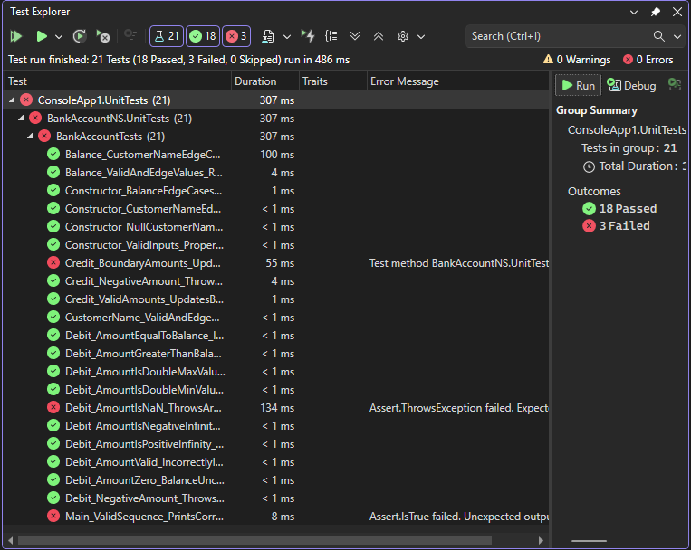

# Generate and run unit tests using the GitHub Copilot Test Agent

In this article, you'll learn how to create, run, and test C# unit tests using the GitHub Copilot Test Agent. 

Although Copilot can generate unit tests, you get extra unit testing feature support by using the GitHub Copilot Test Agent, including the following:

- Unit tests are generated in their own project.
- The Test Agent builds and runs the tests using Test Explorer.
- If there are errors, the Agent tries to identify and fix errors, and then re-runs the tests.

The Test Agent generates tests for C# projects only using the MSTest framework.

## Prerequisites

To get started, you need:

+ Visual Studio 2026 or later
+ [Sign in to Visual Studio using a GitHub account](../ide/work-with-github-accounts.md) with [Copilot access](https://docs.github.com/en/copilot/about-github-copilot/what-is-github-copilot#getting-access-to-copilot) <br/>
  <sup>**</sup> You can use [GitHub Copilot for Free](../ide/copilot-free-plan.md). Sign up and leverage AI to code faster and more efficiently.

## Generate and run unit tests

1. Open an existing C# project that needs new unit tests, or create a new C# project.

   If you create a new project, you can use the unit testing Bank sample code to test the feature. Copy the starting sample code from [Create and run unit tests for .NET](../test/walkthrough-creating-and-running-unit-tests-for-managed-code?view=vs-2022#create-a-project-to-test).

1. Build the project.

   Make sure the project builds without errors to simplify the process.

1. Open Copilot Chat by selecting the GitHub Copilot Chat button.

1. Use the following syntax in the Chat window to start the agent and generate unit tests:

   ```cmd
   @test #target
   ```

   where `#target` can be the name of a solution, project, file, class, or member.

   For the `Bank` example, you can type `@test #Program.cs`.

   

1. In the Chat window, select **Send**.

   The agent starts and initiates an iterative process of analyzing your code, creating a new project for the unit tests, generating unit tests, and running the tests.

   

   Test Explorer shows the results. If Test Explorer is not automatically opened by the agent, select **Test** > **Test Explorer**.

   

   At this point, you can manually use Test Explorer to continue running tests. You can also use Copilot to debug failed unit tests. For more information, see [Debug unit tests](../test/debug-unit-tests-with-test-explorer.md).
