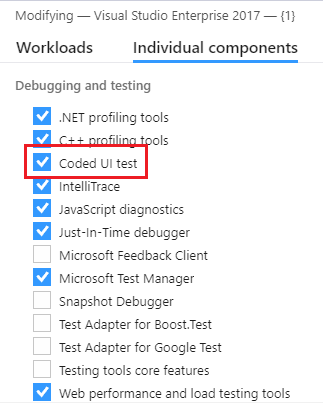
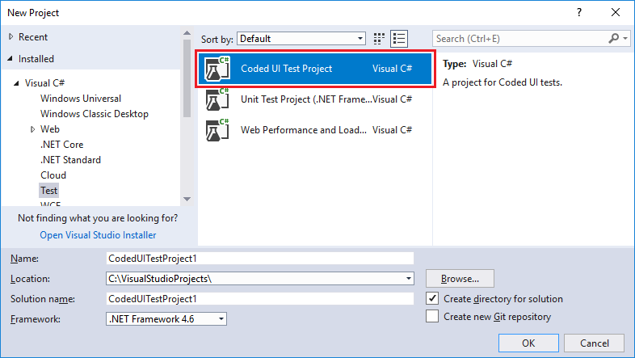
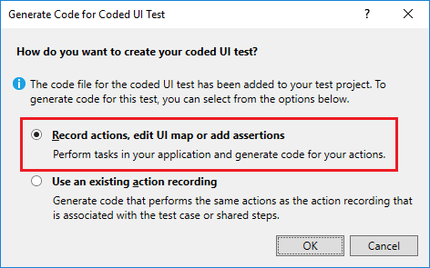

# Use Coded UI test to test your code

Coded UI tests (CUITs) drive your application through its user interface (UI). These tests include functional testing of the UI controls. They let you verify that the whole application, including its user interface, is functioning correctly. Coded UI tests are useful where there is validation or other logic in the user interface, for example in a web page. They are also frequently used to automate an existing manual test.

Creating a Coded UI test in Visual Studio is easy. You simply perform the test manually while **Coded UI Test Builder** runs in the background. You can also specify what values should appear in specific fields. **Coded UI Test Builder** records your actions and generates code from them. After the test is created, you can edit it in a specialized editor that lets you modify the sequence of actions.

The specialized **Coded UI Test Builder** and editor make it easy to create and edit Coded UI tests, even if your main skills are concentrated in testing rather than coding. But if you are a developer and you want to extend the test in a more advanced way, the code is structured so that it is straightforward to copy and adapt. For example, you might record a test to buy something at a website, and then edit the generated code to add a loop that buys many items.

[!INCLUDE [coded-ui-test-deprecation](includes/coded-ui-test-deprecation.md)]

## Requirements

- Visual Studio Enterprise
- Coded UI test component

For more information about which platforms and configurations are supported by Coded UI tests, see [Supported platforms](../test/supported-configurations-and-platforms-for-coded-ui-tests-and-action-recordings.md).

## Install the Coded UI test component

To access the Coded UI test tools and templates, install the **Coded UI test** component of Visual Studio.

1. Launch **Visual Studio Installer** by choosing **Tools** > **Get Tools and Features**.

1. In **Visual Studio Installer**, choose the **Individual components** tab, and then scroll down to the **Debugging and testing** section. Select the **Coded UI test** component.

   

1. Select **Modify**.

## Create a Coded UI test

1. Create a Coded UI test project.

   Coded UI tests must be contained in a Coded UI test project. If you don't already have a Coded UI test project, create one. Choose **File** > **New** > **Project**. Search for and select the **Coded UI Test Project** project template.

   ::: moniker range="vs-2017"

   

   ::: moniker-end

   > [!NOTE]
   > If you don't see the **Coded UI Test Project** template, you need to [install the Coded UI test component](../test/use-ui-automation-to-test-your-code.md#install-the-coded-ui-test-component).

2. Add a Coded UI test file.

     If you just created a Coded UI project, the first CUIT file is added automatically. To add another test file, open the shortcut menu on the Coded UI test project in **Solution Explorer**, and then choose **Add** > **Coded UI Test**.

     In the **Generate Code for Coded UI Test** dialog box, choose **Record actions** > **Edit UI map or add assertions**.

     

     The **Coded UI Test Builder** appears.

     

3. Record a sequence of actions.

     **To start recording**, choose the **Record** icon. Perform the actions that you want to test in your application, including starting the application if that is required. For example, if you are testing a web application, you might start a browser, navigate to the website, and sign in to the application.

     **To pause recording**, for example if you have to deal with incoming mail, choose **Pause**.

    > [!WARNING]
    > All actions performed on the desktop will be recorded. Pause the recording if you are performing actions that may lead to sensitive data being included in the recording.

     **To delete actions** that you recorded by mistake, choose **Edit Steps**.

     **To generate code** that will replicate your actions, choose the **Generate Code** icon and type a name and description for your Coded UI test method.

4. Verify the values in UI fields such as text boxes.

     Choose **Add Assertions** in the **Coded UI Test Builder**, and then choose a UI control in your running application. In the list of properties that appears, select a property, for example, **Text** in a text box. On the shortcut menu, choose **Add Assertion**. In the dialog box, select the comparison operator, the comparison value, and the error message.

     Close the assertion window and choose **Generate Code**.

     

    > [!TIP]
    > Alternate between recording actions and verifying values. Generate code at the end of each sequence of actions or verifications. If you want, you will be able to insert new actions and verifications later.

     For more details, see [Validate properties of controls](#validate-the-properties-of-ui-controls).

5. View the generated test code.

     To view the generated code, close the UI Test Builder window. In the code, you can see the names that you gave to each step. The code is in the CUIT file that you created:

    ```csharp
    [CodedUITest]
    public class CodedUITest1
    { ...
      [TestMethod]
      public void CodedUITestMethod1()
      {
          this.UIMap.AddTwoNumbers();
          this.UIMap.VerifyResultValue();
          // To generate more code for this test, select
          // "Generate Code" from the shortcut menu.
      }
    }
    ```

6. Add more actions and assertions.

   Place the cursor at the appropriate point in the test method and then, on the shortcut menu, choose **Generate Code for Coded UI Test**. New code will be inserted at that point.

7. Edit the detail of the test actions and the assertions.

     Open *UIMap.uitest*. This file opens in the **Coded UI Test Editor**, where you can edit any sequence of actions that you recorded as well as edit your assertions.

     

     For more information, see [Edit Coded UI tests using the Coded UI Test editor](../test/editing-coded-ui-tests-using-the-coded-ui-test-editor.md).

8. Run the test.

   Use Test Explorer, or open the shortcut menu in the test method, and then choose **Run Tests**. For more information about how to run tests, see [Run unit tests with Test Explorer](../test/run-unit-tests-with-test-explorer.md) and *Additional options for running Coded UI tests* in the [What's next?](#whats-next) section at the end of this topic.

The remaining sections in this topic provide more detail about the steps in this procedure.

For a more detailed example, see [Walkthrough: Creating, editing, and maintaining a Coded UI test](../test/walkthrough-creating-editing-and-maintaining-a-coded-ui-test.md). In the walkthrough, you will create a simple Windows Presentation Foundation (WPF) application to demonstrate how to create, edit, and maintain a Coded UI test. The walkthrough provides solutions for correcting tests that have been broken by various timing issues and control refactoring.

## Start and stop the application under test

If you don't want to start and stop the application, browser, or database separately for each test, do one of the following:

- If you do not want to record the actions to start your application under test, you must start your application before you choose the **Record** icon.

- At the end of a test, the process in which the test runs is terminated. If you started your application in the test, the application usually closes.  If you do not want the test to close your application when it exits, add a *.runsettings* file to your solution, and use the `KeepExecutorAliveAfterLegacyRun` option. For more information, see [Configure unit tests by using a .runsettings file](../test/configure-unit-tests-by-using-a-dot-runsettings-file.md).

- Add a test initialize method, identified by a `[TestInitialize]` attribute, which runs code at the start of each test method. For example, you could start the application from the TestInitialize method.

- Add a test cleanup method, identified by a `[TestCleanup]` attribute, that runs code at the end of each test method. For example, the method to close the application could be called from the TestCleanup method.

## Validate the properties of UI controls

You can use the **Coded UI Test Builder** to add a user interface (UI) control to the [UIMap](/previous-versions/dd580454(v=vs.140)) for your test, or to generate code for a validation method that uses an assertion for a UI control.

To generate assertions for your UI controls, choose the **Add Assertions** tool in the **Coded UI Test Builder** and drag it to the control on the application under test that you want to verify is correct. When the box outlines your control, release the mouse. The control class code is immediately created in the *UIMap.Designer.cs* file.


The properties for this control are now listed in the **Add Assertions** dialog box.

Another way of navigating to a particular control is to choose the arrow **(<<)** to expand the view for the **UI Control Map**. To find a parent, sibling, or child control, you can click anywhere on the map and use the arrow keys to move around the tree.


> [!TIP]
> If you don't see any properties when you select a control in your application, or you don't see the control in the UI Control Map, verify that the control has a unique ID in the application code. The unique ID can be an HTML ID attribute or a WPF UId.

Next, open the shortcut menu on the property for the UI control that you want to verify, and then point to **Add Assertion**. In the **Add Assertion** dialog box, select the **Comparator** for your assertion, for example <xref:Microsoft.VisualStudio.TestTools.UnitTesting.Assert.AreEqual%2A>, and type the value for your assertion in **Comparison Value**.


When you have added all your assertions for your test, choose **OK**.

To generate the code for your assertions and add the control to the UI map, choose the **Generate Code** icon. Type a name for your Coded UI test method and a description for the method, which will be added as comments for the method. Choose **Add and Generate**. Next, choose the **Close** icon to close the **Coded UI Test Builder**. This generates code similar to the following code. For example, if the name you entered is `AssertForAddTwoNumbers`, the code will look like this example:

- Adds a call to the assert method AssertForAddTwoNumbers to the test method in your Coded UI test file:

    ```csharp
    [TestMethod]
    public void CodedUITestMethod1()
    {
        this.UIMap.AddTwoNumbers();
        this.UIMap.AssertForAddTwoNumbers();
    }
    ```

     You can edit this file to change the order of the steps and assertions, or to create new test methods. To add more code, place the cursor on the test method and on the shortcut menu choose **Generate Code for Coded UI Test**.

- Adds a method called `AssertForAddTwoNumbers` to your UI map (*UIMap.uitest*). This file opens in the **Coded UI Test Editor**, where you can edit the assertions.

     

     For more information, see [Edit Coded UI tests using the Coded UI test editor](../test/editing-coded-ui-tests-using-the-coded-ui-test-editor.md).

     You can also view the generated code of the assertion method in *UIMap.Designer.cs*. However, you should not edit this file. If you want to make an adapted version of the code, copy the methods to another file such as *UIMap.cs*, rename the methods, and edit them there.

    ```csharp
    public void AssertForAddTwoNumbers()
    {
        ...
    }
    ```

### Select a hidden control using the keyboard

If the control you want to select loses focus and disappears when you select the **Add Assertions** tool from the **Coded UI Test Builder**:

Sometimes, when you add controls and verify their properties, you might have to use the keyboard. For example, when you try to record a Coded UI test that uses a right-click menu control, the list of menu items in the control will lose focus and disappear when you try to select the **Add Assertions** tool from the **Coded UI Test Builder**. This is demonstrated in the following illustration, where the right-click menu in Internet Explorer loses focus and disappears if you try to select it with the **Add Assertions** tool.


To use the keyboard to select a UI control, hover over the control with the mouse. Then hold down the **Ctrl** key and the **I** key at the same time. Release the keys. The control is recorded by the **Coded UI Test Builder**.

#### Manually record mouse hovers

If you can't record a mouse hover on a control:

Under some circumstances, a particular control that's being used in a Coded UI test might require you to use the keyboard to manually record mouse hover events. For example, when you test a Windows Form or a Windows Presentation Foundation (WPF) application, there might be custom code. Or, there might be special behavior defined for hovering over a control, such as a tree node expanding when a user hovers over it. To test circumstances like these, you have to manually notify the **Coded UI Test Builder** that you are hovering over the control by pressing predefined keyboard keys.

When you perform your Coded UI test, hover over the control. Then press and hold **Ctrl**, while you press and hold the **Shift** and **R** keys on your keyboard. Release the keys. A mouse hover event is recorded by the **Coded UI Test Builder**.


After you generate the test method, code similar to the following example will be added to the *UIMap.Designer.cs* file:

```csharp
// Mouse hover '1' label at (87, 9)
Mouse.Hover(uIItem1Text, new Point(87, 9));
```

### Configure mouse-hover keyboard assignments

If the key assignment for capturing mouse hover events is being used elsewhere in my environment:

If necessary, the default keyboard assignment of **Ctrl**+**Shift**+**R** that is used to apply mouse hover events in your Coded UI tests can be configured to use different keys.

> [!WARNING]
> You should not have to change the keyboard assignments for mouse hover events under ordinary circumstances. Use caution when reassigning the keyboard assignment. Your choice might already be in use elsewhere within Visual Studio or the application being tested.

To change the keyboard assignments, modify the following configuration file:

*%ProgramFiles(x86)%\Microsoft Visual Studio\2017\Enterprise\Common7\IDE\CodedUITestBuilder.exe.config*

In the configuration file, change the values for the `HoverKeyModifier` and `HoverKey` keys to modify the keyboard assignments:

```xml
<!-- Begin : Background Recorder Settings -->
<!-- HoverKey to use. -->
<add key="HoverKeyModifier" value="Control, Shift"/>
<add key="HoverKey" value="R"/>
```

### Set implicit mouse hovers for the web browser

If you're having issues recording mouse hovers on a website:

In many websites, when you hover over a particular control, it expands to show additional details. Generally, these look like menus in desktop applications. Because this is a common pattern, Coded UI tests enable implicit hovers for web browsing. For example, if you record hovers in Internet Explorer, an event is fired. These events can lead to redundant hovers getting recorded. Because of this, implicit hovers are recorded with `ContinueOnError` set to `true` in the UI test configuration file. This allows playback to continue if a hover event fails.

To enable the recording of implicit hovers in a web browser, open the configuration file:

*%ProgramFiles(x86)%\Microsoft Visual Studio\2017\Enterprise\Common7\IDE\CodedUITestBuilder.exe.config*

Verify that the configuration file has the key `RecordImplicitiHovers` set to a value of `true` as shown in the following sample:

```xml
<!--Use this to enable/disable recording of implicit hovers.-->
<add key="RecordImplicitHover" value="true"/>
```

## Customize the Coded UI test

After you've created your Coded UI test, you can edit it by using any of the following tools in Visual Studio:

- Use **Coded UI Test Builder** to add additional controls and validation to your tests. See the section [Add controls and validate their properties](#validate-the-properties-of-ui-controls) in this topic.

- **Coded UI Test Editor** lets you easily modify your Coded UI tests. Using **Coded UI Test Editor**, you can locate, view, and edit your test methods. You can also edit UI actions and their associated controls in the UI control map. For more information, see [Edit Coded UI tests using the Coded UI test editor](../test/editing-coded-ui-tests-using-the-coded-ui-test-editor.md).

- **Code Editor:**

  - Manually add code for the controls in your test as described in the [Coded UI control actions and properties](#coded-ui-control-actions-and-properties) section in this topic.

  - After you create a Coded UI test, you can modify it to be data-driven. For more information, see [Create a data-driven Coded UI test](../test/creating-a-data-driven-coded-ui-test.md).

  - In a Coded UI test playback, you can instruct the test to wait for certain events to occur, such as a window to appear, the progress bar to disappear, and so on. To do this, add the appropriate UITestControl.WaitForControlXXX() method. For a complete list of the available methods, see [Make coded UI tests wait for specific events during playback](../test/making-coded-ui-tests-wait-for-specific-events-during-playback.md). For an example of a Coded UI test that waits for a control to be enabled using the WaitForControlEnabled method, see [Walkthrough: Creating, editing and maintaining a coded UI test](../test/walkthrough-creating-editing-and-maintaining-a-coded-ui-test.md).

  - Coded UI tests include support for some of the HTML5 controls that are included in Internet Explorer 9 and Internet Explorer 10. For more information, see [Using HTML5 controls in coded UI tests](../test/using-html5-controls-in-coded-ui-tests.md).

  - Coded UI test coding guidance:

    - [Anatomy of a coded UI test](../test/anatomy-of-a-coded-ui-test.md)

    - [Best practices for coded UI tests](../test/best-practices-for-coded-ui-tests.md)

    - [Test a large application with multiple UI Maps](../test/testing-a-large-application-with-multiple-ui-maps.md)

    - [Supported configurations and platforms for coded UI tests and action recordings](../test/supported-configurations-and-platforms-for-coded-ui-tests-and-action-recordings.md)

### The generated code

When you choose **Generate Code**, several pieces of code are created:

- A line in the test method.

    ```csharp
    [CodedUITest]
    public class CodedUITest1
    { ...
      [TestMethod]
      public void CodedUITestMethod1()
      {
          this.UIMap.AddTwoNumbers();
          // To generate more code for this test, select
          // "Generate Code" from the shortcut menu.      }
    }
    ```

     You can right-click in this method to add more recorded actions and verifications. You can also edit it manually to extend or modify the code. For example, you could enclose some of the code in a loop.

     You can also add new test methods and add code to them in the same way. Each test method must have the `[TestMethod]` attribute.

- A method in *UIMap.uitest*.

     This method includes the detail of the actions you recorded or the value that you verified. You can edit this code by opening *UIMap.uitest*. It opens in a specialized editor in which you can delete or refactor the recorded actions.

     You can also view the generated method in *UIMap.Designer.cs*. This method performs the actions that you recorded when you run the test.

    ```csharp
    // File: UIMap.Designer.cs
    public partial class UIMap
    {
      /// <summary>
      /// Add two numbers
      /// </summary>
      public void AddTwoNumbers()
      { ...   }
    }
    ```

    > [!WARNING]
    > You should not edit this file, because it will be regenerated when you create more tests.

     You can make adapted versions of these methods by copying them to *UIMap.cs*. For example, you could make a parameterized version that you could call from a test method:

    ```csharp
    // File: UIMap.cs
    public partial class UIMap // Same partial class
    {
      /// <summary>
      /// Add two numbers - parameterized version
      /// </summary>
      public void AddTwoNumbers(int firstNumber, int secondNumber)
      { ...   // Code modified to use parameters.
      }
    }
    ```

- Declarations in *UIMap.uitest*.

    These declarations represent the UI controls of the application that are used by your test. They are used by the generated code to operate the controls and access their properties.

    You can also use them if you write your own code. For example, you can have your test method choose a hyperlink in a web application, type a value in a text box, or branch off and take different testing actions based on a value in a field.

    You can add multiple Coded UI tests and multiple UI map objects and files to facilitate testing a large application. For more information, see [Test a large application with multiple UI Maps](../test/testing-a-large-application-with-multiple-ui-maps.md).

For more information about the generated code, see [Anatomy of a coded UI test](../test/anatomy-of-a-coded-ui-test.md).

## Coded UI control actions and properties

When you work with UI test controls in Coded UI tests they are separated into two parts: actions and properties.

- The first part consists of actions that you can perform on UI test controls. For example, Coded UI tests can simulate mouse clicks on a UI test control, or simulate keys typed on the keyboard to affect a UI test control.

- The second part consists of enabling you to get and set properties on a UI test control. For example, Coded UI tests can get the count of items in a `ListBox`, or set a `CheckBox` to the selected state.

**Accessing Actions of UI Test Control**

To perform actions on UI test controls, such as mouse clicks or keyboard actions, use the methods in the <xref:Microsoft.VisualStudio.TestTools.UITesting.Mouse> and <xref:Microsoft.VisualStudio.TestTools.UITesting.Keyboard> classes:

- To perform a mouse-oriented action, such as a mouse click, on a UI test control, use <xref:Microsoft.VisualStudio.TestTools.UITesting.Mouse.Click%2A>.

     `Mouse.Click(buttonCancel);`

- To perform a keyboard-oriented action, such as typing into an edit control, use <xref:Microsoft.VisualStudio.TestTools.UITesting.Keyboard.SendKeys%2A>.

     `Keyboard.SendKeys(textBoxDestination, @"C:\Temp\Output.txt");`

**Accessing Properties of UI Test Control**

To get and set UI control specific property values, you can directly get or set the values the properties of a control, or you can use the  <xref:Microsoft.VisualStudio.TestTools.UITesting.UITestControl.GetProperty%2A?displayProperty=fullName> and <xref:Microsoft.VisualStudio.TestTools.UITesting.UITestControl.SetProperty%2A?displayProperty=fullName> methods with the name of the specific property that you want you get or set.

<xref:Microsoft.VisualStudio.TestTools.UITesting.UITestControl.GetProperty%2A> returns an object, which can then be cast to the appropriate <xref:System.Type>. <xref:Microsoft.VisualStudio.TestTools.UITesting.UITestControl.SetProperty%2A> accepts an object for the value of the property.

### To get or set properties from UI test controls directly

With controls that derive from <xref:Microsoft.VisualStudio.TestTools.UITesting.UITestControl>, such as [HtmlList](xref:Microsoft.VisualStudio.TestTools.UITesting.HtmlControls.HtmlList) or [WinComboBox](xref:Microsoft.VisualStudio.TestTools.UITesting.WinControls.WinComboBox), you can get or set their property values directly. The following code shows some examples:

```csharp
int i = myHtmlList.ItemCount;
myWinCheckBox.Checked = true;
```

### To get properties from UI test controls

- To get a property value from a control, use <xref:Microsoft.VisualStudio.TestTools.UITesting.UITestControl.GetProperty%2A>.

- To specify the property of the control to get, use the appropriate string from the `PropertyNames` class in each control as the parameter to <xref:Microsoft.VisualStudio.TestTools.UITesting.UITestControl.GetProperty%2A>.

- <xref:Microsoft.VisualStudio.TestTools.UITesting.UITestControl.GetProperty%2A> returns the appropriate data type, but this return value is cast as an <xref:System.Object>. The return <xref:System.Object> must then be cast as the appropriate type.

     Example:

     `int i = (int)GetProperty(myHtmlList.PropertyNames.ItemCount);`

### To set properties for UI test controls

- To set a property in a control, use <xref:Microsoft.VisualStudio.TestTools.UITesting.UITestControl.SetProperty%2A>.

- To specify the property of the control to set, use the appropriate string from the  `PropertyNames` class as the first parameter to <xref:Microsoft.VisualStudio.TestTools.UITesting.UITestControl.SetProperty%2A>, with the property value as the second parameter.

     Example:

     `SetProperty(myWinCheckBox.PropertyNames.Checked, true);`

## Debug

You can analyze Coded UI tests using Coded UI test logs. Coded UI test logs filter and record important information about your Coded UI test runs. The format of the logs lets you debug issues quickly. For more information, see [Analyze coded UI tests using coded UI test logs](../test/analyzing-coded-ui-tests-using-coded-ui-test-logs.md).

## What's next?

**Additional options for running Coded UI tests:** You can run Coded UI tests directly from Visual Studio, as described earlier in this topic. Additionally, you can run automated UI tests from Microsoft Test Manager, or using Azure Pipelines. When Coded UI tests are automated, they have to interact with the desktop when you run them, unlike other automated tests.

- [Run unit tests with Test Explorer](../test/run-unit-tests-with-test-explorer.md)

- [Run tests in your build process](/azure/devops/pipelines/test/getting-started-with-continuous-testing?view=vsts)

- [How to: Set up your test agent to run tests that interact with the desktop](https://msdn.microsoft.com/Library/3a94dd07-6d17-402c-ae8f-7947143755c9)

**Adding support for custom controls:**  The Coded UI testing framework does not support every possible UI and might not support the UI you want to test. For example, you cannot immediately create a Coded UI test of the UI for Microsoft Excel. However, you can create an extension to the Coded UI testing framework that supports a custom control.

- [Enable coded UI testing of your controls](../test/enable-coded-ui-testing-of-your-controls.md)

- [Extend coded UI tests and action recordings](../test/extending-coded-ui-tests-and-action-recordings-to-support-microsoft-excel.md)

Coded UI tests are often used to automate manual tests. For more information about manual tests, see [Run manual tests with Microsoft Test Manager](/azure/devops/test/mtm/run-manual-tests-with-microsoft-test-manager?view=vsts). For more information about automated tests, see [Test tools in Visual Studio](../test/improve-code-quality.md).

## See also

- [Record and play back manual tests](/azure/devops/test/mtm/record-play-back-manual-tests?view=vsts)
- [Xamarin.UITest](/appcenter/test-cloud/uitest/)
- <xref:Microsoft.VisualStudio.TestTools.UnitTesting.Assert>
- [Walkthrough: Create, edit, and maintain a Coded UI test](../test/walkthrough-creating-editing-and-maintaining-a-coded-ui-test.md)
- [Create a Coded UI test to test a UWP app](test-uwp-app-with-coded-ui-test.md)
- [Anatomy of a Coded UI test](../test/anatomy-of-a-coded-ui-test.md)
- [Best practices for Coded UI tests](../test/best-practices-for-coded-ui-tests.md)
- [Test a large application with multiple UI Maps](../test/testing-a-large-application-with-multiple-ui-maps.md)
