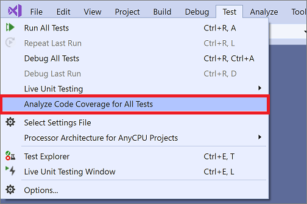
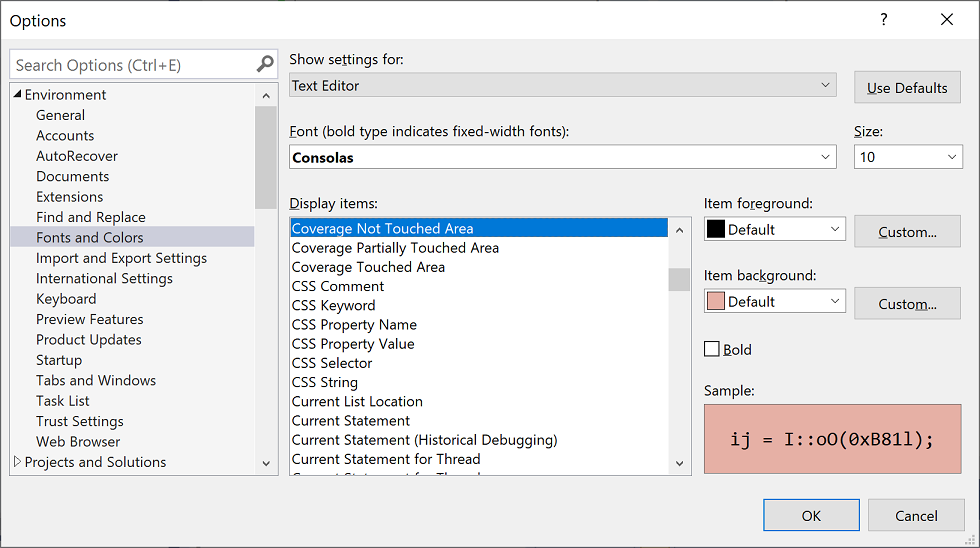

# Use code coverage to determine how much code is being tested

To determine what proportion of your project's code is actually being tested by coded tests such as unit tests, you can use the code coverage feature of Visual Studio. To guard effectively against bugs, your tests should exercise or 'cover' a large proportion of your code.

Code coverage analysis can be applied to both managed (CLI) and unmanaged (native) code.

Code coverage is an option when you run test methods using Test Explorer. The results table shows the percentage of the code that was run in each assembly, class, and method. In addition, the source editor shows you which code has been tested.

::: moniker range="vs-2017"


::: moniker-end

## Requirements

The code coverage feature is available only in Visual Studio Enterprise edition.

## Analyze code coverage

::: moniker range="vs-2017"

1. On the **Test** menu, choose **Analyze Code Coverage**.

::: moniker-end

::: moniker range=">=vs-2019"

1. On the **Test** menu, select **Analyze Code Coverage for All Tests**.

   

   You can also run code coverage from the Test Explorer tool window.

::: moniker-end

2. After the tests have run, to see which lines have been run, choose  **Show Code Coverage Coloring** in the **Code Coverage Results** window. By default, code that is covered by tests is highlighted in light blue.

   > [!TIP]
   > To change the colors or to use bold face, choose **Tools** > **Options** > **Environment** > **Fonts and Colors** > **Show settings for: Text Editor**. Under **Display items**, adjust settings for the "Coverage" items, for example, **Coverage Not Touched Area**.
   >
   > 

3. If the results show low coverage, investigate which parts of the code are not being exercised, and write more tests to cover them. Development teams typically aim for about 80% code coverage. In some situations, lower coverage is acceptable. For example, lower coverage is acceptable where some code is generated from a standard template.

> [!TIP]
> - Turn compiler optimization off
> - If you're working with unmanaged (native) code, use a debug build
> - Generate .pdb (symbol) files for each assembly

If you don't get the results you expect, see [Troubleshoot code coverage](../test/troubleshooting-code-coverage.md).

Don't forget to run code coverage again after updating your code. Coverage results and code coloring are not automatically updated after you modify your code or when you run tests.

## Report in blocks or lines

Code coverage is counted in *blocks*. A block is a piece of code with exactly one entry and exit point.  If the program's control flow passes through a block during a test run, that block is counted as covered. The number of times the block is used has no effect on the result.

You can also have the results displayed in terms of lines by choosing **Add/Remove Columns** in the table header. Some users prefer a count of lines because the percentages correspond more closely to the size of the fragments that you see in the source code. A long block of calculation would count as a single block even if it occupies many lines.

> [!TIP]
> A line of code can contain more than one code block. If this is the case, and the test run exercises all the code blocks in the line, it is counted as one line. If some but not all code blocks in the line are exercised, it is counted as a partial line.

## Manage code coverage results

The **Code Coverage Results** window usually shows the result of the most recent run. The results will vary if you change your test data, or if you run only some of your tests each time.

The code coverage window can also be used to view previous results, or results obtained on other computers.

You can merge the results of several runs, for example from runs that use different test data.

- **To view a previous set of results**, select it from the drop-down menu. The menu shows a temporary list that is cleared when you open a new solution.

- **To view results from a previous session**, choose **Import Code Coverage Results**, navigate to the **TestResults** folder in your solution, and import a *.coverage* file.

   The coverage coloring might be incorrect if the source code has changed since the *.coverage* file was generated.

- **To make results readable as text**, choose **Export Code Coverage Results**. This generates a readable *.coveragexml* file, which you could process with other tools or send easily in mail.

- **To send results to someone else**, send either a *.coverage* file or an exported *.coveragexml* file. They can then import the file. If they have the same version of the source code, they can see coverage coloring.

## Merge results from different runs

In some situations, different blocks in your code will be used depending on the test data. Therefore, you might want to combine the results from different test runs.

For example, suppose that when you run a test with input "2", you find that 50% of a particular function is covered. When you run the test a second time with the input "-2", you see in the coverage coloring view that the other 50% of the function is covered. Now you merge the results from the two test runs, and the report and coverage coloring view show that 100% of the function was covered.

Use  **Merge Code Coverage Results** to do this. You can choose any combination of recent runs or imported results. If you want to combine exported results, you must import them first.

Use **Export Code Coverage Results** to save the results of a merge operation.

### Limitations in merging

- If you merge coverage data from different versions of the code, the results are shown separately, but they are not combined. To get fully combined results, use the same build of the code, changing only the test data.

- If you merge a results file that has been exported and then imported, you can only view the results by lines, not by blocks. Use the **Add/Remove Columns** command to show the line data.

- If you merge results from tests of an ASP.NET project, the results for the separate tests are displayed, but not combined. This applies only to the ASP.NET artifacts themselves: results for any other assemblies will be combined.

## Exclude elements from the code coverage results

You might want to exclude specific elements in your code from the coverage scores, for example if the code is generated from a text template. Add the <xref:System.Diagnostics.CodeAnalysis.ExcludeFromCodeCoverageAttribute?displayProperty=fullName> attribute to any of the following code elements: class, struct, method, property, property setter or getter, event.

> [!TIP]
> Excluding a class does not exclude its derived classes.

For example:

```csharp
using System.Diagnostics.CodeAnalysis;
...
public class ExampleClass1
{
    [ExcludeFromCodeCoverage]
    void ExampleMethod() {...}

    [ExcludeFromCodeCoverage] // exclude property
    int ExampleProperty1
    { get {...} set{...}}

    int ExampleProperty2
    {
        get
        {
            ...
        }
        [ExcludeFromCodeCoverage] // exclude setter
        set
        {
            ...
        }
    }

}
[ExcludeFromCodeCoverage]
class ExampleClass2 { ... }
```

```vb
Imports System.Diagnostics.CodeAnalysis

Class ExampleClass1
    <ExcludeFromCodeCoverage()>
    Public Sub ExampleSub1()
        ...
    End Sub

    ' Exclude property
    < ExcludeFromCodeCoverage()>
    Property ExampleProperty1 As Integer
        ...
    End Property

    ' Exclude setter
    Property ExampleProperty2 As Integer
        Get
            ...
        End Get
        <ExcludeFromCodeCoverage()>
        Set(ByVal value As Integer)
            ...
        End Set
    End Property
End Class

<ExcludeFromCodeCoverage()>
Class ExampleClass2
...
End Class
```

```cpp
// A .cpp file compiled as managed (CLI) code.
using namespace System::Diagnostics::CodeAnalysis;
...
public ref class ExampleClass1
{
  public:
    [ExcludeFromCodeCoverage]
    void ExampleFunction1() { ... }

    [ExcludeFromCodeCoverage]
    property int ExampleProperty2 {...}

    property int ExampleProperty2 {
      int get() { ... }
     [ExcludeFromCodeCoverage]
      void set(int value) { ...  }
   }
}

[ExcludeFromCodeCoverage]
public ref class ExampleClass2
{ ... }
```

### Exclude elements in Native C++ code

To exclude unmanaged (native) elements in C++ code:

```cpp
#include <CodeCoverage\CodeCoverage.h>
...

// Exclusions must be compiled as unmanaged (native):
#pragma managed(push, off)

// Exclude a particular function:
ExcludeFromCodeCoverage(Exclusion1, L"MyNamespace::MyClass::MyFunction");

// Exclude all the functions in a particular class:
ExcludeFromCodeCoverage(Exclusion2, L"MyNamespace::MyClass2::*");

// Exclude all the functions generated from a particular template:
ExcludeFromCodeCoverage(Exclusion3, L"*::MyFunction<*>");

// Exclude all the code from a particular .cpp file:
ExcludeSourceFromCodeCoverage(Exclusion4, L"*\\unittest1.cpp");

// After setting exclusions, restore the previous managed/unmanaged state:
#pragma managed(pop)
```

Use the following macros:

`ExcludeFromCodeCoverage(` *ExclusionName* `, L"` *FunctionName* `");`

`ExcludeSourceFromCodeCoverage(` *ExclusionName* `, L"` *SourceFilePath* `");`

- *ExclusionName* is any unique name.

- *FunctionName* is a fully qualified function name. It may contain wildcards. For example, to exclude all the functions of a class, write `MyNamespace::MyClass::*`

- *SourceFilePath* is the local or UNC path of a .cpp file. It may contain wildcards. The following example excludes all files in a particular directory: `\\MyComputer\Source\UnitTests\*.cpp`

- `#include <CodeCoverage\CodeCoverage.h>`

- Place calls to the exclusion macros in the global namespace, not within any namespace or class.

- You can place the exclusions either in the unit test code file or the application code file.

- The exclusions must be compiled as unmanaged (native) code, either by setting the compiler option or by using `#pragma managed(off)`.

> [!NOTE]
> To exclude functions in C++/CLI code, apply the attribute `[System::Diagnostics::CodeAnalysis::ExcludeFromCodeCoverage]` to the function. This is the same as for C#.

### Include or exclude additional elements

Code coverage analysis is performed only on assemblies that are loaded and for which a *.pdb* file is available in the same directory as the *.dll* or *.exe* file. Therefore in some circumstances, you can extend the set of assemblies that is included by getting copies of the appropriate *.pdb* files.

You can exercise more control over which assemblies and elements are selected for code coverage analysis by writing a *.runsettings* file. For example, you can exclude assemblies of particular kinds without having to add attributes to their classes. For more information, see [Customize code coverage analysis](../test/customizing-code-coverage-analysis.md).

## Analyze code coverage in Azure Pipelines

When you check in your code, your tests run on the build server along with tests from other team members. It's useful to analyze code coverage in Azure Pipelines to get the most up-to-date and comprehensive picture of coverage in the whole project. It also includes automated system tests and other coded tests that you don't usually run on the development machines. For more information, see [Run unit tests with your builds](/azure/devops/pipelines/test/getting-started-with-continuous-testing?view=vsts).

## Analyze code coverage from the command line

To run tests from the command line, use *vstest.console.exe*. Code coverage is an option of the *vstest.console.exe* utility.

1. Launch the Developer Command Prompt for Visual Studio:

   ::: moniker range="vs-2017"

   In the Windows **Start** menu, choose **Visual Studio 2017** > **Developer Command Prompt for VS 2017**.

   ::: moniker-end

   ::: moniker range=">=vs-2019"

   In the Windows **Start** menu, choose **Visual Studio 2019** > **Developer Command Prompt for VS 2019**.

   ::: moniker-end

2. At the command prompt, run the following command:

   ```shell
   vstest.console.exe MyTestAssembly.dll /EnableCodeCoverage
   ```

For more information, see [VSTest.Console.exe command-line options](vstest-console-options.md).

## Troubleshoot

If you do not see code coverage results, the [Troubleshoot code coverage](../test/troubleshooting-code-coverage.md) article might help you.

## See also

- [Customize code coverage analysis](../test/customizing-code-coverage-analysis.md)
- [Troubleshoot code coverage](../test/troubleshooting-code-coverage.md)
- [Unit test your code](../test/unit-test-your-code.md)
