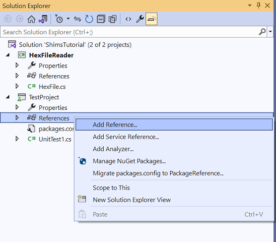
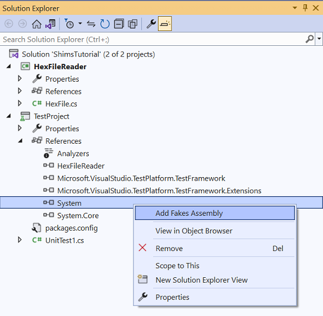
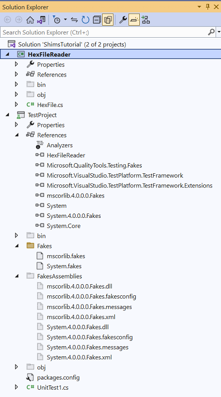

# Use shims to isolate your app for unit testing

**Shim types**, one of the two key technologies utilized by the Microsoft Fakes Framework, are instrumental in isolating the components of your app during testing. They work by intercepting and diverting calls to specific methods, which you can then direct to custom code within your test. This feature enables you to manage the outcome of these methods, ensuring the results are consistent and predictable during each call, regardless of external conditions. This level of control streamlines the testing process and aids in achieving more reliable and accurate results.

Employ **shims** when you need to create a boundary between your code and assemblies that do not form part of your solution. When the aim is to isolate components of your solution from each other, the use of **stubs** is recommended.

(For a more detailed description for stubs, see [Use stubs to isolate parts of your application from each other for unit testing](../test/using-stubs-to-isolate-parts-of-your-application-from-each-other-for-unit-testing.md).)

## Shims limitations

It is important to note that shims do have their limitations. 

Shims cannot be used on all types from certain libraries in the .NET base class, specifically **mscorlib** and **System** in the .NET Framework, and in **System.Runtime** in .NET Core or .NET 5+. This constraint should be taken into account during the test planning and design stage to ensure a successful and effective testing strategy.

## Creating a Shim: A Step-by-Step Guide

Suppose your component contains calls to `System.IO.File.ReadAllLines`:

```csharp
// Code under test:
this.Records = System.IO.File.ReadAllLines(path);
```

### Create a Class Library

1. Open Visual Studio and create a `Class Library` project

   

2. Set project name `HexFileReader`
3. Set solution name `ShimsTutorial`.
4. Set the project's target framework to *.NET Framework 4.8*
5. Delete the default file `Class1.cs`
6. Add a new file `HexFile.cs` and add the following class definition:

    #### [C#](#tab/csharp)
    ```csharp
    // HexFile.cs
    public class HexFile
    {
        public string[] Records { get; private set; }

        public HexFile(string path)
        {
            this.Records = System.IO.File.ReadAllLines(path);
        }
    }
    ```
    
    #### [VB](#tab/vb)
    ```vb
    ' HexFile.vb
    Public Class HexFile
        Public Property Records As String()

        Public Sub New(ByVal path As String)
            Me.Records = System.IO.File.ReadAllLines(path)
        nd Sub
    End Class
    ```
    ---
    
### Create a Test Project

1. Right-click on the solution and add a new project `MSTest Test Project`
2. Set project name `TestProject`
3. Set the project's target framework to *.NET Framework 4.8*

   

### Add Fakes Assembly

1. Add a project reference to `HexFileReader` 

   

2. Add Fakes Assembly

   - In **Solution Explorer**, 
       - For an older .NET Framework Project (non-SDK style), expand your unit test project's **References** node.

       - For an SDK-style project targeting .NET Framework, .NET Core, or .NET 5+, expand the **Dependencies** node to find the assembly you would like to fake under **Assemblies**, **Projects**, or **Packages**.

       - If you're working in Visual Basic, select **Show All Files** in the **Solution Explorer** toolbar to see the **References** node.
       
   - Select the assembly `System` that contains the definition of `System.IO.File.ReadAllLines`.

   - On the shortcut menu, select **Add Fakes Assembly**.

   

Since building results in some warnings and errors because not all types can be used with shims, you will have to modify the content of `Fakes\mscorlib.fakes` to exclude them.

```xml
<Fakes xmlns="http://schemas.microsoft.com/fakes/2011/" Diagnostic="true">
  <Assembly Name="mscorlib" Version="4.0.0.0"/>
  <StubGeneration>
    <Clear/>
  </StubGeneration>
  <ShimGeneration>
    <Clear/>
    <Add FullName="System.IO.File"/>
    <Remove FullName="System.IO.FileStreamAsyncResult"/>
    <Remove FullName="System.IO.FileSystemEnumerableFactory"/>
    <Remove FullName="System.IO.FileInfoResultHandler"/>
    <Remove FullName="System.IO.FileSystemInfoResultHandler"/>
    <Remove FullName="System.IO.FileStream+FileStreamReadWriteTask"/>
    <Remove FullName="System.IO.FileSystemEnumerableIterator"/>
  </ShimGeneration>
</Fakes>
```

### Create a unit test

1. Modify the default file `UnitTest1.cs` to add the following `TestMethod` 

    #### [C#](#tab/csharp)
    ```csharp
    [TestMethod]
    public void TestFileReadAllLine()
    {
        using (ShimsContext.Create())
        {
            // Arrange
            System.IO.Fakes.ShimFile.ReadAllLinesString = (s) => new string[] { "Hello", "World", "Shims" };

            // Act
            var target = new HexFile("this_file_doesnt_exist.txt");

            Assert.AreEqual(3, target.Records.Length);
        }
    }
    ```

    #### [VB](#tab/vb)
    ```vb
    <TestMethod>
    Public Sub TestFileReadAllLine()
        Using ShimsContext.Create()
            ' Arrange
            System.IO.Fakes.ShimFile.ReadAllLinesString = Function(s) New String() {"Hello", "World", "Shims"}

            ' Act
            Dim target = New HexFile("this_file_doesnt_exist.txt")

            Assert.AreEqual(3, target.Records.Length)
        End Using
    End Sub
    ```
    ---
    
   Here is the Solution Explorer showing all the files

   

2. Open Test Explorer and run the test.

It's critical to properly dispose each shim context. As a rule of thumb, call the `ShimsContext.Create` inside of a `using` statement to ensure proper clearing of the registered shims. For example, you might register a shim for a test method that replaces the `DateTime.Now` method with a delegate that always returns the first of January 2000. If you forget to clear the registered shim in the test method, the rest of the test run would always return the first of January 2000 as the `DateTime.Now` value. This might be surprising and confusing.

---

## Naming Conventions for Shim Classes

Shim class names are made up by prefixing `Fakes.Shim` to the original type name. Parameter names are appended to the method name. (You don't have to add any assembly reference to System.Fakes.)

```csharp
    System.IO.File.ReadAllLines(path);
```

```csharp
    System.IO.Fakes.ShimFile.ReadAllLinesString = (path) => new string[] { "Hello", "World", "Shims" };
```
---

## Understanding How Shims Work

Shims operate by introducing *detours* into the codebase of the application being tested. Whenever there's a call to the original method, the Fakes system intervenes to redirect that call, causing your custom shim code to execute instead of the original method.

It's important to note that these detours are created and removed dynamically at runtime. Detours should always be created within the lifespan of a `ShimsContext`. When the ShimsContext is disposed, any active shims that were created within it are also removed. To manage this efficiently, it's recommended to encapsulate the creation of detours within a `using` statement.

---

## Shims for different kinds of methods

Shims support various types of methods.

### Static methods

When shimming static methods, properties that hold shims are housed within a shim type. These properties only possess a setter, which is used to attach a delegate to the targeted method. For instance, if we have a class called `MyClass` with a static method `MyMethod`:

```csharp
//code under test
public static class MyClass {
    public static int MyMethod() {
        ...
    }
}
```
We can attach a shim to `MyMethod` such that it constantly returns 5:

```csharp
// unit test code
ShimMyClass.MyMethod = () => 5;
```

### Instance methods (for all instances)

Just like static methods, instance methods can also be shimmed for all instances. The properties that hold these shims are placed in a nested type named AllInstances to prevent confusion. If we have a class `MyClass` with an instance method `MyMethod`:

```csharp
// code under test
public class MyClass {
    public int MyMethod() {
        ...
    }
}
```
We can attach a shim to `MyMethod` so that it consistently returns 5, regardless of the instance:

```csharp
// unit test code
ShimMyClass.AllInstances.MyMethod = () => 5;
```

The generated type structure of `ShimMyClass` would appear as follows:

```csharp
// Fakes generated code
public class ShimMyClass : ShimBase<MyClass> {
    public static class AllInstances {
        public static Func<MyClass, int>MyMethod {
            set {
                ...
            }
        }
    }
}
```

In this scenario, Fakes passes the runtime instance as the first argument of the delegate.

### Instance methods (Single Runtime Instance)

Instance methods can also be shimmed using different delegates, depending on the call's receiver. This allows the same instance method to exhibit different behaviors per instance of the type. The properties that hold these shims are instance methods of the shim type itself. Each instantiated shim type is linked to a raw instance of a shimmed type.

For example, given a class `MyClass` with an instance method `MyMethod`:

```csharp
// code under test
public class MyClass {
    public int MyMethod() {
        ...
    }
}
```

We can create two shim types for `MyMethod` such that the first consistently returns 5 and the second consistently returns 10:

```csharp
// unit test code
var myClass1 = new ShimMyClass()
{
    MyMethod = () => 5
};
var myClass2 = new ShimMyClass { MyMethod = () => 10 };
```

The generated type structure of `ShimMyClass` would appear as follows:

```csharp
// Fakes generated code
public class ShimMyClass : ShimBase<MyClass> {
    public Func<int> MyMethod {
        set {
            ...
        }
    }
    public MyClass Instance {
        get {
            ...
        }
    }
}
```

The actual shimmed type instance can be accessed through the Instance property:

```csharp
// unit test code
var shim = new ShimMyClass();
var instance = shim.Instance;
```

The shim type also includes an implicit conversion to the shimmed type, allowing you to use the shim type directly:

```csharp
// unit test code
var shim = new ShimMyClass();
MyClass instance = shim; // implicit cast retrieves the runtime instance
```

---

## Constructors

Constructors are no exception to shimming; they too can be shimmed to attach shim types to objects that will be created in the future. For instance, every constructor is represented as a static method, named `Constructor`, within the shim type. Let's consider a class `MyClass` with a constructor that accepts an integer:

```csharp
public class MyClass {
    public MyClass(int value) {
        this.Value = value;
    }
    ...
}
```

A shim type for the constructor can be set up such that, irrespective of the value passed to the constructor, every future instance will return -5 when the Value getter is invoked:

```csharp
// unit test code
ShimMyClass.ConstructorInt32 = (@this, value) => {
    var shim = new ShimMyClass(@this) {
        ValueGet = () => -5
    };
};
```

Each shim type exposes two types of constructors. The default constructor should be used when a new instance is needed, whereas the constructor that takes a shimmed instance as an argument should only be used in constructor shims:

```csharp
// unit test code
public ShimMyClass() { }
public ShimMyClass(MyClass instance) : base(instance) { }
```
The structure of the generated type for `ShimMyClass` can be illustrated as follows:

```csharp
// Fakes generated code
public class ShimMyClass : ShimBase<MyClass>
{
    public static Action<MyClass, int> ConstructorInt32 {
        set {
            ...
        }
    }

    public ShimMyClass() { }
    public ShimMyClass(MyClass instance) : base(instance) { }
    ...
}
```

### Accessing Base members

Shim properties of base members can be reached by creating a shim for the base type and inputting the child instance into the constructor of the base shim class.

For instance, consider a class `MyBase` with an instance method `MyMethod` and a subtype `MyChild`:

```csharp
public abstract class MyBase {
    public int MyMethod() {
        ...
    }
}

public class MyChild : MyBase {
}
```

A shim of `MyBase` can be set up by initiating a new `ShimMyBase` shim:

```csharp
// unit test code
var child = new ShimMyChild();
new ShimMyBase(child) { MyMethod = () => 5 };
```

It's important to note that when passed as a parameter to the base shim constructor, the child shim type is implicitly converted to the child instance.

The structure of the generated type for `ShimMyChild` and `ShimMyBase` can be likened to the following code:

```csharp
// Fakes generated code
public class ShimMyChild : ShimBase<MyChild> {
    public ShimMyChild() { }
    public ShimMyChild(Child child)
        : base(child) { }
}
public class ShimMyBase : ShimBase<MyBase> {
    public ShimMyBase(Base target) { }
    public Func<int> MyMethod
    { set { ... } }
}
```

### Static constructors

Shim types expose a static method `StaticConstructor` to shim the static constructor of a type. Since static constructors are executed once only, you need to make sure that the shim is configured before any member of the type is accessed.

### Finalizers

Finalizers are not supported in Fakes.

### Private methods

The Fakes code generator creates shim properties for private methods that only have visible types in the signature, that is, parameter types and return type visible.

### Binding interfaces

When a shimmed type implements an interface, the code generator emits a method that allows it to bind all the members from that interface at once.

For example, given a class `MyClass` that implements `IEnumerable<int>`:

```csharp
public class MyClass : IEnumerable<int> {
    public IEnumerator<int> GetEnumerator() {
        ...
    }
    ...
}
```

You can shim the implementations of `IEnumerable<int>` in MyClass by calling the Bind method:

```csharp
// unit test code
var shimMyClass = new ShimMyClass();
shimMyClass.Bind(new List<int> { 1, 2, 3 });
```

The generated type structure of `ShimMyClass` resembles the following code:

```csharp
// Fakes generated code
public class ShimMyClass : ShimBase<MyClass> {
    public ShimMyClass Bind(IEnumerable<int> target) {
        ...
    }
}
```

---

## Change Default Behavior

Each generated shim type includes an instance of the `IShimBehavior` interface, accessible via the `ShimBase<T>.InstanceBehavior` property. This behavior is invoked whenever a client calls an instance member that has not been explicitly shimmed.

By default, if no specific behavior has been set, it uses the instance returned by the static `ShimBehaviors.Current` property, which typically throws a `NotImplementedException` exception.

You can modify this behavior at any time by adjusting the `InstanceBehavior` property for any shim instance. For instance, the following code snippet alters the behavior to either do nothing or return the default value of the return type—i.e., `default(T)`:

```csharp
// unit test code
var shim = new ShimMyClass();
//return default(T) or do nothing
shim.InstanceBehavior = ShimBehaviors.DefaultValue;
```
You can also globally change the behavior for all shimmed instances—where the `InstanceBehavior` property has not been explicitly defined—by setting the static `ShimBehaviors.Current` property:

```csharp
// unit test code
// change default shim for all shim instances where the behavior has not been set
ShimBehaviors.Current = ShimBehaviors.DefaultValue;
```

## Identifying Interactions with External Dependencies

To help identify when your code is interacting with external systems or dependencies (referred to as the `environment`), you can utilize shims to assign a specific behavior to all members of a type. This includes static methods. By setting the `ShimBehaviors.NotImplemented` behavior on the static `Behavior` property of the shim type, any access to a member of that type that hasn't been explicitly shimmed will throw a `NotImplementedException`. This can serve as a useful signal during testing, indicating that your code is attempting to access an external system or dependency.

Here's an example of how to set this up in your unit test code:

```csharp
// unit test code
// Assign the NotImplementedException behavior to ShimMyClass
ShimMyClass.Behavior = ShimBehaviors.NotImplemented;
```

For convenience, a shorthand method is also provided to achieve the same effect:

```csharp
// Shorthand to assign the NotImplementedException behavior to ShimMyClass
ShimMyClass.BehaveAsNotImplemented();
```

---

## Invoking Original Methods from Within Shim Methods

There could be scenarios where you might need to execute the original method during the execution of the shim method. For instance, you might want to write text to the file system after validating the file name passed to the method.

One approach to handle this situation is to encapsulate a call to the original method using a delegate and `ShimsContext.ExecuteWithoutShims()`, as demonstrated in the following code:

```csharp
// unit test code
ShimFile.WriteAllTextStringString = (fileName, content) => {
  ShimsContext.ExecuteWithoutShims(() => {

      Console.WriteLine("enter");
      File.WriteAllText(fileName, content);
      Console.WriteLine("leave");
  });
};
```

Alternatively, you can nullify the shim, call the original method, and then restore the shim.

```csharp
// unit test code
ShimsDelegates.Action<string, string> shim = null;
shim = (fileName, content) => {
  try {
    Console.WriteLine("enter");
    // remove shim in order to call original method
    ShimFile.WriteAllTextStringString = null;
    File.WriteAllText(fileName, content);
  }
  finally
  {
    // restore shim
    ShimFile.WriteAllTextStringString = shim;
    Console.WriteLine("leave");
  }
};
// initialize the shim
ShimFile.WriteAllTextStringString = shim;
```

## Handling Concurrency with Shim Types

Shim types operate across all threads within the AppDomain and do not possess thread affinity. This property is crucial to keep in mind if you plan to utilize a test runner that supports concurrency. It's worth noting that tests involving shim types cannot run concurrently, although this restriction is not enforced by the Fakes runtime.

## Shimming System.Environment

If you wish to shim the <xref:System.Environment?displayProperty=fullName> class, you'll need to make some modifications to the `mscorlib.fakes` file. Following the Assembly element, add the following content:

```xml
<ShimGeneration>
    <Add FullName="System.Environment"/>
</ShimGeneration>
```

Once you have made these changes and rebuilt the solution, the methods and properties in the `System.Environment` class are now available to be shimmed. Here's an example of how you can assign a behavior to the `GetCommandLineArgsGet` method:

```csharp
System.Fakes.ShimEnvironment.GetCommandLineArgsGet = ...
```

By making these modifications, you've opened up the possibility to control and test how your code interacts with system environment variables, an essential tool for comprehensive unit testing.

## Related content

- [Isolate code under test with Microsoft Fakes](../test/isolating-code-under-test-with-microsoft-fakes.md)
