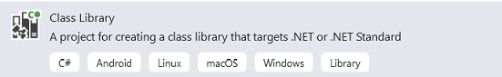
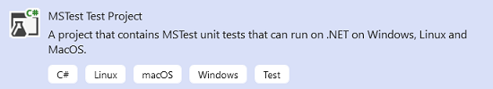
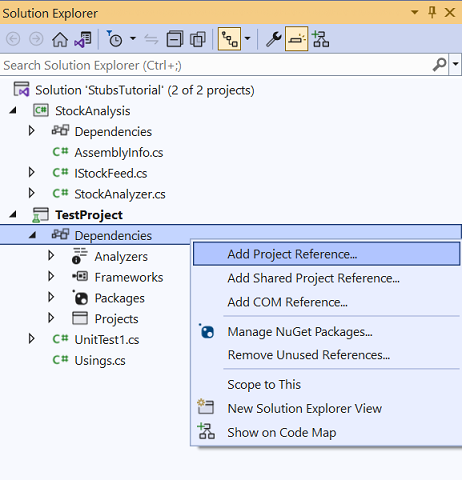
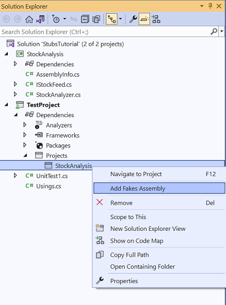
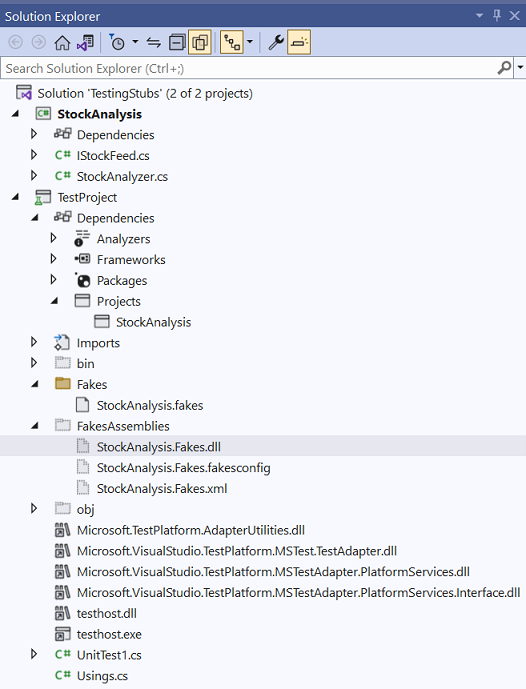
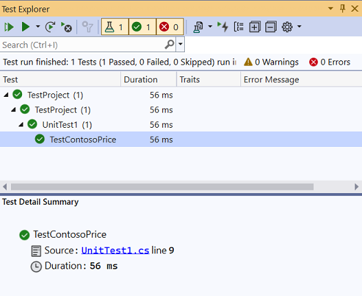

# Use stubs to isolate parts of your application from each other for unit testing

*Stub types* are an important technology provided by the Microsoft Fakes framework, enabling easy isolation of the component you're testing from other components it relies on. A stub acts as a small piece of code that replaces another component during testing. A key benefit of using stubs is the ability to obtain consistent results to make test writing easier. Even if the other components aren't yet fully functional, you can still execute tests by using stubs.

To apply stubs effectively, it's recommended to design your component in a way that it primarily depends on interfaces rather than concrete classes from other parts of the application. This design approach promotes decoupling and reduces the likelihood of changes in one part requiring modifications in another. When it comes to testing, this design pattern enables substituting a stub implementation for a real component, facilitating effective isolation and accurate testing of the target component.

For example, let's consider the diagram that illustrates the components involved:


In this diagram, the component under test is `StockAnalyzer`, which typically relies on another component called `RealStockFeed`. However, `RealStockFeed` poses a challenge for testing because it returns different results each time its methods are called. This variability makes it difficult to ensure consistent and reliable testing of `StockAnalyzer`.

To overcome this obstacle during testing, we can adopt the practice of [dependency injection](https://en.wikipedia.org/wiki/Dependency_injection). This approach involves writing your code in such a way that it doesn't explicitly mention classes in another component of your application. Instead, you define an interface that the other component and a stub can implement for test purposes.

Here's an example of how you can use dependency injection in your code:

#### [C#](#tab/csharp)

```csharp
public int GetContosoPrice(IStockFeed feed) => feed.GetSharePrice("COOO");
```

#### [VB](#tab/vb)

```vb
Public Function GetContosoPrice(feed As IStockFeed) As Integer
Return feed.GetSharePrice("COOO")
End Function
```
---

## Stub limitations

Review the following limitations for stubs.

- Method signatures with pointers aren't supported.

- Sealed classes or static methods can't be stubbed using stub types because stub types rely on virtual method dispatch. For such cases, use shim types as described in [Use shims to isolate your application from other assemblies for unit testing](../test/using-shims-to-isolate-your-application-from-other-assemblies-for-unit-testing.md)

## Creating a Stub: A Step-by-Step Guide

Let's start this exercise with a motivating example: the one shown in the preceding diagram. 

### Create a Class Library

Follow these steps to create a class library.

1. Open Visual Studio and create a **Class Library** project.

   

1. Configure the project attributes:

   - Set the **Project name** to *StockAnalysis*.
   - Set the **Solution name** to *StubsTutorial*.
   - Set the project **Target framework** to **.NET 8.0**.

1. Delete the default file *Class1.cs*.

1. Add a new file named *IStockFeed.cs* and copy in the following interface definition:

   #### [C#](#tab/csharp)

   ```csharp
   // IStockFeed.cs
   public interface IStockFeed
   {
       int GetSharePrice(string company);
   }
   ```

   #### [VB](#tab/vb)

   ```vb
   ' IStockFeed.vb
   Public Interface IStockFeed
       Function GetSharePrice(company As String) As Integer
   End Interface
   ```
   ---

7. Add another new file named *StockAnalyzer.cs* and copy in the following class definition:

   #### [C#](#tab/csharp)

   ```csharp
   // StockAnalyzer.cs
   public class StockAnalyzer
   {
       private IStockFeed stockFeed;
       public StockAnalyzer(IStockFeed feed)
       {
           stockFeed = feed;
       }
       public int GetContosoPrice()
       {
           return stockFeed.GetSharePrice("COOO");
       }
   }
   ```

   #### [VB](#tab/vb)

   ```vb
   ' StockAnalyzer.vb
   Public Class StockAnalyzer
       Private stockFeed As IStockFeed
       Public Sub New(feed As IStockFeed)
           stockFeed = feed
       End Sub
       Public Function GetContosoPrice() As Integer
           Return stockFeed.GetSharePrice("COOO")
       End Function
   End Class
   ```
   ---

### Create a Test Project

Create the test project for the exercise.

1. Right-click on the solution and add a new project named *MSTest Test Project*.

1. Set the project name to *TestProject*.

1. Set the project's target framework to **.NET 8.0**.

   

### Add Fakes assembly

Add the Fakes assembly for the project.

1. Add a project reference to `StockAnalyzer`.

   

1. Add the Fakes Assembly.

   1. In **Solution Explorer**, locate the assembly reference:

      - For an older .NET Framework Project (non-SDK style), expand your unit test project's **References** node.

      - For an SDK-style project targeting .NET Framework, .NET Core, or .NET 5.0 or later, expand the **Dependencies** node to find the assembly you would like to fake under **Assemblies**, **Projects**, or **Packages**.

      - If you're working in Visual Basic, select **Show All Files** in the **Solution Explorer** toolbar to see the **References** node.
       
   1. Select the assembly that contains the class definitions for which you want to create stubs.

   1. On the shortcut menu, select **Add Fakes Assembly**.

      

### Create a unit test

Now create the unit test.

1. Modify the default file *UnitTest1.cs* to add the following `Test Method` definition.

   #### [C#](#tab/csharp)

   ```csharp
   [TestClass]
   class UnitTest1
   {
       [TestMethod]
       public void TestContosoPrice()
       {
           // Arrange:
           int priceToReturn = 345;
           string companyCodeUsed = "";
           var componentUnderTest = new StockAnalyzer(new StockAnalysis.Fakes.StubIStockFeed()
           {
               GetSharePriceString = (company) =>
               {
                   // Store the parameter value:
                   companyCodeUsed = company;
                   // Return the value prescribed by this test:
                   return priceToReturn;
               }
           });

           // Act:
           int actualResult = componentUnderTest.GetContosoPrice();

           // Assert:
           // Verify the correct result in the usual way:
           Assert.AreEqual(priceToReturn, actualResult);

           // Verify that the component made the correct call:
           Assert.AreEqual("COOO", companyCodeUsed);
       }
   }
   ```

   #### [VB](#tab/vb)

   ```vb
   <TestClass()> _
   Class UnitTest1
       <TestMethod()> _
       Public Sub TestContosoPrice()
           ' Arrange:
           Dim priceToReturn As Integer = 345
           Dim companyCodeUsed As String = ""
           Dim componentUnderTest As New StockAnalyzer(New StockAnalysis.Fakes.StubIStockFeed() With {
               .GetSharePriceString = Function(company)
                                    ' Store the parameter value:
                                    companyCodeUsed = company
                                    ' Return the value prescribed by this test:
                                    Return priceToReturn
                                    End Function
           })
           
           ' Act:
           Dim actualResult As Integer = componentUnderTest.GetContosoPrice()

           ' Assert:
           ' Verify the correct result in the usual way:
           Assert.AreEqual(priceToReturn, actualResult)

           ' Verify that the component made the correct call:
           Assert.AreEqual("COOO", companyCodeUsed)
       End Sub
   ...
   End Class
   ```
   ---

   The special piece of magic here's the `StubIStockFeed` class. For every interface in the referenced assembly, the Microsoft Fakes mechanism generates a stub class. The name of the stub class is derived from the name of the interface, with "`Fakes.Stub`" as a prefix, and the parameter type names appended.

   Stubs are also generated for the getters and setters of properties, for events, and for generic methods. For more information, see [Use stubs to isolate parts of your application from each other for unit testing](../test/using-stubs-to-isolate-parts-of-your-application-from-each-other-for-unit-testing.md).

   

1. Open Test Explorer and run the test.

   

## Stubs for different kinds of type members

There are stubs for different kinds of type members.

### Methods

In the provided example, methods can be stubbed by attaching a delegate to an instance of the stub class. The name of the stub type is derived from the names of the method and parameters. For example, consider the following `IStockFeed` interface and its method `GetSharePrice`:

```csharp
// IStockFeed.cs
interface IStockFeed
{
    int GetSharePrice(string company);
}
```

We attach a stub to `GetSharePrice` by using `GetSharePriceString`:

```csharp
// unit test code
var componentUnderTest = new StockAnalyzer(new StockAnalysis.Fakes.StubIStockFeed()
        {
            GetSharePriceString = (company) =>
            {
                // Store the parameter value:
                companyCodeUsed = company;
                // Return the value prescribed by this test:
                return priceToReturn;
            }
        });
```

If you don't provide a stub for a method, Fakes generates a function that returns the `default value` of the return type. For numbers, the default value is 0. For class types, the default is `null` in C# or `Nothing` in Visual Basic.

### Properties

Property getters and setters are exposed as separate delegates and can be stubbed individually. For example, consider the `Value` property of `IStockFeedWithProperty`:

```csharp
interface IStockFeedWithProperty
{
    int Value { get; set; }
}
```

To stub the getter and setter of `Value` and simulate an auto-property, you can use the following code:

```csharp
// unit test code
int i = 5;
var stub = new StubIStockFeedWithProperty();
stub.ValueGet = () => i;
stub.ValueSet = (value) => i = value;
```

If you don't provide stub methods for either the setter or the getter of a property, Fakes generates a stub that stores values, making the stub property behave like a simple variable.

### Events

Events are exposed as delegate fields, allowing any stubbed event to be raised simply by invoking the event backing field. Let's consider the following interface to stub:

```csharp
interface IStockFeedWithEvents
{
    event EventHandler Changed;
}
```

To raise the `Changed` event, you invoke the backing delegate:

```csharp
// unit test code
var withEvents = new StubIStockFeedWithEvents();
// raising Changed
withEvents.ChangedEvent(withEvents, EventArgs.Empty);
```

### Generic methods

You can stub generic methods by providing a delegate for each desired instantiation of the method. For example, given the following interface with a generic method:

```csharp
interface IGenericMethod
{
    T GetValue<T>();
}
```

You can stub the `GetValue<int>` instantiation as follows:

```csharp
[TestMethod]
public void TestGetValue()
{
    var stub = new StubIGenericMethod();
    stub.GetValueOf1<int>(() => 5);

    IGenericMethod target = stub;
    Assert.AreEqual(5, target.GetValue<int>());
}
```

If the code calls `GetValue<T>` with any other instantiation, the stub executes the behavior.

### Stubs of virtual classes

In the previous examples, the stubs have been generated from interfaces. However, you can also generate stubs from a class that has virtual or abstract members. For example:

```csharp
// Base class in application under test
public abstract class MyClass
{
    public abstract void DoAbstract(string x);
    public virtual int DoVirtual(int n)
    {
        return n + 42;
    }

    public int DoConcrete()
    {
        return 1;
    }
}
```

In the stub generated from this class, you can set delegate methods for `DoAbstract()` and `DoVirtual()`, but not `DoConcrete()`.

```csharp
// unit test
var stub = new Fakes.MyClass();
stub.DoAbstractString = (x) => { Assert.IsTrue(x>0); };
stub.DoVirtualInt32 = (n) => 10 ;
```

If you don't provide a delegate for a virtual method, Fakes can either provide the default behavior or call the method in the base class. To have the base method called, set the `CallBase` property:

```csharp
// unit test code
var stub = new Fakes.MyClass();
stub.CallBase = false;
// No delegate set - default delegate:
Assert.AreEqual(0, stub.DoVirtual(1));

stub.CallBase = true;
// No delegate set - calls the base:
Assert.AreEqual(43,stub.DoVirtual(1));
```

## Change the default behavior of stubs

Each generated stub type holds an instance of the `IStubBehavior` interface through the `IStub.InstanceBehavior` property. This behavior is called whenever a client calls a member with no attached custom delegate. If the behavior isn't set, it uses the instance returned by the `StubsBehaviors.Current` property. By default, this property returns a behavior that throws a `NotImplementedException` exception.

You can change the behavior at any time by setting the `InstanceBehavior` property on any stub instance. For example, the following snippet changes the behavior so that the stub either does nothing or returns the default value of the return type `default(T)`:

```csharp
// unit test code
var stub = new StockAnalysis.Fakes.StubIStockFeed();
// return default(T) or do nothing
stub.InstanceBehavior = StubsBehaviors.DefaultValue;
```

The behavior can also be changed globally for all stub objects where the behavior isn't set with the `StubsBehaviors.Current` property:

```csharp
// Change default behavior for all stub instances where the behavior has not been set.
StubBehaviors.Current = BehavedBehaviors.DefaultValue;
```

## Related content

- [Isolate code under test with Microsoft Fakes](../test/isolating-code-under-test-with-microsoft-fakes.md)
