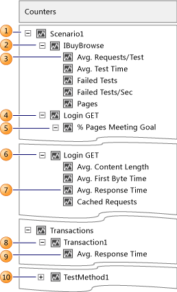

# Using the Counters Panel in Graphs View and Tables View
The Counters panel is visible in the Graphs view and Tables view in the Load Test Analyzer while a load test is running, or when you are analyzing a load test result. For more information, see [Analyzing Load Test Results in the Graphs View](../test/analyzing-load-test-results-in-the-graphs-view-of-the-load-test-analyzer.md), [Analyzing Load Test Results and Errors in the Tables View](../test/analyzing-load-test-results-and-errors-in-the-tables-view-of-the-load-test-analyzer.md) and [How to: Access Load Test Results for Analysis](../test/how-to--access-load-test-results-for-analysis.md).  
  
 The Counters panel displays a structured view of all the performance counters that have been collected during the load test. You can show or hide the counters panel by choosing **Show Counters Panel** on the load Test Analyzer toolbar.  
  
 The counters are organized in a tree structure, where the leaf nodes are performance counter instances that can be graphed.  
  
 **Requirements**  
  
-   Visual Studio Enterprise  
  
 The Counters panel provides the following features:  
  
-   Communicates threshold violation information.  
  
-   Selection of counters for graphing.  
  
-   A structured tree view of all performance counters collected during a load test run with the following primary branches:  
  
    -   **Overall:** Contains performance counter data summary for each test agent and for the entire load test.  
  
    -   **Scenario Name:** Branches labeled with load test scenario names in the performance counter tree contain all load test counter instances associated with a particular load test scenario. Most load test counters are nested within a scenario branch.  
  
         A scenario branch contains Web performance test nodes. The Web performance test nodes contain Pages, Requests, and Transaction nodes. Any leaf node in this structure is a performance counter that can be added to a graph.  
  
    -   **Computers:** Contains all non-load test counter instances grouped by computer. The Computers branch contains a node for each computer that is associated with the load test controller specified in the Roles section of the currently selected test settings. For more information, see [Distributing Load Test Runs Across Multiple Test Machines Using Test Controllers and Test Agents](../test/distributing-load-test-runs-across-multiple-test-machines-using-test-controllers-and-test-agents.md).  
  
         Each computer node contains a set of performance counter categories collected from that computer. Categories contain counters and counters contain performance counter instance names.  
  
    -   **Errors:** Contains all the errors detected during the load test. The Errors node contains several sub-category error nodes which are specific to different kinds of errors. For example, exceptions and HTTP errors.  
  
### Scenario Name Node in Counters Panel  
  
|||  
|-|-|  
||1.  All performance counters associated with Scenario1 of the load test appear under this node. 2.  All tests of a scenario are located beneath the scenario node. The label indicates the test name. 3.  Leaf nodes under a test node are load test testcase counters where the instance name for the counter is the test name. This counters I the average test time for IBuyBrowse of Scenario1. 4.  All load test page counter instances associated with a Web performance test branch. At this node, all the load test pace counter instances associated with page Login GET (Reporting name) of the IBuyBrowse Web performance test in Scenario1 of the load test are contained here. 5.  Leaf nodes under a page node are load test page counters. 6.  All load test requests counter instances associated with a Web performance test are contained within a Web performance test branch. At this node, all request counter instances associated with the request Login GET (Reporting name) of IBuyBrowse Web performance test in Scenario1 o the load test contained here. 7.  Leaf node under a request node are load test request counters. 8.  All load test transaction counter instances associated with a Web performance test are contained within a Web performance test branch. At this node, all transaction counter instances associate with the transaction named Transaction1 of the IBuyBrowse Web performance test in Scenraio1 of the load test are contained here. 9. Leaf node under a transaction node are load test transaction counters. 10. Unit test node.|  
  
## Tasks  
  
|Tasks|Associated topics|  
|-----------|-----------------------|  
|**Add more performance counters to a graph in graph view:** In the Counters panel, you can add different kinds of data to a load test graph by adding more performance counters on the graph.|-   [How to: Add and Delete Counters on Graphs](../test/how-to--add-and-delete-counters-on-graphs-in-load-test-results.md)|  
|**Analyze any thresholds you specified in the load test that were violated:** The Counters panel displays icons representing threshold violations that you can then add to tables and graphs for further analysis.|-   [How to: Analyze Threshold Violations Using the Counters Panel](../test/how-to--analyze-threshold-violations-using-the-counters-panel-in-load-test-analyzer.md)|  
|**Analyze any errors that were detected during the load test run:** The Counters panel includes an errors node that contains error categories and sub-categories such as HTTP errors that you can use to add errors to graphs for further analysis.|-   [How to: Analyze Errors Using the Counters Panel](../test/how-to--analyze-errors-using-the-counters-panel.md)|  
  
## Performance Counter Sampling Interval Considerations  
 Choose a value for the **Sample Rate** property in the load test run settings based on the length of your load test. A smaller sample rate, such as the default value of five seconds, requires more space in the load test results database. For longer load tests, increasing the sample rate reduces the amount of data that you collect. For more information, see [How to: Specify the Sample Rate](../test/how-to--specify-the-sample-rate-for-a-load-test-run-setting.md).  
  
 Here are some guidelines for sample rates:  
  
|Load Test Duration|Recommended Sample Rate|  
|------------------------|-----------------------------|  
|\< 1 Hour|5 seconds|  
|1 - 8 Hours|15 seconds|  
|8 - 24 Hours|30 seconds|  
|> 24 Hours|60 seconds|  
  
## Considerations for including Timing Details to Collect Percentile Data  
 There is a property in the run settings in the Load Test Editor named **Timing Details Storage**. If **Timing Details Storage** property is enabled, then the time to execute each individual test, transaction, and page during the load test will be stored in the load test results repository. This allows for 90th and 95th percentile data to be shown in the Load Test Analyzer in the Tests, Transactions, and Pages tables.  
  
 There are two choices for enabling the **Timing Details Storage** property in the run settings properties:**StatisticsOnly** and **AllIndividualDetails**. With either option, all the individual tests, pages, and transactions are timed, and percentile data is calculated from the individual timing data. The difference is that with the **StatisticsOnly** option, as soon as the percentile data has been calculated, the individual timing data is deleted from the repository. This reduces the amount of space that is required in the repository when you use timing details. However, advanced users might want to process the timing detail data in other ways, by using SQL tools. If this is the case, the **AllIndividualDetails** option should be used so that the timing detail data is available for that processing. Additionally, if you set the property to **AllIndividualDetails**, then you can analyze the virtual user activity using the Virtual User Activity chart in the Load Test Analyzer after the load test is finished running. For more information, see [Analyzing Virtual User Activity in the Details View](../test/analyzing-load-test-virtual-user-activity-in-the-details-view-of-the-load-test-analyzer.md).  
  
> [!NOTE]
>  In earlier versions of Visual Studio, including [!INCLUDE[vsprvsext](../test/includes/vsprvsext_md.md)] and [!INCLUDE[vs_orcas_long](../codequality/includes/vs_orcas_long_md.md)], the **All Individual Details** setting for the **Timing Details Storage** property was available. However, there are two important differences. First, the **All Individual Details** setting was not the default setting. Second, the only way to access this information was by using SQL queries.  
  
 The amount of space that is required in the load test results repository to store the timing details data could be very large, especially for longer running load tests. Also, the time to store this data in the load test results repository at the end of the load test is longer because this data is stored on the load test agents until the load test has finished executing. When the load test finishes, the data is stored into the repository. By default, the **Timing Details Storage** property is enabled. If this is an issue for your testing environment, you might want to set the **Timing Details Storage** to **None**.  
  
 For more information, see [How to: Specify the Timing Details Storage Property](../test/how-to--specify-the-timing-details-storage-property-for-a-load-test-run-setting.md).  
  
## See Also  
 [Analyzing Load Test Results](../test/analyzing-load-test-results-using-the-load-test-analyzer.md)   
 [Load Test Analyzer Overview](../test/load-test-analyzer-overview.md)