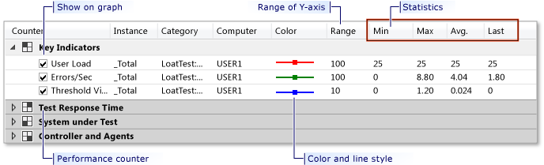

# Using the Graphs View Legend to Analyze Load Tests
The Load Test Analyzer's Graphs view includes a legend panel that displays information for each performance counter that is associated with the currently selected graph.  
  
 **Requirements**  
  
-   Visual Studio Enterprise  
  
   
Graphs view legend  
  
 The following information is contained within the legend:  
  
-   **Show on graph:** Use the check boxes to specify whether the line for a particular counter, such as **User load** or **Errors/Sec**, is plotted on the graph. Select a check box if you want the line to be plotted on the graph. Clear a check box to remove the plot line from the graph. When a plot line is removed, the statistics for the counter continue to display in the legend.  
  
-   **Range:** This column displays the performance counter's y-axis range. By default, this value will automatically adjust as the range of sample data changes. An automatically adjusted range will always be the next power of 10 greater than Max value; this includes negative powers of ten. A graph can contain a variety of counters, each with a different range. Therefore, the y-axis is not labeled with any specific range, but is instead labeled with values from 0-100 that represent a percentage of the total range for each counter. For example, for a counter with a range of 1000, a data point of 60 on the y-axis would correspond to a value of 600 for the counter.  
  
    > [!NOTE]
    >  You can turn off the automatic range value adjustment by locking the range to a specific value. When the range is locked, any values exceeding the range are displayed as the maximum value you specified at the top of the graph. Use the **Plot Options** dialog box to lock the range at a specific value. For more information, see [How to: Specify Plot Options for Graphing Counters](../test/how-to--specify-plot-options-for-graphing-counters.md).  
  
-   **Counter:** The four columns named **Counter**, **Instance**, **Category**, and **Computer** together uniquely identify the performance counter.  
  
-   **Color:** The **Color** column shows the color and line style of the plotted line for the performance counter. Use the **Plot Options** dialog box to change the color or line style of a performance counter on the graph. The **Plot Options** dialog box is available from the legend's shortcut menu. For more information, see [How to: Specify Plot Options for Graphing Counters](../test/how-to--specify-plot-options-for-graphing-counters.md).  
  
-   **Statistics:** The **Min**, **Max**, **Avg** and **Last** columns show the respective statistics for the performance counter. These values correspond to the data that is displayed on the visible region of the graph. For example, if you zoom into a region of a run, the legend statistics will reflect values for only the zoomed area. The "Last" column is the value of the performance counter on the most recently completed sampling interval.  
  
    > [!NOTE]
    >  The Last column only displays in the Load Test Analyzer's Legend while the load test is running.  
  
     For more information, see [How to: Zoom in on a Region of the Graph](../test/how-to--zoom-in-on-a-region-of-the-graph-in-load-test-results.md).  
  
 Selecting an item in the legend does the following:  
  
-   Allows the item to be removed from both the legend and the graph. Either  right-click the item and select **Delete**, or press the **Delete** key.  
  
-   Highlights the plotted line on the graph.  
  
-   Causes the data grid to display data for the selected item.  
  
-   Lets you access the **Plot Options** dialog box for the counter.  
  
> [!TIP]
>  You can use **Graph Options drop-down** button in the Load Test Analyzer's toolbar and select **Show Legend** to show or hide the **Legend** panel that is associated with the graph view.  
  
## See Also  
 [How to: Specify Plot Options for Graphing Counters](../test/how-to--specify-plot-options-for-graphing-counters.md)   
 [How to: Zoom in on a Region of the Graph](../test/how-to--zoom-in-on-a-region-of-the-graph-in-load-test-results.md)   
 [Analyzing Load Test Results in the Graphs View](../test/analyzing-load-test-results-in-the-graphs-view-of-the-load-test-analyzer.md)   
 [Load Test Analyzer Overview](../test/load-test-analyzer-overview.md)