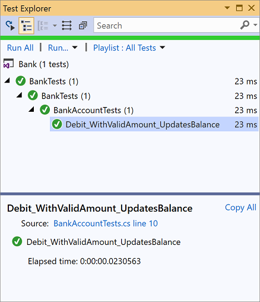
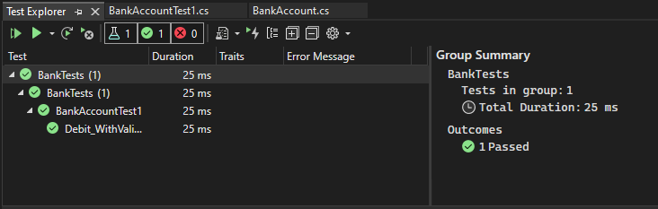

# Create and run unit tests for .NET

This article steps you through creating, running, and customizing a series of unit tests using the Microsoft unit test framework for managed code and Visual Studio **Test Explorer**. You start with a C# project that is under development, create tests that exercise its code, run the tests, and examine the results. Then you change the project code and rerun the tests. If you would like a conceptual overview of these tasks before going through these steps, see [Unit test basics](../test/unit-test-basics.md).

This article describes how to manually create unit tests. If you would like to generate tests automatically from existing code, see the following articles:

- [Create unit test method stubs from code](../test/create-unit-tests-menu.md)
- [Use slash commands in GitHub Copilot](../ide/copilot-chat-context.md#slash-commands)

## Prerequisites

Visual Studio must be installed along with the **.NET desktop development** workload.

## Create a project to test

1. Open Visual Studio.

1. On the start window, choose **Create a new project**.

1. Search for and select the C# **Console App** project template for .NET, and then click **Next**.

   If you do not see the **Console App** template, use the Visual Studio Installer to install the **.NET desktop development** workload.

1. Name the project **Bank**, and then click **Next**.

1. Choose either the recommended target framework or .NET 8, and then choose **Create**.

   The Bank project is created and displayed in **Solution Explorer** with the *Program.cs* file open in the code editor.

   > [!NOTE]
   > If *Program.cs* is not open in the editor, double-click the file *Program.cs* in **Solution Explorer** to open it.

1. Replace the contents of *Program.cs* with the following C# code that defines a class, *BankAccount*:

   ```csharp
   using System;

   namespace BankAccountNS
   {
       /// <summary>
       /// Bank account demo class.
       /// </summary>
       public class BankAccount
       {
           private readonly string m_customerName;
           private double m_balance;

           private BankAccount() { }

           public BankAccount(string customerName, double balance)
           {
               m_customerName = customerName;
               m_balance = balance;
           }

           public string CustomerName
           {
               get { return m_customerName; }
           }

           public double Balance
           {
               get { return m_balance; }
           }

           public void Debit(double amount)
           {
               if (amount > m_balance)
               {
                   throw new ArgumentOutOfRangeException("amount");
               }

               if (amount < 0)
               {
                   throw new ArgumentOutOfRangeException("amount");
               }

               m_balance += amount; // intentionally incorrect code
           }

           public void Credit(double amount)
           {
               if (amount < 0)
               {
                   throw new ArgumentOutOfRangeException("amount");
               }

               m_balance += amount;
           }

           public static void Main()
           {
               BankAccount ba = new BankAccount("Mr. Bryan Walton", 11.99);

               ba.Credit(5.77);
               ba.Debit(11.22);
               Console.WriteLine("Current balance is ${0}", ba.Balance);
           }
       }
   }
   ```

1. Rename the file to *BankAccount.cs* by right-clicking and choosing **Rename** in **Solution Explorer**.

1. On the **Build** menu, click **Build Solution** (or press **Ctrl** + **SHIFT** + **B**).

You now have a project with methods you can test. In this article, the tests focus on the `Debit` method. The `Debit` method is called when money is withdrawn from an account.

## Create a unit test project

1. On the **File** menu, select **Add** > **New Project**.

   > [!TIP]
   > You can also right-click on the solution in **Solution Explorer** and choose **Add** > **New Project**.

1. Type **test** in the search box, select **C#** as the language, and then select the C# **MSTest Test Project** for .NET template, and then click **Next**.

   > [!NOTE]
   > In Visual Studio 2019 version 16.9, the MSTest project template is **Unit Test Project**.

1. Name the project **BankTests** and click **Next**.

1. Choose either the recommended target framework or .NET 8, and then choose **Create**.

   ::: moniker range=">=vs-2022"
   Starting in Visual Studio 2022 version 17.10, you can also select a test runner. For the test runner, you can choose either **VSTest** or **MSTest**. For more information on the difference between test runners, see [Microsoft.Testing.Platform and VSTest comparison](/dotnet/core/testing/unit-testing-platform-vs-vstest).
   ::: moniker-end

   The **BankTests** project is added to the **Bank** solution.

1. In the **BankTests** project, add a reference to the **Bank** project.

   In **Solution Explorer**, select **Dependencies** under the **BankTests** project and then choose **Add Reference** (or **Add Project Reference**) from the right-click menu.

1. In the **Reference Manager** dialog box, expand **Projects**, select **Solution**, and then check the **Bank** item.

1. Choose **OK**.

## Create the test class

Create a test class to verify the `BankAccount` class. You can use the *UnitTest1.cs* file that was generated by the project template, but give the file and class more descriptive names.

### Rename a file and class

1. To rename the file, in **Solution Explorer**, select the *UnitTest1.cs* file in the BankTests project. From the right-click menu, choose **Rename** (or press **F2**), and then rename the file to *BankAccountTests.cs*.

1. To rename the class, position the cursor on `UnitTest1` in the code editor, right-click, and then choose **Rename** (or press **F2**). Type in **BankAccountTests** and then press **Enter**.

The *BankAccountTests.cs* file now contains the following code:

```csharp
// The 'using' statement for Test Tools is in GlobalUsings.cs
// using Microsoft.VisualStudio.TestTools.UnitTesting;

namespace BankTests
{
    [TestClass]
    public class BankAccountTests
    {
        [TestMethod]
        public void TestMethod1()
        {
        }
    }
}
```

### Add a using statement

Add a [`using` statement](/dotnet/csharp/language-reference/keywords/using-statement) to the test class to be able to call into the project under test without using fully qualified names. At the top of the class file, add:

```csharp
using BankAccountNS;
```

### Test class requirements

The minimum requirements for a test class are:

- The `[TestClass]` attribute is required on any class that contains unit test methods that you want to run in Test Explorer.

- Each test method that you want Test Explorer to recognize must have the `[TestMethod]` attribute.

You can have other classes in a unit test project that do not have the `[TestClass]` attribute, and you can have other methods in test classes that do not have the `[TestMethod]` attribute. You can call these other classes and methods from your test methods.

## Create the first test method

In this procedure, you write unit test methods to verify the behavior of the `Debit` method of the `BankAccount` class.

There are at least three behaviors that need to be checked:

- The method throws an <xref:System.ArgumentOutOfRangeException> if the debit amount is greater than the balance.

- The method throws an <xref:System.ArgumentOutOfRangeException> if the debit amount is less than zero.

- If the debit amount is valid, the method subtracts the debit amount from the account balance.

> [!TIP]
> You can delete the default `TestMethod1` method, because you won't use it in this article.

### To create a test method

The first test verifies that a valid amount (that is, one that is less than the account balance and greater than zero) withdraws the correct amount from the account. Add the following method to that `BankAccountTests` class:

```csharp
[TestMethod]
public void Debit_WithValidAmount_UpdatesBalance()
{
    // Arrange
    double beginningBalance = 11.99;
    double debitAmount = 4.55;
    double expected = 7.44;
    BankAccount account = new BankAccount("Mr. Bryan Walton", beginningBalance);

    // Act
    account.Debit(debitAmount);

    // Assert
    double actual = account.Balance;
    Assert.AreEqual(expected, actual, 0.001, "Account not debited correctly");
}
```

The method is straightforward: it sets up a new `BankAccount` object with a beginning balance and then withdraws a valid amount. It uses the <xref:Microsoft.VisualStudio.TestTools.UnitTesting.Assert.AreEqual%2A?displayProperty=nameWithType> method to verify that the ending balance is as expected. Methods such as `Assert.AreEqual`, <xref:Microsoft.VisualStudio.TestTools.UnitTesting.Assert.IsTrue%2A?displayProperty=nameWithType>, and others are frequently used in unit testing. For more conceptual information on writing a unit test, see [Write your tests](../test/unit-test-basics.md#write-your-tests).

### Test method requirements

A test method must meet the following requirements:

- It's decorated with the `[TestMethod]` attribute.

- It returns `void`.

- It cannot have parameters.

## Build and run the test

1. On the **Build** menu, choose **Build Solution** (or press **Ctrl** + **SHIFT** + **B**).

1. If **Test Explorer** is not open, open it by choosing **Test** > **Test Explorer** (or **Test** > **Windows** > **Test Explorer**) from the top menu bar (or press **Ctrl** + **E**, **T**).

1. Choose **Run All** to run the test (or press **Ctrl** + **R**, **V**).

   While the test is running, the status bar at the top of the **Test Explorer** window is animated. At the end of the test run, the bar turns green if all the test methods pass, or red if any of the tests fail.

   In this case, the test fails.

1. Select the method in **Test Explorer** to view the details at the bottom of the window.

## Fix your code and rerun your tests

The test result contains a message that describes the failure. You might need to drill down to see this message. For the `AreEqual` method, the message displays what was expected and what was actually received. You expected the balance to decrease, but instead it increased by the amount of the withdrawal.

The unit test has uncovered a bug: the amount of the withdrawal is *added* to the account balance when it should be *subtracted*.

### Correct the bug

To correct the error, in the *BankAccount.cs* file, replace the line:

```csharp
m_balance += amount;
```

with:

```csharp
m_balance -= amount;
```

### Rerun the test

In **Test Explorer**, choose **Run All** to rerun the test (or press **Ctrl** + **R**, **V**). The red/green bar turns green to indicate that the test passed.

::: moniker range="<=vs-2019"

::: moniker-end
::: moniker range=">=vs-2022"

::: moniker-end

## Use unit tests to improve your code

This section describes how an iterative process of analysis, unit test development, and refactoring can help you make your production code more robust and effective.

### Analyze the issues

You've created a test method to confirm that a valid amount is correctly deducted in the `Debit` method. Now, verify that the method throws an <xref:System.ArgumentOutOfRangeException> if the debit amount is either:

- greater than the balance, or
- less than zero.

### Create and run new test methods

Create a test method to verify correct behavior when the debit amount is less than zero:

```csharp
[TestMethod]
public void Debit_WhenAmountIsLessThanZero_ShouldThrowArgumentOutOfRange()
{
    // Arrange
    double beginningBalance = 11.99;
    double debitAmount = -100.00;
    BankAccount account = new BankAccount("Mr. Bryan Walton", beginningBalance);

    // Act and assert
    Assert.ThrowsException<System.ArgumentOutOfRangeException>(() => account.Debit(debitAmount));
}
```

Use the <xref:Microsoft.VisualStudio.TestTools.UnitTesting.Assert.ThrowsException%2A> method to assert that the correct exception has been thrown. This method causes the test to fail unless an <xref:System.ArgumentOutOfRangeException> is thrown. If you temporarily modify the method under test to throw a more generic <xref:System.ApplicationException> when the debit amount is less than zero, the test behaves correctly&mdash;that is, it fails.

To test the case when the amount withdrawn is greater than the balance, do the following steps:

1. Create a new test method named `Debit_WhenAmountIsMoreThanBalance_ShouldThrowArgumentOutOfRange`.

2. Copy the method body from `Debit_WhenAmountIsLessThanZero_ShouldThrowArgumentOutOfRange` to the new method.

3. Set the `debitAmount` to a number greater than the balance.

Run the two tests and verify that they pass.

### Continue the analysis

The method being tested can be improved further. With the current implementation, we have no way to know which condition (`amount > m_balance` or `amount < 0`) led to the exception being thrown during the test. We just know that an `ArgumentOutOfRangeException` was thrown somewhere in the method. It would be better if we could tell which condition in `BankAccount.Debit` caused the exception to be thrown (`amount > m_balance` or `amount < 0`) so we can be confident that our method is sanity-checking its arguments correctly.

Look at the method being tested (`BankAccount.Debit`) again, and notice that both conditional statements use an `ArgumentOutOfRangeException` constructor that just takes name of the argument as a parameter:

```csharp
throw new ArgumentOutOfRangeException("amount");
```

There's a constructor you can use that reports far richer information: <xref:System.ArgumentOutOfRangeException.%23ctor(System.String,System.Object,System.String)> includes the name of the argument, the argument value, and a user-defined message. You can refactor the method under test to use this constructor. Even better, you can use publicly available type members to specify the errors.

### Refactor the code under test

First, define two constants for the error messages at class scope. Place the definitions in the class under test, `BankAccount`:

```csharp
public const string DebitAmountExceedsBalanceMessage = "Debit amount exceeds balance";
public const string DebitAmountLessThanZeroMessage = "Debit amount is less than zero";
```

Then, modify the two conditional statements in the `Debit` method:

```csharp
if (amount > m_balance)
{
    throw new System.ArgumentOutOfRangeException("amount", amount, DebitAmountExceedsBalanceMessage);
}

if (amount < 0)
{
    throw new System.ArgumentOutOfRangeException("amount", amount, DebitAmountLessThanZeroMessage);
}
```

### Refactor the test methods

Refactor the test methods by removing the call to <xref:Microsoft.VisualStudio.TestTools.UnitTesting.Assert.ThrowsException%2A?displayProperty=nameWithType>. Wrap the call to `Debit()` in a `try/catch` block, catch the specific exception that's expected, and verify its associated message. The <xref:Microsoft.VisualStudio.TestTools.UnitTesting.StringAssert.Contains%2A?displayProperty=fullName> method provides the ability to compare two strings.

Now, the `Debit_WhenAmountIsMoreThanBalance_ShouldThrowArgumentOutOfRange` might look like this:

```csharp
[TestMethod]
public void Debit_WhenAmountIsMoreThanBalance_ShouldThrowArgumentOutOfRange()
{
    // Arrange
    double beginningBalance = 11.99;
    double debitAmount = 20.0;
    BankAccount account = new BankAccount("Mr. Bryan Walton", beginningBalance);

    // Act
    try
    {
        account.Debit(debitAmount);
    }
    catch (System.ArgumentOutOfRangeException e)
    {
        // Assert
        StringAssert.Contains(e.Message, BankAccount.DebitAmountExceedsBalanceMessage);
    }
}
```

### Retest, rewrite, and reanalyze

Currently, the test method doesn't handle all the cases that it should. If the method under test, the `Debit` method, failed to throw an <xref:System.ArgumentOutOfRangeException> when the `debitAmount` was larger than the balance (or less than zero), the test method would pass. This scenario isn't good because you want the test method to fail if no exception is thrown.

This outcome is a bug in the test method. To resolve the issue, add an <xref:Microsoft.VisualStudio.TestTools.UnitTesting.Assert.Fail%2A?displayProperty=nameWithType> assert at the end of the test method to handle the case where no exception is thrown.

Rerunning the test shows that the test now *fails* if the correct exception is caught. The `catch` block catches the exception, but the method continues to execute and it fails at the new <xref:Microsoft.VisualStudio.TestTools.UnitTesting.Assert.Fail%2A?displayProperty=nameWithType> assert. To resolve this problem, add a `return` statement after the `StringAssert` in the `catch` block. Rerunning the test confirms that you've fixed this problem. The final version of the `Debit_WhenAmountIsMoreThanBalance_ShouldThrowArgumentOutOfRange` looks like this:

```csharp
[TestMethod]
public void Debit_WhenAmountIsMoreThanBalance_ShouldThrowArgumentOutOfRange()
{
    // Arrange
    double beginningBalance = 11.99;
    double debitAmount = 20.0;
    BankAccount account = new BankAccount("Mr. Bryan Walton", beginningBalance);

    // Act
    try
    {
        account.Debit(debitAmount);
    }
    catch (System.ArgumentOutOfRangeException e)
    {
        // Assert
        StringAssert.Contains(e.Message, BankAccount.DebitAmountExceedsBalanceMessage);
        return;
    }

    Assert.Fail("The expected exception was not thrown.");
}
```

### Conclusion

The improvements to the test code led to more robust and informative test methods. But more importantly, they also improved the code under test.

> [!TIP]
> This article uses the Microsoft unit test framework for managed code. **Test Explorer** can also run tests from third-party unit test frameworks that have adapters for **Test Explorer**. For more information, see [Install third-party unit test frameworks](../test/install-third-party-unit-test-frameworks.md).

## Related content

For information about how to run tests from a command line, see [VSTest.Console.exe command-line options](vstest-console-options.md).
