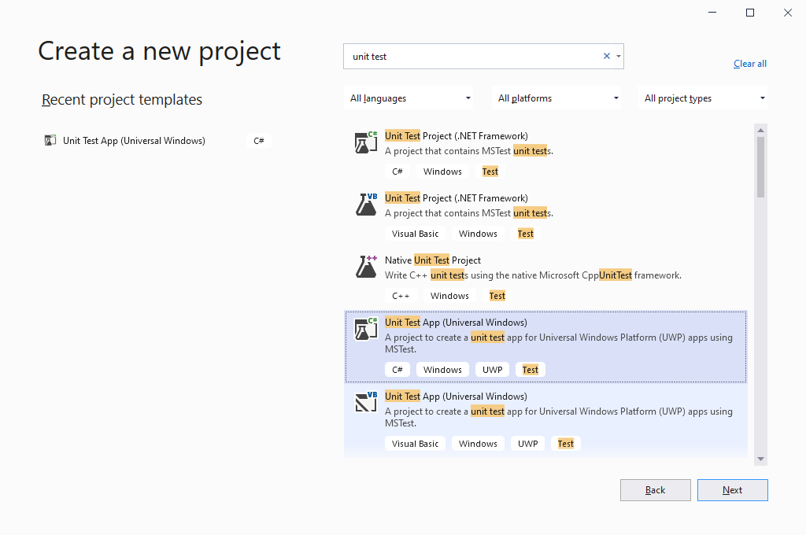
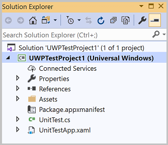

# Walkthrough: Create and run unit tests for UWP apps

Visual Studio includes support for unit testing Universal Windows Platform (UWP) apps. Visual Studio provides unit test project templates for C#, Visual Basic, and C++.

> [!TIP]
> For more information about developing UWP apps, see [Getting started with UWP apps](/windows/uwp/get-started/).

The following procedures describe the steps to create, run, and debug unit tests for a UWP app.

## Create a unit test project for a UWP app

::: moniker range=">=vs-2019"

1. Open Visual Studio. On the start window, choose **Create a new project**.

2. In the search box of the **Create a new project** page, enter **unit test**.

   The list of templates filters to those for unit testing.

3. Select the **Unit Test App (Universal Windows)** template for either C# or Visual Basic, and then select **Next**.

   

4. Optionally change the project or solution name and location, and then select **Create**.

5. Optionally change the target and minimum platform versions, and then select **OK**.

After completing these steps, the unit test project is created and displays in Solution Explorer.

::: moniker-end

::: moniker range="vs-2017"

1. From the **File** menu, choose **New Project**.

   The **New Project** dialog displays.

2. Under Templates, choose the programming language you want to create unit tests in, and then choose the associated Windows Universal unit test library. For example, choose **Visual C#** , then choose **Windows Universal**, and then choose **Unit Test Library (Universal Windows)**.

3. (Optional) In the **Name** textbox, enter the name you want to use for the project.

4. (Optional) Modify the path where you want to create the project by entering it in the **Location** textbox, or by choosing the **Browse** button.

5. (Optional) In the **Solution** name textbox, enter that name you want to use for your solution.

6. Leave the **Create directory for solution** option selected and choose the **OK** button.

   

   **Solution Explorer** is populated with the UWP unit test project, and the code editor displays the default unit test titled UnitTest1.

   

::: moniker-end

## Edit the unit test project's UWP application manifest file

1. In **Solution Explorer**, right-click the *Package.appxmanifest* file and choose **Open**.

2. In the **Manifest Designer**, choose the **Capabilities** tab.

3. In the list under **Capabilities**, select the capabilities that you need your unit test and the code that it testing to have. For example, select the **Internet** checkbox if the unit test needs and the code it is testing need to have the capability to access the internet.

   > [!NOTE]
   > The capabilities you select should only include capabilities that are necessary for the unit test to function correctly.

   

## Code the unit test for a UWP app

In the code editor, edit the unit test, and add the asserts and logic required for your test.

## Run unit tests

To build the solution and run the unit test using Test Explorer:

1. On the **Test** menu, choose **Windows**, and then choose **Test Explorer**.

2. From the **Build** menu, choose **Build Solution**.

   Your unit test is now shown in Test Explorer.

   > [!NOTE]
   > You must build the solution to update the list of unit tests in Test Explorer.

3. In **Test Explorer**, choose the unit test you created.

4. Choose **Run All**.

   

   > [!TIP]
   > You can select one or more unit tests listed in Test Explorer, and then right-click and choose **Run Selected Tests**.
   >
   > Additionally, you can choose to **Debug Selected Tests**, **Open Test**, and use the **Properties** option.
   >
   > 

   The unit test runs. Upon completion, Test Explorer displays the test status and elapsed time and provides a link to the source.

   

## See also

- [Test UWP apps with Visual Studio](../test/unit-test-your-code.md)
- [Build and test a UWP app](/azure/devops/pipelines/apps/windows/universal?tabs=vsts)
