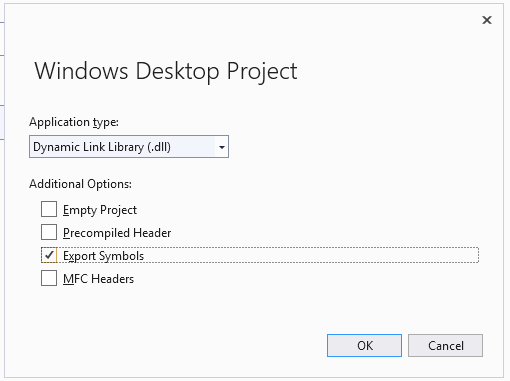

# Write unit tests for C++ DLLs

This walkthrough describes how to develop a native C++ DLL using test-first methodology. The basic steps are as follows:

1. [Create a native test project](#create_test_project). The test project is located in the same solution as the DLL project.

2. [Create a DLL project](#create_dll_project). This walkthrough creates a new DLL, but the procedure for testing an existing DLL is similar.

3. [Make the DLL functions visible to the tests](#make_functions_visible).

4. [Iteratively augment the tests](#iterate). We recommend a "red-green-refactor" cycle, in which development of the code is led by the tests.

5. [Debug failing tests](#debug). You can run tests in debug mode.

6. [Refactor while keeping the tests unchanged](#refactor). Refactoring means improving the structure of the code without changing its external behavior. You can do it to improve the performance, extensibility, or readability of the code. Because the intention is not to change the behavior, you do not change the tests while making a refactoring change to the code. The tests help make sure that you do not introduce bugs while you are refactoring.

7. [Check coverage](using-code-coverage-to-determine-how-much-code-is-being-tested.md). Unit tests are more useful when they exercise more of your code. You can discover which parts of your code have been used by the tests.

8. [Isolate units from external resources](using-stubs-to-isolate-parts-of-your-application-from-each-other-for-unit-testing.md). Typically, a DLL is dependent on other components of the system that you are developing, such as other DLLs, databases, or remote subsystems. It is useful to test each unit in isolation from its dependencies. External components can make tests run slowly. During development, the other components might not be complete.

## <a name="create_test_project"></a> Create a native unit test project

1. On the **File** menu, choose **New** > **Project**.

     **Visual Studio 2017 and earlier**: Expand **Installed** > **Templates** > **Visual C++** > **Test**.
     **Visual Studio 2019**: Set **Language** to C++ and type "test" into the search box.

     Choose the **Native Unit Test Project** template, or whatever installed framework you prefer. If you choose another template such as Google Test or Boost.Test, the basic principles are the same although some details will differ.

     In this walkthrough, the test project is named `NativeRooterTest`.

2. In the new project, inspect **unittest1.cpp**

     

     Notice that:

    - Each test is defined by using `TEST_METHOD(YourTestName){...}`.

         You do not have to write a conventional function signature. The signature is created by the macro TEST_METHOD. The macro generates an instance function that returns void. It also generates a static function that returns information about the test method. This information allows the test explorer to find the method.

    - Test methods are grouped into classes by using `TEST_CLASS(YourClassName){...}`.

         When the tests are run, an instance of each test class is created. The test methods are called in an unspecified order. You can define special methods that are invoked before and after each module, class, or method.

3. Verify that the tests run in Test Explorer:

    1. Insert some test code:

        ```cpp
        TEST_METHOD(TestMethod1)
        {
            Assert::AreEqual(1,1);
        }
        ```

         Notice that the `Assert` class provides several static methods that you can use to verify results in test methods.

    2. On the **Test** menu, choose **Run** > **All Tests**.

         The test builds and runs.

         **Test Explorer** appears.

         The test appears under **Passed Tests**.

         

## <a name="create_dll_project"></a> Create a DLL project

The following steps show how to create a DLL project in Visual Studio 2019.

1. Create a C++ project by using the **Windows Desktop Wizard**: Right-click on the solution name in **Solution Explorer** and choose **Add** > **New Project**. Set the **Language** to C++ and then type "windows" in the search box. Choose **Windows Desktop Wizard** from the results list.

     In this walkthrough, the project is named `RootFinder`.

2. Press **Create**. In the next dialog, under **Application type** choose **Dynamic Link Library (dll)** and also check **Export Symbols**.

     The **Export Symbols** option generates a convenient macro that you can use to declare exported methods.

     

3. Declare an exported function in the principal *.h* file:

     

     The declarator `__declspec(dllexport)` causes the public and protected members of the class to be visible outside the DLL. For more information, see [Using dllimport and dllexport in C++ Classes](/cpp/cpp/using-dllimport-and-dllexport-in-cpp-classes).

4. In the principal *.cpp* file, add a minimal body for the function:

    ```cpp
        // Find the square root of a number.
        double CRootFinder::SquareRoot(double v)
        {
            return 0.0;
        }
    ```

## <a name="make_functions_visible"></a> Couple the test project to the DLL project

1. Add the DLL project to the project references of the test project:

   1. Right-click on the test project node in **Solution Explorer** and choose **Add** > **Reference**.

   2. In the **Add Reference** dialog box, select the DLL project and choose **Add**.

        

2. In the principal unit test *.cpp* file, include the *.h* file of the DLL code:

   ```cpp
   #include "..\RootFinder\RootFinder.h"
   ```

3. Add a basic test that uses the exported function:

   ```cpp
   TEST_METHOD(BasicTest)
   {
      CRootFinder rooter;
      Assert::AreEqual(
         // Expected value:
         0.0,
         // Actual value:
         rooter.SquareRoot(0.0),
         // Tolerance:
         0.01,
        // Message:
        L"Basic test failed",
        // Line number - used if there is no PDB file:
        LINE_INFO());
   }
   ```

4. Build the solution.

    The new test appears in **Test Explorer**.

5. In **Test Explorer**, choose **Run All**.

    

   You have set up the test and the code projects, and verified that you can run tests that run functions in the code project. Now you can begin to write real tests and code.

## <a name="iterate"></a> Iteratively augment the tests and make them pass

1. Add a new test:

    ```cpp
    TEST_METHOD(RangeTest)
    {
      CRootFinder rooter;
      for (double v = 1e-6; v < 1e6; v = v * 3.2)
      {
        double actual = rooter.SquareRoot(v*v);
        Assert::AreEqual(v, actual, v/1000);
      }
    }
    ```

    > [!TIP]
    > We recommend that you do not change tests that have passed. Instead, add a new test, update the code so that the test passes, and then add another test, and so on.
    >
    > When your users change their requirements, disable the tests that are no longer correct. Write new tests and make them work one at a time, in the same incremental manner.

2. Build the solution, and then in **Test Explorer**, choose **Run All**.

     The new test fails.

     

    > [!TIP]
    > Verify that each test fails immediately after you have written it. This helps you avoid the easy mistake of writing a test that never fails.

3. Enhance your DLL code so that the new test passes:

    ```cpp
    #include <math.h>
    ...
    double CRootFinder::SquareRoot(double v)
    {
      double result = v;
      double diff = v;
      while (diff > result/1000)
      {
        double oldResult = result;
        result = result - (result*result - v)/(2*result);
        diff = abs (oldResult - result);
      }
      return result;
    }
    ```

4. Build the solution and then in **Test Explorer**, choose **Run All**.

     Both tests pass.

     

    > [!TIP]
    > Develop code by adding tests one at a time. Make sure that all the tests pass after each iteration.

## <a name="debug"></a> Debug a failing test

1. Add another test:

    ```cpp
    #include <stdexcept>
    ...
    // Verify that negative inputs throw an exception.
    TEST_METHOD(NegativeRangeTest)
    {
      wchar_t message[200];
      CRootFinder rooter;
      for (double v = -0.1; v > -3.0; v = v - 0.5)
      {
        try
        {
          // Should raise an exception:
          double result = rooter.SquareRoot(v);

          _swprintf(message, L"No exception for input %g", v);
          Assert::Fail(message, LINE_INFO());
        }
        catch (std::out_of_range ex)
        {
          continue; // Correct exception.
        }
        catch (...)
        {
          _swprintf(message, L"Incorrect exception for %g", v);
          Assert::Fail(message, LINE_INFO());
        }
      }
    }
    ```

2. Build the solution and choose **Run All**.

3. Open (or double-click) the failed test.

     The failed assertion is highlighted. The failure message is visible in the detail pane of **Test Explorer**.

     

4. To see why the test fails, step through the function:

    1. Set a breakpoint at the start of the SquareRoot function.

    2. On the shortcut menu of the failed test, choose **Debug Selected Tests**.

         When the run stops at the breakpoint, step through the code.

5. Insert code in the function that you are developing:

    ```cpp

    #include <stdexcept>
    ...
    double CRootFinder::SquareRoot(double v)
    {
        // Validate parameter:
        if (v < 0.0)
        {
          throw std::out_of_range("Can't do square roots of negatives");
        }

    ```

6. All tests now pass.

   

> [!TIP]
> If individual tests have no dependencies that prevent them from being run in any order, turn on parallel test execution in the settings menu of the toolbar. This can noticeably reduce the time taken to run all the tests.

## <a name="refactor"></a> Refactor the code without changing tests

1. Simplify the central calculation in the SquareRoot function:

    ```cpp
    // old code:
    //   result = result - (result*result - v)/(2*result);
    // new code:
         result = (result + v/result)/2.0;

    ```

2. Build the solution and choose **Run All**, to make sure that you have not introduced an error.

    > [!TIP]
    > A good set of unit tests gives confidence that you have not introduced bugs when you change the code.
    >
    > Keep refactoring separate from other changes.

## Next steps

- **Isolation.** Most DLLs are dependent on other subsystems such as databases and other DLLs. These other components are often developed in parallel. To allow unit testing to be performed while the other components are not yet available, you have to substitute mock or

- **Build Verification Tests.** You can have tests performed on your team's build server at set intervals. This ensures that bugs are not introduced when the work of several team members is integrated.

- **Checkin tests.** You can mandate that some tests are performed before each team member checks code into source control. Typically this is a subset of the complete set of build verification tests.

   You can also mandate a minimum level of code coverage.

## Related content

- [Add unit tests to existing C++ applications](../test/how-to-use-microsoft-test-framework-for-cpp.md)
- [Using Microsoft.VisualStudio.TestTools.CppUnitTestFramework](how-to-use-microsoft-test-framework-for-cpp.md)
- [Debug native code](../debugger/debugging-native-code.md)
- [Walkthrough: Creating and using a dynamic link library (C++)](/cpp/build/walkthrough-creating-and-using-a-dynamic-link-library-cpp)
- [Import and export](/cpp/build/importing-and-exporting)
