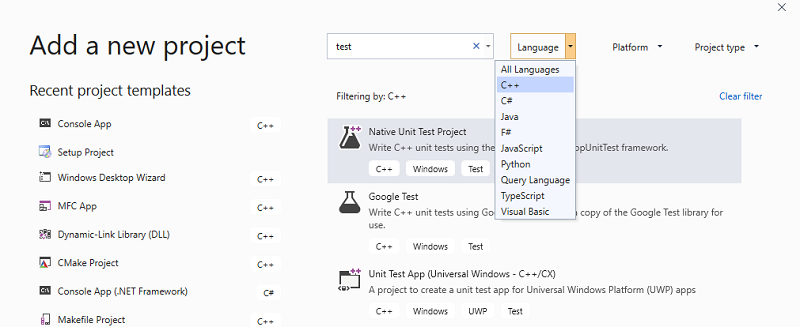
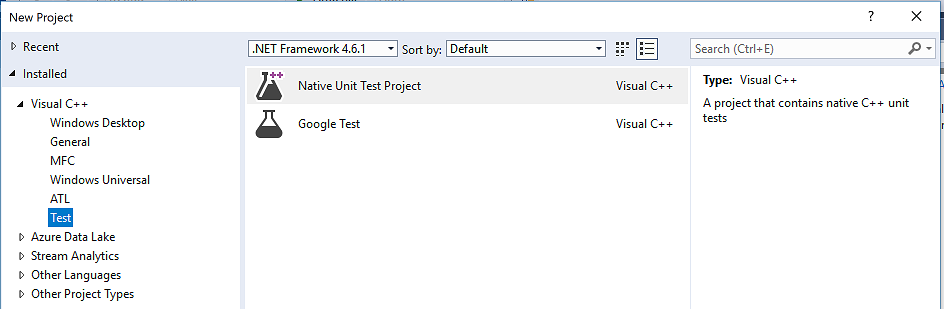
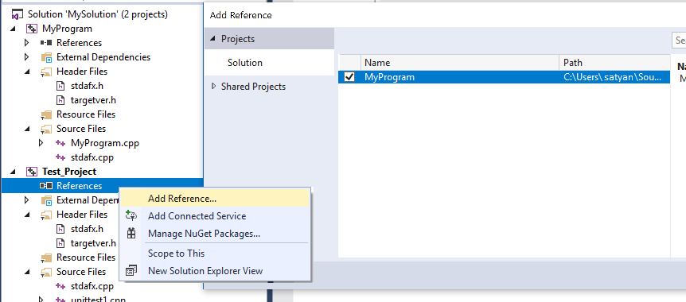
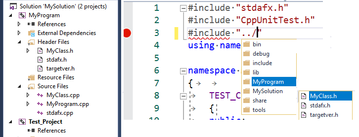
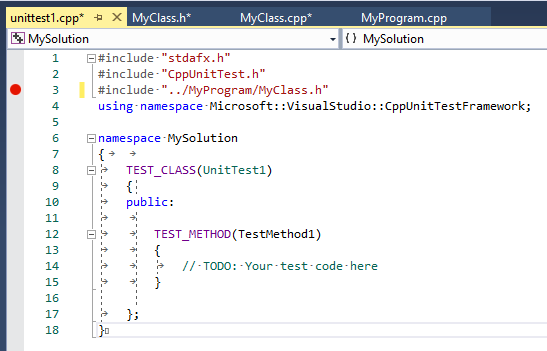
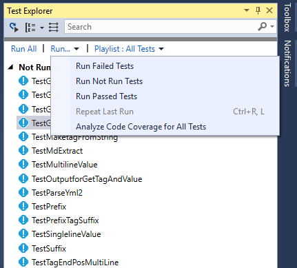
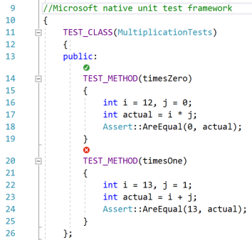
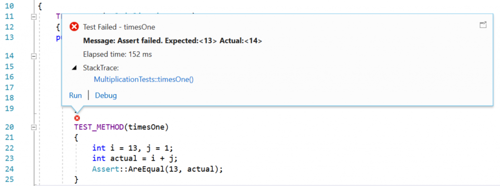

# Write unit tests for C/C++ in Visual Studio

You can write and run your C++ unit tests by using the **Test Explorer** window. It works just like it does for other languages. For more information about using **Test Explorer**, see [Run unit tests with Test Explorer](run-unit-tests-with-test-explorer.md).

> [!NOTE]
> Some features such as Live Unit Testing, Coded UI Tests and IntelliTest are not supported for C++.

Visual Studio includes these C++ test frameworks with no additional downloads required:

- Microsoft Unit Testing Framework for C++
- Google Test
- Boost.Test
- CTest

Along with using the installed frameworks, you can write your own test adapter for whatever framework you would like to use within Visual Studio. A test adapter can integrate unit tests with the **Test Explorer** window. Several third-party adapters are available on the [Visual Studio Marketplace](https://marketplace.visualstudio.com). For more information, see [Install third-party unit test frameworks](install-third-party-unit-test-frameworks.md).

**Visual Studio 2017 and later (Professional and Enterprise)**

C++ unit test projects support [CodeLens](../ide/find-code-changes-and-other-history-with-codelens.md).

**Visual Studio 2017 and later (all editions)**

- **Google Test Adapter** is included as a default component of the **Desktop development with C++** workload. It has a project template that you can add to a solution. Use the **Add New Project** right-click menu on the solution node in **Solution Explorer** to add it. It also has options you can configure via **Tools** > **Options**. For more information, see [How to: Use Google Test in Visual Studio](how-to-use-google-test-for-cpp.md).

- **Boost.Test** is included as a default component of the **Desktop development with C++** workload. It's integrated with **Test Explorer**, but currently doesn't have a project template. It must be manually configured. For more information, see [How to: Use Boost.Test in Visual Studio](how-to-use-boost-test-for-cpp.md).

- **CTest** support is included with the **C++ CMake tools** component, which is part of the **Desktop development with C++** workload. For more information, see [How to: Use CTest in Visual Studio](how-to-use-ctest-for-cpp.md).

**Visual Studio 2015 and earlier**

You can download the Google Test adapter and Boost.Test Adapter extensions on the Visual Studio Marketplace. Find them at [Test adapter for Boost.Test](https://marketplace.visualstudio.com/items?itemName=VisualCPPTeam.TestAdapterforBoostTest) and [Test adapter for Google Test](https://marketplace.visualstudio.com/items?itemName=VisualCPPTeam.TestAdapterforGoogleTest).

## Basic test workflow

The following sections show the basic steps to get you started with C++ unit testing. The basic configuration is similar for both the Microsoft and Google Test frameworks. Boost.Test requires that you manually create a test project.

::: moniker range=">=vs-2019"

### Create a test project in Visual Studio 2019

You define and run tests inside one or more test projects. You create the projects in the same solution as the code you want to test. To add a new test project to an existing solution, right-click on the Solution node in **Solution Explorer**. In the pop-up menu, choose **Add** > **New Project**. Set **Language** to C++ and type "test" into the search box. The following illustration shows the test projects that are available when the **Desktop Development with C++** and the **UWP Development** workload are installed:



::: moniker-end

::: moniker range="vs-2017"

### Create a test project in Visual Studio 2017

You define and run tests inside one or more test projects. You create the projects in the same solution as the code you want to test. To add a new test project, right-click on the Solution node in **Solution Explorer** and choose **Add** > **New Project**. In the left pane, choose **Visual C++ Test**. Then, choose one of the project types from the center pane. The following illustration shows the test projects that are available when the **Desktop Development with C++** workload is installed:



::: moniker-end

### Create references to other projects in the solution

To enable access to the functions in the project under test, add a reference to the project in your test project. Right-click on the test project node in **Solution Explorer** for a pop-up menu. Choose **Add** > **Reference**. In the Add Reference dialog, choose the project(s) you want to test.



### Link to object or library files

If the test code doesn't export the functions that you want to test, you can add the output .obj or .lib files to the dependencies of the test project. For more information, see [To link the tests to the object or library files](how-to-use-microsoft-test-framework-for-cpp.md#object_files).

### Add #include directives for header files

Next, in your unit test *.cpp* file, add an `#include` directive for any header files that declare the types and functions you want to test. Type `#include "` and then IntelliSense will activate to help you choose. Repeat for any additional headers.



To avoid having to type the full path in each include statement in the source file, you can add the required folders in **Project** > **Properties** > **C/C++** > **General** > **Additional Include Directories**.

### Write test methods

> [!NOTE]
> This section shows syntax for the Microsoft Unit Testing Framework for C/C++. It is documented here: [Microsoft.VisualStudio.TestTools.CppUnitTestFramework API reference](microsoft-visualstudio-testtools-cppunittestframework-api-reference.md). For Google Test documentation, see [Google Test primer](https://github.com/google/googletest/blob/master/docs/primer.md). For Boost.Test, see [Boost Test library: The unit test framework](https://www.boost.org/doc/libs/1_46_0/libs/test/doc/html/utf.html).

The *.cpp* file in your test project has a stub class and method defined for you. They show an example of how to write test code. The signatures use the TEST_CLASS and TEST_METHOD macros, which make the methods discoverable from the **Test Explorer** window.



TEST_CLASS and TEST_METHOD are part of the [Microsoft Native Test Framework](microsoft-visualstudio-testtools-cppunittestframework-api-reference.md). **Test Explorer** discovers test methods in other supported frameworks in a similar way.

A TEST_METHOD returns void. To produce a test result, use the static methods in the `Assert` class to test actual results against what is expected. In the following example, assume `MyClass` has a constructor that takes a `std::string`. We can test that the constructor initializes the class as expected like so:

```cpp
TEST_METHOD(TestClassInit)
{
    std::string name = "Bill";
    MyClass mc(name);
    Assert::AreEqual(name, mc.GetName());
}
```

In the previous example, the result of the `Assert::AreEqual` call determines whether the test passes or fails. The Assert class contains many other methods for comparing expected vs. actual results.

You can add *traits* to test methods to specify test owners, priority, and other information. You can then use these values to sort and group tests in **Test Explorer**. For more information, see [Run unit tests with Test Explorer](run-unit-tests-with-test-explorer.md).

### Run the tests

1. On the **Test** menu, choose **Windows** > **Test Explorer**. The following illustration shows a test project whose tests have not yet run.

   

   > [!NOTE]
   > CTest integration with **Test Explorer** is not yet available. Run CTest tests from the CMake main menu.

1. If not all your tests are visible in the window, build the test project by right-clicking its node in **Solution Explorer** and choosing **Build** or **Rebuild**.

1. In **Test Explorer**, choose **Run All**, or select the specific tests you want to run. Right-click on a test for other options, including running it in debug mode with breakpoints enabled. After running all the tests, the window shows which tests passed and which ones failed:


For failed tests, the message offers details that help to diagnose the cause. Right-click on the failing test for a pop-up menu. Choose **Debug Selected Tests** to step through the function where the failure occurred.

For more information about using **Test Explorer**, see [Run unit tests with Test Explorer](run-unit-tests-with-test-explorer.md).

For more information related to unit testing, see [Unit test basics](unit-test-basics.md)

## Use CodeLens

**Visual Studio 2017 and later (Professional and Enterprise editions)**

[CodeLens](../ide/find-code-changes-and-other-history-with-codelens.md) lets you quickly see the status of a unit test without leaving the code editor.

You can initialize CodeLens for a C++ unit test project in any of these ways:

- Edit and build your test project or solution.
- Rebuild your project or solution.
- Run tests from the **Test Explorer** window.

After it's initialized, you can see test status icons above each unit test.



Click on the icon for more information, or to run or debug the unit test:



## See also

- [Unit test your code](unit-test-your-code.md)
