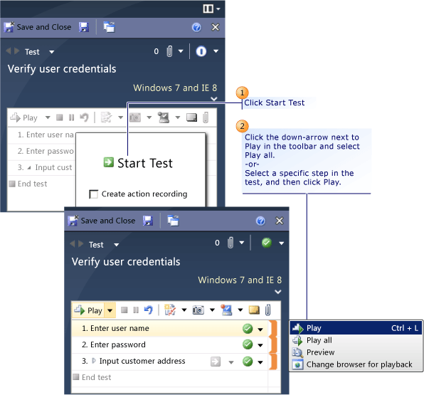

# - How to: Play Back an Action Recording
After you create an *action recording*, you can play it back while you run a test that contains the recording. This helps in circumstances where you might have to run the test multiple times because the action recording automatically plays back the steps. Alternatively, you can fast forward through the test steps until you reach the correct test step to verify a bug.  
  
 For information about how to create an action recording, see [- How to: Create an Action Recording](../test_notintoc/--how-to--create-an-action-recording.md).  
  
 The action recording can also contain data that the tests steps use while the test runs, for example, logging on to an application or a Web site. As soon as the action recording finishes, you can continue to test manually at the point where the action recording stopped.  
  
 **Requirements**  
  
-   Visual Studio Enterprise, [!INCLUDE[vstsTestEssLong](../test/includes/vststestesslong_md.md)]  
  
 The following procedure describes how to play back an action recording, starting with how to load a test into Test Runner.  
  
## Replay an Action Recording from a Test Case in Microsoft Test Manager in Test Runner  
 To play an action recording, you must first load a test that contains an action recording into [!INCLUDE[mtrshort](../test_notintoc/includes/mtrshort_md.md)] from [!INCLUDE[TCMext](../codequality/includes/tcmext_md.md)]. For more information, see [- How to: Create an Action Recording](../test_notintoc/--how-to--create-an-action-recording.md).  
  
 **Loading a test with an action recording**  
  
   
  
#### To load a test into Test Runner  
  
1.  Open [!INCLUDE[TCMext](../codequality/includes/tcmext_md.md)].  
  
    > [!NOTE]
    >  To display the [!INCLUDE[TCMext](../codequality/includes/tcmext_md.md)] window, choose Start, All Programs, Microsoft Visual Studio, Microsoft Test Manager.  
  
2.  On the center group switcher, choose the down-arrow and then choose **Testing Center**.  
  
3.  On the center group menu bar, choose **Test**.  
  
4.  In the menu under the center group menu bar, choose **Run Tests** if it is not already selected.  
  
5.  In the left side pane, under **RunTests**, select either the test plan or the test suite listed under the test plan that contains the test that you want to run.  
  
     The right side pane displays the test cases within the selected test suite.  
  
6.  In the right side pane, choose a test case that contains an action recording and then choose **Run**.  
  
     The **Test Runner** opens.  
  
    > [!NOTE]
    >  Select **Run with options** to specify a build to run the test on, or to override the test settings and environment settings for the test plan. For more information, see [How to: Override Settings in Your Test Plan for Test Runs](assetId:///832576d2-44bd-4237-8cde-612349a3ab50).  
  
 **Playing back an action recording from Microsoft Test Manager**  
  
   
  
#### To replay an action recording from the test loaded from Microsoft Test Manager  
  
1.  When you load a test from [!INCLUDE[TCMext](../codequality/includes/tcmext_md.md)] into [!INCLUDE[mtrshort](../test_notintoc/includes/mtrshort_md.md)], you are prompted to **Start Test** with the option **Create action recording**. Leave **Create action recording** clear and choose **Start Test**.  
  
2.  In the toolbar, choose the down-arrow next to **Play** and select **Play all**.  
  
     -or-  
  
     Select a specific step or multiple steps in the test to play back and in the toolbar, choose the down-arrow next to **Play** and select **Play**.  
  
     The action recording will display the steps in the **AutomationPlayback in Progress** dialog box and the steps will play as you conducted them during the recording.  
  
    > [!NOTE]
    >  You can preview the action recording steps before you run them by selecting the **Preview** option from the **Play** button in the toolbar. For more information, see [How to: Preview Action Steps](../test_notintoc/how-to--preview-action-steps.md).  
  
3.  After the action recording finishes, you can continue your testing with this manual test.  
  
    > [!NOTE]
    >  You can replay the action recording as described in the following procedure, "Replay an Action recording in an open test in Test Runner."  
  
## Replay an Action recording in an open test in Test Runner  
 To replay an action recording, you must first create an action recording with the currently loaded test or have a test that contains an action recording already loaded. For more information, see [- How to: Create an Action Recording](../test_notintoc/--how-to--create-an-action-recording.md).  
  
 **Replay action in Test Runner**  
  
   
  
#### To replay an action recording in a previously loaded test  
  
1.  In the **Test Steps** pane, choose the specific test step or test steps that you want to play back and then choose **Play** in the toolbar.  
  
     You can also select specific steps to play back by using combinations of CTRL + CLICK and SHIFT + CLICK.  
  
     The action recording will display the steps in the **AutomationPlayback in Progress** dialog box and the steps will play as you conducted them during the recording.  
  
    > [!NOTE]
    >  You can also play back all the steps by choosing the arrow next to **Play** in the toolbar and then choosing **Play all**.  
  
     -or-  
  
2.  In the **Test Steps** pane, right-click the yellow action recording section indicator to the right of the test step that you want play back and select **Play**.  
  
     The action recording will display the steps in the **AutomationPlayback in Progress** dialog box and the steps will play as you conducted them during the recording.  
  
3.  After the action recording finishes, you can continue your testing with this manual test.  
  
## See Also  
 [- How to: Create an Action Recording](../test_notintoc/--how-to--create-an-action-recording.md)   
 [How to: Preview Action Steps](../test_notintoc/how-to--preview-action-steps.md)   
 [Record and play back manual tests](../test/record-and-play-back-manual-tests.md)