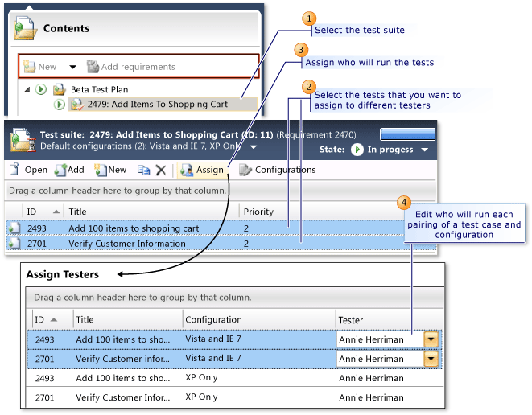

# How to: Assign Who Will Run the Tests in a Test Plan
When you add test cases to a test plan using [!INCLUDE[TCMext](../codequality/includes/tcmext_md.md)], the tester who is assigned to the test case is automatically assigned to run the pairings of test cases and configurations. This is the default setting. If you want a tester who is not assigned to the test case to run a particular pairing, you can select the test case and change the assigned tester as shown in the following illustration.  
  
   
  
 You can also select the test suite and reassign all the tests. For example, you might want to assign all the tests for a specific configuration to one tester.  
  
 **Requirements**  
  
-   Visual Studio Enterprise, [!INCLUDE[vstsTestEssLong](../test/includes/vststestesslong_md.md)]  
  
> [!NOTE]
>  This does not change the ownership of the test case. The owner is listed in the **Assigned To** field in the test case.  
  
### To assign a tester to run specific pairings of test cases and configurations  
  
1.  Open [!INCLUDE[TCMext](../codequality/includes/tcmext_md.md)]. (Go to Start, All Programs, Microsoft Visual Studio, Microsoft Test Manager)  
  
2.  From the **Testing Center**, choose **Plan** and then choose **Contents**.  
  
     The **Contents** pane is displayed.  
  
3.  To change the default assignments of testers, select the test suite that contains the test cases that you want to reassign.  
  
4.  If you want to be able to reassign any of the test cases in a test suite, right-click the test suite and select **Assign testers for all tests**.  
  
     \- or -  
  
     If you want to reassign specific test cases in the test suite, select the specific tests in the test suite details pane, and choose **Assign** in the **Test Suite Details** pane toolbar.  
  
     The **Assign Testers** dialog box is displayed. It shows all the pairings of test cases and configurations for the test cases that you selected.  
  
5.  Choose **Tester** to select a different tester to run the specific pairing of a test case with a configuration.  
  
    > [!NOTE]
    >  You can select multiple pairings of test cases and configurations and change the assignment for all by changing **Tester** for any one of the selected rows.  
  
6.  (Optional) To group the test cases by a specific column, drag the column title to **Drag a column header here to group by that column**. If you drag the column title for configuration, you can now select all the test cases for a specific configuration. Press **Shift** in the first row of the group and press **Shift** in the last row, and then choose **Tester** in one of the rows to assign them to the same tester.  
  
7.  To save your changes, choose **Save assignments**.  
  
     Any changes to the assignments are displayed in **Testers**.  
  
    > [!NOTE]
    >  If different testers are assigned to different configurations for the same test, **Multiple** is displayed in **Testers**.  
  
## See Also  
 [Plan your tests](../test/planning-manual-tests-using-the-web-portal.md)