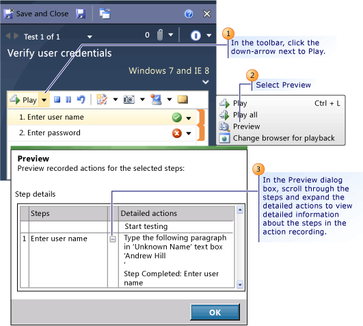

# How to: Preview Action Steps
Before you play back an action recording, you can preview the action steps within the recording. The preview steps are displayed in text format in the **Preview** dialog box and include detailed actions that took place during the step. These details can help you determine the exact steps that took place in the application when you are trying to isolate errors or determine whether the steps were conducted correctly.  
  
 **Requirements**  
  
-   Visual Studio Enterprise, [!INCLUDE[vstsTestEssLong](../test/includes/vststestesslong_md.md)]  
  
## Preview Action Steps When Loading a Test with an Action Recording  
 To preview action steps in an action recording, you must first load a test that contains an action recording into [!INCLUDE[mtrshort](../test_notintoc/includes/mtrshort_md.md)] from [!INCLUDE[TCMext](../codequality/includes/tcmext_md.md)] or create one in the current test. For more information, see [- How to: Create an Action Recording](../test_notintoc/--how-to--create-an-action-recording.md) and [- How to: Play Back an Action Recording](../test_notintoc/--how-to--play-back-an-action-recording.md). This procedure shows how to load a test that has an existing action recording and then how to preview the action steps within the recording.  
  
 **Load a test with an action recording**  
  
   
  
#### To load a test with an action recording into Test Runner  
  
1.  Open [!INCLUDE[TCMext](../codequality/includes/tcmext_md.md)]. (Go to Start, All Programs, Microsoft Visual Studio, Microsoft Test Manager.)  
  
2.  Choose the down-arrow on the center group switcher and then choose **Testing Center**.  
  
3.  On the center group menu bar, choose **Test**.  
  
4.  In the menu under the center group menu bar, choose **Run Tests** if it is not already selected.  
  
5.  In the left pane, under **Run Tests**, select either the test plan or the test suite listed under the test plan that contains the test that you want to run.  
  
     The right side pane displays the test cases within the selected test suite.  
  
6.  In the right side pane, choose a test case that contains an action recording and then choose **Run**.  
  
     The Test Runner opens.  
  
    > [!NOTE]
    >  Select **Run with options** to specify a build to run the test on, or to override the test settings and environment settings for the test plan.  
  
 **Preview action recording in Test Runner**  
  
   
  
#### To preview the action steps in a test with an action recording  
  
1.  When you load a test from [!INCLUDE[TCMext](../codequality/includes/tcmext_md.md)] into [!INCLUDE[mtrshort](../test_notintoc/includes/mtrshort_md.md)], you are prompted to **Start Test** with the option **Create action recording**. The **Create action recording** check box should be clear. Choose **Start Test**.  
  
2.  In the toolbar, choose the down-arrow next to **Play** and select **Preview**.  
  
     The **Preview** dialog box is displayed.  
  
3.  Scroll through the steps and expand the detailed actions to view detailed information about the steps in the action recording.  
  
## Preview Action Steps in a Previously Loaded Test  
 To preview action steps in an action recording, you must first load a test that contains an action recording into [!INCLUDE[mtrshort](../test_notintoc/includes/mtrshort_md.md)] from [!INCLUDE[TCMext](../codequality/includes/tcmext_md.md)] or create one in the current test. For more information, see [- How to: Create an Action Recording](../test_notintoc/--how-to--create-an-action-recording.md) and [- How to: Play Back an Action Recording](../test_notintoc/--how-to--play-back-an-action-recording.md). This procedure assumes that you already have a test loaded which has an existing action recording, or a test that you have just added an action recording to.  
  
 **Preview action recording in a loaded test**  
  
   
  
#### To preview action steps in a previously loaded test  
  
1.  Choose a test step for which you want to preview the action step. The test step must have an orange action recording section indicator associated with it.  
  
    > [!NOTE]
    >  You can use CTRL+Click or SHIFT+Click to select multiple test steps as long as they each have an associated blue action recording section.  
  
2.  In the toolbar, choose the down-arrow next to **Play** and select **Preview**.  
  
     The **Preview** dialog box is displayed.  
  
3.  Scroll through the steps and expand the detailed actions to view detailed information about the steps in the action recording.  
  
## See Also  
 [- How to: Play Back an Action Recording](../test_notintoc/--how-to--play-back-an-action-recording.md)   
 [- How to: Create an Action Recording](../test_notintoc/--how-to--create-an-action-recording.md)   
 [Record and play back manual tests](../test/record-and-play-back-manual-tests.md)