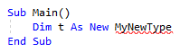
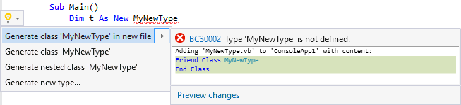
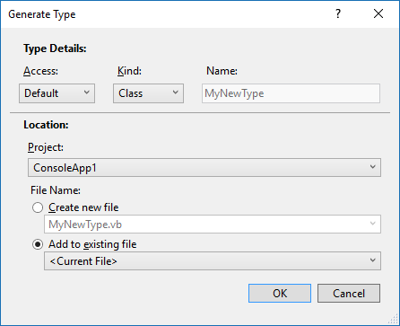

# Generate a class or type in Visual Basic
**What:** Lets you immediately generate the code for a class or type. 

**When:** You introduce a new class or type and want to properly declare it, automatically.  

**Why:** You could declare the class or type before using it, however this feature will generate the class or type automatically. 

**How:**

1. Place your cursor on the line where there is a red squiggle indicating you've used a class that doesn't yet exist.

   

1. Next, do one of the following:
   * **Keyboard**
     * Press **Ctrl+.** to trigger the **Quick Actions and Refactorings** menu and select one of the options from the Preview window popup.
   * **Mouse**
     * Right-click and select the **Quick Actions and Refactorings** menu and select one of the options from the Preview window popup.
     * Hover over the red squiggle and click the  icon which appears.
     * Click the  icon which appears in the left margin if the text cursor is already on the line with the red squiggle.

   

   Selection | Description
   --- | ---
   Generate class '*TypeName*' in new file | Creates a class named *TypeName* in a file named *TypeName*.cs/.vb
   Generate class '*TypeName*' | Creates a class named *TypeName* in the current file.
   Generate nested class '*TypeName*' | Creates a class named *TypeName* nested inside the current class.
   Generate new type... | Creates a new class or struct with all of the properties you specify.

   >[!TIP]
   >Use the [**Preview changes**](../../ide/preview-changes.md) link at the bottom of the preview window to see all of the changes that will be made before making your selection.

1. If you select the **Generate new type...** item, a dialog box will pop up that allows you to perform some additional actions.

   

   Selection | Description
   --- | ---
   Access | Set the type to have *Default*, *Internal* or *Public* access.
   Kind | This can be set as *class* or *struct*.
   Name | This cannot be changed and will be the name you already typed.
   Project | If there are multiple projects in your solution, you can choose where you want the class/struct to live.
   File Name | You can create a new file or you can add the type to an existing file.

1. The class/struct will be created automatically with the constructor inferred from its usage.

   

## See Also  
[Code Generation (Visual Basic)](../code-generation-vb.md)  
[Preview Changes](../../ide/preview-changes.md)