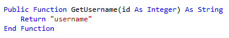
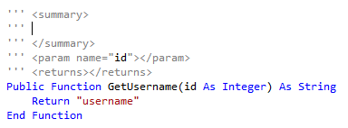
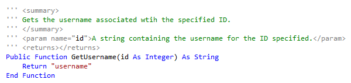

# Generate XML documentation comments in Visual Basic
**What:** Lets you immediately generate the base XML required to document the selected element. 

**When:** You want to create XML Document Comments for later processing by a documentation tool like Sandcastle.

**Why:** You could manually create the entire comment block yourself, however this will save time and improve accuracy by generating the base template and additional elements. 

**How:**

1. Place your text cursor above the element you want to document, for example, a method.

   

1. Next, type **'''** (3 single quotes) which will automatically create the base template and any additional elements as necessary.  For example, when commenting a method, it will generate the **\<summary\>** tags as well as a **\<param\>** tag for every parameter that is passed to the method, and a **\<returns\>** tag to document what the method returns.

   

1. Complete the comments and add any additional information you feel is necessary.

   

## See Also
[Documenting Your Code with XML (Visual Basic)](/dotnet/visual-basic/programming-guide/program-structure/documenting-your-code-with-xml)  
[Code Generation (Visual Basic)](../code-generation-vb.md) 