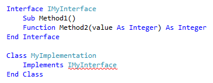
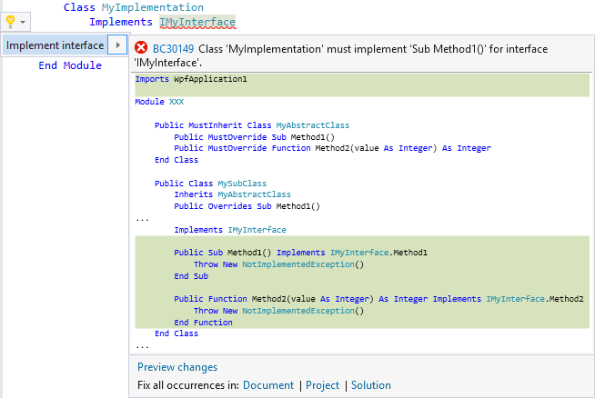
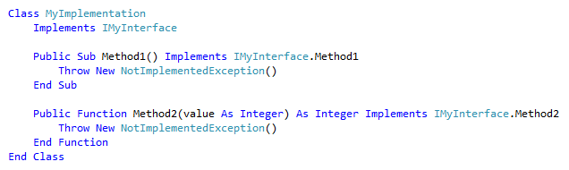

# Implement an interface in Visual Basic
**What:** Lets you immediately generate the code required to implement an interface. 

**When:** You want to inherit from an interface.  

**Why:** You could manually implement all interface one-by-one, however this feature will generate all method signatures automatically. 

**How:**

1. Place your cursor on the line where there is a red squiggle indicating you have referenced an interface but have not implemented all required members.

   

1. Next, do one of the following:
   * **Keyboard**
     * Press **Ctrl+.** to trigger the **Quick Actions and Refactorings** menu and select **Implement interface (explicitly)** from the Preview window popup.
   * **Mouse**
     * Right-click and select the **Quick Actions and Refactorings** menu and select **Implement interface (explicitly)** from the Preview window popup.
     * Hover over the red squiggle and click the  icon which appears.
     * Click the  icon which appears in the left margin if the text cursor is already on the line with the red squiggle.

   

   >[!TIP]
   >Use the [**Preview changes**](../../ide/preview-changes.md) link at the bottom of the preview window to see all of the changes that will be made before making your selection.
   >
   >Additionally, you can use the **Document**, **Project**, and **Solution** links at the bottom of the preview window to create the proper method signatures across multiple classes which implement the interface.

1. The interface's method signatures will be created automatically, ready to be implemented.

   

## See Also  
[Code Generation (Visual Basic)](../code-generation-vb.md)  
[Preview Changes](../../ide/preview-changes.md)