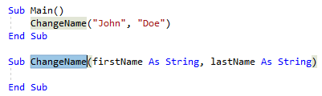
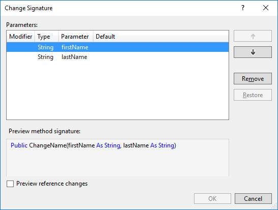

# Change a method signature in Visual Basic
**What:** Lets you remove or change the order of a method's parameters.

**When:** You want to move or remove a method parameter that is currently being used in a variety of locations.  

**Why:** You could manually remove and re-order the parameters, and then find all calls to that method and change them one-by-one, but that could lead to errors.  This refactoring tool will perform the task automatically.

**How:**

1. Highlight or place the text cursor inside the name of the method to modify, or one of its usages:

   

1. Next, do one of the following:
   * **Keyboard**
     * Press **Ctrl+R**, then **Ctrl+V**.  (Note that your keyboard shortcut may be different based on which profile you've selected.)
     * Press **Ctrl+.** to trigger the **Quick Actions and Refactorings** menu and select **Change Signature** from the Preview window popup.
   * **Mouse**
     * Select **Edit > Refactor > Remove Parameters**.
     * Select **Edit > Refactor > Reorder Parameters**.
     * Right-click the code, select the **Quick Actions and Refactorings** menu and select **Change Signature** from the Preview window popup.

1. In the **Change Signature** dialog that pops up, you can use the buttons on the right side to change the method signature:

   

   | Button | Description
   | ------ | ---
   | **Up/Down** | Move the selected parameter up and down the list
   | **Remove**  | Remove the selected parameter from the list
   | **Restore** | Restore the selected, crossed-out parameter to the list

   > [!TIP]
   > Use the [**Preview reference changes**](../../ide/preview-changes.md) checkbox to see what the result will be before committing to it.

1. When you are finished, press the **OK** button to make the changes.

   

## See Also  
[Refactoring (Visual Basic)](../refactoring-vb.md)  
[Preview Changes](../../ide/preview-changes.md)