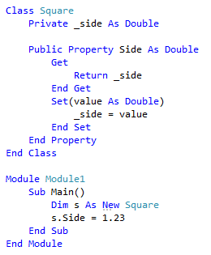

# Encapsulate a field in Visual Basic
**What:** Lets you turn a field into a property, and update all usages of that field to use the newly created property.

**When:** You want to move a field into a property, and update all references to that field.  

**Why:** You want to give other classes access to a field, but don't want those classes to have direct access.  By wrapping the field in a property, you could write code to verify the value being assigned, for example.

**How:**

1. Highlight or place the text cursor inside the name of the field to encapsulate:

   

1. Next, do one of the following:
   * **Keyboard**
     * Press **Ctrl+R**, then **Ctrl+E**.  (Note that your keyboard shortcut may be different based on which profile you've selected.)
	 * Press **Ctrl+.** to trigger the **Quick Actions and Refactorings** menu and select either **Encapsulate field** entry from the Preview window popup.
   * **Mouse**
     * Select **Edit > Refactor > Encapsulate Field**.
	 * Right-click the code, select the **Quick Actions and Refactorings** menu and select either **Encapsulate field** entry from the Preview window popup.

   Selection | Description
   --------- | -----------
   **Encapsulate field (and use property)** | Encapsulates the field with a property, and updates all usages of the field to use the generated property
   **Encapsulate field (but still use field)** | Encapsulates the field with a property, but leaves all usages of the field untouched

   The property will be immediately created and references to the field will be updated, if selected.

   > [!TIP]
   > Use the [**Preview changes**](../../ide/preview-changes.md) link in the popup window to see what the result will be before committing to it.

   

## See Also  
[Refactoring (Visual Basic)](../refactoring-vb.md)  
[Preview Changes](../../ide/preview-changes.md)