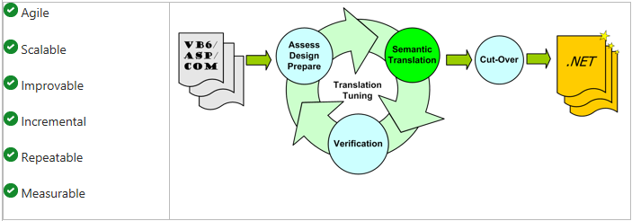
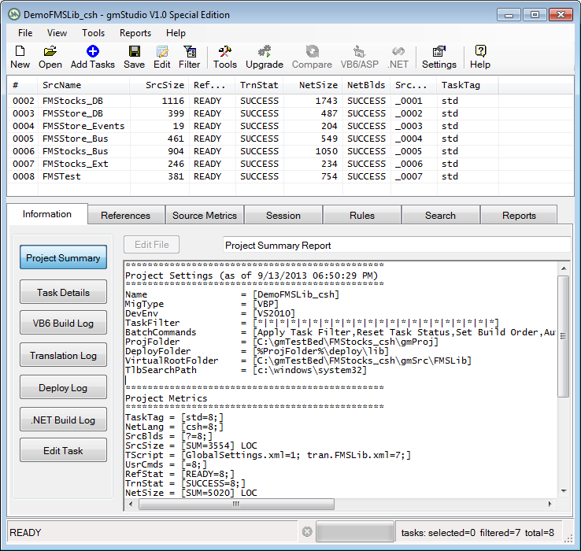

# Great Migrations Studio (gmStudio)

gmStudio is a unique system re-engineering environment for developing scalable, custom VB6/ASP/COM to .NET upgrade solutions. As a comprehensive software re-engineering platform, gmStudio helps you plan, customize, improve, verify, and track your upgrade process and meet the unique requirements of your source code and your .NET standards.  If you are looking to preserve and enhance the value of your VB6/ASP/COM assets, gmStudio is the most advanced and cost-effective solution available. 

## The Tool-Assisted Rewrite

gmStudio offers compiler-as-a-service capabilities to enable an agile **Tool-Assisted Rewrite Methodology**. This methodology accelerates your upgrade efforts without sacrificing quality or control. Project teams using our tools and methods can deliver a lot more upgrade, better, and faster.

 

## Important offer for you!

Microsoft and Great Migrations have partnered to offer a free gmStudio license to you. The link below can be used to obtain a free copy of gmStudio that will allow you to upgrade an application of up to 10,000 lines of VB6 code to VB.NET or C#. This promotional offer can also be applied as a discount when purchasing a larger license or a license for our **ASP upgrade** tool.

[**Learn more and Download a free version of gmStudio**](http://www.greatmigrations.com/resources/gmstudio-promotion.aspx)

[**Click to request gmStudio Promotional Edition for systems with up to 10,000 lines of VB6 code!**](http://www.greatmigrations.com/resources/gmstudio-promotion.aspx)

 

## Benefits

- **Cash-in your legacy software assets**: use gmStudio to help you "cash in" your legacy assets by upgrading them to .NET.

- **Get more upgrade for your money**:  generate code that takes advantage of .NET.

- **Rewrite to your standards**: use .NET APIs and design patterns for lower total cost of ownership and agility after the upgrade.  

- **Integrate manual development**:  automatically integrate hand-written code fragments, methods or entire files. 

- **Upgrade enterprise applications**: upgrade large, complex systems made up of many inter-related VB6/ASP/COM components.

- **Continue maintenance in parallel with the upgrade**:  our methodology does not require a code freeze.  

- **Get valuable results quickly**: gmStudio facilitates an agile approach to migration that delivers .NET code iteratively.
 
- **Build quality in and up**: the gmStudio approach is test-driven and improves code quality systematically and incrementally.

- **Document and reuse your solutions**: each gmStudio solution is documented and reusable.

- **Plan and estimate more effectively**: gmStudio's customizable code analysis reports help you plan your upgrade strategies.

- **Measure and track progress**:  gmStudio's translation, build, and code review reports help you measure quality and track progress.

## Features

- **VB6/COM Compiler-as-a-service**: configure gmStudio using our extensible rules-scripting language.

- **Choice of Target Language**: automatically rewrite VB6/COM in either C# or VB.NET.

- **Choice of Target IDE**: choose VS2010 or VS2012 as your Visual Studio IDE.

- **Choice of Forms Replacement**: target WinForms or WPF (beta).

- **Custom COM/ActiveX Replacement**: replace COM APIs and controls with .NET classes that meet your standards.

- **Custom API Replacement**: replace Win32 API calls with .NET code that meets your standards.

- **Custom Language Replacement**: replace VB6 intrinsics with .NET code that meets your standards.

- **Stub Generation**: generate stubbed-out .NET classes for your COM dependencies and application code.

- **Content Templates**: use custom, dynamic templates for project files, AssemblyInfo files, and many other code structures.

- **Custom Deployment/Build Processes**: add your tasks to the deployment/build processes for the translated code.

- **High-performance**: experiment with many variations of your upgrade rules, even if your system is very large.

## Additional Resources

- **Learn more**:  visit [Great Migrations Documentation Home](https://www.greatmigrations.com/resources/documentation.aspx) for white papers, case studies, videos and webcasts.

- **Try it yourself**:  submit the [gmStudio Demo request form](http://www.greatmigrations.com/resources/gmstudio-promotion.aspx) to get a free trial version of gmStudio.
  
