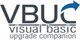
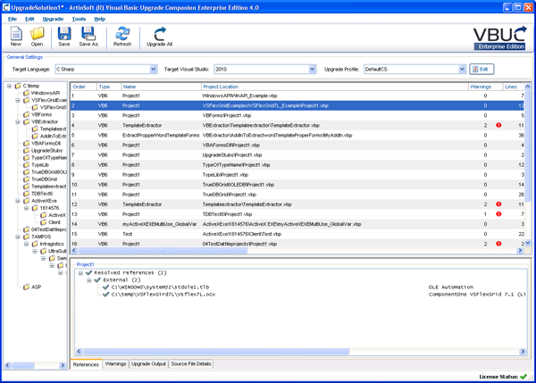
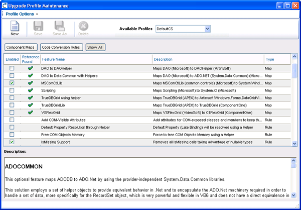

# Mobilize.Net's Visual Basic Upgrade Companion (VBUC)

<table>
   <tr>
      <td> </td> 
      <td>Mobilize.Net's Visual Basic Upgrade Companion (VBUC) is the industry-leading tool for the migration of VIsual Basic 6 to both Visual Basic .NET and C#. With a proven track record of millions of lines of code upgraded to Microsoft's .NET Framework, the VBUC helps you move your business-critical applications out of obsolescence free of ties to third-party dependencies. 

      If you are look to take advantage of new Microsoft technologies, reducing development, deployment, nad maintenance costs, and addressing compliance issues or meeting market demands, the VBUC is the most advanced and cost-effective solution out there.
 </td>  
   </tr>
<table>

<table>
   <tr>
      <td></td>
      <td><a href="http://www.mobilize.net/solution/msdn"><strong>Learn more and download a free version of VBUC</string></a></td>
   </tr>
</table>  

## Exciting offer for you!

Microsoft and Mobilize.Net have partnered to offer a free VBUC license to you. The discount code below can be used to purchase a license that will allow you to migrate an application of up to 10,000 lines of VB6 code to VB.NET or C# for free. It can also be applied when purchasing a larger license.

[Download your copy today.](http://www.mobilize.net/solution/msdn) Use the code **MSDN** for a free license for up to 10,000 lines of code!

## Benefits

- Cost-effectively convert your application to either C# or VB.NET: About 80% savings versus a manual rewrite and 60% versus other tools.

- Accelerate your VB6 to .NET migration: Lower your project timeframe up to 4 times less than other solutions.

- Reduce project risks: The VBUC is a non-disruptive, highly automated tool that preserves all the business rules embedded in the code and the value of the original application.

- Take advantage of the new platform features: Generate 100% native VB.NET or C# code, easy to maintain and evolve. No ties to proprietary third-party runtimes that deprive you of all the benefits of the .NET Framework.

- Extend and customize the migration tool based on your needs: Add support for more legacy components and enhance existing features to comply with enterprise coding standards.

## Features

The Visual Basic Upgrade Companion includes a large set of powerful features and customization/extensibility options that provide a wide range of choices for the code conversion process, dramatically reducing the subsequent amount of required manual work and producing native .NET code while making the translated application to compile and run with a behavior that is equivalent to the original VB6 system.

These are some of the unique characteristics of the Visual Basic Upgrade Companion:

- **Language transformations**: The VBUC performs the most advanced language transformations to generate pure, clean and readable .NET source code employing the most of its inherent features.

- **Advanced Code Refactoring**: The VBUC applies additional transformation rules to generate code that looks as if it was originally written in .NET.

- **Reference Resolution Between Projects**: Save time, human effort and money by easily upgrading multi-project, complex applications in a single run.

- **Error Handling Transformation**: Eliminate the “On error” and “Go to” statements from your resulting .NET code with just a single click.

- **Resolve Late Bound Variable Types**: All the data-type issues are automatically fixed during the migration. Late binding variables will no longer have generic data types.
 
- **Extensibility**: Appropriate code conversion rules and component mappings can be set through switchable options that are displayed in a Profile Manager window. All the particular code techniques and patterns found in your code can be described into the VBUC’s core, including the ability to add or fine-tune existing support for ActiveX controls and libraries. More complex customizations can be implemented by Mobilize.Net on user request.
 
   

- **Third Party Library Support**: The Visual Basic Upgrade Companion is able to upgrade many ActiveX controls found in the original application to inherent .NET components or to newer versions of those third-party controls.

- **Legacy Data Access to ADO.NET**: Upgrade your data access (ADO, DAO, RDO) to ADO.NET automatically with several source-target combination possibilities.

- **ASP/VB6 Migration Support**: The VBUC allows the migration of mixed ASP and VB6 projects to ASP.NET and VB.NET or C#.

- **User Environment**: Advanced GUI and Command Line interface oriented to improve its usability and user experience. The UI and all messages, including EWIs, can be displayed in different languages besides the standard English.
 
  

For an updated, more detailed features list, please visit the [VBUC’s technical site](http://www.vbtonet.com/?msdn).

## Learn more and try it for yourself
Learn more about the VBUC, read customer evidence, access white papers, videos and webcasts, or download a free trial at http://www.mobilize.net/solution/msdn.

## Additional Resources

- [**VB/ASP Assessment Tool**](https://www.mobilize.net/modernization-assessment-tool): a free product that works as a measuring instrument for the upgrade effort, analyzing the application components and the relationships between them from a migration perspective, which considers elements, constructs, and features that consume significant resources during an upgrade project.

- [**VB migration services**](https://www.mobilize.net/solution/legacy-solutions/vbmap---migrate-from-vb6-to-net): Mobilize.Net can also provide consulting services that range from technical support on an hourly basis to a complete turn-key solution, accelerating and simplifying the migration process of your Visual Basic 6 applications, either to the .NET Platform or straight to the Web, significantly reducing costs, time, and risks.
 
- [**VBUC technical site**](http://www.vbtonet.com/?msdn): a comprehensive website around the Visual basic Upgrade Companion, full of documentation and other resources to help you achieve success on your VB6 to .NET migration projects.

- [**Mobilize.Net’s customers**](http://www.mobilize.net/resources/customer-list): a partial list of companies that have benefitted from using our unique migration technology.

- [**Mobilize.Net’s case studies and testimonials**](http://www.mobilize.net/case-studies/case-studies): detailed customer evidence ranging from quotes to comprehensive success stories.
 
- [**Mobilize.Net’s white papers**](http://www.mobilize.net/whitepapers): loads of useful information to plan your migration project accordingly and succeed.
 
- [**Mobilize.Net’s multimedia resources**](http://www.mobilize.net/tech-resources): training /demo videos, webcasts, podcasts and more.

 