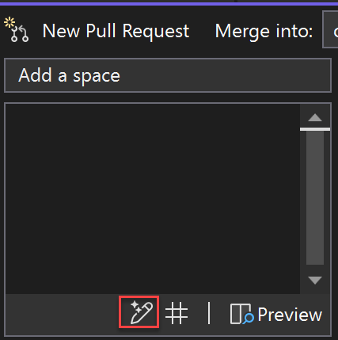
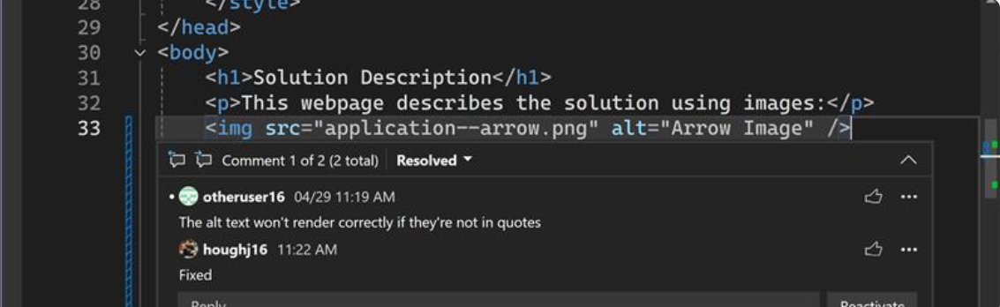
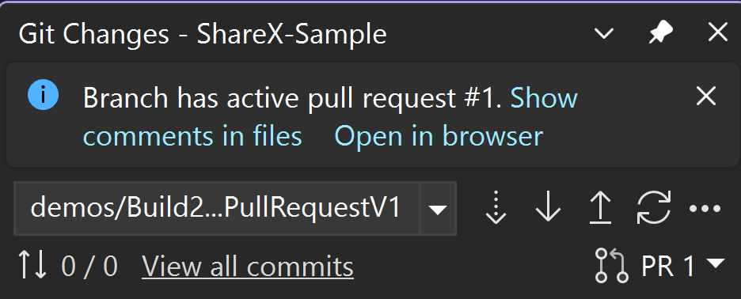

# Create a pull request in Visual Studio 

If you’re authenticated to GitHub or Azure DevOps and have pushed changes to your remote repository, you can create a pull request without leaving Visual Studio. Pull requests are an essential tool in GitHub and Azure DevOps for code review.  These reviews help catch issues in new features and allow teammates to share their experience with different regions of the codebase – improving the health of the codebase overall.  

> [!NOTE]
> To try out the feature, ensure it’s enabled in **Tools** > **Options** > **Preview Features** > **Pull Request**

To create a pull request, follow these steps:

1. Before you can create a pull request, you need to [create a new branch](git-create-branch.md) for your changes. This branch keeps your modifications separate from the main branch until they’re ready to be merged.

1. Then, you can [commit](git-make-commit.md) and [push](git-push-remote.md) your changes as you normally would in the Git Changes window.

1. Select the link in the notification banner to **Create in Visual Studio** or **Create in Browser**.

   :::image type="content" source="media/vs-2022/git-create-pull-request-infobar-two-links.png" alt-text="Screenshot of the Git Changes window with the infobar 'Successfully pushed QP to origin. Pull request: Create in Visual Studio or create in browser.' in Visual Studio 2022.":::
   
   Alternatively, you can create a pull request from a remote branch by navigating to the **New Pull Request** window via the top-level menu **Git** > **GitHub** or **Azure DevOps** > **New Pull Request**. Or right-click a branch in the Git Repository Window.
   
   :::image type="content" source="media/vs-2022/git-create-pr-top-level-menu.png" alt-text="The Git top level menu with GitHub selected and 'New Pull Request' text highlighted in Visual Studio 2022."::: 

   Or right select a branch in the Git Repository Window to open the context menu and select **New Pull Request**.

   :::image type="content" source="media/vs-2022/git-create-pr-git-repository-branch-context-menu.png" alt-text="The Git Repository window with the outgoing / incoming link text highlighted in Visual Studio 2022."::: 

1. Select the branch that you want to merge into and give your pull request a descriptive title and description. You can use [markdown syntax](https://www.markdownguide.org/) to format your pull request description from Visual Studio. Try it out by typing the markdown symbols in the **Description** box and preview your markdown by selecting the **Preview** button.

   > [!TIP]
   > With Visual Studio 2022 version 17.10 preview 2 and later and the GitHub Copilot extensions, you can use AI to generate a detailed pull request description that describes your changes. Press the sparkle pen icon to request that GitHub Copilot generate a PR description. To install GitHub Copilot, see [Install and manage GitHub Copilot in Visual Studio](../ide/visual-studio-github-copilot-install-and-states.md).
   >
   > 

   :::image type="content" source="media/vs-2022/git-create-pr-markdown.png" alt-text="The New Pull Request window with the preview button text highlighted in Visual Studio 2022."::: 

1. The difference preview allows you to see all the changes in the files that have been committed as a part of your pull request. See [Compare files - diff view](../ide/compare-with.md).

   > [!TIP]
   > The summary difference view option allows you to review only the changed sections of code. 

   :::image type="content" source="media/vs-2022/git-create-pr-summary-diff.png" alt-text="The New Pull Request window with the summary button text highlighted in Visual Studio 2022."::: 

1. You can link work items by referencing them with the [issue search](https://devblogs.microsoft.com/visualstudio/reference-github-issues-and-pull-requests-in-visual-studio/), by typing `#` in the description box or pressing the **#** button in the lower right corner. You can also add your reviewers by typing their GitHub username or Azure DevOps identity or email. 

   :::image type="content" source="media/vs-2022/git-create-pr-issue-search.png" alt-text="The New Pull Request with # in the description box and a list of the related GitHub issues and pull requests shown in Visual Studio 2022."::: 

1. Once you’ve clicked **Create** on your pull request, other developers can review your changes and provide feedback. Or, with Visual Studio 17.12 and later, click the dropdown and choose **Create as draft**.

   :::image type="content" source="media/vs-2022/git-new-pull-request-create-draft.png" alt-text="Screenshot showing the option to create a new pull request as a draft." :::

With Visual Studio 17.12 and later, you can enable the **Pull Request Templates** feature (in **Tools** > **Options** > **Environment** > **Preview Features**) so that your default PR template in your repo will be used when creating a new pull request for both GitHub and Azure DevOps. Learn more about how to add a pull request template to your repository in the [GitHub documentation](https://docs.github.com/communities/using-templates-to-encourage-useful-issues-and-pull-requests/creating-a-pull-request-template-for-your-repository) and [Azure DevOps documentation](/azure/devops/repos/git/pull-request-templates#default-pull-request-templates).

## View or add pull request comments in the editor

With Visual Studio 17.11 or later, you can view comments and suggestions from reviewers without switching contexts to the browser.

To enable this feature, open **Tools** > **Options** > **Preview features** and make sure that **Pull Request Comments** is selected.

### View pull request comments

To view the comments for a pull request, check out any branch with an active pull request branch and select **Show comments in files** from the infobar. You can also select the PR number in the **Git Changes** window or from the Git top level menu with **Git** > **GitHub** or **Azure DevOps** > **Show comments in files**.

### Add pull request comments

With Visual Studio 17.13 or later, you can review a pull request, or add comments.

To enable this feature, open **Tools** > **Options** > **Preview features** and make sure that **Pull Request Comments** is selected. Once these are activated, checkout any branch with an active pull request and click on **Show comments in files** in the infobar, and navigate through the changes using the toolbar buttons above the code file.

To add a comment, click on the **Add comment** icon to the left side of the editor.

The ability to add comments to a pull request is limited for some Git providers. For example, with GitHub as the provider, you can only add comments on lines within 3 lines of a change, but with the Azure DevOps provider, you can add comments at any line of a file involved in the pull request. In any case, you can only add comments on files that are included in the pull request.

### Use the keyboard

You can navigate across files and individual comments using the icons in the toolbar, or use the following keyboard shortcuts:

| Action | Keyboard shortcut |
| - | - |
| Go to the previous file in the pull request | **Ctrl**+**Shift**+**Alt**+**F6** |
| Go to the next file in the pull request | **Ctrl**+**Alt**+**F6** |
| Go to the previous comment | **Ctrl**+**Shift**+**Alt**+**F8** |
| Go to the next comment | **Ctrl**+**Alt**+**F8** |

## Next steps

To continue your journey, visit the [Fetch, pull, and sync in Visual Studio](git-fetch-pull-sync.md) page.

## See also

- [Git experience in Visual Studio](git-with-visual-studio.md)
- [Visual Studio & GitHub: Better together](https://visualstudio.microsoft.com/vs/github/)
