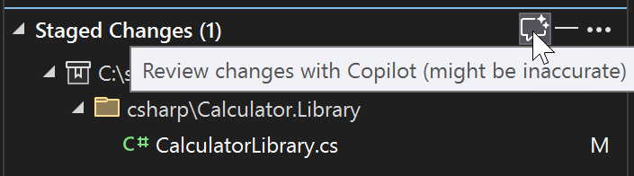
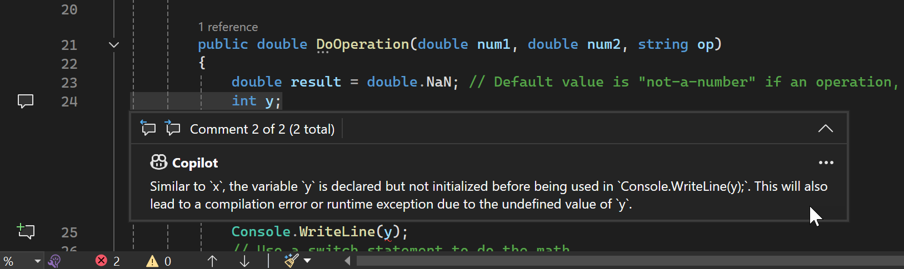
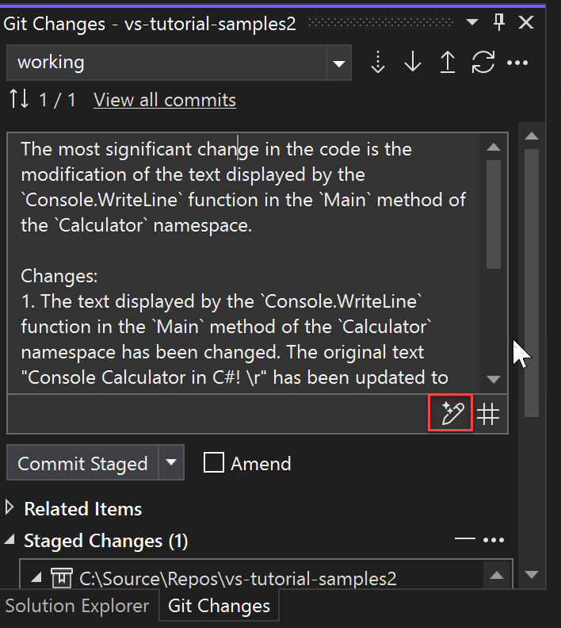

# Make a Git commit in Visual Studio

The core part of any Git workflow is modifying files and committing the changes in those files.  While this article references GitHub repositories, you can work remotely with the Git provider of your choice, such as GitHub or Azure DevOps. Or, you can work locally with no provider at all.

Git tracks file changes in your repo as you work, and separates the files in your repo into three categories. These changes are equivalent to what you would see when you enter the `git status` command in the command line:

- **Unmodified files**: These files haven't changed since your last commit.
- **Modified files**: These files have changes since your last commit, but you haven't yet staged them for the next commit.
- **Staged files**: These files have changes that will be added to the next commit.

As you do your work, Visual Studio keeps track of the file changes to your project in the **Changes** section of the **Git Changes** window.

:::image type="content" source="media/vs-2022/git-changes-window.png" alt-text="The Git Changes window in Visual Studio 2022.":::

## Stage changes and make a commit

To stage changes when you're ready, select the **+** (plus) button on each file you want to stage, or right-click a file and then select **Stage**. You can also stage all your modified files with one click by using the stage all **+** (plus) button at the top of the **Changes** section.

When you stage a change, Visual Studio creates a **Staged Changes** section. Only changes in the **Staged Changes** section are added to the next commit, which you can do by selecting **Commit Staged**. The equivalent command for this action is `git commit -m "Your commit message"`.

:::image type="content" source="media/vs-2022/git-commit-message.png" alt-text="The Git commit dialog in Visual Studio 2022.":::

Changes can also be unstaged by clicking the **–** (minus) button. The equivalent command for this action is `git reset <file_path>` to unstage a single file or `git reset <directory_path>` to unstage all the files in a directory.

You can also choose not to stage your modified files by skipping the staging area. In this case, Visual Studio allows you to commit your changes directly without having to stage them. Just enter your commit message and then select **Commit All**. The equivalent command for this action is `git commit -a`.

Visual Studio also makes it easy to commit and sync with one click by using the **Commit All and Push** and **Commit All and Sync** shortcuts. When you double-click any file in the **Changes** and the **Staged changes** sections, you can see a line-by-line comparison with the unmodified version of the file. See [Compare files - diff view](../ide/compare-with.md).

:::image type="content" source="media/vs-2022/git-file-version-compare.png" alt-text="The line-by-line comparison of file versions in Visual Studio 2022.":::

:::moniker range=">=vs-2022"

New in [**version 17.6**](/visualstudio/releases/2022/release-notes-v17.6): You can also reference an issue or a pull request by typing `#` or selecting the **#** button in the lower right side of the commit message text box. For more information, see the [Reference issues and pull requests](https://devblogs.microsoft.com/visualstudio/reference-github-issues-and-pull-requests-in-visual-studio/) blog post.

New in [**version 17.12**](/visualstudio/releases/2022/release-notes-v17.12): When you rename a file, you'll see a notification bar at the top of the **Git Changes** window informing you that a file was renamed, and prompting you to stage that change. This notification appears before you stage or commit anything. You might want to stage and commit the change before making other changes, in order to ensure that Git detects the change as a rename, not a deletion and addition of a new file.

New in **version 17.13**: With [GitHub Copilot](../ide/visual-studio-github-copilot-install-and-states.md) installed, you can have GitHub Copilot review your code changes before you commit them. In the **Git Changes** window, click on the **Review changes with Copilot** button, which looks like a comment icon with a sparkle.

After a few moments, a link showing the number of code review comments appears in the **Git Changes** window that you can click on to view and navigate the comments. If no issues are detected, the message **Copilot did not comment on any files** appears.

The code review feedback shows up as comments, which show brief summary of the potential problem, and you can decide to make a change, or dismiss the comment box by using the downward arrow button on the top right of the comment box.

To remove all comments, use the **X** in the Git Changes window to close the Copilot code review link.
:::moniker-end

## Revert, reset, or amend a commit

When you double-click a **Commit**, Visual Studio opens its details in a separate tool window. From here you can revert the commit, reset (undo) the commit, amend the commit message, or create a tag on the commit. When you click a changed file in the commit, Visual Studio opens the side-by-side **Diff** view of the commit and its parent.

:::image type="content" source="media/vs-2022/git-branch-commit-details.png" alt-text="The Commit Details dialog in Visual Studio 2022.":::

:::moniker range=">=vs-2022"
## Generate commit messages with GitHub Copilot Chat

With Visual Studio 2022 version 17.9 and later and the GitHub Copilot extensions, you can use AI to generate detailed commit messages that describe your changes.

> [!NOTE]
>To enable AI-generated commit messages, you need GitHub Copilot and GitHub Copilot Chat. If you're using Visual Studio version 17.10 or later, see [Get GitHub Copilot for Visual Studio 2022 version 17.10 or later](../ide/visual-studio-github-copilot-install-and-states.md#get-github-copilot-for-visual-studio-2022-version-1710-or-later).
>
>If you're using Visual Studio versions 17.9 or earlier, see [Get GitHub Copilot for Visual Studio 2022 versions 17.8 to 17.9](../ide/visual-studio-github-copilot-install-and-states.md#get-github-copilot-for-visual-studio-2022-versions-178-to-179).

When you're ready to make a commit, use the sparkly pen icon (tooltip: **Add AI generated commit message**) at the lower right of the commit message editbox to request an AI-generated commit message. The AI-generated text is generated and added to anything you already had. Read it carefully to see if it's accurate. You have the option of accepting the insertion or discarding it. If you accept the insertion, you can then edit the text before submitting it. When you're ready, choose the **Commit Staged** button, or one of the other commit options available in the dropdown below the commit message editbox.

> [!NOTE]
> Read about how GitHub Copilot protects the privacy of your data at [GitHub Copilot Business Privacy Statement](https://docs.github.com/site-policy/privacy-policies/github-copilot-business-privacy-statement).

:::moniker-end

## Related content

- [Stage lines of code](git-line-staging.md)
- [Git experience in Visual Studio](git-with-visual-studio.md)
