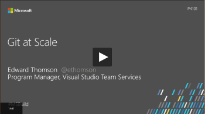

# Git

Use Git repos to host and collaborate on your code using Team Services or Team Foundation Server.  

## 5-Minute Quickstarts 

Get started by creating a repo, uploading your code, and inviting developers to work in the repo. You can use any one of these clients or IDEs: 

<table>
<tr valign="middle" align="center">
<td> [Web](/vsts/git/create-new-repo.md)</td>
<td> [Visual Studio](/vsts/git/share-your-code-in-git-vs.md)</td>
</tr>
</table>    

Or, you can [import an existing repo](/vsts/git/import-git-repository.md) from GitHub, BitBucket, GitLab, or other location to a new, empty repo. 

## Step-by-Step Tutorials  

Learn the basics of working in Git with these tutorials which show tasks performed using Visual Studio.

- [Create a new repo](/vsts/git/tutorial/creatingrepo.md)  
- [Clone an existing repo](/vsts/git/tutorial/clone.md)  
- [Save work with commits](/vsts/git/tutorial/commits.md)  
- [Create work in branches](/vsts/git/tutorial/branches.md)  
- [Share code with push](/vsts/git/tutorial/pushing.md)  
- [Update code with fetch and pull](/vsts/git/tutorial/pulling.md)  
- [Review code with pull requests](/vsts/git/tutorial/pullrequest.md)  
- [Apply changes with rebase](/vsts/git/tutorial/rebase.md)  
- [Copy changes with cherry-pick](/vsts/git/tutorial/cherry-pick.md)  
- [Resolve merge conflicts](/vsts/git/tutorial/merging.md)  
- [Undo changes](/vsts/git/tutorial/undo.md)  
- [Ignore files](/vsts/git/tutorial/ignore-files.md)  
- [Review history](/vsts/git/tutorial/history.md)  

## Videos 
 
  

## Resources 

- [What is Git?](https://www.visualstudio.com/learn/what-is-git/)  
- [What is version control?](https://www.visualstudio.com/learn/what-is-version-control/)  
- [Plan your migration to Git](https://www.visualstudio.com/learn/centralized-to-git/)  
- [Migrate from TFVC to Git](https://www.visualstudio.com/learn/migrate-from-tfvc-to-git/)  
- [Git at Scale](https://www.visualstudio.com/learn/git-at-scale/)   
- [Marketplace extensions](https://marketplace.visualstudio.com/search?target=VSTS&category=Code&sortBy=Downloads)