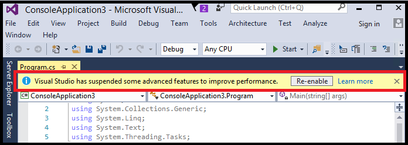

# Automatic feature suspension
[!INCLUDE[vs2017banner](../includes/vs2017banner.md)]
If your available system memory falls to 200MB or less, Visual Studio displays the following message in the code editor.

 

 When Visual Studio detects a low memory condition, it automatically suspends certain advanced features to help it remain stable. When this advanced feature suspension warning appears, Visual Studio will continue to work as before, but its performance will be slightly degraded.

 In a low memory condition, the following occurs:

- Full solution analysis for Visual C# and Visual Basic is disabled.

- [Garbage Collection](https://msdn.microsoft.com/library/22b6cb97-0c80-4eeb-a2cf-5ed7655e37f9) (GC) low-latency mode for Visual C# and Visual Basic are disabled.

- Visual Studio caches are flushed.

## Improve Visual Studio performance
 For tips and tricks on how to improve Visual Studio performance when dealing with large solutions or low-memory conditions, see [Performance considerations for large solutions](https://github.com/dotnet/roslyn/wiki/Performance-considerations-for-large-solutions).

## Full solution analysis suspended
 By default, full solution analysis is enabled for Visual Basic and disabled for Visual C#. However, in a low memory condition, full solution analysis is automatically disabled for both Visual Basic and Visual C#, regardless of their settings in the Options dialog box. However, you can re-enable full solution analysis by choosing the **Re-enable** button in the info bar when it appears, by selecting the **Enable full solution analysis** check box in the Options dialog, or by restarting Visual Studio. The Options dialog box always shows the current full solution analysis settings. For more information, see [How to: Enable and Disable Full Solution Analysis](../code-quality/how-to-enable-and-disable-full-solution-analysis-for-managed-code.md).

## GC low-latency disabled
 To re-enable GC low-latency mode, restart Visual Studio.  By default, Visual Studio enables GC  low-latency mode whenever you are typing to ensure that your typing doesn't block any GC operations. However, if a low memory condition causes Visual Studio to display the automatic suspension warning, GC low-latency mode is disabled for that session. Restarting Visual Studio will re-enable the default GC behavior. For more information, see <xref:System.Runtime.GCLatencyMode>.

## Visual Studio caches flushed

All Visual Studio caches are immediately emptied, but will begin to repopulate if you continue your current development session or restart Visual Studio. The caches flushed include caches for the following features.

- Find all references

- Navigate To

- Add Using

In addition, caches used for internal Visual Studio operations are also cleared.

> [!NOTE]
> The automatic feature suspension warning occurs only once on a per-solution basis, not on a per-session basis. This means that if you switch from Visual Basic to Visual C# (or vice-versa) and run into another low memory condition, you can possibly get another automatic feature suspension warning.

## See also

- [How to: Enable and Disable Full Solution Analysis](../code-quality/how-to-enable-and-disable-full-solution-analysis-for-managed-code.md)
- [Fundamentals of Garbage Collection](https://msdn.microsoft.com/library/67c5a20d-1be1-4ea7-8a9a-92b0b08658d2)
- [Performance considerations for large solutions](https://github.com/dotnet/roslyn/wiki/Performance-considerations-for-large-solutions)