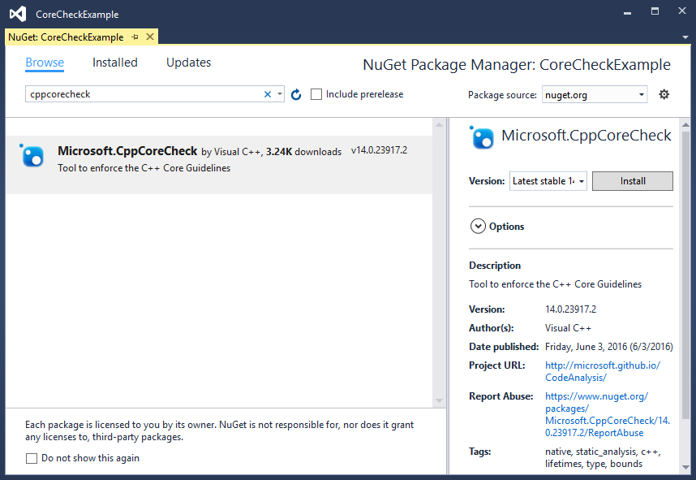

# Using the C++ Core Guidelines checkers
[!INCLUDE[vs2017banner](../includes/vs2017banner.md)]

The C++ Core Guidelines are a portable set of guidelines, rules, and best practices about coding in C++ created by C++ experts and designers.  Visual Studio now supports add-in packages that create additional rules for the code analysis tools to check your code for compliance with the C++ Core Guidelines and suggest improvements.  
  
## The C++ Core Guidelines Project  
 Created by Bjarne Stroustrup and others, the C++ Core Guidelines are a guide to using modern C++ safely and effectively. The Guidelines emphasize static type safety and resource safety. They identify ways to eliminate or minimize the most error-prone parts of the language, and suggest how to  make your code simpler and more performant in a reliable way. These guidelines are maintained by the Standard C++ Foundation. To learn more, see the documentation, [C++ Core Guidelines](http://isocpp.github.io/CppCoreGuidelines/CppCoreGuidelines), and access the C++ Core Guidelines documentation project files on [GitHub](https://github.com/isocpp/CppCoreGuidelines).  
  
 Microsoft supports the C++ Core Guidelines effort by making C++ Core Check code analysis rule sets that you can add to your projects by using a Nuget package. The package is named Microsoft.CppCoreCheck, and it is available at [https://www.nuget.org/packages/Microsoft.CppCoreCheck](https://www.nuget.org/packages/Microsoft.CppCoreCheck). This package requires you have at least Visual Studio 2015 with Update 1 installed.  
  
 The package also installs another package as a dependency, a header-only Guideline Support Library (GSL). The GSL is also available on GitHub at [https://github.com/Microsoft/GSL](https://github.com/Microsoft/GSL).  
  
## Enable the C++ Core Check guidelines in Code Analysis  
 To enable the C++ Core Check code analysis tools, install the Microsoft.CppCoreCheck NuGet package into each C++ project that you want to check within Visual Studio.  
  
#### To add the Microsoft.CppCoreCheck package to your project  
  
1. In **Solution Explorer**, right-click to open the context menu of your Project in the Solution that you want to add the package to. Choose **Manage NuGet Packages** to open the **NuGet Package Manager**.  
  
2. In the **NuGet Package Manager** window, search for Microsoft.CppCoreCheck.  
  
      
  
3. Select the Microsoft.CppCoreCheck package and then choose the **Install** button to add the rules to your project.  
  
   The NuGet package adds an additional MSBuild .targets file to your project that is invoked when you enable code analysis on your project. This .targets file adds the C++ Core Check rules as an additional extension to the Visual Studio code analysis tool.  
  
   You can enable code analysis on your project by selecting the **Enable Code Analysis on Build** checkbox in the **Code Analysis** section of the **Property Pages** dialog for your project.  
  
     
  
   The C++ Core Check rules become part of the default rule sets that run when code analysis is enabled. Because the C++ Core Check rules are under development, some rules may not be ready for use on all code, but may be informative during development. These rules are released as experimental. You can choose whether to run the released or experimental rules in the properties for your project.  
  
     
  
   To enable or disable the C++ Core Check rule sets, open the **Property Pages** dialog for your project. Under **Configuration Properties**, expand  **Code Analysis**, **Extensions**. In the dropdown control next to **Enable C++ Core Check (Released)** or **Enable C++ Core Check (Experimental)**,  choose **Yes** or **No**. Choose **OK** or **Apply** to save your changes.  
  
## Check Types, Bounds, and Lifetimes  
 The C++ Core Check package currently contains checkers for the [Type safety](http://isocpp.github.io/CppCoreGuidelines/CppCoreGuidelines#SS-type), [Bounds safety](http://isocpp.github.io/CppCoreGuidelines/CppCoreGuidelines#SS-bounds), and [Lifetime safety](http://isocpp.github.io/CppCoreGuidelines/CppCoreGuidelines#SS-lifetime) profiles.  
  
 Here’s an example of the kind of issues that the C++ Core Check rules can find:  
  
```cpp  
// CoreCheckExample.cpp  
// Add CppCoreCheck package and enable code analysis in build for warnings.  
  
int main()  
{  
    int arr[10];           // warning C26494  
    int* p = arr;          // warning C26485  
  
    [[gsl::suppress(bounds.1)]] // This attribute suppresses Bounds rule #1  
    {  
        int* q = p + 1;    // warning C26481 (suppressed)  
        p = q++;           // warning C26481 (suppressed)  
    }  
  
    return 0;  
}  
```  
  
 This example demonstrates a few of the warnings that the C++ Core Check rules can find:  
  
- C26494 is rule Type.5: Always initialize an object.  
  
- C26485 is rule Bounds.3: No array-to-pointer decay.  
  
- C26481 is rule Bounds.1: Don’t use pointer arithmetic. Use `span` instead.  
  
  If the C++ Core Check code analysis rulesets are installed and enabled when you compile this code, the first two warnings are output, but the third is suppressed. Here's the build output from the example code:  
  
**1>------ Build started: Project: CoreCheckExample, Configuration: Debug Win32 --**  
**----**  
**1>  CoreCheckExample.cpp**  
**1>  CoreCheckExample.vcxproj -> C:\Users\username\documents\visual studio 2015\P**  
**rojects\CoreCheckExample\Debug\CoreCheckExample.exe**  
**1>  CoreCheckExample.vcxproj -> C:\Users\username\documents\visual studio 2015\P**  
**rojects\CoreCheckExample\Debug\CoreCheckExample.pdb (Full PDB)**  
**c:\users\username\documents\visual studio 2015\projects\corecheckexample\coreche**  
**ckexample\corecheckexample.cpp(6): warning C26494: Variable 'arr' is uninitializ**  
**ed. Always initialize an object. (type.5: https://go.microsoft.com/fwlink/p/?Link**  
**ID=620421)**  
**c:\users\username\documents\visual studio 2015\projects\corecheckexample\coreche**  
**ckexample\corecheckexample.cpp(7): warning C26485: Expression 'arr': No array to**  
**pointer decay. (bounds.3: https://go.microsoft.com/fwlink/p/?LinkID=620415)**  
**========== Build: 1 succeeded, 0 failed, 0 up-to-date, 0 skipped ==========** The C++ Core Guidelines are there to help you write better and safer code. However, if you have an instance where a rule or a profile shouldn’t be applied, it’s easy to suppress it directly in the code. You can use the `gsl::suppress` attribute to keep C++ Core Check from detecting and reporting any violation of a rule in the following code block. You can mark individual statements to suppress specific rules. You can even suppress the entire bounds profile by writing `[[gsl::suppress(bounds)]]` without including a specific rule number.  
  
## Use the Guideline Support Library  
 The Microsoft.CppCoreCheck NuGet package also installs a package that contains Microsoft’s implementation of the Guideline Support Library (GSL). The GSL is also available in standalone form at [http://www.nuget.org/packages/Microsoft.Gsl](https://www.nuget.org/packages/Microsoft.Gsl). This library is helpful if you want to follow the Core Guidelines. The GSL includes definitions that let you replace error-prone constructs with safer alternatives. For example, you can replace a `T*, length` pair of parameters with the `span<T>` type. The GSL is open source, so if you want to take a look at the library sources, comment, or contribute, the project can be found at [https://github.com/Microsoft/GSL](https://github.com/Microsoft/GSL).
