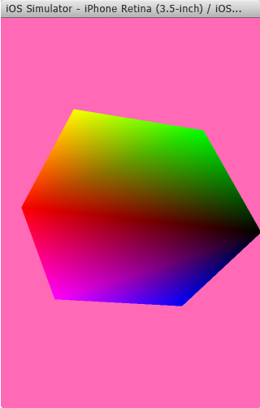

# Build an OpenGL ES Application on Android and iOS
[!INCLUDE[vs2017banner](../includes/vs2017banner.md)]

When you install the Visual C++ for Cross-Platform Mobile Development option, you can create Visual Studio solutions and projects for iOS apps and Android apps that share common code. This topic guides you through a solution template that creates both a simple iOS app and an Android Native Activity app. The apps have C++ code in common that uses OpenGL ES to display the same animated rotating cube on each platform. OpenGL ES (OpenGL for Embedded Systems or GLES) is a 2D and 3D graphics API that is supported on many mobile devices.  
  
 [Requirements](#req)   
 [Create a new OpenGLES Application project](#Create)   
 [Build and run the Android app](#BuildAndroid)   
 [Build and run the iOS app](#BuildIOS)   
 [Customize your apps](#Customize)  
  
##  Requirements  
 Before you can create an OpenGL ES app for iOS and Android, you must make sure you've met all system requirements. You must install the Visual C++ for Cross-Platform Mobile Development option in Visual Studio 2015. Make sure that the required third-party tools and SDKs are included in the installation, and that the Visual Studio Emulator for Android is installed. For more information and detailed instructions, see [Install Visual C++ for Cross-Platform Mobile Development](../cross-platform/install-visual-cpp-for-cross-platform-mobile-development.md). To build and test the iOS app, you'll need a Mac computer, set up according to the installation instructions. For more information about how to set up for iOS development, see [Install And Configure Tools to Build using iOS](../cross-platform/install-and-configure-tools-to-build-using-ios.md)  
  
##  Create a new OpenGLES Application project  
 In this tutorial, you first create a new OpenGL ES Application project and then build and run the default app in the Visual Studio Emulator for Android. Next you build the app for iOS and run the app in the iOS Simulator.  
  
#### To create a new project  
  
1. Open Visual Studio. On the menu bar, choose **File**, **New**, **Project**.  
  
2. In the **New Project** dialog box, under **Templates**, choose **Visual C++**, **Cross Platform**, and then choose the **OpenGLES Application (Android, iOS)** template.  
  
3. Give the app a name like `MyOpenGLESApp`, and then choose **OK**.  
  
      
  
    Visual Studio creates the new solution and opens Solution Explorer.  
  
      
  
   The new OpenGL ES Application solution includes three library projects and two application projects. The Libraries folder includes a shared code project and two platform-specific projects that reference the shared code:  
  
- **MyOpenGLESApp.Android.NativeActivity** contains the references and glue code that implements your app as a Native Activity on Android. The implementation of the entry points from the glue code are in main.cpp, which includes the common shared code in MyOpenGLESApp.Shared. Precompiled headers are in pch.h. This Native Activity app project is compiled into a shared library (.so) file which is picked up by the MyOpenGLESApp.Android.Packaging project.  
  
- **MyOpenGLESApp.iOS.StaticLibrary** creates an iOS static library (.a) file that contains the shared code in MyOpenGLESApp.Shared. It is linked to the app created by the MyOpenGLESApp.iOS.Application project.  
  
- **MyOpenGLESApp.Shared** contains the shared code that works across platforms. It uses preprocessor macros for conditional compilation of platform-specific code. The shared code is picked up by project reference in both MyOpenGLESApp.Android.NativeActivity and MyOpenGLESApp.iOS.StaticLibrary.  
  
  The solution has two projects to build the apps for the Android and iOS platforms:  
  
- **MyOpenGLESApp.Android.Packaging** creates the .apk file for deployment on an Android device or emulator. This contains the resources and AndroidManifest.xml file where you set manifest properties. It also contains the build.xml file that controls the Ant build process. It's set as the startup project by default, so that it can be deployed and run directly from Visual Studio.  
  
- **MyOpenGLESApp.iOS.Application** contains the resources and Objective-C glue code to create an iOS app that links to the C++ static library code in MyOpenGLESApp.iOS.StaticLibrary. This project creates a build package that is transferred to your Mac by Visual Studio and the remote agent. When you build this project, Visual Studio sends the files and commands to build and deploy your app on the Mac.  
  
##  Build and run the Android app  
 The solution created by the template sets the Android app as the default project.  You can build and run this app to verify your installation and setup. For an initial test, run the app on one of the device profiles installed by the Visual Studio Emulator for Android. If you prefer to test your app on another target, you can load the target emulator or connect the device to your computer.  
  
#### To build and run the Android Native Activity app  
  
1. If it is not already selected, choose **x86** from the **Solution Platforms** drop-down list.  
  
      
  
    Use x86 to target the Android Emulator for Windows. If you are targeting a device, choose the solution platform based on the device processor. If the **Solution Platforms** list isn’t displayed, choose **Solution Platforms** from the **Add/Remove Buttons** list, and then choose your platform.  
  
2. In **Solution Explorer**, open the shortcut menu for MyOpenGLESApp.Android.Packaging project and then choose **Build**.  
  
      
  
    The Output window displays the output of the build process for the Android shared library and the Android app.  
  
      
  
3. Choose one of the VS Emulator Android Phone (x86) profiles as your deployment target.  
  
      
  
    If you have installed other emulators or connected an Android device, you can choose them in the deployment target drop-down list. To run the app, the built Solution Platform must match the platform of the target device.  
  
4. Press F5 to start debugging, or Shift+F5 to start without debugging.  
  
    Visual Studio starts the emulator, which takes several seconds to load and deploy your code. Here’s how the app appears in the Visual Studio emulator for Android.  
  
      
  
    Once your app has started, you can set breakpoints and use the debugger to step through code, examine locals, and watch values.  
  
5. Press Shift + F5 to stop debugging.  
  
    The emulator is a separate process that continues to run. You can edit, compile, and deploy your code multiple times to the same emulator. Your app appears in the app collection on the emulator, and it can be started from there directly.  
  
   The generated Android Native Activity app and library projects put the C++ shared code in a dynamic library that includes "glue" code to interface with the Android platform. This means most of the app code is in the library, and the manifest, resources, and build instructions are in the packaging project. The shared code is called from main.cpp in the NativeActivity project. For more information about how to program an Android Native Activity, see the Android Developer NDK [Concepts](https://developer.android.com/ndk/guides/concepts.html) page.  
  
   Visual Studio builds Android Native Activity projects by using the Android NDK, which uses Clang as the platform toolset. Visual Studio maps the properties in the NativeActivity project to the command-line switches and options that are used to compile, link, and debug on the target platform. For details, open the **Property Pages** dialog for the MyOpenGLESApp.Android.NativeActivity project. For more information about the command line switches, see the [Clang Compiler User's Manual](http://clang.llvm.org/docs/UsersManual.html).  
  
##  Build and run the iOS app  
 The iOS app project is created and edited in Visual Studio, but because of licensing restrictions, it must be built and deployed from a Mac. Visual Studio communicates with a remote agent running on the Mac to transfer project files and execute build, deployment, and debugging commands. You must set up and configure your Mac and Visual Studio to communicate before you can build the iOS app. For detailed instructions, see [Install And Configure Tools to Build using iOS](../cross-platform/install-and-configure-tools-to-build-using-ios.md). Once the remote agent is running and Visual Studio is paired with your Mac, you can build and run the iOS app to verify your installation and setup.  
  
#### To build and run the iOS app  
  
1. Verify that the remote agent is running on your Mac, and that Visual Studio is paired to the remote agent. To start the remote agent, open a Terminal app window and enter `vcremote`. For more information, see [Configure the remote agent in Visual Studio](../cross-platform/install-and-configure-tools-to-build-using-ios.md#ConfigureVS).  
  
      
  
2. If it is not already selected, choose **x86** from the **Solution Platforms** drop-down list.  
  
      
  
    Use x86 to target the iOS Simulator. If you are targeting an iOS device, choose the solution platform based on the device processor (usually an ARM processor). If the **Solution Platforms** list isn’t displayed, choose **Solution Platforms** from the **Add/Remove Buttons** list, and then choose your platform.  
  
3. In Solution Explorer, open the shortcut menu for the MyOpenGLESApp.iOS.Application project and choose **Build**.  
  
      
  
    The Output window displays the output of the build process for the iOS static library and the iOS app. On the Mac, the Terminal window running the remote agent shows the command and file transfer activity.  
  
    On your Mac computer, you may be prompted at accept a code signing request. Choose Allow to continue.  
  
4. Choose **iOS Simulator** on the toolbar to run the app in the iOS Simulator on your Mac. It may take a moment to start the simulator. You may have to bring the simulator to the foreground on your Mac to see its output.  
  
      
  
    Once your app has started, you can set breakpoints and use the Visual Studio debugger to examine locals, see the call stack, and watch values.  
  
      
  
5. Press Shift + F5 to stop debugging.  
  
    The iOS Simulator is a separate process that continues to run on your Mac. You can edit, compile, and deploy your code multiple times to the same iOS Simulator instance. You can also run your code directly in the simulator after it has been deployed.  
  
   The generated iOS app and library projects put the C++ code in a static library that implements only the shared code. Most of the application code is in the Application project. The calls to the shared library code in this template project are made in the GameViewController.m file. To build your iOS app, Visual Studio uses the Xcode platform toolset, which requires communication with a remote client that is running on a Mac.  
  
   Visual Studio transfers the project files and sends commands to the remote client to build the app using Xcode. The remote client sends build status information back to Visual Studio. When the app has built successfully, you can use Visual Studio to send commands to run and debug the app. The debugger in Visual Studio controls the app running in the iOS Simulator running on your Mac, or on an attached iOS device. Visual Studio maps the properties in the StaticLibrary project to the command-line switches and options that are used to build, link, and debug on the target iOS platform. For compiler command-line option details, open the **Property Pages** dialog for the MyOpenGLESApp.iOS.StaticLibrary project.  
  
##  Customize your apps  
 You can modify the shared C++ code to add or change common functionality. You must change the calls to the shared code in the MyOpenGLESApp.Android.NativeActivity and MyOpenGLESApp.iOS.Application projects to match. You can use preprocessor macros to specify platform-specific sections in your common code. The preprocessor macro `__ANDROID__` is predefined when you build for Android. The preprocessor macro `__APPLE__` is predefined when you build for iOS.  
  
 To see the IntelliSense for a particular project platform, choose the project in the context switcher dropdown in the Navigation bar at the top of the editor window.  
  
   
  
 IntelliSense issues in the current project are marked with a red wavy line. Issues in other projects are marked with a purple wavy line. By default, Visual Studio does not support code colorization or IntelliSense for Java or Objective-C files. However, you can still modify the source files and change the resources to set your application name, icon, and other implementation details.
