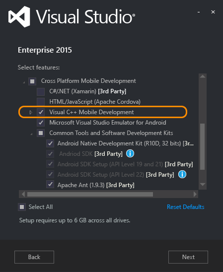
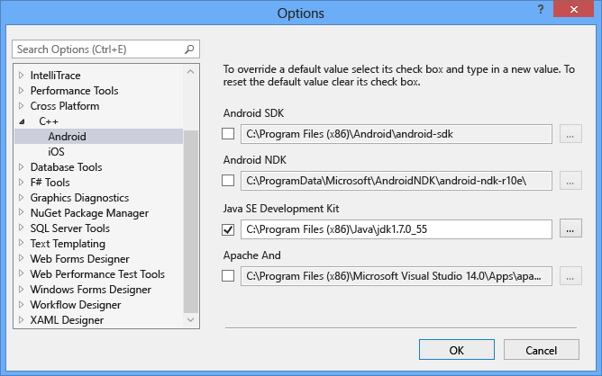

# Install Visual C++ for Cross-Platform Mobile Development
[!INCLUDE[vs2017banner](../includes/vs2017banner.md)]

Visual C++ for Cross-Platform Mobile Development](https://go.microsoft.com/fwlink/p/?LinkId=536383) is an installable component of Visual Studio 2015. It includes cross-platform Visual Studio templates and installs the cross-platform tools and SDKs to get started quickly, without having to locate, download, and configure them yourself. You can use these tools in Visual Studio to easily create, edit, debug and test cross-platform projects. This topic describes how to install the tools and third-party software required to develop cross-platform apps using Visual Studio. For an overview of the component, see [Visual C++ Cross-Platform Mobile](https://go.microsoft.com/fwlink/p/?LinkId=536387)  
  
 [Requirements](#Requirements)   
 [Get the tools](#GetTheTools)   
 [Install the tools](#InstallTheTools)   
 [Install tools for iOS](#InstallForiOS)   
 [Install or update dependencies manually](#ThirdParty)  
  
##  Requirements  
  
- For installation requirements, see [Visual Studio 2015 System Requirements](https://www.visualstudio.com/visual-studio-2015-system-requirements-vs).  
  
  > [!IMPORTANT]
  > If you are using Windows 7 or Windows Server 2008 R2, you can develop code for Classic Windows applications, Android Native Activity apps and libraries, and apps and code libraries for iOS, but not Windows Store or Universal Windows apps.  
  
  To build apps for specific device platforms, there are some additional requirements:  
  
- Windows Phone emulators and the Microsoft Visual Studio Emulator for Android require a computer that can run Hyper-V. The Hyper-V feature in Windows must be enabled before you can install and run the emulators. For more information, see the emulator's [system requirements](https://msdn.microsoft.com/4d5bb438-231a-4cd2-84b7-e9660b0e3baf).  
  
- The x86 Android emulators that come with the Android SDK work best on computers that can run the Intel HAXM driver. This driver requires an Intel x64 processor with VT-x and Execute Disable Bit support. For more information, see [Installation Instructions for Intel® Hardware Accelerated Execution Manager - Microsoft Windows](https://go.microsoft.com/fwlink/p/?LinkId=536385).  
  
- Building code for iOS requires an Apple ID, an iOS Developer Program account, and a Mac computer that can run [Xcode 6](https://go.microsoft.com/fwlink/p/?LinkId=536387) or later on OS X Mavericks or later versions. For simple installation steps, see [Install tools for iOS](#InstallForiOS).  
  
##  Get the tools  
 Visual C++ for Cross-Platform Mobile Development is an installable component included in Visual Studio Community, Professional, and Enterprise editions. To get Visual Studio, go to the [Visual Studio 2015 Downloads](https://go.microsoft.com/fwlink/p/?linkid=517106) page and download Visual Studio 2015 with Update 2 or later.  
  
##  Install the tools  
 The installer for Visual Studio 2015 includes an option to install Visual C++ for Cross-Platform Mobile Development. This installs the required C++ language tools, templates and components for Visual Studio, the GCC and Clang toolsets needed for Android builds and debugging, and components to communicate with a Mac for iOS development. It also installs all the third-party tools and software development kits that are required to support iOS and Android app development. Most of these third-party tools are open-source software required for Android platform support.  
  
- Android Native Development Kit (NDK) is required to build C++ code that targets the Android platform.  
  
- Android SDK, Apache Ant, and Java SE Development Kit are required for the Android build process.  
  
- Microsoft Visual Studio Emulator for Android is an optional high-performance emulator useful for testing and debugging your code.  
  
#### To install Visual C++ for Cross-Platform Mobile Development and the third-party tools  
  
1. Run the Visual Studio 2015 installer that you downloaded following the link in [Get the tools](#GetTheTools). To install optional components, choose **Custom** as the type of installation. Choose **Next** to select the optional components to install.  
  
2. In Select features, expand **Cross Platform Mobile Development** and check **Visual C++ Mobile Development**.  
  
       
  
     By default, when you select **Visual C++ Mobile Development**, the **Programming Languages** option is set to install **Visual C++**, and the  **Common Tools and Software Development Kits** options are set to install required third-party components. You can choose additional components if you need them. By default, the **Microsoft Visual Studio Emulator for Android** is also selected. Components that are already installed appear inactive in the list.  
  
     To build Universal Windows apps and share code between them and your Android and iOS projects, in  **Select features**, expand **Windows and Web Development** and check **Universal Windows App Development Tools**. If you don't plan to build Universal Windows apps, you can skip this option.  
  
     Choose **Next** to continue.  
  
3. The third-party components have their own license terms. You can view the license terms by choosing the **License Terms** link next to each component. Choose **Install** to add the components and install Visual Studio and Visual C++ for Cross-Platform Mobile Development.  
  
4. When installation is complete, close the installer and then restart your computer. Some setup actions for the third-party components do not take effect until the computer is restarted.  
  
    > [!IMPORTANT]
    > You must restart to make sure everything is installed correctly.  
  
     If the Microsoft Visual Studio Emulator for Android component failed to install, your computer may not have Hyper-V enabled. Use the **Turn Windows features on or off** Control Panel app to enable Hyper-V, and then run the Visual Studio installer again.  
  
    > [!NOTE]
    > If your computer or your version of Windows does not support Hyper-V, you can't use the Microsoft Visual Studio Emulator for Android component. The Home Edition of Windows does not include Hyper-V support.  
  
5. Open Visual Studio. If this is the first time that you have run Visual Studio, it may take some time to configure and sign in. When Visual Studio is ready, on the **Tools** menu, select **Extensions and Updates**, **Updates**. If there are Visual Studio updates available for Visual C++ for Cross-Platform Mobile Development or for Microsoft Visual Studio Emulator for Android, install them.  
  
##  Install tools for iOS  
 You can use Visual C++ for Cross-Platform Mobile Development to edit, debug and deploy iOS code to the iOS Simulator or to an iOS device, but because of licensing restrictions, the code must be built remotely on a Mac. To build and run iOS apps using Visual Studio, you must set up and configure the remote agent on your Mac. For detailed installation instructions, prerequisites and configuration options, see [Install And Configure Tools to Build using iOS](../cross-platform/install-and-configure-tools-to-build-using-ios.md). If you're not building for iOS, you can skip this step.  
  
##  Install or update dependencies manually  
 If you decide not to install one or more third-party dependencies using the Visual Studio installer when you install the Visual C++ Mobile Development option, you can install them later by using the steps in [Install the tools](#InstallTheTools). You can also install or update them independently of Visual Studio.  
  
> [!CAUTION]
> You can install the dependencies in any order, except for Java. You must install and configure the JDK before you install the Android SDK.  
  
 Read the following information and use these links to install dependencies manually.  
  
- [Java SE Development Kit](http://www.oracle.com/technetwork/java/javase/downloads/jdk8-downloads-2133151.html)  
  
   By default, the installer puts the Java tools in C:\Program Files (x86)\Java.  
  
- [Android SDK](https://developer.android.com/sdk/index.html#Other)  
  
   During the installation, update the APIs as recommended. Make sure that at least the SDK for Android 5.0 Lollipop (API level 21) is installed. By default, the installer puts the Android SDK in C:\Program Files (x86)\Android\android-sdk.  
  
   You can run the SDK Manager app in the Android SDK directory again to update the SDK and install optional tools and additional API levels. Updates may fail to install unless you use **Run as administrator** to run the SDK Manager app. If you have problems building an Android app, check the SDK Manager for updates to your installed SDKs.  
  
   To use some of the Android emulators that come with the Android SDK, you must install the optional Intel HAXM drivers. You may have to remove the Hyper-V feature from Windows to install the Intel HAXM drivers successfully. You must restore the Hyper-V feature to use the Windows Phone emulators and the Microsoft Visual Studio Emulator for Android.  
  
- [Android NDK](https://developer.android.com/tools/sdk/ndk/index.html)  
  
   By default, the installer puts the Android NDK in C:\ProgramData\Microsoft\AndroidNDK. You can download and install the Android NDK again to update the NDK installation.  
  
- [Apache Ant](http://ant.apache.org/bindownload.cgi)  
  
   By default, the installer puts Apache Ant in C:\Program Files (x86)\Microsoft Visual Studio 14.0\Apps.  
  
- [Microsoft Visual Studio Emulator for Android](https://visualstudio.microsoft.com/vs/msft-android-emulator/)  
  
   You can install and update the Microsoft Visual Studio Emulator for Android from the Visual Studio Gallery.  
  
  In most cases, Visual Studio can detect the configurations for the third-party software you’ve installed, and maintains the installation paths in internal environment variables. You can override the default paths of these cross-platform development tools in the Visual Studio IDE.  
  
#### To set the paths for third-party tools  
  
1. On the Visual Studio menu bar, select **Tools**, **Options**.  
  
2. In the **Options** dialog box, expand **Cross Platform**, **C++**, and select **Android**.  
  
       
  
3. To change the path used by a tool, check the checkbox next to the path, and edit the folder path in the textbox. You can also use the browse button (**...**) to open a **Select location** dialog to choose the folder.  
  
4. Choose **OK** to save the custom tool folder locations.  
  
## See Also  
 [Install And Configure Tools to Build using iOS](../cross-platform/install-and-configure-tools-to-build-using-ios.md)   
 [Visual C++ Cross-Platform Mobile](https://www.visualstudio.com/explore/cplusplus-mdd-vs.aspx)
