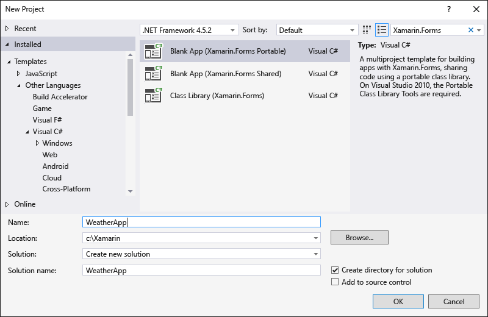
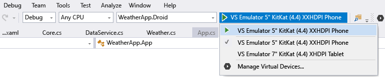

# Learn app-building basics with Xamarin.Forms in Visual Studio
[!INCLUDE[vs2017banner](../includes/vs2017banner.md)]

Once you've done the steps in [Setup and install](../cross-platform/setup-and-install.md) and [Verify your Xamarin environment](../cross-platform/verify-your-xamarin-environment.md), this walkthrough shows you how to build a basic app (shown below) with Xamarin.Forms. With Xamarin.Forms you'll write all of your UI code once in a portable class library (PCL). Xamarin will then automatically render the native UI controls for the iOS, Android, and Windows platforms. We recommend this approach because the PCL option best supports using only those .NET APIs that are supported across all target platforms, and because Xamarin.Forms lets you share UI code across platforms.

 

 You'll do these things to build it:

- [Set up your solution](#solution)

- [Write shared data service code](#dataservice)

- [Begin writing shared UI code](#uicode)

- [Test your app using the Visual Studio Emulator for Android](#test)

- [Finish the UI with a native look and feel across platforms](#finish)

> [!TIP]
> You can find the complete source code for this project in the [xamarin-forms-samples repository on GitHub](https://github.com/xamarin/xamarin-forms-samples/tree/master/Weather).

## <a name="solution"></a> Set up your solution
 These steps create a Xamarin.Forms solution that contains a PCL for shared code and two added NuGet packages.

1. In Visual Studio, create a new **Blank App (Xamarin.Forms Portable)** solution and name it **WeatherApp**. You can find this template most easily by entering **Xamarin.Forms** into the search field.

     If it’s not there, you might have to install Xamarin or enable the Visual Studio 2015 feature, see [Setup and install](../cross-platform/setup-and-install.md).

     

2. After clicking OK to create the solution, you’ll have a number of individual projects:

    - **WeatherApp (Portable)**: the PCL where you’ll write code that is shared across platforms, including common business logic and UI code using with Xamarin.Forms.

    - **WeatherApp.Droid**: the project that contains the native Android code. This is set as the default startup project.

    - **WeatherApp.iOS**: the project that contains the native iOS code.

    - **WeatherApp.UWP**: the project that contains Windows 10 UWP code.

    - **WeatherApp.Windows (Windows 8.1)**: the project that contains native Windows 8.1 code.

    - **WeatherApp.WinPhone (Windows Phone 8.1)**: the project that contains the native Windows Phone code.

    > [!NOTE]
    > You're free to delete any of the projects for a platform that you're not targeting. For the purposes of this walkthrough, we'll be referring to the Android, iOS, and Windows Phone 8.1 projects. Working with the UWP and Windows 8.1 projects is very similar to working with the Windows Phone 8.1 project.

     Within each native project you have access to the native designer for the corresponding platform and can implement platform specific screens and functionality as needed.

3. Upgrade the Xamarin.Forms NuGet package in your solution to the latest stable version as follows. We recommend doing this whenever you create a new Xamarin solution:

    - Select **Tools > NuGet Package Manager > Manage NuGet Packages for Solution**.

    - Under the **Updates** tab, check the **Xamarin.Forms** update and check to update all the projects in your solution. (Note: leave any updates for Xamarin.Android.Support unchecked.)

    - Update the **Version** field to the **Latest stable** version that is available.

    - Click **Update**.

         

4. Add the **Newtonsoft.Json** and NuGet package to the PCL project, which you’ll use to process information retrieved from a weather data service:

    - In the NuGet Package Manager (still open from step 3), select the **Browse** tab and search for **Newtonsoft**.

    - Select **Newtonsoft.Json**.

    - Check the **WeatherApp** project (this is the only project in which you need to install the package).

    - Ensure the **Version** field is set to the **Latest stable** version.

    - Click **Install**.

    - 

5. Repeat step 4 to find and install the **Microsoft.Net.Http** package.

6. Build your solution and verify that there are no build errors.

## <a name="dataservice"></a> Write shared data service code
 The **WeatherApp (Portable)** project is where you’ll write code for the portable class library (PCL) that’s shared across all platforms. The PCL is automatically included in the app packages build by the iOS, Android, and Windows Phone projects.

 To run this sample you must first sign up for a free API key at [http://openweathermap.org/appid](https://openweathermap.org/appid).

 The following steps add then code to the PCL to access and store data from that weather service:

1. Right-click the **WeatherApp** project and select **Add > Class…**. In the **Add New Item** dialog, name the file **Weather.cs**. You’ll use this class to store data from the weather data service.

2. Replace the entire contents of **Weather.cs** with the following:

    ```csharp
    namespace WeatherApp
    {
        public class Weather
        {
            public string Title { get; set; }
            public string Temperature { get; set; }
            public string Wind { get; set; }
            public string Humidity { get; set; }
            public string Visibility { get; set; }
            public string Sunrise { get; set; }
            public string Sunset { get; set; }

            public Weather()
            {
                //Because labels bind to these values, set them to an empty string to
                //ensure that the label appears on all platforms by default.
                this.Title = " ";
                this.Temperature = " ";
                this.Wind = " ";
                this.Humidity = " ";
                this.Visibility = " ";
                this.Sunrise = " ";
                this.Sunset = " ";
            }
        }
    }
    ```

3. Add another class to the PCL project named **DataService.cs** in which you’ll use to process JSON data from the weather data service.

4. Replace the entire contents of **DataService.cs** with the following code:

    ```csharp
    using System.Threading.Tasks;
    using Newtonsoft.Json;
    using System.Net.Http;

    namespace WeatherApp
    {
        public class DataService
        {
            public static async Task<dynamic> getDataFromService(string queryString)
            {
                HttpClient client = new HttpClient();
                var response = await client.GetAsync(queryString);

                dynamic data = null;
                if (response != null)
                {
                    string json = response.Content.ReadAsStringAsync().Result;
                    data = JsonConvert.DeserializeObject(json);
                }

                return data;
            }
        }
    }
    ```

5. Add a third class to the PCL named **Core** where you’ll put shared business logic, such as logic that forms a query string with a zip code, calls the weather data service, and populates an instance of the **Weather** class.

6. Replace the contents of **Core.cs** with the following:

    ```csharp
    using System;
    using System.Threading.Tasks;

    namespace WeatherApp
    {
        public class Core
        {
            public static async Task<Weather> GetWeather(string zipCode)
            {
                //Sign up for a free API key at http://openweathermap.org/appid
                string key = "YOUR KEY HERE";
                string queryString = "http://api.openweathermap.org/data/2.5/weather?zip="
                    + zipCode + ",us&appid=" + key + "&units=imperial";

                dynamic results = await DataService.getDataFromService(queryString).ConfigureAwait(false);

                if (results["weather"] != null)
                {
                    Weather weather = new Weather();
                    weather.Title = (string)results["name"];
                    weather.Temperature = (string)results["main"]["temp"] + " F";
                    weather.Wind = (string)results["wind"]["speed"] + " mph";
                    weather.Humidity = (string)results["main"]["humidity"] + " %";
                    weather.Visibility = (string)results["weather"][0]["main"];

                    DateTime time = new System.DateTime(1970, 1, 1, 0, 0, 0, 0);
                    DateTime sunrise = time.AddSeconds((double)results["sys"]["sunrise"]);
                    DateTime sunset = time.AddSeconds((double)results["sys"]["sunset"]);
                    weather.Sunrise = sunrise.ToString() + " UTC";
                    weather.Sunset = sunset.ToString() + " UTC";
                    return weather;
                }
                else
                {
                    return null;
                }
            }
        }
    }
    ```

7. Build the **WeatherApp** PCL project to make sure the code is correct.

## <a name="uicode"></a> Begin writing shared UI code
 Xamarin.Forms let you implement shared UI code in the PCL. In these steps you’ll add a screen to the PCL with a button that updates its text with data returned by the weather data service code added in the previous section:

1. Add a **Forms Xaml Page** named **WeatherPage.cs** by right-clicking the **WeatherApp** project and selecting **Add > New Item...**. In the **Add New Item** dialog, search on “Forms,” select **Forms Xaml Page**, and name it **WeatherPage.cs**.

     Xamarin.Forms is XAML-based, so this step creates a **WeatherPage.xaml** file along with the nested code-behind file **WeatherPage.xaml.cs**. This allows you to generate UI through either XAML or code. You’ll do some of both in this walkthrough.

     

2. To add a button to the WeatherPage screen, replace the contents of WeatherPage.xaml with the following:

    ```xaml
    <?xml version="1.0" encoding="utf-8" ?>
    <ContentPage xmlns="http://xamarin.com/schemas/2014/forms"
           xmlns:x="http://schemas.microsoft.com/winfx/2009/xaml"
           x:Class="WeatherApp.WeatherPage">
      <Button x:Name="getWeatherBtn" Text="Get Weather"/>
    </ContentPage>
    ```

     Notice that the name of the button must be defined using the **x:Name** attribute so that you can reference this button by name from within the code-behind file.

3. To add an event handler for the button’s **Clicked** event to update the button text, replace the contents of **WeatherPage.xaml.cs** with the code below. (Feel free to change “60601” to another zip code.)

    ```csharp
    using System;
    using Xamarin.Forms;

    namespace WeatherApp
    {
        public partial class WeatherPage: ContentPage
        {
            public WeatherPage()
            {
                InitializeComponent();
                this.Title = "Sample Weather App";
                getWeatherBtn.Clicked += GetWeatherBtn_Clicked;

                //Set the default binding to a default object for now
                this.BindingContext = new Weather();
            }

            private async void GetWeatherBtn_Clicked(object sender, EventArgs e)
            {
                Weather weather = await Core.GetWeather("60601");
                getWeatherBtn.Text = weather.Title;
            }
        }
    }
    ```

4. To open **WeatherPage** as the first screen when the app launches, replace the default constructor in **App.cs** with the following code:

    ```csharp
    public App()
    {
        MainPage = new NavigationPage(new WeatherPage());
    }
    ```

5. Build the WeatherApp PCL project to make sure the code is correct.

## <a name="test"></a> Test your app using the Visual Studio Emulator for Android
 Now you’re ready to run the app! Let’s run just the Android version for now to verify that the app is getting data from the weather service. Later you’ll also run the iOS and Windows Phone versions after you’ve added more UI elements. (Note: if you’re running Visual Studio on Windows 7, you’ll follow these same steps but will the Xamarin Player instead.)

1. Set the **WeatherApp.Droid** project as the startup project by right-clicking it and selecting **Set as Startup Project**.

2. In the Visual Studio toolbar, you’ll see **WeatherApp.Droid** listed as the target project. Select one of the Android emulators for debugging and hit **F5**. We recommend using one of the **VS Emulator** options that will run the app in the Visual Studio Emulator for Android options.

     

3. When the app launches in the emulator, click the **Get Weather** button. You should see the button’s text updated to **Chicago, IL**, which is the *Title* property of the data retrieved from the weather service.

     

## <a name="finish"></a> Finish the UI with a native look and feel across platforms
 Xamarin.Forms renders native UI controls for each platform so that your app automatically has a native look and feel. To see this more clearly, let’s finish the UI with an input field for a zip code and then display the weather data that’s returned from the service.

1. Replace the contents of **WeatherPage.xaml** with the code below. Note that every element is named using the **x:Name** attribute as described earlier so that the element can be referenced from code. Xamarin.Forms also provides a number of [layout options](https://docs.microsoft.com/xamarin/xamarin-forms/user-interface/controls/layouts) (xamarin.com); here, WeatherPage is using [StackLayout](https://docs.microsoft.com/dotnet/api/Xamarin.Forms.StackLayout?view=xamarin-forms) (xamarin.com).

   ```xaml
   <?xml version="1.0" encoding="utf-8" ?>
   <ContentPage xmlns="http://xamarin.com/schemas/2014/forms"
          xmlns:x="http://schemas.microsoft.com/winfx/2009/xaml"
          x:Class="WeatherApp.WeatherPage">

     <ContentPage.Resources>
       <ResourceDictionary>
         <Style x:Key="labelStyle" TargetType="Label">
           <Setter Property="TextColor" Value="#a8a8a8" />
           <Setter Property="FontSize" Value="Small" />
         </Style>
         <Style x:Key="fieldStyle" TargetType="Label">
           <Setter Property="TextColor">
             <OnPlatform x:TypeArguments="Color" iOS="Black" Android="White" WinPhone="White" />
           </Setter>
           <Setter Property="FontSize" Value="Medium" />
         </Style>
         <Style x:Key="fieldView" TargetType="ContentView">
           <Setter Property="Padding" Value="10,0,0,0" />
         </Style>
       </ResourceDictionary>
     </ContentPage.Resources>

     <ContentPage.Content>
       <ScrollView>
         <StackLayout>
           <StackLayout Orientation="Horizontal" HorizontalOptions="FillAndExpand"
                 BackgroundColor="#545454">
             <StackLayout Padding="10,10,10,10" HorizontalOptions="Start">
               <Label Text="Search by Zip Code" TextColor="White" FontAttributes="Bold"
                   FontSize="Medium" />
               <Label x:Name="zipCodeLabel" Text="Zip Code" Style="{StaticResource labelStyle}" />
               <Entry x:Name="zipCodeEntry" />
             </StackLayout>
             <StackLayout Padding="0,0,0,10" VerticalOptions="End">
               <Button x:Name="getWeatherBtn" Text="Get Weather" WidthRequest="185" BorderWidth="1" >
                 <!-- Set iOS colors; use defaults on other platforms -->
                 <Button.TextColor>
                   <OnPlatform x:TypeArguments="Color" iOS="White"/>
                 </Button.TextColor>
                 <Button.BorderColor>
                   <OnPlatform x:TypeArguments="Color" iOS="White"/>
                 </Button.BorderColor>
               </Button>
             </StackLayout>
           </StackLayout>
           <StackLayout Padding="10,10,10,10" HorizontalOptions="Start">
             <Label Text="Location" Style="{StaticResource labelStyle}" />
             <ContentView Style="{StaticResource fieldView}">
               <Label Text="{Binding Title}" Style="{StaticResource fieldStyle}" />
             </ContentView>
             <Label Text="Temperature" Style="{StaticResource labelStyle}" />
             <ContentView Style="{StaticResource fieldView}">
               <Label x:Name="tempLabel" Text="{Binding Temperature}"
                   Style="{StaticResource fieldStyle}" />
             </ContentView>
             <Label Text="Wind Speed" Style="{StaticResource labelStyle}" />
             <ContentView Style="{StaticResource fieldView}">
               <Label x:Name="windLabel" Text="{Binding Wind}" Style="{StaticResource fieldStyle}" />
             </ContentView>
             <Label Text="Humidity" Style="{StaticResource labelStyle}" />
             <ContentView Style="{StaticResource fieldView}">
               <Label x:Name="humidityLabel" Text="{Binding Humidity}"
                   Style="{StaticResource fieldStyle}" />
             </ContentView>
             <Label Text="Visibility" Style="{StaticResource labelStyle}" />
             <ContentView Style="{StaticResource fieldView}">
               <Label x:Name="visibilitylabel" Text="{Binding Visibility}"
                   Style="{StaticResource fieldStyle}" />
             </ContentView>
             <Label Text="Time of Sunrise" Style="{StaticResource labelStyle}" />
             <ContentView Style="{StaticResource fieldView}">
               <Label x:Name="sunriseLabel" Text="{Binding Sunrise}"
                   Style="{StaticResource fieldStyle}" />
             </ContentView>
             <Label Text="Time of Sunset" Style="{StaticResource labelStyle}" />
             <ContentView Style="{StaticResource fieldView}">
               <Label x:Name="sunsetLabel" Text="{Binding Sunset}"
                   Style="{StaticResource fieldStyle}" />
             </ContentView>
           </StackLayout>
         </StackLayout>
       </ScrollView>
     </ContentPage.Content>
   </ContentPage>
   ```

    Note the use of the **OnPlatform** tag in Xamarin.Forms. **OnPlatform** selects a property value that’s specific to the current platform on which the app is running (see [External XAML Syntax](https://docs.microsoft.com/xamarin/xamarin-forms/xaml/xaml-basics/essential-xaml-syntax) (xamarin.com). We’re using it here to set a different text color for the data fields: White on Android and Windows Phone, Black on iOS. You can use **OnPlatform** for any properties and any data types to make platform-specific adjustments anywhere in your XAML. In the code-behind file, you can use the [Device.OnPlatform API](https://docs.microsoft.com/xamarin/xamarin-forms/platform/device) for the same purpose.

2. In **WeatherPage.xaml.cs**, replace the **GetWeatherBtn_Clicked** event handler with the code below. This code verifies that there’s a zip code in the entry field, retrieves data for that zip code, sets the whole screen’s binding context to the resulting Weather instance, then sets the button text to “Search Again.” Note that each label in the UI binds to a property of the Weather class, so when you set the screen’s binding context to a **Weather** instance, those labels update automatically.

   ```csharp
   private async void GetWeatherBtn_Clicked(object sender, EventArgs e)
   {
       if (!String.IsNullOrEmpty(zipCodeEntry.Text))
       {
           Weather weather = await Core.GetWeather(zipCodeEntry.Text);
           this.BindingContext = weather;
           getWeatherBtn.Text = "Search Again";
       }
   }
   ```

3. Run the app on all three platforms—Android, iOS, and Windows Phone—by right-clicking the appropriate project, selecting Set as startup project, and starting the app either on a device or in the emulator or simulator. Enter a valid United States zip code (such as 60601) and press the Get Weather button to display weather data for that region as shown below. You’ll of course need to have Visual Studio connected to a Mac OS X computer on your network for the iOS project.

    

   The complete source code for this project is in the [xamarin-forms-samples repository on GitHub](https://github.com/xamarin/xamarin-forms-samples/tree/master/Weather).
