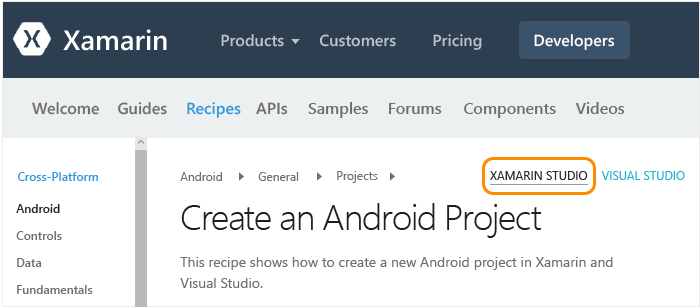
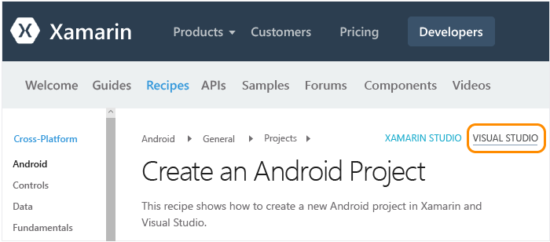

# Setup, install, and verifications for Mac users
[!INCLUDE[vs2017banner](../includes/vs2017banner.md)]

This topic is meant for developers working primarily on a Mac who will optionally use Visual Studio inside a Windows virtual machine on the Mac. If you are a developer working primarily on a Windows computer and need to set up a secondary Mac for targeting iOS, see the main [Setup and install](../cross-platform/setup-and-install.md) topic.  
  
 To work with Xamarin on a Mac, you’ll need the following:  
  
- A Xamarin account. Go to [https://www.xamarin.com/](https://www.xamarin.com/) and click **Sign In** on the upper right of the page, then click **Create a new account** on the page that appears. Select an email address and password for your Xamarin account.  
  
- A Mac with OSX Yosemite (10.10) or above, with Xcode 7 and Xamarin 4 installed.  
  
- One of the following configurations:  
  
  - **For running Xamarin Studio directly on the Mac:** Xamarin Studio is Xamarin’s development environment that supports building Android, iOS, and Windows apps using C#.  To get a quick overview of Xamarin Studio, refer to the [Xamarin Studio overview](https://xamarin.com/studio) (xamarin.com).  
  
  - **If you already have Parallels or VMWare configured on your Mac:** run Windows with Visual Studio 2015 and Xamarin 4 inside Parallels or VMWare.  With this configuration, Xamarin is an extension that's installed with Visual Studio that provides the ability to use Visual Studio as your development environment for building Android, iOS, and WinPhone apps using C#.  Note that you can obtain a free 3-month Parallels subscription as part of the Visual Studio Developer Essentials Program. See [Microsoft Visual Studio Dev Essentials Will Include Parallels Desktop Pro and Parallels Access](https://www.parallels.com/blogs/) (Parallels blog).  
  
  This topic provides instructions for these requirements.  While the installation process is running, you can review the topic [Learn about mobile development with Xamarin](../cross-platform/learn-about-mobile-development-with-xamarin.md) to read and watch the necessary background material.  
  
  **In this topic:**  
  
- [Mac setup (Apple ID, Xcode, and Xamarin)](#mac)  
  
- [Windows setup inside Parallels (Visual Studio and Xamarin)](#windows)  
  
- [Verify your environment](#verify)  
  
##  Mac setup (Apple ID, Xcode, and Xamarin)  
  
1. Create a free Apple ID at [My Apple ID](https://appleid.apple.com/) if you don’t have one already. This is necessary for installing and signing into Xcode.  
  
2. Download and install Xcode from  [https://developer.apple.com/xcode/](https://developer.apple.com/xcode/).  
  
3. Download and install Xamarin by following the instructions on [Installing and Configuring Xamarin.iOS](https://docs.microsoft.com/xamarin/ios/get-started/installation/mac) (xamarin.com).  
  
4. Once you’ve completed installing Xamarin on both the Windows and Mac computers, follow the instructions on [Connecting to the Mac using XMA](/xamarin/ios/get-started/installation/windows/connecting-to-mac) (xamarin.com) so that you can work with iOS and the Mac from Visual Studio on the Windows computer.  
  
##  Windows setup inside Parallels (Visual Studio and Xamarin)  
  
1. Using the Windows desktop that you’ve configured inside Parallels/VMWare, [download and launch the installer for any edition of Visual Studio 2015](https://www.visualstudio.com/downloads/download-visual-studio-vs.aspx) (Community, Professional, or Enterprise). Visual Studio 2015 Community is the free edition; the Professional and Enterprise editions can be used on a trial basis for 30 days.  
  
2. Within the installer, select a **Custom** install:  
  
       
  
3. Check/clear the following boxes:  
  
    1. Check **Cross-Platform Mobile Development > C#/.NET (Xamarin)**. This will also automatically select various Android tools under Common Tools and Software Development Kits.  
  
           
  
    2. Clear **Cross-Platform Mobile Development > Microsoft Visual Studio Emulator for Android**.  
  
4. Click the Install button and let the process run. Again, this will take some time to complete, during which time you can continue with this topic and go through [Learn about mobile development with Xamarin](../cross-platform/learn-about-mobile-development-with-xamarin.md).  
  
5. Once installation is complete, launch Visual Studio and sign in with your Microsoft account if prompted (this is the same account you use with Windows). Then check for Xamarin updates through **Tools > Options > Xamarin** or **Tools > Options > Xamarin > Other**, where you’ll find a **Check Now** link:  
  
       
  
    > [!NOTE]
    > Be sure to update Xamarin to version 4.0.3.214 or higher to avoid issues with earlier Xamarin licenses.  If you attempt to check for updates and see an error about Microsoft build tools, see the thread on [Xamarin's forums](https://forums.xamarin.com/discussion/69015/xamarin-update-on-vs-2013-says-i-need-the-build-tools-for-vs-2015).
  
6. Once you’ve completed installing Xamarin on both the Windows and Mac computers, follow the instructions on [Connecting to the Mac using XMA](/xamarin/ios/get-started/installation/windows/connecting-to-mac) (xamarin.com) so that you can work with iOS from Visual Studio.  
  
##  Verify your environment  
 Once the installers have completed, spend a few minutes to verify that everything is ready to experience Xamarin development.  
  
### Xamarin Studio  
 First, ensure that when you navigate to the provided links, that you have **Xamarin Studio** selected in the upper right-hand corner so that you see the correct version of the Xamarin documentation:  
  
   
  
 **Android**  
  
1. Validate creating an Android project by following the instructions on [Create an Android Project](https://github.com/xamarin/docs-archive/tree/master/Recipes/android/general/projects/create_an_android_project) (xamarin.com).  
  
2. Validate debugging in the Android Player through the [Android Player > Integration with Xamarin Studio documentation](https://developer.xamarin.com/guides/android/getting_started/installation/android-player/#Integration_with_Xamarin_Studio) (xamarin.com).  
  
   **iOS**  
  
3. Validate creating an iOS project by following the instructions on [Create an iOS](https://github.com/xamarin/docs-archive/tree/master/Recipes/ios/general/projects/create_an_ios_project) (xamarin.com).  
  
4. Validate debugging in the iOS simulator through the [Debugging in the Simulator documentation](https://developer.xamarin.com/guides/ios/deployment,_testing,_and_metrics/debugging_in_xamarin_ios/#Debugging_on_the_Simulator) (xamarin.com).  
  
### Visual Studio  
 First, ensure that when you navigate to the provided links, that you have **Visual Studio** selected in the upper right-hand corner so that you see the correct version of the Xamarin documentation:  
  
   
  
 Also sign into your Xamarin account through **Tools > Xamarin Account...**.  
  
 **Android**  
  
1. Validate creating an Android project by following the instructions on [Create an Android Project](https://github.com/xamarin/docs-archive/tree/master/Recipes/android/general/projects/create_an_android_project) (xamarin.com).  
  
2. Validate the Android designer: in the Android project in Solution Explorer, open the **Resources > Layout > Main.axml** file.  
  
   - If you receive an error saying "The installed Android SDK is too old," click **Open Android SDK** in that message and select the newest SDK version available. Note that you must be running Visual Studio as an administrator to update the SDK.  
  
3. Validate that you can connect from Visual Studio to the emulator that is installed on your Mac.  The result of this is that you will see the Xamarin Player in the list of emulators that you can select from within Visual Studio for debugging.  To do this, follow the instructions on [Connecting Visual Studio to the Xamarin Android Player](https://docs.microsoft.com/xamarin/android/deploy-test/debugging/debug-on-emulator?tabs=windows) (xamarin.com).  
  
   **iOS**  
  
4. Make sure your Mac is available on the network and paired with Visual Studio as described on [Connecting to the Mac using XMA](/xamarin/ios/get-started/installation/windows/connecting-to-mac) (xamarin.com).  
  
5. Validate creating an iOS project by following the instructions on [Create an iOS](https://github.com/xamarin/docs-archive/tree/master/Recipes/ios/general/projects/create_an_ios_project) (xamarin.com).  
  
6. Validate the storyboard designer: in the iOS project in Solution Explorer, open the **MainStoryboard.storyboard** file. Here, Visual Studio is hosting the designer that’s running remotely on the Mac.  
  
7. Validate building and debugging:  
  
   1. Right-click the iOS project in Solution Explorer and select **Set as Startup Project**.  
  
   2. Select the **iPhoneSimulator** target from Visual Studio’s build drop-down as shown below. If no simulators are listed, launch Xcode on your Mac, select **Xcode->Preferences**, and click **Download**. Under **Components** you should see the simulator versions that are available to download. Additional instructions for debugging can be found on the Xamarin’s [Debugging](https://developer.xamarin.com/guides/ios/deployment,_testing,_and_metrics/debugging_in_xamarin_ios/#Debugging_on_the_Simulator) page (xamarin.com).  
  
          
  
   3. Select an iPhone target from Visual Studio’s debug drop-down as shown below and start the debugger by pressing F5. This launches the simulator on the Mac where you’ll interact with the app, while debugging happens in Visual Studio.  
  
        
