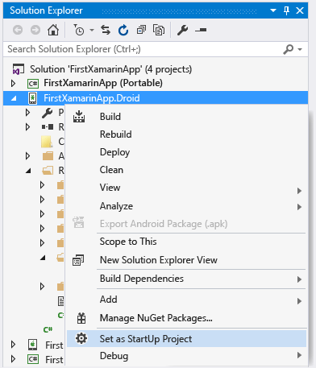
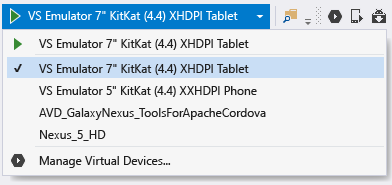
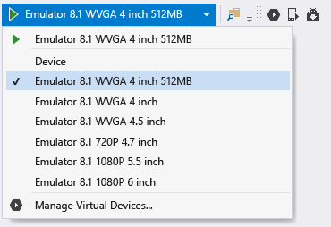
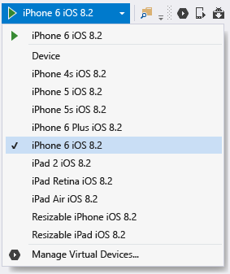

# Verify your Xamarin environment
[!INCLUDE[vs2017banner](../includes/vs2017banner.md)]

Once the installers have completed (see [Setup and install](../cross-platform/setup-and-install.md)), spend a few minutes to verify that everything is ready to experience Xamarin development.  
  
 Once you have completed these verifications, you can do either or both of the following walkthroughs:  
  
- [Learn app-building basics with Xamarin.Forms in Visual Studio](../cross-platform/learn-app-building-basics-with-xamarin-forms-in-visual-studio.md)  
  
- [Build apps with native UI using Xamarin in Visual Studio](../cross-platform/build-apps-with-native-ui-using-xamarin-in-visual-studio.md)  
  
## All platforms  
 First, select **Tools > Options**, expand **Xamarin > Other**,  and click the **Check now** link for updates. You need to be using Xamarin 4.0.3.214 or later to avoid previous licensing issues.  
  
 Then create a new Xamarin solution in Visual Studio using **File > New Project**, then in the dialog expand **Templates > Other Languages > Visual C# > Cross-Platform**, select **Blank App (Native Portable)**, and click OK. This creates a solution with a shared portable class library project and individual projects for Android, iOS, and Windows:  
  
   
  
> [!NOTE]
> If the templates are not there, see [Are the Xamarin project templates missing? Try this](#missing) at the bottom of this page.  
  
## Android  
  
1. Check that you have the latest Android SDK tools installed by going to **Tools > Android > Android SDK Manager** and installing the newest version of the Android SDK Tools, Android SDK Platform-tools, and Android SDK Build-tools components. Note that it is not necessary to always install the latest Android API level; the API you need depends on the platform level you want to target. In general, installing Xamarin will install the platform level it requires.  

2. Validate the Android designer: in the Android project in Solution Explorer, open the **Resources > Layout > Main.axml** file. (If you aren't seeing this file directly, try searching for it in Solution Explorer; it exists in the Android project only and not in the iOS project.)  
  
    - If you receive an error saying "The installed Android SDK is too old", click **Open Android SDK** in that message to select and install the newest SDK version tools available as in step 1 above. 
  
3. Validate building and debugging in the emulator (or device):  
  
    - Right-click the Android project in Solution Explorer and select **Set as Startup Project**.  
  
           
  
    - Select an appropriate emulator based on your target Android version; if you have an Android development device attached to your computer, you will also see it listed here alongside the emulators:  
  
        - Windows 8+: select a **VS Emulator** target in Visual Studio’s debug drop-down as shown below and start the debugger by pressing **F5**. For more details, see [Introducing Visual Studio’s Emulator for Android](https://devblogs.microsoft.com/devops/introducing-visual-studios-emulator-for-android/) (Visual Studio ALM blog). If you encounter problems getting the emulator to work, see [Troubleshooting the Visual Studio Emulator for Android](../cross-platform/troubleshooting-the-visual-studio-emulator-for-android.md). You can also create new device profiles for the emulator by selecting **Tools > Visual Studio Emulator for Android...**.  
  
               
  
             Note: if you do not see the **Tools > Visual Studio Emulator for Android...** menu option, you may not have the emulator itself installed. Go to **Control Panel > Programs and Features**, select **Microsoft Visual Studio**, and click **Change** to rerun the installer. Click **Modify** in the installer, check the box for **Cross Platform Mobile Development > Microsoft Visual Studio Emulator for Android**, and click **Update**.  
  
        - For Windows 7 and earlier: select the Xamarin Player for Android in the drop-down instead and press F5 to run. For details on the Xamarin Player, its device manager, and troubleshooting tips, read [Xamarin Android Player](https://docs.microsoft.com/xamarin/android/deploy-test/debugging/debug-on-emulator?tabs=windows) (xamarin.com).  
  
> [!NOTE]
> In Visual Studio, you may notice the presence of the Android Emulator Manager (AVD) button in the toolbar (show below), which opens the device manager that is specifically used for configuring the Google Android emulator.  This has no impact on either the Visual Studio Emulator for Android or the Xamarin Player, each of which has their own device manager for configuring profiles.  See [Introducing Visual Studio’s Emulator for Android](https://devblogs.microsoft.com/devops/introducing-visual-studios-emulator-for-android/) (Visual Studio ALM blog) and [Xamarin Android Player](https://docs.microsoft.com/xamarin/android/deploy-test/debugging/debug-on-emulator?tabs=windows) (xamarin.com) for details.  
>   
  
## Windows Phone  
  
1. Validate the Windows Phone designer: in the Windows Phone project in Solution Explorer, open the **MainPage.xaml** file.  
  
2. Validate building and debugging in the emulator or on a device (note: you will need to have the Windows Phone emulator installed through Visual Studio setup for this step, or a tethered device):  
  
    - Right-click the Windows Phone project in Solution Explorer and select **Set as Startup Project**.  
  
    - Select an **Emulator 8.1** target or an attached device in Visual Studio’s debug drop-down as shown below and start the debugger by pressing F5.  
  
           
  
    - If you encounter problems getting the emulator to work, read [Troubleshooting the Windows Phone 8 Emulator](https://msdn.microsoft.com/library/windows/apps/jj681694.aspx).  
  
## iOS  
  
1. Make sure your Mac is available on the network and paired with Visual Studio as described on [Connecting to the Mac](https://docs.microsoft.com/xamarin/ios/get-started/installation/windows/connecting-to-mac/) (xamarin.com).  
  
2. Validate the storyboard designer: in the iOS project in Solution Explorer, open the **Main.storyboard** file. Here, Visual Studio is hosting the designer that’s running remotely on the Mac.  
  
3. Validate building and debugging:  
  
    1. Right-click the iOS project in Solution Explorer and select **Set as Startup Project**.  
  
    2. Select the **iPhoneSimulator** target from Visual Studio’s build drop-down as shown below, or the **iPhone** target if you have a tethered device. If no simulators are listed, launch Xcode on your Mac, select **Xcode->Preferences**, and click **Download**. Under **Components** you should see the simulator versions that are available to download. Additional instructions for debugging can be found on the Xamarin’s [Debugging](https://developer.xamarin.com/guides/ios/deployment,_testing,_and_metrics/debugging_in_xamarin_ios/#Debugging_on_the_Simulator) page (xamarin.com).  
  
           
  
    3. Select an iPhone target from Visual Studio’s debug drop-down as shown below and start the debugger by pressing F5. This launches the simulator on the Mac where you’ll interact with the app, while debugging happens in Visual Studio. If you have a physical iPhone or iPad connected to the Mac, it will appear here and you can select it instead. If you do not see any devices or simulators listed, check the connection to the Mac by reviewing the topic linked in step 1 above, or by going to **Tools** >**iOS** >**Xamarin Mac Agent**  
  
           
  
    4. If you encounter problems connecting to the Mac, read [Connection Troubleshooting](https://docs.microsoft.com/xamarin/ios/get-started/installation/windows/connecting-to-mac/troubleshooting) (xamarin.com).  
  
    5. If you see an error saying "No installed provisioning profiles match the installed iOS signing keys, do the following:  
  
        - Check that your Apple Id account is added in Xcode on your Mac as described on [Adding Your Account to Xcode](https://developer.apple.com/library/content/documentation/IDEs/Conceptual/AppStoreDistributionTutorial/AddingYourAccounttoXcode/AddingYourAccounttoXcode.html#//apple_ref/doc/uid/TP40013839-CH40-SW1) (apple.com).  After adding your account, be sure to restart both Visual Studio and Xcode.  
  
               
  
        - Verify that in your iOS project properties in the iOS bundle signing tab, that the Custom entitlement field is empty for the   active debug configuration.  Note: you should only try removing this setting if you’ve encountered the above error message.  
  
##  Are the Xamarin project templates missing? Try this  
 Templates might be missing if you install Xamarin directly from the Xamarin website and you have Visual Studio 2013 and Visual Studio 2015 installed side-by-side. It’s easy to fix, though: just enable the **Xamarin for Visual Studio 2015** feature in the Xamarin setup program.  
  
1. In Control Panel, open **Programs and Features**, choose the **Xamarin** item, and click **Change**.  
  
2. In the setup wizard for Xamarin that appears,  click **Next** and then **Change**.  
  
3. In the list of optional features to install, expand **Xamarin for Visual Studio 2015**, choose **will be installed on local drive**, and click **Next** to proceed with adding the feature.
