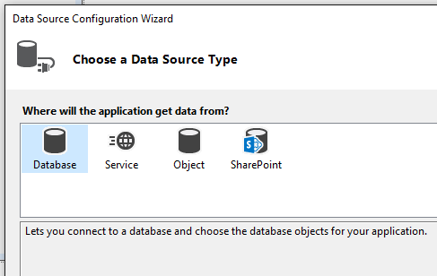
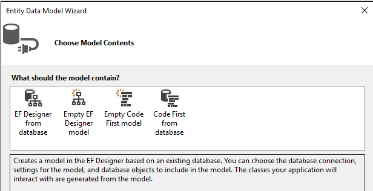

# Add new data sources
[!INCLUDE[vs2017banner](../includes/vs2017banner.md)]

In the context of .NET data tools in Visual Studio, the term *data source* refers to .NET objects that connect to a data store and expose the data to a .NET application. The Visual Studio designers can consume the output of the data source to generate the boilerplate code that binds the data to forms when you drag and drop database objects from the **Data Sources** window. This kind of data source can be:

- A class in an Entity Framework model that is associated with some kind of database.

- A dataset that is associated with some kind of database.

- A class that represents a network service such as a Windows Communication Foundation (WCF) data service or a REST service.

- A class that represents a SharePoint service.

- A class or collection in your solution.

> [!NOTE]
> If you are not using data-binding features, datasets, Entity Framework, LINQ to SQL, WCF, or SharePoint, the concept of a "data source" does not apply. Just connect directly to the database by using the SQLCommand objects and communicate directly with the database.

 You create and edit data sources by using the **Data Source Configuration Wizard** in a Windows Forms or Windows Presentation Foundation application. For Entity Framework, first create your entity classes, and then start the wizard by selecting **Project** > **Add New Data Source** (described in more detail later in this article).

 

 After you create a data source, it appears in the **Data Sources** tool window (Shift+Alt+D or **View** > **Other Windows** > **Data Source**). You can drag a data source from the **Data Sources** window onto a form design surface or control. This causes boilerplate code to be generated—code that displays the data that originates in the data store to the user. The following illustration shows a dataset that has been dropped onto a Windows form. If you selected F5 on the application, the data from the underlying database would appear in the form's controls.

 

## Data source for a database or a database file

### Dataset
 To create a dataset as a data source, run the **Data Source Configuration Wizard** (**Project** > **Add New Data** Source) and choose the **Database** data-source type. Follow the prompts to specify a new or existing database connection, or a database file.

### Entity classes
 To create an Entity Framework model as a data source, first run the **Entity Data Model Wizard** to create the entity classes (**Project** > **Add New Item** > **ADO.NET Entity Data Model**).

 

 Choose the method by which you want to generate the model.

 

 Add the model as a data source. The classes that were generated appear in the **Data Source Configuration Wizard** when you choose the **Objects** category.

 

## Data source for a service
 To create a data source from a service, run the **Data Source Configuration Wizard** and choose the **Service** data-source type. This is really just a shortcut to the **Add Service Reference** dialog box, which you can also access by right-clicking the project in **Solution Explorer** and selecting **Add service reference**.

 When you create a data source from a service, Visual Studio adds a service reference to your project. Visual Studio also creates proxy objects that correspond to the objects that the service returns. For example, a service that returns a dataset is represented in your project as a dataset; a service that returns a specific type is represented in your project as the type returned.

 You can create a data source from the following types of services:

- WCF Data Services. For more information, see [Overview](https://msdn.microsoft.com/library/7924cf94-c9a6-4015-afc9-f5d22b1743bb).

- WCF data services. For more information, see [Windows Communication Foundation Services and WCF Data Services in Visual Studio](../data-tools/windows-communication-foundation-services-and-wcf-data-services-in-visual-studio.md).

- Web services.

    > [!NOTE]
    > The items that appear in the **Data Sources** window are dependent on the data that the service returns. Some services might not provide enough information for the **Data Source Configuration Wizard** to create bindable objects. For example, if the service returns an untyped dataset, no items will appear in the **Data Sources** window when you complete the wizard. This is because untyped datasets do not provide a schema, and therefore the wizard does not have enough information to create the data source.

## Data source for an object
 You can create a data source from any object that exposes one or more public properties by running the **Data Source Configuration Wizard** and then selecting the **Object** data-source type. All public properties of an object are displayed in the **Data Sources** window.   If you are using Entity Framework and have generated a model, this is where you find the entity classes that will be the data sources for your application.

 On the **Select the Data Objects** page, expand the nodes in the tree view to locate the objects that you want to bind to. The tree view contains nodes for your project and for assemblies and other projects that are referenced by your project.

 If you want to bind to an object in an assembly or project that does not appear in the tree view, click **Add Reference** and use the **Add Reference Dialog Box** to add a reference to the assembly or project. After you add the reference, the assembly or project is added to the tree view.

> [!NOTE]
> You may need to build the project that contains your objects before the objects appear in the tree view.

> [!NOTE]
> To support drag-and-drop data binding, objects that implement the <xref:System.ComponentModel.ITypedList> or <xref:System.ComponentModel.IListSource> interface must have a default constructor. Otherwise, Visual Studio cannot instantiate the data-source object, and it will display an error when you drag the item to the design surface.

## Data source for a SharePoint list
 You can create a data source from a SharePoint list by running the **Data Source Configuration Wizard** and selecting the **SharePoint** data-source type. SharePoint exposes data through [!INCLUDE[ssAstoria](../includes/ssastoria-md.md)], so creating a SharePoint data source is the same as creating a data source from a service. Selecting the **SharePoint** item in the **Data Source Configuration Wizard** opens the **Add Service Reference** dialog box, where you connect to the SharePoint data service by pointing to the SharePoint server.  This requires the SharePoint SDK.

## See Also
 [Visual Studio data tools for .NET](../data-tools/visual-studio-data-tools-for-dotnet.md)
