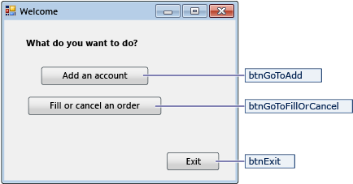

# Create a simple data application by using ADO.NET
[!INCLUDE[vs2017banner](../includes/vs2017banner.md)]

When you create an application that manipulates data in a database, you perform basic tasks such defining connection strings, inserting data, and running stored procedures. By following this topic, you can discover how to interact with a database from within a simple Windows Forms "forms over data" application by using Visual C# or Visual Basic and ADO.NET.  All .NET data technologies—including datasets, LINQ to SQL, and Entity Framework—ultimately perform steps that are very similar to those shown in this article.

 This article demonstrates a simple way to get data out of a database in a very fast manner. If your application needs to modify data in non-trivial ways and update the database, you should consider using Entity Framework and using data binding to automatically sync user interface controls to changes in the underlying data.

> [!IMPORTANT]
> To keep the code simple, it doesn’t include production-ready exception handling.

 **In this topic**

- [Set up the sample database](../data-tools/create-a-simple-data-application-by-using-adonet.md#BKMK_setupthesampledatabase)

- [Create the forms and add controls](../data-tools/create-a-simple-data-application-by-using-adonet.md#BKMK_createtheformsandaddcontrols)

- [Store the connection string](../data-tools/create-a-simple-data-application-by-using-adonet.md#BKMK_storetheconnectionstring)

- [Retrieve the connection string](../data-tools/create-a-simple-data-application-by-using-adonet.md#BKMK_retrievetheconnectionstring)

- [Write the code for the forms](../data-tools/create-a-simple-data-application-by-using-adonet.md#BKMK_writethecodefortheforms)

- [Test your application](../data-tools/create-a-simple-data-application-by-using-adonet.md#BKMK_testyourapplication)

## Prerequisites
 To create the application, you'll need:

- Visual Studio Community Edition.

- SQL Server Express LocalDB.

- The small sample database that you create by following the steps in [Create a SQL database by using a script](../data-tools/create-a-sql-database-by-using-a-script.md).

- The connection string for the database after you set it up. You can find this value by opening **SQL Server Object Explorer**, opening the shortcut menu for the database, selecting **Properties**, and then scrolling to the **ConnectionString**  property.

  This topic assumes that you're familiar with the basic functionality of the Visual Studio IDE and can create a Windows Forms application, add forms to that project, put buttons and other controls on those forms, set properties of those controls, and code simple events. If you aren't comfortable with these tasks, we suggest that you complete the [Getting Started with Visual C# and Visual Basic](../ide/getting-started-with-visual-csharp-and-visual-basic.md) before you start this topic.

## <a name="BKMK_setupthesampledatabase"></a> Set up the sample database
 The sample database for this walkthrough consists of the Customer and Orders tables. The tables contain no data initially, but you’ll add data when you run the application that you'll create. The database also has five simple stored procedures. [Create a SQL database by using a script](../data-tools/create-a-sql-database-by-using-a-script.md) contains a Transact-SQL script that creates the tables, the primary and foreign keys, the constraints, and the stored procedures.

## <a name="BKMK_createtheformsandaddcontrols"></a> Create the forms and add controls

1. Create a project for a Windows Forms application, and then name it SimpleDataApp.

    Visual Studio creates the project and several files, including an empty Windows form that's named Form1.

2. Add two Windows forms to your project so that it has three forms, and then give them the following names:

   - Navigation

   - NewCustomer

   - FillOrCancel

3. For each form, add the text boxes, buttons, and other controls that appear in the following illustrations. For each control, set the properties that the tables describe.

   > [!NOTE]
   > The group box and the label controls add clarity but aren't used in the code.

   **Navigation form**

   

|Controls for the Navigation form|Properties|
|--------------------------------------|----------------|
|Button|Name = btnGoToAdd|
|Button|Name = btnGoToFillOrCancel|
|Button|Name = btnExit|

 **NewCustomer form**

 

|Controls for the NewCustomer form|Properties|
|---------------------------------------|----------------|
|TextBox|Name = txtCustomerName|
|TextBox|Name = txtCustomerID<br /><br /> Readonly = True|
|Button|Name = btnCreateAccount|
|NumericUpdown|DecimalPlaces = 0<br /><br /> Maximum = 5000<br /><br /> Name = numOrderAmount|
|DateTimePicker|Format = Short<br /><br /> Name = dtpOrderDate|
|Button|Name = btnPlaceOrder|
|Button|Name = btnAddAnotherAccount|
|Button|Name = btnAddFinish|

 **FillOrCancel form**

 

|Controls for the FillOrCancel form|Properties|
|----------------------------------------|----------------|
|TextBox|Name = txtOrderID|
|Button|Name = btnFindByOrderID|
|DateTimePicker|Format = Short<br /><br /> Name = dtpFillDate|
|DataGridView|Name = dgvCustomerOrders<br /><br /> Readonly = True<br /><br /> RowHeadersVisible = False|
|Button|Name = btnCancelOrder|
|Button|Name = btnFillOrder|
|Button|Name = btnFinishUpdates|

## <a name="BKMK_storetheconnectionstring"></a> Store the connection string
 When your application tries to open a connection to the database, your application must have access to the connection string. To avoid entering the string manually on each form, store the string in the App config file in your project, and create a method that returns the string when the method is called from any form in your application.

 You can find the connection string in **SQL Server Object Explorer** by right-clicking the database, selecting **Properties**, and then finding the ConnectionString property. Use Ctrl+A to select the string.

1. In **Solution Explorer**, select the **Properties** node under the project, and then select **Settings.settings**.

2. In the **Name** column, enter `connString`.

3. In the **Type** list, select **(Connection String)**.

4. In the **Scope** list, select **Application**.

5. In the **Value** column, enter your connection string (without any outside quotes), and then save your changes.

> [!NOTE]
> In a real application, you should store the connection string securely, as described in [Connection Strings and Configuration Files](https://msdn.microsoft.com/library/37df2641-661e-407a-a3fb-7bf9540f01e8).

## <a name="BKMK_retrievetheconnectionstring"></a> Retrieve the connection string

1. On the menu bar, select **Project** > **Add Reference**, and then add a reference to System.Configuration.dll.

2. On the menu bar, select **Project** > **Add Class** to add a class file to your project, and then name the file `Utility`.

     Visual Studio creates the file and displays it in **Solution Explorer**.

3. In the Utility file, replace the placeholder code with the following code. Notice the numbered comments (prefixed with Util-) that identify sections of the code. The table that follows the code calls out key points.

    ```csharp
    using System;
    using System.Collections.Generic;
    using System.Linq;
    using System.Text;
    using System.Threading.Tasks;
    //Util-1 More namespaces.
    using System.Configuration;

    namespace SimpleDataApp
    {
        internal class Utility
        {

            //Get the connection string from App config file.
            internal static string GetConnectionString()
            {
                //Util-2 Assume failure.
                string returnValue = null;

                //Util-3 Look for the name in the connectionStrings section.
                ConnectionStringSettings settings =
                ConfigurationManager.ConnectionStrings["SimpleDataApp.Properties.Settings.connString"];

                //If found, return the connection string.
                if (settings != null)
                    returnValue = settings.ConnectionString;

                return returnValue;
            }
        }
    }
    ```

    ```vb
    Imports System
    Imports System.Collections.Generic
    Imports System.Linq
    Imports System.Text
    Imports System.Threading.Tasks
    ' Util-1 More namespaces.
    Imports System.Configuration

    Namespace SimpleDataApp
        Friend Class Utility

            ' Get connection string from App config file.
            Friend Shared Function GetConnectionString() As String

                ' Util-2 Assume failure.
                Dim returnValue As String = Nothing

                ' Util-3 Look for the name in the connectionStrings section.
                Dim settings As ConnectionStringSettings = ConfigurationManager.ConnectionStrings("SimpleDataApp.My.MySettings.connString")

                ' If found, return the connection string.
                If settings IsNot Nothing Then
                    returnValue = settings.ConnectionString
                End If

                Return returnValue
            End Function
        End Class
    End Namespace
    ```

    |Comment|Description|
    |-------------|-----------------|
    |Util-1|Add the `System.Configuration` namespace.|
    |Util-2|Define a variable, `returnValue`, and initialize it to `null` (C#) or `Nothing` (Visual Basic).|
    |Util-3|Even though you entered `connString` as the name of the connection string in the **Properties** window, you must specify `"SimpleDataApp.Properties.Settings.connString"` (C#) or `"SimpleDataApp.My.MySettings.connString"` (Visual Basic) in the code.|

## <a name="BKMK_writethecodefortheforms"></a> Write the code for the forms
 This section contains brief overviews of what each form does and shows the code that creates the forms. Numbered comments identify sections of the code.

### Navigation form
 The Navigation form opens when you run the application. The **Add an account** button opens the NewCustomer form. The **Fill or cancel orders** button opens the FillOrCancel form. The **Exit** button closes the application.

#### Make the Navigation form the startup form
 If you're using C#, in **Solution Explorer**, open Program.cs, and then change the `Application.Run` line to this: `Application.Run(new Navigation());`

 If you're using Visual Basic, in **Solution Explorer**, open the **Properties** window, select the **Application** tab, and then select **SimpleDataApp.Navigation** in the **Startup form** list.

#### Create event handlers
 Double-click the three buttons on the form to create empty event-handler methods.

#### Create code for Navigation
 In the Navigation form, replace the existing code with the following code.

```csharp
using System;
using System.Collections.Generic;
using System.ComponentModel;
using System.Data;
using System.Drawing;
using System.Linq;
using System.Text;
using System.Threading.Tasks;
using System.Windows.Forms;

namespace SimpleDataApp
{
    public partial class Navigation : Form
    {
        public Navigation()
        {
            InitializeComponent();
        }

        //Open the NewCustomer form as a dialog box, which will return focus to the calling form when it closes.
        private void btnGoToAdd_Click(object sender, EventArgs e)
        {
            Form frm = new NewCustomer();
            frm.Show();
        }

        //Open the FillorCancel form as a dialog box.
        private void btnGoToFillOrCancel_Click(object sender, EventArgs e)
        {
            Form frm = new FillOrCancel();
            frm.ShowDialog();
        }

        //Close the application, not just the Navigation form.
        private void btnExit_Click(object sender, EventArgs e)
        {
            this.Close();
        }
    }
}
```

```vb
Imports System
Imports System.Collections.Generic
Imports System.ComponentModel
Imports System.Data
Imports System.Drawing
Imports System.Linq
Imports System.Text
Imports System.Threading.Tasks
Imports System.Windows.Forms

Namespace SimpleDataApp
    Partial Public Class Navigation
        Inherits Form
        Public Sub New()
            InitializeComponent()
        End Sub

        ' Open the NewCustomer form as a dialog box, which will return focus to the calling form when it closes.
        Private Sub btnGoToAdd_Click() Handles btnGoToAdd.Click
            Dim frm As Form = New NewCustomer()
            frm.Show()
        End Sub

        ' Open the FillorCancel form as a dialog box.
        Private Sub btnGoToFillOrCancel_Click() Handles btnGoToFillOrCancel.Click
            Dim frm As Form = New FillOrCancel()
            frm.ShowDialog()
        End Sub

        ' Close the application, not just the Navigation form.
        Private Sub btnExit_Click() Handles btnExit.Click
            Me.Close()
        End Sub
    End Class
End Namespace

```

### NewCustomer form
 When you enter a customer name and then select the **Create Account** button, the NewCustomer form creates a customer account, and SQL Server returns an IDENTITY value as the new account number. You then place an order for the new account by specifying an amount and an order date and selecting the **Place Order** button.

#### Create event handlers
 Create an empty Click event handler for each button on the form.

#### Create code for NewCustomer
 Add the following code to the NewCustomer form. Step through each code block by using the numbered comments and the table after the code.

```csharp
using System;
using System.Collections.Generic;
using System.ComponentModel;
using System.Data;
using System.Drawing;
using System.Linq;
using System.Text;
using System.Threading.Tasks;
using System.Windows.Forms;
//NC-1 More namespaces.
using System.Data.SqlClient;
using System.Configuration;

namespace SimpleDataApp
{
    public partial class NewCustomer : Form
    {
        //NC-2 Storage for IDENTITY values returned from database.
        private int parsedCustomerID;
        private int orderID;

        //NC-3 Specify a connection string.
        string connstr = SimpleDataApp.Utility.GetConnectionString();

        public NewCustomer()
        {
            InitializeComponent();
        }

        //NC-4 Create account.
        private void btnCreateAccount_Click(object sender, EventArgs e)
        {
            //NC-5 Set up and run stored procedure only if Customer Name is present.
            if (isCustomerName())
            {

                //NC-6 Create the connection.
                SqlConnection conn = new SqlConnection(connstr);

                //NC-7 Create a SqlCommand, and identify it as a stored procedure.
                SqlCommand cmdNewCustomer = new SqlCommand("Sales.uspNewCustomer", conn);
                cmdNewCustomer.CommandType = CommandType.StoredProcedure;

                //NC-8 Add input parameter from the stored procedure and specify what to use as its value.
                cmdNewCustomer.Parameters.Add(new SqlParameter("@CustomerName", SqlDbType.NVarChar, 40));
                cmdNewCustomer.Parameters["@CustomerName"].Value = txtCustomerName.Text;

                //NC-9 Add output parameter.
                cmdNewCustomer.Parameters.Add(new SqlParameter("@CustomerID", SqlDbType.Int));
                cmdNewCustomer.Parameters["@CustomerID"].Direction = ParameterDirection.Output;

                //NC-10 try-catch-finally
                try
                {
                    //NC-11 Open the connection.
                    conn.Open();

                    //NC-12 Run the stored procedure.
                    cmdNewCustomer.ExecuteNonQuery();

                    //NC-13 Customer ID is an IDENTITY value from the database.
                    this.parsedCustomerID = (int)cmdNewCustomer.Parameters["@CustomerID"].Value;
                    this.txtCustomerID.Text = Convert.ToString(parsedCustomerID);

                }
                catch
                {
                    //NC-14 A simple catch.

                    MessageBox.Show("Customer ID was not returned. Account could not be created.");
                }
                finally
                {
                    //NC-15 Close the connection.
                    conn.Close();
                }
            }
        }

        //NC-16 Verify that Customer Name is present.
        private bool isCustomerName()
        {
            if (txtCustomerName.Text == "")
            {
                MessageBox.Show("Please enter a name.");
                return false;
            }
            else
            {
                return true;
            }
        }

        //NC-17 Place order.
        private void btnPlaceOrder_Click(object sender, EventArgs e)
        {
            //NC-18 Set up and run stored procedure only if required input is present.
            if (isPlaceOrderReady())
            {
                // Create the connection.
                SqlConnection conn = new SqlConnection(connstr);

                //NC-19 Create SqlCommand and identify it as a stored procedure.
                SqlCommand cmdNewOrder = new SqlCommand("Sales.uspPlaceNewOrder", conn);
                cmdNewOrder.CommandType = CommandType.StoredProcedure;

                //NC-20 @CustomerID, which was an output parameter from uspNewCustomer.
                cmdNewOrder.Parameters.Add(new SqlParameter("@CustomerID", SqlDbType.Int));
                cmdNewOrder.Parameters["@CustomerID"].Value = this.parsedCustomerID;

                //NC-21 @OrderDate.
                cmdNewOrder.Parameters.Add(new SqlParameter("@OrderDate", SqlDbType.DateTime, 8));
                cmdNewOrder.Parameters["@OrderDate"].Value = dtpOrderDate.Value;

                //NC-22 @Amount.
                cmdNewOrder.Parameters.Add(new SqlParameter("@Amount", SqlDbType.Int));
                cmdNewOrder.Parameters["@Amount"].Value = numOrderAmount.Value;

                //NC-23 @Status. For a new order, the status is always O (open).
                cmdNewOrder.Parameters.Add(new SqlParameter("@Status", SqlDbType.Char, 1));
                cmdNewOrder.Parameters["@Status"].Value = "O";

                //NC-24 Add return value for stored procedure, which is orderID.
                cmdNewOrder.Parameters.Add(new SqlParameter("@RC", SqlDbType.Int));
                cmdNewOrder.Parameters["@RC"].Direction = ParameterDirection.ReturnValue;

                //try-catch-finally
                try
                {
                    //Open connection.
                    conn.Open();

                    //Run the stored procedure.
                    cmdNewOrder.ExecuteNonQuery();

                    //NC-25 Display the order number.
                    this.orderID = (int)cmdNewOrder.Parameters["@RC"].Value;
                    MessageBox.Show("Order number " + this.orderID + " has been submitted.");
                }
                catch
                {
                    //A simple catch.
                    MessageBox.Show("Order could not be placed.");
                }
                finally
                {
                    //Close connection.
                    conn.Close();
                }
            }
        }

        //NC-26 Verify that order data is ready.
        private bool isPlaceOrderReady()
        {
            // Verify that CustomerID is present.
            if (txtCustomerID.Text == "")
            {
                MessageBox.Show("Please create customer account before placing order.");
                return false;
            }

            // Verify that Amount isn't 0.
            else if ((numOrderAmount.Value < 1))
            {
                MessageBox.Show("Please specify an order amount.");
                return false;
            }
            else
            {
                // Order can be submitted.
                return true;
            }
        }

        //NC-27 Reset the form for another new account.
        private void btnAddAnotherAccount_Click(object sender, EventArgs e)
        {
            this.ClearForm();
        }

        //NC-28 Clear values from controls.
        private void ClearForm()
        {
            txtCustomerName.Clear();
            txtCustomerID.Clear();
            dtpOrderDate.Value = DateTime.Now;
            numOrderAmount.Value = 0;
            this.parsedCustomerID = 0;
        }

        //NC-29 Close the form.
        private void btnAddFinish_Click(object sender, EventArgs e)
        {
            this.Close();
        }

    }
}

```

```vb
Imports System
Imports System.Collections.Generic
Imports System.ComponentModel
Imports System.Data
Imports System.Drawing
Imports System.Linq
Imports System.Text
Imports System.Threading.Tasks
Imports System.Windows.Forms
' NC-1 More namespaces.
Imports System.Data.SqlClient
Imports System.Configuration

Namespace SimpleDataApp
    Partial Public Class NewCustomer
        Inherits Form

        ' NC-2 Storage for IDENTITY values returned from database.
        Private parsedCustomerID As Integer
        Private orderID As Integer

        ' NC-3 Specify a connection string.
        Private connstr As String = SimpleDataApp.Utility.GetConnectionString()

        Public Sub New()
            InitializeComponent()
        End Sub

        ' NC-4 Create account.
        Private Sub btnCreateAccount_Click() Handles btnCreateAccount.Click

            ' NC-5 Set up and run stored procedure only if Customer Name is present.
            If isCustomerName() Then

                ' NC-6 Create the connection.
                Dim conn As New SqlConnection(connstr)

                ' NC-7 Create a SqlCommand, and identify it as a stored procedure.
                Dim cmdNewCustomer As New SqlCommand("Sales.uspNewCustomer", conn)
                cmdNewCustomer.CommandType = CommandType.StoredProcedure

                ' NC-8 Add input parameter from the stored procedure and specify what to use as its value.
                cmdNewCustomer.Parameters.Add(New SqlParameter("@CustomerName", SqlDbType.NVarChar, 40))
                cmdNewCustomer.Parameters("@CustomerName").Value = txtCustomerName.Text

                ' NC-9 Add output parameter.
                cmdNewCustomer.Parameters.Add(New SqlParameter("@CustomerID", SqlDbType.Int))
                cmdNewCustomer.Parameters("@CustomerID").Direction = ParameterDirection.Output

                ' NC-10 try-catch-finally
                Try
                    ' NC-11 Open the connection.
                    conn.Open()

                    ' NC-12 Run the stored procedure.
                    cmdNewCustomer.ExecuteNonQuery()

                    ' NC-13 Customer ID is an IDENTITY value from the database.
                    Me.parsedCustomerID = CInt(cmdNewCustomer.Parameters("@CustomerID").Value)
                    Me.txtCustomerID.Text = Convert.ToString(parsedCustomerID)

                Catch
                    ' NC-14 A simple catch.
                    MessageBox.Show("Customer ID was not returned. Account could not be created.")
                Finally
                    ' NC-15 Close the connection.
                    conn.Close()
                End Try
            End If
        End Sub

        ' NC-16 Verify that Customer Name is present.
        Private Function isCustomerName() As Boolean
            If txtCustomerName.Text = "" Then
                MessageBox.Show("Please enter a name.")
                Return False
            Else
                Return True
            End If
        End Function

        ' NC-17 Place order.
        Private Sub btnPlaceOrder_Click() Handles btnPlaceOrder.Click

            ' NC-18 Set up and run stored procedure only if necessary input is present.
            If isPlaceOrderReady() Then

                ' Create the connection.
                Dim conn As New SqlConnection(connstr)

                ' NC-19 Create SqlCommand and identify it as a stored procedure.
                Dim cmdNewOrder As New SqlCommand("Sales.uspPlaceNewOrder", conn)
                cmdNewOrder.CommandType = CommandType.StoredProcedure

                ' NC-20 @CustomerID, which was an output parameter from uspNewCustomer.
                cmdNewOrder.Parameters.Add(New SqlParameter("@CustomerID", SqlDbType.Int))
                cmdNewOrder.Parameters("@CustomerID").Value = Me.parsedCustomerID

                ' NC-21 @OrderDate.
                cmdNewOrder.Parameters.Add(New SqlParameter("@OrderDate", SqlDbType.DateTime, 8))
                cmdNewOrder.Parameters("@OrderDate").Value = dtpOrderDate.Value

                ' NC-22 @Amount.
                cmdNewOrder.Parameters.Add(New SqlParameter("@Amount", SqlDbType.Int))
                cmdNewOrder.Parameters("@Amount").Value = numOrderAmount.Value

                ' NC-23 @Status. For a new order, the status is always O (open).
                cmdNewOrder.Parameters.Add(New SqlParameter("@Status", SqlDbType.[Char], 1))
                cmdNewOrder.Parameters("@Status").Value = "O"

                ' NC-24 Add return value for stored procedure, which is orderID.
                cmdNewOrder.Parameters.Add(New SqlParameter("@RC", SqlDbType.Int))
                cmdNewOrder.Parameters("@RC").Direction = ParameterDirection.ReturnValue

                ' try-catch-finally
                Try
                    ' Open connection.
                    conn.Open()

                    ' Run the stored procedure.
                    cmdNewOrder.ExecuteNonQuery()

                    ' NC-25 Display the order number.
                    Me.orderID = CInt(cmdNewOrder.Parameters("@RC").Value)
                    MessageBox.Show("Order number " & (Me.orderID).ToString & " has been submitted.")

                Catch
                    ' A simple catch.
                    MessageBox.Show("Order could  not be placed.")

                Finally
                    ' Close connection.
                    conn.Close()
                End Try
            End If
        End Sub

        ' NC-26 Verify that order data is ready.
        Private Function isPlaceOrderReady() As Boolean

            ' Verify that CustomerID is present.
            If txtCustomerID.Text = "" Then
                MessageBox.Show("Please create customer account before placing order.")
                Return False

                ' Verify that Amount isn't 0.
            ElseIf (numOrderAmount.Value < 1) Then

                MessageBox.Show("Please specify an order amount.")
                Return False
            Else
                ' Order can be submitted.
                Return True
            End If
        End Function

        ' NC-27 Reset the form for another new account.
        Private Sub btnAddAnotherAccount_Click() Handles btnAddAnotherAccount.Click
            Me.ClearForm()
        End Sub

        ' NC-28 Clear values from controls.
        Private Sub ClearForm()
            txtCustomerName.Clear()
            txtCustomerID.Clear()
            dtpOrderDate.Value = DateTime.Now
            numOrderAmount.Value = 0
            Me.parsedCustomerID = 0
        End Sub

        ' NC-29 Close the form.
        Private Sub btnAddFinish_Click() Handles btnAddFinish.Click
            Me.Close()
        End Sub

    End Class
End Namespace
```

|Comment|Description|
|-------------|-----------------|
|NC-1|Add `System.Data.SqlClient` and `System.Configuration` to the list of namespaces.|
|NC-2|Declare the `parsedCustomerID` and `orderID` variables, which you'll use later.|
|NC-3|Call the `GetConnectionString` method to get the connection string from the App config file, and store the value in the `connstr` string variable.|
|NC-4|Add code to the Click event handler for the `btnCreateAccount` button.|
|NC-5|Wrap the call to `isCustomerName` around the Click event code so that `uspNewCustomer` runs only if a customer name is present.|
|NC-6|Create a `SqlConnection` object (`conn`), and pass in the connection string in `connstr`.|
|NC-7|Create a `SqlCommand` object, `cmdNewCustomer`.<br /><br /> -   Specify `Sales.uspNewCustomer` as the stored procedure to run.<br />-   Use the `CommandType` property to specify that the command is a stored procedure.|
|NC-8|Add the `@CustomerName` input parameter from the stored procedure.<br /><br /> -   Add the parameter to the `Parameters` collection.<br />-   Use the `SqlDbType` enumeration to specify the parameter type as nvarchar(40).<br />-   Specify `txtCustomerName.Text` as the source.|
|NC-9|Add the output parameter from the stored procedure.<br /><br /> -   Add the parameter to the `Parameters` collection.<br />-   Use `ParameterDirection.Output` to identify the parameter as output.|
|NC-10|Add a Try-Catch-Finally block to open the connection, run the stored procedure, handle exceptions, and then close the connection.|
|NC-11|Open the connection (`conn`) that you created at NC-6.|
|NC-12|Use the `ExecuteNonQuery` method for  `cmdNewCustomer` to run the `Sales.uspNewCustomer` stored procedure. This stored procedure runs an `INSERT` statement, not a query.|
|NC-13|The `@CustomerID` value is returned as an IDENTITY value from the database. Because it's an integer, you'll have to convert it to a string to display it in the **Customer ID** text box.<br /><br /> -   You declared `parsedCustomerID` at NC-2.<br />-   Store the `@CustomerID` value in `parsedCustomerID` for later use.<br />-   Convert the returned customer ID to a string, and insert it into `txtCustomerID.Text`.|
|NC-14|For this sample, add a simple (not production-quality) catch clause.|
|NC-15|Always close a connection after you finish using it, so that it can be released to the connection pool. See [SQL Server Connection Pooling (ADO.NET)](https://msdn.microsoft.com/library/8xx3tyca\(l=en-us,v=VS.110\).aspx).|
|NC-16|Define a method to verify that a customer name is present.<br /><br /> -   If the text box is empty, display a message and return `false`, because a name is required to create the account.<br />-   If the text box isn't empty, return `true`.|
|NC-17|Add code to the Click event handler for the `btnPlaceOrder` button.|
|NC-18|Wrap the call to `isPlaceOrderReady` around the `btnPlaceOrder_Click` event code so that `uspPlaceNewOrder` doesn't run if required input isn't present.|
|NC-19 through NC-25|These sections of code resemble the code that you added for the `btnCreateAccount_Click` event handler.<br /><br /> -   NC-19. Create the `SqlCommand` object, `cmdNewOrder`, and specify `Sales.uspPlaceOrder` as the stored procedure.<br />-   NC-20 through NC-23 are the input parameters for the stored procedure.<br />-   NC-24. `@RC` will contain a return value that's the generated order ID from the database. This parameter's direction is specified as `ReturnValue`.<br />-   NC-25. Store the value of order ID in the `orderID` variable that you declared at NC-2, and display the value in a message box.|
|NC-26|Define a method to verify that a customer ID exists and that an amount has been specified in `numOrderAmount`.|
|NC-27|Call the `ClearForm` method in the `btnAddAnotherAccount` Click event handler.|
|NC-28|Create the `ClearForm` method to clear values from the form if you want to add another customer.|
|NC29|Close the NewCustomer form, and return focus to the Navigation form.|

### FillOrCancel form
 The FillorCancel form runs a query to return an order when you enter an order ID and select the **Find Order** button. The returned row appears in a read-only data grid. You can mark the order as canceled (X) if you select the **Cancel Order** button, or you can mark the order as filled (F) if you select the **Fill Order** button. If you select the **Find Order** button again, the updated row appears.

#### Create event handlers
 Create empty Click event handlers for the four buttons on the form.

#### Create code for FillOrCancel
 Add the following code to the FillOrCancel form. Step through the code blocks by using the numbered comments and the table that follows the code.

```csharp
using System;
using System.Collections.Generic;
using System.ComponentModel;
using System.Data;
using System.Drawing;
using System.Linq;
using System.Text;
using System.Threading.Tasks;
using System.Windows.Forms;
//FC-1 More namespaces.
using System.Text.RegularExpressions;
using System.Data.SqlClient;
using System.Configuration;

namespace SimpleDataApp
{
    public partial class FillOrCancel : Form
    {
        //FC-2 Storage for OrderID.
        private int parsedOrderID;

        //FC-3 Specify a connection string.
        string connstr = SimpleDataApp.Utility.GetConnectionString();

        public FillOrCancel()
        {
            InitializeComponent();
        }

        //FC-4 Find an order.
        private void btnFindByOrderID_Click(object sender, EventArgs e)
        {
            //FC-5 Prepare the connection and the command.
            if (isOrderID())
            {
                //Create the connection.
                SqlConnection conn = new SqlConnection(connstr);

                //Define a query string that has a parameter for orderID.
                string sql = "select * from Sales.Orders where orderID = @orderID";

                //Create a SqlCommand object.
                SqlCommand cmdOrderID = new SqlCommand(sql, conn);

                //Define the @orderID parameter and its value.
                cmdOrderID.Parameters.Add(new SqlParameter("@orderID", SqlDbType.Int));
                cmdOrderID.Parameters["@orderID"].Value = parsedOrderID;

                //try-catch-finally
                try
                {
                    //FC-6 Run the command and display the results.
                    //Open the connection.
                    conn.Open();

                    //Run the command by using SqlDataReader.
                    SqlDataReader rdr = cmdOrderID.ExecuteReader();

                    //Create a data table to hold the retrieved data.
                    DataTable dataTable = new DataTable();

                    //Load the data from SqlDataReader into the data table.
                    dataTable.Load(rdr);

                    //Display the data from the data table in the data grid view.
                    this.dgvCustomerOrders.DataSource = dataTable;

                    //Close the SqlDataReader.
                    rdr.Close();
                }
                catch
                {
                    //A simple catch.
                    MessageBox.Show("The requested order could not be loaded into the form.");
                }
                finally
                {
                    //Close the connection.
                    conn.Close();
                }
            }
        }

        //FC-7 Cancel an order.
        private void btnCancelOrder_Click(object sender, EventArgs e)
        {
            //Set up and run stored procedure only if OrderID is ready.
            if (isOrderID())
            {
                //Create the connection.
                SqlConnection conn = new SqlConnection(connstr);

                // Create command and identify it as a stored procedure.
                SqlCommand cmdCancelOrder = new SqlCommand("Sales.uspCancelOrder", conn);
                cmdCancelOrder.CommandType = CommandType.StoredProcedure;

                cmdCancelOrder.Parameters.Add(new SqlParameter("@orderID", SqlDbType.Int));
                cmdCancelOrder.Parameters["@orderID"].Value = parsedOrderID;

                // try-catch-finally
                try
                {
                    // Open the connection.
                    conn.Open();

                    // Run the cmdCancelOrder command.
                    cmdCancelOrder.ExecuteNonQuery();
                }
                // A simple catch.
                catch
                {
                    MessageBox.Show("The cancel operation was not completed.");
                }
                finally
                {
                    //Close connection.
                    conn.Close();
                }
            }
        }

        //FC-8 Fill an order.
        private void btnFillOrder_Click(object sender, EventArgs e)
        {
            //Set up and run stored procedure only if OrderID is ready.
            if (isOrderID())
            {
                //Create the connection.
                SqlConnection conn = new SqlConnection(connstr);

                //Create command and identify it as a stored procedure.
                SqlCommand cmdFillOrder = new SqlCommand("Sales.uspFillOrder", conn);
                cmdFillOrder.CommandType = CommandType.StoredProcedure;

                // Add input parameter from the stored procedure.
                cmdFillOrder.Parameters.Add(new SqlParameter("@orderID", SqlDbType.Int));
                cmdFillOrder.Parameters["@orderID"].Value = parsedOrderID;

                //Add the second input parameter.
                cmdFillOrder.Parameters.Add(new SqlParameter("@FilledDate", SqlDbType.DateTime, 8));
                cmdFillOrder.Parameters["@FilledDate"].Value = dtpFillDate.Value;

                //try-catch-finally
                try
                {
                    //Open the connection.
                    conn.Open();

                    //Run the cmdFillOrder command.
                    cmdFillOrder.ExecuteNonQuery();
                }
                catch
                {
                    //A simple catch.
                    MessageBox.Show("The fill operation was not completed.");
                }
                finally
                {
                    //Close the connection.
                    conn.Close();
                }
            }
        }

        //FC-9 Verify that OrderID is ready.
        private bool isOrderID()
        {

            //Check for input in the Order ID text box.
            if (txtOrderID.Text == "")
            {
                MessageBox.Show("Please specify the Order ID.");
                return false;
            }

            // Check for characters other than integers.
            else if (Regex.IsMatch(txtOrderID.Text, @"^\D*$"))
            {
               //Show message and clear input.
                MessageBox.Show("Please specify integers only.");
                txtOrderID.Clear();
                return false;
            }
            else
            {
                //Convert the text in the text box to an integer to send to the database.
                parsedOrderID = Int32.Parse(txtOrderID.Text);
                return true;
            }
        }

        //Close the form.
        private void btnFinishUpdates_Click(object sender, EventArgs e)
        {
            this.Close();
        }
    }
}
```

```vb
Imports System
Imports System.Collections.Generic
Imports System.ComponentModel
Imports System.Data
Imports System.Drawing
Imports System.Linq
Imports System.Text
Imports System.Threading.Tasks
Imports System.Windows.Forms
' FC-1 More namespaces.
Imports System.Text.RegularExpressions
Imports System.Data.SqlClient
Imports System.Configuration

Namespace SimpleDataApp
    Partial Public Class FillOrCancel
        Inherits Form
        ' FC-2 Storage for OrderID.
        Private parsedOrderID As Integer

        ' FC-3 Specify a connection string.
        Private connstr As String = SimpleDataApp.Utility.GetConnectionString()

        Public Sub New()
            InitializeComponent()
        End Sub

        ' FC-4 Find an order.
        Private Sub btnFindByOrderID_Click() Handles btnFindByOrderID.Click

            ' FC-5 Prepare the connection and the command.

            If isOrderID() Then
                ' Create the connection.
                Dim conn As New SqlConnection(connstr)

                ' Define the query string that has a parameter for orderID.
                Dim sql As String = "select * from Sales.Orders where orderID = @orderID"

                ' Create a SqlCommand object.
                Dim cmdOrderID As New SqlCommand(sql, conn)

                ' Define the @orderID parameter and its value.
                cmdOrderID.Parameters.Add(New SqlParameter("@orderID", SqlDbType.Int))
                cmdOrderID.Parameters("@orderID").Value = parsedOrderID

                ' try-catch-finally
                Try
                    ' FC-6 Run the command and display the results.
                    ' Open connection.
                    conn.Open()

                    ' Run the command by using SqlDataReader.
                    Dim rdr As SqlDataReader = cmdOrderID.ExecuteReader()

                    ' Create a data table to hold the retrieved data.
                    Dim dataTable As New DataTable()

                    ' Load the data from SqlDataReader into the data table.
                    dataTable.Load(rdr)

                    ' Display the data from the data table in the data grid view.
                    Me.dgvCustomerOrders.DataSource = dataTable

                    ' Close the SqlDataReader.
                    rdr.Close()
                Catch
                    ' A simple catch.
                    MessageBox.Show("The requested order could not be loaded into the form.")
                Finally
                    ' Close the connection.
                    conn.Close()
                End Try
            End If
        End Sub

        ' FC-7 Cancel an order.
        Private Sub btnCancelOrder_Click() Handles btnCancelOrder.Click

            ' Set up and run stored procedure only if OrderID is ready.
            If isOrderID() Then

                ' Create the connection.
                Dim conn As New SqlConnection(connstr)

                ' Create the command and identify it as a stored procedure.
                Dim cmdCancelOrder As New SqlCommand("Sales.uspCancelOrder", conn)
                cmdCancelOrder.CommandType = CommandType.StoredProcedure

                ' Add input parameter from the stored procedure.
                cmdCancelOrder.Parameters.Add(New SqlParameter("@orderID", SqlDbType.Int))
                cmdCancelOrder.Parameters("@orderID").Value = parsedOrderID

                ' try-catch-finally
                Try
                    ' Open the connection.
                    conn.Open()

                    ' Run the cmdCancelOrder command.
                    cmdCancelOrder.ExecuteNonQuery()
                Catch
                    ' A simple catch.
                    MessageBox.Show("The cancel operation was not completed.")
                Finally
                    ' Close connection.
                    conn.Close()
                End Try
            End If
        End Sub

        ' FC-8 Fill an order.
        Private Sub btnFillOrder_Click() Handles btnFillOrder.Click

            ' Set up and run stored procedure only if OrderID is ready.
            If isOrderID() Then

                ' Create the connection.
                Dim conn As New SqlConnection(connstr)

                ' Create command and identify it as a stored procedure.
                Dim cmdFillOrder As New SqlCommand("Sales.uspFillOrder", conn)
                cmdFillOrder.CommandType = CommandType.StoredProcedure

                ' Add input parameter from the stored procedure.
                cmdFillOrder.Parameters.Add(New SqlParameter("@orderID", SqlDbType.Int))
                cmdFillOrder.Parameters("@orderID").Value = parsedOrderID

                ' Add second input parameter.
                cmdFillOrder.Parameters.Add(New SqlParameter("@FilledDate", SqlDbType.DateTime, 8))
                cmdFillOrder.Parameters("@FilledDate").Value = dtpFillDate.Value

                ' try-catch-finally
                Try
                    ' Open the connection.
                    conn.Open()

                    ' Run the cmdFillOrder command.
                    cmdFillOrder.ExecuteNonQuery()
                Catch
                    ' A simple catch.
                    MessageBox.Show("The fill operation was not completed.")
                Finally
                    ' Close the connection.
                    conn.Close()
                End Try
            End If
        End Sub

        ' FC-9 Verify that OrderID is ready.
        Private Function isOrderID() As Boolean

            ' Check for input in the Order ID text box.
            If txtOrderID.Text = "" Then
                MessageBox.Show("Please specify the Order ID.")
                Return False

                ' Check for characters other than integers.
            ElseIf Regex.IsMatch(txtOrderID.Text, "^\D*$") Then

                ' Show message and clear input.
                MessageBox.Show("Please specify integers only.")
                txtOrderID.Clear()
                Return False

            Else
                ' Convert the text in the text box to an integer to send to the database.
                parsedOrderID = Int32.Parse(txtOrderID.Text)
                Return True

            End If
        End Function

        ' Close the form.
        Private Sub btnFinishUpdates_Click() Handles btnFinishUpdates.Click
            Me.Close()
        End Sub
    End Class
End Namespace
```

|Comment|Description|
|-------------|-----------------|
|FC-1|Add `System.Data.SqlClient`, `System.Configuration`, and `System.Text.RegularExpressions` to the list of namespaces.|
|FC-2|Declare the `parsedOrderID` variable.|
|FC-3|Call the `GetConnectionString` method to get the connection string from the App config file, and store the value in the `connstr` string variable.|
|FC-4|Add code to the Click event handler for `btnFindOrderByID`.|
|FC-5|These tasks are required before you try to run an SQL statement or a stored procedure.<br /><br /> -   Create a `SqlConnection` object.<br />-   Define the SQL statement or specify the name of the stored procedure. (In this case, you'll run a `SELECT` statement.)<br />-   Create a `SqlCommand` object.<br />-   Define any parameters for the SQL statement or stored procedure.|
|FC-6|This code uses `SqlDataReader` and `DataTable` to retrieve and display the query result.<br /><br /> -   Open the connection.<br />-   Create a `SqlDataReader` object, `rdr`, by running  the `ExecuteReader` method for `cmdOrderID`.<br />-   Create a `DataTable` object to hold the retrieved data.<br />-   Load the data from the `SqlDataReader` object into the `DataTable` object.<br />-   Display the data in the data grid view by specifying `DataTable` as `DataSource` for the data grid view.<br />-   Close `SqlDataReader`.|
|FC-7|Add code to the Click event handler for `btnCancelOrder`. This code runs the `Sales.uspCancelOrder` stored procedure.|
|FC-8|Add code to the Click event handler for `btnFillOrder`. This code runs the `Sales.uspFillOrder` stored procedure.|
|FC-9|Create a method to verify that `OrderID` is ready to submit as a parameter to the `SqlCommand` object.<br /><br /> -   Make sure that an ID has been entered in `txtOrderID`.<br />-   Use `Regex.IsMatch` to define a simple check for non-integer characters.<br />-   You declared the `parsedOrderID` variable at FC-2.<br />-   If the input is valid, convert the text to an integer, and store the value in the `parsedOrderID` variable.<br />-   Wrap the `isOrderID` method around the `btnFindByOrderID`, `btnCancelOrder`, and `btnFillOrder` Click event handlers.|

## <a name="BKMK_testyourapplication"></a> Test your application
 Select the F5 key to build and test your application after you code each Click event handler, and then after you finish coding.
