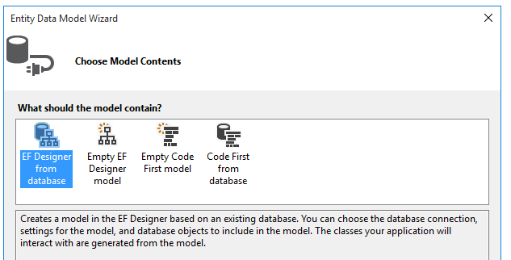
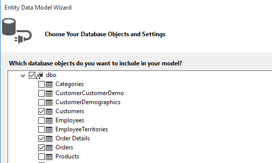
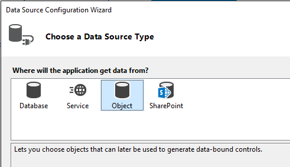
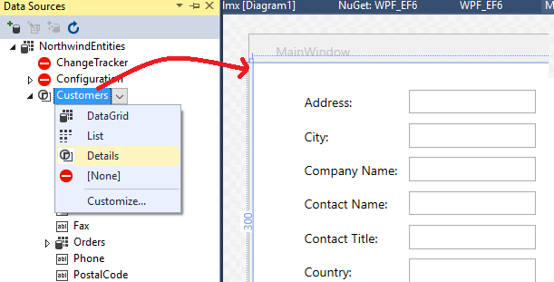
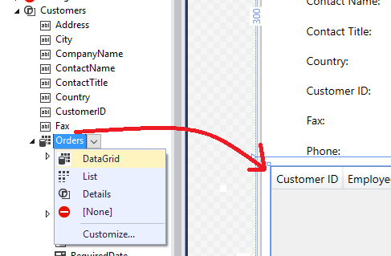

# Create a simple data application with WPF and Entity Framework 6
[!INCLUDE[vs2017banner](../includes/vs2017banner.md)]

This walkthough shows how to create a basic "forms over data" application in Visual Studio with SQL Server LocalDB, the Northwind database, Entity Framework 6, and Windows Presentation Foundation. It shows how to do basic databinding with a master-detail view, and it also has a custom "Binding Navigator" with buttons for "Move Next," "Move Previous," "Move to beginning," "Move to end," "Update" and "Delete."

 This article focuses on using data tools in Visual Studio, and does not attempt to explain the underlying technologies in any depth. It assumes that you have a basic familiarity with XAML, Entity Framework, and SQL. This example also does not demonstrate MVVM architecture, which is standard for WPF applications. However, you can copy this code into your own MVVM application with very few modifications.

## Install and connect to Northwind
 This example uses SQL Server Express LocalDB and the Northwind sample database. It should work with other SQL database products just as well if the ADO.NET data provider for that product supports Entity Framework.

1. If you haven't already, install SQL Server 2014 LocalDB Express 32 bit from the [SQL Server Editions download page](https://www.microsoft.com/sql-server/sql-server-editions-express).

2. Install the Northwind sample database by following the instructions here: [Install SQL Server sample databases](../data-tools/install-sql-server-sample-databases.md).

3. [Add new connections](../data-tools/add-new-connections.md) for Northwind.

## Configure the project

1. In Visual Studio, choose **File &#124; New Project** and then create a new C# WPF Application.

2. Next we will add the NuGet package for Entity Framework 6. In Solution Explorer, select the project node. In the main menu, choose **Project &#124; Manage NuGet Packages...**

     

3. In the NuGet Package manager, click on the **Browse** link. Entity Framework is probably the top package in the list. Click **Install** in the right pane and follow the prompts. The Output window will tell you when the install is finished.

     

4. Now we can use Visual Studio to create a model based on the Northwind database.

## Create the model

1. Right click on the project node in Solution Explorer and choose **Add &#124; New Item**. In the left pane, under the C# node, choose **Data** and in the middle pane choose **ADO.NET Entity Data Model**.

    

2. Call the model `Northwind_model` and choose OK. This brings up the **Entity Data Model Wizard**. Choose **EF Designer from database** and then click **Next**.

    

3. In the next screen, choose your LocalDB Northwind connection and click **Next**.

4. In the next page of the wizard, we choose which tables, stored procedures and other database objects to include in the Entity Framework model. Expand the dbo node in the tree view and choose Customers, Orders and Order Details. Leave defaults checked and click **Finish**.

    

5. The wizard generates the C# classes that represent the Entity Framework model. These are plain old C# classes and they are what we will databind to the WPF user interface. The .edmx file describes the relationships and other metadata that associates the classes with objects in the database.  The .tt files are T4 templates that generate the code that will operate on the model and save changes to the database. You can see all these files in Solution Explorer under the Northwind_model node:

    

    The designer surface for the .edmx file enables you to modify some properties and relationships in the model. We are not going to use the designer in this walkthrough.

6. The .tt files are general-purpose and we need to tweak one of them to work with WPF databinding, which requires ObservableCollections.  In Solution Explorer, expand the Northwind_model node until you find Northwind_model.tt. (Make sure you are **not** in the *.Context .tt file which is directly below the .edmx file).

   - Replace the two occurrences of <xref:System.Collections.ICollection> with <xref:System.Collections.ObjectModel.ObservableCollection%601>.

   - Replace the first occurrence of <xref:System.Collections.Generic.HashSet%601> with <xref:System.Collections.ObjectModel.ObservableCollection%601> around line 51. Do not replace the second occurrence of HashSet

   - Replace the only occurrence of <xref:System.Collections.Generic> (around line 334) with <xref:System.Collections.ObjectModel>.

7. Press **Ctrl + Shift + B** to build the project. When the build finishes,  the model classes are visible to the data sources wizard.

   Now we are ready to hook up this model to the XAML page so that we can view, navigate and modify the data.

## Databind the model to the XAML page
 It is possible to write your own databinding code, but it is much easier to let Visual Studio do it for you.

1. From the main menu, choose **Project &#124; Add new data source** to bring up the **Data Source Configuration Wizard**. Choose **Object** because we are binding to the model classes, not to the database:

     

2. Select Customer.  (Sources for Orders will be automatically generated from the Orders navigation property in  Customer.)

     

3. Click **Finish**

4. Navigate to MainWindow.xaml in Code View. We are going to keep the XAML very simple for the purposes of this example. Change the title of MainWindow to something more descriptive, and increase its Height and Width to 600 x 800 for now. You can always change it later. Now add these three row definitions to the main grid, one row for the navigation buttons, one for the customer's details, one for the grid that shows their orders:

    ```xaml
    <Grid.RowDefinitions>
               <RowDefinition Height="auto"/>
               <RowDefinition Height="auto"/>
               <RowDefinition Height="*"/>
           </Grid.RowDefinitions>
    ```

5. Now open MainWindow.xaml so that you are viewing it in the designer. This will cause the Data Sources window to appear as an option in the Visual Studio window margin next to Toolbox. Click on the tab to open the window, or else press **Shift + Alt + D** or choose **View &#124; Other Windows &#124; Data Sources**. We are going to display each property in the  Customers class in its own individual text box. First click on the arrow in the Customers combo box and choose **Details**. Then drag the node onto the middle part of the design surface so that the designer knows you want it to go in the middle row.  If you misplace it, you can specify the row manually later in the XAML. By default, the controls are placed vertically in a grid element, but at this point you can arrange them however you like on the form.  For example, it might make sense to put the Name text box on top, above the address. The sample application for this article reorders the fields and rearranges them into two columns.

     

     In the code view, you can now see a new `Grid` element in row 1 (the middle row) of the parent Grid. The parent Grid has a `DataContext` attribute that refers to a CollectionViewSource which has been added to the `Windows.Resources` element. Given that data context, when the first text box, for example, binds to "Address" that name is mapped to the `Address` property in the current `Customer` object in the CollectionViewSource.

    ```xaml
    <Grid DataContext="{StaticResource customerViewSource}">
    ```

6. When a customer is visible in the top half of the window, we want to see their orders in the bottom half. We'll show the orders in a single grid view control. For master-detail databinding to work as expected, it is important that we bind to the Orders property in the Customers class, not to the separate Orders node. Pay attention to the following illustration! Drag the Orders property of the Customers class to the lower half of the form, so that the designer puts it in row 2:

     

7. Visual Studio has generated all the binding code that connects the UI controls to events in the model. All we need to do, in order to see some data, is to write some code to populate the model. First let's navigate to MainWindow.xaml.cs and add a data member to the MainWindow class for the data context. This object, which has been generated for us, acts something like a control that tracks changes and events in the model. While we are here, we'll add two members that we'll use later to add a new customer or new order. We'll also add the constructor initialization logic. The top of our class should look like this:

    ```csharp
    public partial class MainWindow : Window
       {
           public Customer newCustomer { get; set; }
           public Order newOrder { get; set; }

           NorthwindEntities context = new NorthwindEntities();
           CollectionViewSource custViewSource;
           CollectionViewSource ordViewSource;

           public MainWindow()
           {
               InitializeComponent();
               newCustomer = new Customer();
               newOrder = new Order();
               custViewSource = ((CollectionViewSource)
                   (FindResource("customerViewSource")));
               ordViewSource = ((CollectionViewSource)
                   (FindResource("customerOrdersViewSource")));
               DataContext = this;
           }
    ```

     Add a `using` directive for System.Data.Entity to bring the Load extension method into scope:

    ```csharp
    using System.Data.Entity;
    ```

     Now scroll down and find the Window_Loaded event handler. Notice that Visual Studio has added a CollectionViewSource object for us. This represents the NorthwindEntities object that we selected when we created the model. Let's add code to Window_loaded so that the entire method now looks like this:

    ```csharp
    private void Window_Loaded(object sender, RoutedEventArgs e)
        {
            // Load is an extension method on IQueryable,
            // defined in the System.Data.Entity namespace.
            // This method enumerates the results of the query,
            // similar to ToList but without creating a list.
            // When used with Linq to Entities this method
            // creates entity objects and adds them to the context.
            context.Customers.Load();

            // After the data is loaded call the DbSet<T>.Local property
            // to use the DbSet<T> as a binding source.
            custViewSource.Source = context.Customers.Local;
        }
    ```

8. Press **F5**. You should see the details for the first customer that was retrieved into the CollectionViewSource , and their orders in the data grid. The formatting isn't great, so let's fix that up. and crate a way to view the other records, and do basic CRUD operations.

## Adjust the page design and add grids for new customers and orders
 The default arrangement produced by Visual Studio is not ideal for our application, so we'll make some changes manually in the XAML. We will also need some "forms" (which are actually Grids) to enable the user to add a new customer or new order.    In order to be able to add a new customer and order, we need a separate set of text boxes that are not data-bound to the `CollectionViewSource`. We'll control which grid the user sees at any given time by setting the Visible property in the handler methods.

 Finally, we will add a Delete button to each row in the Orders grid to enable a user to delete an individual order.

 First, add these styles to Windows.Resources:

```xaml
<Style x:Key="Label" TargetType="{x:Type Label}" BasedOn="{x:Null}">
    <Setter Property="HorizontalAlignment" Value="Left"/>
    <Setter Property="VerticalAlignment" Value="Center"/>
    <Setter Property="Margin" Value="3"/>
    <Setter Property="Height" Value="23"/>
</Style>
<Style x:Key="CustTextBox" TargetType="{x:Type TextBox}" BasedOn="{x:Null}">
    <Setter Property="HorizontalAlignment" Value="Right"/>
    <Setter Property="VerticalAlignment" Value="Center"/>
    <Setter Property="Margin" Value="3"/>
    <Setter Property="Height" Value="26"/>
    <Setter Property="Width" Value="120"/>
</Style>
```

 Next, replace the entire outer Grid with this markup:

```xaml
<Grid >
     <Grid.RowDefinitions>
         <RowDefinition Height="auto"/>
         <RowDefinition Height="auto"/>
         <RowDefinition Height="*"/>
     </Grid.RowDefinitions>
     <StackPanel  Orientation="Horizontal" Margin="2,2,2,0" Height="36" VerticalAlignment="Top" Background="Gainsboro" DataContext="{StaticResource customerViewSource}" d:LayoutOverrides="LeftMargin, RightMargin, TopMargin, BottomMargin">
         <Button Name="btnFirst" Content="|◄" Command="{StaticResource FirstCommand}" Style="{StaticResource NavButton}"  />
         <Button Name="btnPrev"  Content="◄" Command="{StaticResource PreviousCommand}" Style="{StaticResource NavButton}"/>
         <Button Name="btnNext"  Content="►" Command="{StaticResource NextCommand}"     Style="{StaticResource NavButton}"/>
         <Button Name="btnLast"  Content="►|" Command="{StaticResource LastCommand}" Style="{StaticResource NavButton}"/>
         <Button Name="btnDelete" Content="Delete Customer" Command="{StaticResource DeleteCustomerCommand}" FontSize="11" Width="120" Style="{StaticResource NavButton}"/>
         <Button  Name="btnAdd"   Content="New Customer"  Command="{StaticResource AddCommand}" FontSize="11" Width="80" Style="{StaticResource NavButton}"/>
         <Button Content="New Order" Name="btnNewOrder" FontSize="11" Width="80" Style="{StaticResource NavButton}" Click="NewOrder_click"/>
         <Button Name="btnUpdate" Content="Commit" Command="{StaticResource UpdateCommand}" FontSize="11" Width="80" Style="{StaticResource NavButton}"/>
         <Button Content="Cancel" Name="btnCancel"  Command="{StaticResource CancelCommand}" FontSize="11" Width="80" Style="{StaticResource NavButton}"/>
     </StackPanel>
     <Grid x:Name="existingCustomerGrid" Grid.Row="1" HorizontalAlignment="Left" Margin="5" Visibility="Visible" VerticalAlignment="Top" Background="AntiqueWhite" DataContext="{StaticResource customerViewSource}">
         <Grid.ColumnDefinitions>
             <ColumnDefinition Width="Auto" MinWidth="233"/>
             <ColumnDefinition Width="Auto" MinWidth="397"/>
         </Grid.ColumnDefinitions>
         <Grid.RowDefinitions>
             <RowDefinition Height="Auto"/>
             <RowDefinition Height="Auto"/>
             <RowDefinition Height="Auto"/>
             <RowDefinition Height="Auto"/>
             <RowDefinition Height="Auto"/>
             <RowDefinition Height="Auto"/>
         </Grid.RowDefinitions>
         <Label Content="Customer ID:" Grid.Row="0" Style="{StaticResource Label}"/>
         <TextBox x:Name="customerIDTextBox"  Grid.Row="0" Style="{StaticResource CustTextBox}"
                  Text="{Binding CustomerID, Mode=TwoWay, NotifyOnValidationError=true, ValidatesOnExceptions=true}"/>
         <Label Content="Company Name:"  Grid.Row="1" Style="{StaticResource Label}"/>
         <TextBox x:Name="companyNameTextBox"  Grid.Row="1" Style="{StaticResource CustTextBox}"
                  Text="{Binding CompanyName, Mode=TwoWay, NotifyOnValidationError=true, ValidatesOnExceptions=true}"/>
         <Label Content="Contact Name:"  Grid.Row="2" Style="{StaticResource Label}"/>
         <TextBox x:Name="contactNameTextBox" Grid.Row="2" Style="{StaticResource CustTextBox}"
                  Text="{Binding ContactName, Mode=TwoWay, NotifyOnValidationError=true, ValidatesOnExceptions=true}"/>
         <Label Content="Contact Title:"  Grid.Row="3" Style="{StaticResource Label}"/>
         <TextBox x:Name="contactTitleTextBox" Grid.Row="3" Style="{StaticResource CustTextBox}"
                  Text="{Binding ContactTitle, Mode=TwoWay, NotifyOnValidationError=true, ValidatesOnExceptions=true}"/>
         <Label Content="Address:" Grid.Row="4" Style="{StaticResource Label}"/>
         <TextBox x:Name="addressTextBox" Grid.Row="4" Style="{StaticResource CustTextBox}"
                  Text="{Binding Address, Mode=TwoWay, NotifyOnValidationError=true, ValidatesOnExceptions=true}"/>
         <Label Content="City:" Grid.Column="1" Grid.Row="0"  Style="{StaticResource Label}"/>
         <TextBox x:Name="cityTextBox" Grid.Column="1" Grid.Row="0" Style="{StaticResource CustTextBox}"
                  Text="{Binding City, Mode=TwoWay, NotifyOnValidationError=true, ValidatesOnExceptions=true}"/>
         <Label Content="Country:" Grid.Column="1" Grid.Row="1" Style="{StaticResource Label}"/>
         <TextBox x:Name="countryTextBox" Grid.Column="1" Grid.Row="1" Style="{StaticResource CustTextBox}"
                  Text="{Binding Country, Mode=TwoWay, NotifyOnValidationError=true, ValidatesOnExceptions=true}"/>
         <Label Content="Fax:" Grid.Column="1" Grid.Row="2" Style="{StaticResource Label}"/>
         <TextBox x:Name="faxTextBox" Grid.Column="1" Grid.Row="2" Style="{StaticResource CustTextBox}"
                  Text="{Binding Fax, Mode=TwoWay, NotifyOnValidationError=true, ValidatesOnExceptions=true}"/>
         <Label Content="Phone:" Grid.Column="1" Grid.Row="3" Style="{StaticResource Label}"/>
         <TextBox x:Name="phoneTextBox" Grid.Column="1" Grid.Row="3" Style="{StaticResource CustTextBox}"
                  Text="{Binding Phone, Mode=TwoWay, NotifyOnValidationError=true, ValidatesOnExceptions=true}"/>
         <Label Content="Postal Code:" Grid.Column="1" Grid.Row="4" VerticalAlignment="Center" Style="{StaticResource Label}"/>
         <TextBox x:Name="postalCodeTextBox" Grid.Column="1" Grid.Row="4" Style="{StaticResource CustTextBox}"
                  Text="{Binding PostalCode, Mode=TwoWay, NotifyOnValidationError=true, ValidatesOnExceptions=true}"/>
         <Label Content="Region:" Grid.Column="1" Grid.Row="5" Style="{StaticResource Label}"/>
         <TextBox x:Name="regionTextBox" Grid.Column="1" Grid.Row="5" Style="{StaticResource CustTextBox}"
                  Text="{Binding Region, Mode=TwoWay, NotifyOnValidationError=true, ValidatesOnExceptions=true}"/>
     </Grid>
     <Grid x:Name="newCustomerGrid" Grid.Row="1" HorizontalAlignment="Left" VerticalAlignment="Top" Margin="5" DataContext="{Binding RelativeSource={RelativeSource FindAncestor, AncestorType={x:Type Window}}, Path=newCustomer, UpdateSourceTrigger=Explicit}" Visibility="Collapsed" Background="CornflowerBlue">
         <Grid.ColumnDefinitions>
             <ColumnDefinition Width="Auto" MinWidth="233"/>
             <ColumnDefinition Width="Auto" MinWidth="397"/>
         </Grid.ColumnDefinitions>
         <Grid.RowDefinitions>
             <RowDefinition Height="Auto"/>
             <RowDefinition Height="Auto"/>
             <RowDefinition Height="Auto"/>
             <RowDefinition Height="Auto"/>
             <RowDefinition Height="Auto"/>
             <RowDefinition Height="Auto"/>
         </Grid.RowDefinitions>
         <Label Content="Customer ID:" Grid.Row="0" Style="{StaticResource Label}"/>
         <TextBox x:Name="add_customerIDTextBox"  Grid.Row="0"  Style="{StaticResource CustTextBox}"
                  Text="{Binding CustomerID, Mode=TwoWay, NotifyOnValidationError=true, ValidatesOnExceptions=true}"/>
         <Label Content="Company Name:"  Grid.Row="1" Style="{StaticResource Label}"/>
         <TextBox x:Name="add_companyNameTextBox"  Grid.Row="1" Style="{StaticResource CustTextBox}"
                  Text="{Binding CompanyName, Mode=TwoWay, NotifyOnValidationError=true, ValidatesOnExceptions=true }"/>
         <Label Content="Contact Name:"  Grid.Row="2" Style="{StaticResource Label}"/>
         <TextBox x:Name="add_contactNameTextBox" Grid.Row="2" Style="{StaticResource CustTextBox}"
                  Text="{Binding ContactName, Mode=TwoWay, NotifyOnValidationError=true, ValidatesOnExceptions=true}"/>
         <Label Content="Contact Title:"  Grid.Row="3" Style="{StaticResource Label}"/>
         <TextBox x:Name="add_contactTitleTextBox" Grid.Row="3" Style="{StaticResource CustTextBox}"
                  Text="{Binding ContactTitle, Mode=TwoWay, NotifyOnValidationError=true, ValidatesOnExceptions=true}"/>
         <Label Content="Address:" Grid.Row="4" Style="{StaticResource Label}"/>
         <TextBox x:Name="add_addressTextBox" Grid.Row="4" Style="{StaticResource CustTextBox}"
                  Text="{Binding Address, Mode=TwoWay, NotifyOnValidationError=true, ValidatesOnExceptions=true}"/>
         <Label Content="City:" Grid.Column="1" Grid.Row="0"  Style="{StaticResource Label}"/>
         <TextBox x:Name="add_cityTextBox" Grid.Column="1" Grid.Row="0" Style="{StaticResource CustTextBox}"
                  Text="{Binding City, Mode=TwoWay, NotifyOnValidationError=true, ValidatesOnExceptions=true}"/>
         <Label Content="Country:" Grid.Column="1" Grid.Row="1" Style="{StaticResource Label}"/>
         <TextBox x:Name="add_countryTextBox" Grid.Column="1" Grid.Row="1" Style="{StaticResource CustTextBox}"
                  Text="{Binding Country, Mode=TwoWay, NotifyOnValidationError=true, ValidatesOnExceptions=true}"/>
         <Label Content="Fax:" Grid.Column="1" Grid.Row="2" Style="{StaticResource Label}"/>
         <TextBox x:Name="add_faxTextBox" Grid.Column="1" Grid.Row="2" Style="{StaticResource CustTextBox}"
                  Text="{Binding Fax, Mode=TwoWay, NotifyOnValidationError=true, ValidatesOnExceptions=true}"/>
         <Label Content="Phone:" Grid.Column="1" Grid.Row="3" Style="{StaticResource Label}"/>
         <TextBox x:Name="add_phoneTextBox" Grid.Column="1" Grid.Row="3" Style="{StaticResource CustTextBox}"
                  Text="{Binding Phone, Mode=TwoWay, NotifyOnValidationError=true, ValidatesOnExceptions=true}"/>
         <Label Content="Postal Code:" Grid.Column="1" Grid.Row="4" VerticalAlignment="Center" Style="{StaticResource Label}"/>
         <TextBox x:Name="add_postalCodeTextBox" Grid.Column="1" Grid.Row="4" Style="{StaticResource CustTextBox}"
                  Text="{Binding PostalCode, Mode=TwoWay, NotifyOnValidationError=true, ValidatesOnExceptions=true}"/>
         <Label Content="Region:" Grid.Column="1" Grid.Row="5" Style="{StaticResource Label}"/>
         <TextBox x:Name="add_regionTextBox" Grid.Column="1" Grid.Row="5" Style="{StaticResource CustTextBox}"
                  Text="{Binding Region, Mode=TwoWay, NotifyOnValidationError=true, ValidatesOnExceptions=true}"/>
     </Grid>
     <Grid x:Name="newOrderGrid" Grid.Row="1" HorizontalAlignment="Left" VerticalAlignment="Top" Margin="5" DataContext="{Binding Path=newOrder, Mode=TwoWay}" Visibility="Collapsed" Background="LightGreen">
         <Grid.ColumnDefinitions>
             <ColumnDefinition Width="Auto" MinWidth="233"/>
             <ColumnDefinition Width="Auto" MinWidth="397"/>
         </Grid.ColumnDefinitions>
         <Grid.RowDefinitions>
             <RowDefinition Height="Auto"/>
             <RowDefinition Height="Auto"/>
             <RowDefinition Height="Auto"/>
             <RowDefinition Height="Auto"/>
             <RowDefinition Height="Auto"/>
             <RowDefinition Height="Auto"/>
             <RowDefinition Height="Auto"/>
         </Grid.RowDefinitions>
         <Label Content="New Order Form" FontWeight="Bold"/>
         <Label Content="Employee ID:"  Grid.Row="1" Style="{StaticResource Label}"/>
         <TextBox x:Name="add_employeeIDTextBox" Grid.Row="1" Style="{StaticResource CustTextBox}"
                  Text="{Binding EmployeeID, Mode=TwoWay, NotifyOnValidationError=true, ValidatesOnExceptions=true}"/>
         <Label Content="Order Date:"  Grid.Row="2" Style="{StaticResource Label}"/>
         <DatePicker x:Name="add_orderDatePicker" Grid.Row="2"  HorizontalAlignment="Right" Width="120"
                 SelectedDate="{Binding OrderDate, Mode=TwoWay, NotifyOnValidationError=true, ValidatesOnExceptions=true, UpdateSourceTrigger=PropertyChanged}"/>
         <Label Content="Required Date:" Grid.Row="3" Style="{StaticResource Label}"/>
         <DatePicker x:Name="add_requiredDatePicker" Grid.Row="3" HorizontalAlignment="Right" Width="120"
                  SelectedDate="{Binding RequiredDate, Mode=TwoWay, NotifyOnValidationError=true, ValidatesOnExceptions=true, UpdateSourceTrigger=PropertyChanged}"/>
         <Label Content="Shipped Date:"  Grid.Row="4"  Style="{StaticResource Label}"/>
         <DatePicker x:Name="add_shippedDatePicker"  Grid.Row="4"  HorizontalAlignment="Right" Width="120"
                 SelectedDate="{Binding ShippedDate, Mode=TwoWay, NotifyOnValidationError=true, ValidatesOnExceptions=true, UpdateSourceTrigger=PropertyChanged}"/>
         <Label Content="Ship Via:"  Grid.Row="5" Style="{StaticResource Label}"/>
         <TextBox x:Name="add_ShipViaTextBox"  Grid.Row="5" Style="{StaticResource CustTextBox}"
                  Text="{Binding ShipVia, Mode=TwoWay, NotifyOnValidationError=true, ValidatesOnExceptions=true}"/>
         <Label Content="Freight"  Grid.Row="6" Style="{StaticResource Label}"/>
         <TextBox x:Name="add_freightTextBox" Grid.Row="6" Style="{StaticResource CustTextBox}"
                  Text="{Binding Freight, Mode=TwoWay, NotifyOnValidationError=true, ValidatesOnExceptions=true}"/>
     </Grid>
     <DataGrid x:Name="ordersDataGrid" SelectionUnit="Cell" SelectionMode="Single" AutoGenerateColumns="False" CanUserAddRows="false" IsEnabled="True" EnableRowVirtualization="True" Width="auto" ItemsSource="{Binding Source={StaticResource customerOrdersViewSource}}" Margin="10,10,10,10" Grid.Row="2" RowDetailsVisibilityMode="VisibleWhenSelected">
         <DataGrid.Columns>
             <DataGridTemplateColumn>
                 <DataGridTemplateColumn.CellTemplate>
                     <DataTemplate>
                         <Button Content="Delete"  Command="{StaticResource DeleteOrderCommand}" CommandParameter="{Binding}"/>
                     </DataTemplate>
                 </DataGridTemplateColumn.CellTemplate>
             </DataGridTemplateColumn>
             <DataGridTextColumn x:Name="customerIDColumn" Binding="{Binding CustomerID}" Header="Customer ID" Width="SizeToHeader"/>
             <DataGridTextColumn x:Name="employeeIDColumn" Binding="{Binding EmployeeID}" Header="Employee ID" Width="SizeToHeader"/>
             <DataGridTextColumn x:Name="freightColumn" Binding="{Binding Freight}" Header="Freight" Width="SizeToHeader"/>
             <DataGridTemplateColumn x:Name="orderDateColumn" Header="Order Date" Width="SizeToHeader">
                 <DataGridTemplateColumn.CellTemplate>
                     <DataTemplate>
                         <DatePicker SelectedDate="{Binding OrderDate, Mode=TwoWay, NotifyOnValidationError=true, ValidatesOnExceptions=true, UpdateSourceTrigger=PropertyChanged}"/>
                     </DataTemplate>
                 </DataGridTemplateColumn.CellTemplate>
             </DataGridTemplateColumn>
             <DataGridTextColumn x:Name="orderIDColumn" Binding="{Binding OrderID}" Header="Order ID" Width="SizeToHeader"/>
             <DataGridTemplateColumn x:Name="requiredDateColumn" Header="Required Date" Width="SizeToHeader">
                 <DataGridTemplateColumn.CellTemplate>
                     <DataTemplate>
                         <DatePicker SelectedDate="{Binding RequiredDate, Mode=TwoWay, NotifyOnValidationError=true, ValidatesOnExceptions=true, UpdateSourceTrigger=PropertyChanged}"/>
                     </DataTemplate>
                 </DataGridTemplateColumn.CellTemplate>
             </DataGridTemplateColumn>
             <DataGridTextColumn x:Name="shipAddressColumn" Binding="{Binding ShipAddress}" Header="Ship Address" Width="SizeToHeader"/>
             <DataGridTextColumn x:Name="shipCityColumn" Binding="{Binding ShipCity}" Header="Ship City" Width="SizeToHeader"/>
             <DataGridTextColumn x:Name="shipCountryColumn" Binding="{Binding ShipCountry}" Header="Ship Country" Width="SizeToHeader"/>
             <DataGridTextColumn x:Name="shipNameColumn" Binding="{Binding ShipName}" Header="Ship Name" Width="SizeToHeader"/>
             <DataGridTemplateColumn x:Name="shippedDateColumn" Header="Shipped Date" Width="SizeToHeader">
                 <DataGridTemplateColumn.CellTemplate>
                     <DataTemplate>
                         <DatePicker SelectedDate="{Binding ShippedDate, Mode=TwoWay, NotifyOnValidationError=true, ValidatesOnExceptions=true, UpdateSourceTrigger=PropertyChanged}"/>
                     </DataTemplate>
                 </DataGridTemplateColumn.CellTemplate>
             </DataGridTemplateColumn>
             <DataGridTextColumn x:Name="shipPostalCodeColumn" Binding="{Binding ShipPostalCode}" Header="Ship Postal Code" Width="SizeToHeader"/>
             <DataGridTextColumn x:Name="shipRegionColumn" Binding="{Binding ShipRegion}" Header="Ship Region" Width="SizeToHeader"/>
             <DataGridTextColumn x:Name="shipViaColumn" Binding="{Binding ShipVia}" Header="Ship Via" Width="SizeToHeader"/>
         </DataGrid.Columns>
     </DataGrid>
 </Grid>
```

## Add buttons to navigate, add, update and delete
 In Windows Forms applications, you get a BindingNavigator object with buttons for navigating through rows in a database and doing basic CRUD operations. WPF does not provide a BindingNavigator   but they are easy enough to make. We'll do that with buttons inside a horizontal StackPanel in the bottom row of the page grid, and we'll associate the buttons with Commands that are bound to methods in the code behind.

 There are fours parts to the command logic: (1) the commands, (2) the bindings, (3) the buttons, and (4) the command handlers in the code-behind.

#### Add commands, bindings and buttons in XAML

1. First, let's add the commands in our MainWindow.XAML file inside the Windows.Resources element:

    ```xaml

     <RoutedUICommand x:Key="FirstCommand" Text="First"/>
    <RoutedUICommand x:Key="LastCommand" Text="Last"/>
    <RoutedUICommand x:Key="NextCommand" Text="Next"/>
    <RoutedUICommand x:Key="PreviousCommand" Text="Previous"/>
    <RoutedUICommand x:Key="DeleteCustomerCommand" Text="Delete Customer"/>
    <RoutedUICommand x:Key="DeleteOrderCommand" Text="Delete Order"/>
    <RoutedUICommand x:Key="UpdateCommand" Text="Update"/>
    <RoutedUICommand x:Key="AddCommand" Text="Add"/>
    <RoutedUICommand x:Key="CancelCommand" Text="Cancel"/>
    ```

2. A CommandBinding maps a RoutedUICommand event to a method in the code behind. Add this CommandBindings element after the Windows.Resources closing tag:

    ```xaml

        <Window.CommandBindings>
        <CommandBinding Command="{StaticResource FirstCommand}" Executed="FirstCommandHandler"/>
        <CommandBinding Command="{StaticResource LastCommand}" Executed="LastCommandHandler"/>
        <CommandBinding Command="{StaticResource NextCommand}" Executed="NextCommandHandler"/>
        <CommandBinding Command="{StaticResource PreviousCommand}" Executed="PreviousCommandHandler"/>
        <CommandBinding Command="{StaticResource DeleteCustomerCommand}" Executed="DeleteCustomerCommandHandler"/>
        <CommandBinding Command="{StaticResource DeleteOrderCommand}" Executed="DeleteOrderCommandHandler"/>
        <CommandBinding Command="{StaticResource UpdateCommand}" Executed="UpdateCommandHandler"/>
        <CommandBinding Command="{StaticResource AddCommand}" Executed="AddCommandHandler"/>
        <CommandBinding Command="{StaticResource CancelCommand}" Executed="CancelCommandHandler"/>
    </Window.CommandBindings>
    ```

3. Now let's add the StackPanel with the navigation, add, delete and update buttons. First, add this style to Windows.Resources:

    ```xaml
    <Style x:Key="NavButton" TargetType="{x:Type Button}" BasedOn="{x:Null}">
        <Setter Property="FontSize" Value="24"/>
        <Setter Property="FontFamily" Value="Segoe UI Symbol"/>
        <Setter Property="Margin" Value="2,2,2,0"/>
        <Setter Property="Width" Value="40"/>
        <Setter Property="Height" Value="auto"/>
    </Style>
    ```

     Now paste this code just after the RowDefinitions for the outer Grid element toward the top of the XAML page:

    ```xaml
    <StackPanel  Orientation="Horizontal" Margin="2,2,2,0" Height="36" VerticalAlignment="Top" Background="Gainsboro" DataContext="{StaticResource customerViewSource}" d:LayoutOverrides="LeftMargin, RightMargin, TopMargin, BottomMargin">
        <Button Name="btnFirst" Content="|◄" Command="{StaticResource FirstCommand}" Style="{StaticResource NavButton}"  />
        <Button Name="btnPrev"  Content="◄" Command="{StaticResource PreviousCommand}" Style="{StaticResource NavButton}"/>
        <Button Name="btnNext"  Content="►" Command="{StaticResource NextCommand}"     Style="{StaticResource NavButton}"/>
        <Button Name="btnLast"  Content="►|" Command="{StaticResource LastCommand}" Style="{StaticResource NavButton}"/>
        <Button Name="btnDelete" Content="Delete Customer" Command="{StaticResource DeleteCustomerCommand}" FontSize="11" Width="120" Style="{StaticResource NavButton}"/>
        <Button  Name="btnAdd"   Content="New Customer"  Command="{StaticResource AddCommand}" FontSize="11" Width="80" Style="{StaticResource NavButton}"/>
        <Button Content="New Order" Name="btnNewOrder" FontSize="11" Width="80" Style="{StaticResource NavButton}" Click="NewOrder_click"/>
        <Button Name="btnUpdate" Content="Commit" Command="{StaticResource UpdateCommand}" FontSize="11" Width="80" Style="{StaticResource NavButton}"/>
        <Button Content="Cancel" Name="btnCancel"  Command="{StaticResource CancelCommand}" FontSize="11" Width="80" Style="{StaticResource NavButton}"/>
    </StackPanel>
    ```

#### Add command handlers to the MainWindow class

1. The code-behind  is minimal except for the add and delete methods. Note that the navigation is performed by calling methods on the View property of the CollectionViewSource. The DeleteOrderCommandHandler shows how to perform a cascade delete on an order. We have to first delete the Order_Details that are associated with it. The UpdateCommandHandler adds a new customer to the collection, or else just updates the existing object with whatever changes the user made in the text boxes.

2. Add these handler methods to the MainWindow class in MainWindow.xaml.cs, If your CollectionViewSource for the Customers table has a different name, then you will need to adjust the name in each of these methods:

    ```csharp
       private void LastCommandHandler(object sender, ExecutedRoutedEventArgs e)
    {
        custViewSource.View.MoveCurrentToLast();
    }

    private void PreviousCommandHandler(object sender, ExecutedRoutedEventArgs e)
    {
        custViewSource.View.MoveCurrentToPrevious();
    }

    private void NextCommandHandler(object sender, ExecutedRoutedEventArgs e)
    {
        custViewSource.View.MoveCurrentToNext();
    }

    private void FirstCommandHandler(object sender, ExecutedRoutedEventArgs e)
    {
        custViewSource.View.MoveCurrentToFirst();
    }

    private void DeleteCustomerCommandHandler(object sender, ExecutedRoutedEventArgs e)
    {
        // If existing window is visible, then delete the customer and all their orders.
        // In a real application, you should add warnings and allow a user to cancel the operation.
        var cur = custViewSource.View.CurrentItem as Customer;

        var cust = (from c in context.Customers
                    where c.CustomerID == cur.CustomerID
                    select c).FirstOrDefault();

        if (cust != null)
        {
            foreach (var ord in cust.Orders.ToList())
            {
                Delete_Order(ord);
            }
            context.Customers.Remove(cust);
        }
        context.SaveChanges();
        custViewSource.View.Refresh();
    }

    // Commit changes from the new customer form, the new order form,
    // or edits made to the existing customer form.
    private void UpdateCommandHandler(object sender, ExecutedRoutedEventArgs e)
    {
        if (newCustomerGrid.IsVisible)
        {
            // Create a new object because the old one
            // is being tracked by EF now.
            newCustomer = new Customer();
            newCustomer.Address = add_addressTextBox.Text;
            newCustomer.City = add_cityTextBox.Text;
            newCustomer.CompanyName = add_companyNameTextBox.Text;
            newCustomer.ContactName = add_contactNameTextBox.Text;
            newCustomer.ContactTitle = add_contactTitleTextBox.Text;
            newCustomer.Country = add_countryTextBox.Text;
            newCustomer.CustomerID = add_customerIDTextBox.Text;
            newCustomer.Fax = add_faxTextBox.Text;
            newCustomer.Phone = add_phoneTextBox.Text;
            newCustomer.PostalCode = add_postalCodeTextBox.Text;
            newCustomer.Region = add_regionTextBox.Text;

            // Perform very basic validation
            if (newCustomer.CustomerID.Length == 5)
            {
                // Insert the new customer at correct position:
                int len = context.Customers.Local.Count();
                int pos = len;
                for (int i = 0; i < len; ++i)
                {
                    if (String.CompareOrdinal(newCustomer.CustomerID, context.Customers.Local[i].CustomerID) < 0)
                    {
                        pos = i;
                        break;
                    }
                }
                context.Customers.Local.Insert(pos, newCustomer);
                custViewSource.View.Refresh();
                custViewSource.View.MoveCurrentTo(newCustomer);
            }
            else
            {
                MessageBox.Show("CustomerID must have 5 characters.");
            }

            newCustomerGrid.Visibility = Visibility.Collapsed;
            existingCustomerGrid.Visibility = Visibility.Visible;
        }
        else if (newOrderGrid.IsVisible)
        {
            // Order ID is auto-generated so we don't set it here.
            // For CustomerID, address, etc we use the values from current customer.
            // User can modify these in the datagrid after the order is entered.

            newOrder.OrderDate = add_orderDatePicker.SelectedDate;
            newOrder.RequiredDate = add_requiredDatePicker.SelectedDate;
            newOrder.ShippedDate = add_shippedDatePicker.SelectedDate;
            try
            {
                // Exercise for the reader if you are using Northwind:
                // Add the Northwind Shippers table to the model.
                // Acceptable ShipperID values are 1, 2, or 3.
                if (add_ShipViaTextBox.Text == "1" || add_ShipViaTextBox.Text == "2"
                    || add_ShipViaTextBox.Text == "3")
                {
                    newOrder.ShipVia = Convert.ToInt32(add_ShipViaTextBox.Text);
                }
                else
                {
                    MessageBox.Show("Shipper ID must be 1, 2, or 3 in Northwind.");
                    return;
                }
            }
            catch
            {
                MessageBox.Show("Ship Via must be convertible to int");
                return;
            }
            try
            {
                newOrder.Freight = Convert.ToDecimal(add_freightTextBox.Text);
            }
            catch
            {
                MessageBox.Show("Freight must be convertible to decimal.");
                return;
            }

            // Add the order into the EF model
            context.Orders.Add(newOrder);
            ordViewSource.View.Refresh();
        }

        // Save the changes, either for a new customer, a new order
        // or an edit in an existing customer or order
        context.SaveChanges();
    }

    // Sets up the form so that user can enter data. Data is later
    // saved when user clicks Commit.
    private void AddCommandHandler(object sender, ExecutedRoutedEventArgs e)
    {
        existingCustomerGrid.Visibility = Visibility.Collapsed;
        newOrderGrid.Visibility = Visibility.Collapsed;
        newCustomerGrid.Visibility = Visibility.Visible;

        // Clear all the text boxes before adding a new customer.
        foreach (var child in newCustomerGrid.Children)
        {
            var tb = child as TextBox;
            if (tb != null)
            {
                tb.Text = "";
            }
        }
    }

    private void NewOrder_click(object sender, RoutedEventArgs e)
    {
        var cust = custViewSource.View.CurrentItem as Customer;
        if (cust == null)
        {
            MessageBox.Show("No customer selected.");
            return;
        }

        newOrder.CustomerID = cust.CustomerID;

        // Get address and other mostly constant fields from
        // an existing order, if one exists
        var coll = custViewSource.Source as IEnumerable<Customer>;
        var lastOrder = (from c in coll
                         from ord in c.Orders
                         select ord).LastOrDefault();
        if (lastOrder != null)
        {
            newOrder.ShipAddress = lastOrder.ShipAddress;
            newOrder.ShipCity = lastOrder.ShipCity;
            newOrder.ShipCountry = lastOrder.ShipCountry;
            newOrder.ShipName = lastOrder.ShipName;
            newOrder.ShipPostalCode = lastOrder.ShipPostalCode;
            newOrder.ShipRegion = lastOrder.ShipRegion;
        }

        existingCustomerGrid.Visibility = Visibility.Collapsed;
        newCustomerGrid.Visibility = Visibility.Collapsed;
        newOrderGrid.UpdateLayout();
        newOrderGrid.Visibility = Visibility.Visible;
    }

    // Cancels any input into the new customer form
    private void CancelCommandHandler(object sender, ExecutedRoutedEventArgs e)
    {
        add_addressTextBox.Text = "";
        add_cityTextBox.Text = "";
        add_companyNameTextBox.Text = "";
        add_contactNameTextBox.Text = "";
        add_contactTitleTextBox.Text = "";
        add_countryTextBox.Text = "";
        add_customerIDTextBox.Text = "";
        add_faxTextBox.Text = "";
        add_phoneTextBox.Text = "";
        add_postalCodeTextBox.Text = "";
        add_regionTextBox.Text = "";

        existingCustomerGrid.Visibility = Visibility.Visible;
        newCustomerGrid.Visibility = Visibility.Collapsed;
        newOrderGrid.Visibility = Visibility.Collapsed;
    }

    private void Delete_Order(Order order)
    {
        // Find the order in the EF model.
        var ord = (from o in context.Orders.Local
                   where o.OrderID == order.OrderID
                   select o).FirstOrDefault();

        // Delete all the order_details that have
        // this Order as a foreign key
        foreach (var detail in ord.Order_Details.ToList())
        {
            context.Order_Details.Remove(detail);
        }

        // Now it's safe to delete the order.
        context.Orders.Remove(ord);
        context.SaveChanges();

        // Update the data grid.
        ordViewSource.View.Refresh();
    }

    private void DeleteOrderCommandHandler(object sender, ExecutedRoutedEventArgs e)
    {
        // Get the Order in the row in which the Delete button was clicked.
        Order obj = e.Parameter as Order;
        Delete_Order(obj);
    }
    ```

3. Press **F5**. You should see your data, and the navigation buttons should work as expected. Click on "Commit" to add a new customer or order to the model after you have entered the data.  Click on "Cancel" to back out of a new Customer or New Order form without saving. You can make edits to existing Customers and Orders directly in the text boxes, and those changes will be written to the model automatically.

## See Also
 [Visual Studio data tools for .NET](../data-tools/visual-studio-data-tools-for-dotnet.md) [Entity Framework Documentation](https://msdn.microsoft.com/data/ee712907.aspx)
