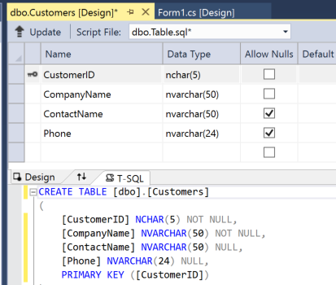
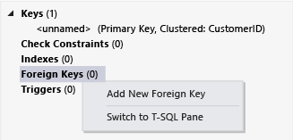

# Create a SQL database by using a designer
[!INCLUDE[vs2017banner](../includes/vs2017banner.md)]

You can explore basic tasks, such as adding tables and defining columns, by using Visual Studio to create and update a local database file in SQL Server Express LocalDB. After you finish this walkthrough, you can discover more advanced capabilities by using your local database as a starting point for other walkthroughs that require it.

 You can also create a database by using SQL Server Management Studio (a separate download) or Transact-SQL statements in the **SQL Server Object Explorer** tool window in Visual Studio.

 During this walkthrough, you'll explore the following tasks:

- [Create a project and a local database file](../data-tools/create-a-sql-database-by-using-a-designer.md#BKMK_CreateNewSQLDB)

- [Create tables, columns, primary keys, and foreign keys](../data-tools/create-a-sql-database-by-using-a-designer.md#BKMK_CreateNewTbls)

- [Populate the tables with data](../data-tools/create-a-sql-database-by-using-a-designer.md#BKMK_Populating)

## Prerequisites
 To complete this walkthrough, ensure that you have SQL Server Data Tools installed. On the **View** menu, you should see **SQL Server Object Explorer**. If it's not there, go to **Add or Remove Programs**, click **Visual Studio 2015**, select **Change**, and select the box next to **SQL Server Data Tools**.

## <a name="BKMK_CreateNewSQLDB"></a> Create a project and a local database file

#### To create a project and a database file

1. Create a Windows Forms project that's named `SampleDatabaseWalkthrough`.

2. On the menu bar, select **Project** > **Add New Item**.

3. In the list of item templates, scroll down and select **Service-based Database**.

    

4. Name the database **SampleDatabase**, and then select the **Add** button.

5. If the **Data Sources** window isn't open, open it by selecting the Shift+Alt+D keys or, on the menu bar, selecting **View** > **Other Windows** > **Data Sources**.

6. In the **Data Sources** window, select the **Add New Data Source** link.

7. In the **Data Source Configuration Wizard**, select the **Next** button four times to accept the default settings, and then select the **Finish** button.

   By opening the properties window for the database, you can view its connection string and the location of the primary .mdf file. You will see that the database file is in the project folder.

- In Visual Studio, select **View** > **SQL Server Object Explorer** if that window isn't already open. Open the properties window by expanding the **Data Connections** node, opening the shortcut menu for SampleDatabase.mdf, and then selecting **Properties**.

- Alternatively, you can select **View** > **Server Explorer**, if that window isn't already open. Open the properties window by expanding the **Data Connections** node. Open the shortcut menu for SampleDatabase.mdf, and then select **Properties**.

## <a name="BKMK_CreateNewTbls"></a> Create tables, columns, primary keys, and foreign keys
 In this section, you'll create a couple of tables, a primary key in each table, and a few rows of sample data. In the next walkthrough, you'll get an idea of how that information might appear in an application. You'll also create a foreign key to specify how records in one table might correspond to records in the other table.

#### To create the Customers table

1. In **Server Explorer** or **SQL Server Object Explorer**, expand the **Data Connections** node, and then expand the **SampleDatabase.mdf** node.

2. Open the shortcut menu for **Tables**, and then select **Add New Table**.

     The **Table Designer** opens and shows a grid with one default row, which represents a single column in the table that you're creating. By adding rows to the grid, you'll add columns in the table.

3. In the grid, add a row for each of the following entries:

    |Column name|Data type|Allow nulls|
    |-----------------|---------------|-----------------|
    |`CustomerID`|`nchar(5)`|False (cleared)|
    |`CompanyName`|`nvarchar(50)`|False (cleared)|
    |`ContactName`|`nvarchar (50)`|True (selected)|
    |`Phone`|`nvarchar (24)`|True (selected)|

4. Open the shortcut menu for the `CustomerID` row, and then select **Set Primary Key**.

5. Open the shortcut menu for the default row, and then select **Delete**.

6. Name the Customers table by updating the first line in the script pane to match the following sample:

    ```
    CREATE TABLE [dbo].[Customers]
    ```

     You should see something like this:

     

7. In the upper-left corner of the **Table Designer**, select the **Update** button.

8. In the **Preview Database Updates** dialog box, select the **Update Database** button.

     Your changes are saved to the local database file.

#### To create the Orders table

1. Add another table, and then add a row for each entry in the following table:

    |Column name|Data type|Allow nulls|
    |-----------------|---------------|-----------------|
    |`OrderID`|`int`|False (cleared)|
    |`CustomerID`|`nchar(5)`|False (cleared)|
    |`OrderDate`|`datetime`|True (selected)|
    |`OrderQuantity`|`int`|True (selected)|

2. Set **OrderID** as the primary key, and then delete the default row.

3. Name the Orders table by updating the first line in the script pane to match the following sample:

    ```
    CREATE TABLE [dbo].[Orders]
    ```

4. In the upper-left corner of the **Table Designer**, select the **Update** button.

5. In the **Preview Database Updates** dialog box, select the **Update Database** button.

     Your changes are saved to the local database file.

#### To create a foreign key

1. In the context pane on the right side of the grid, open the shortcut menu for **Foreign Keys**, and then select **Add New Foreign Key**, as the following illustration shows.

     

2. In the text box that appears, replace **ToTable** with `Customers`.

3. In the T-SQL pane, update the last line to match the following sample:

    ```
    CONSTRAINT [FK_Orders_Customers] FOREIGN KEY ([CustomerID]) REFERENCES [Customers]([CustomerID])
    ```

4. In the upper-left corner of the **Table Designer**, select the **Update** button.

5. In the **Preview Database Updates** dialog box, select the **Update Database** button.

     Your changes are saved to the local database file.

## <a name="BKMK_Populating"></a> Populate the tables with data

#### To populate the tables with data

1. In **Server Explorer** or **SQL Server Object Explorer**, expand the node for the sample database.

2. Open the shortcut menu for the **Tables** node, select **Refresh**, and then expand the **Tables** node.

3. Open the shortcut menu for the Customers table, and then select **Show Table Data**.

4. Add whatever data you want for at least three customers.

     You can specify any five characters you want as the customer IDs, but choose at least one that you can remember for use later in this procedure.

5. Open the shortcut menu for the Orders table, and then select **Show Table Data**.

6. Add data for at least three orders.

    > [!IMPORTANT]
    > Make sure that all order IDs and order quantities are integers and that each customer ID  matches a value that you specified in the CustomerID column of the Customers table.

7. On the menu bar, select **File** > **Save All**.

8. On the menu bar, select **File** > **Close Solution**.

    > [!NOTE]
    > As a best practice, you can back up the database file that you just created by copying it and then either pasting the copy in another location or giving the copy a different name.

## Next Steps
 Now that you have a local database file with some sample data, you can complete any of the walkthroughs that demonstrate database tasks.
