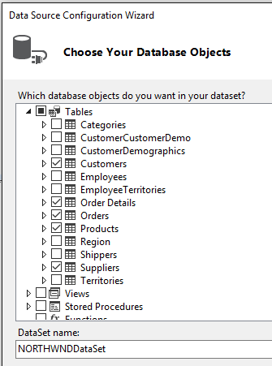
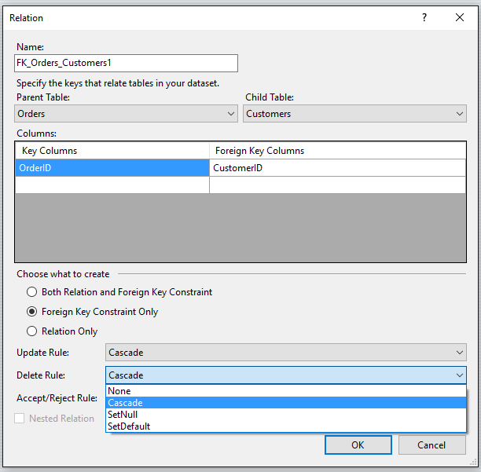
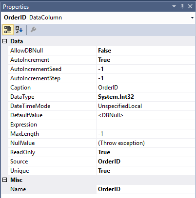

# Create and configure datasets in Visual Studio
[!INCLUDE[vs2017banner](../includes/vs2017banner.md)]

A *dataset* is a set of objects that store data from a database in memory and support change tracking to enable create, read, update and delete (CRUD) operations on that data without the need to be always connected to the database. Datasets were designed for simple *forms over data* business applications. For new applications, consider using Entity Framework to store and model data in memory. To work with datasets, you should have a basic knowledge of database concepts.

 You create a typed <xref:System.Data.DataSet> class in Visual Studio at design time by using the **Data Source Configuration Wizard**. For information on creating datasets programmatically, see [Creating a DataSet](https://msdn.microsoft.com/library/57629d8f-393e-4677-8b83-29ffde27f5fc).

## Create a new dataset by using the Data Source Configuration Wizard

1. On the **Project** menu, click **Add New Data Source** to start the **Data Source Configuration Wizard**.

2. Choose the type of data source that you will be connecting to.

     

3. For databases, choose the database or databases that will be the data source for your dataset.

     

4. Choose the tables (or individual columns), stored procedures, functions, and views from the database that you want to be represented in the dataset.

     

5. Click **Finish**.

6. The dataset appears as a node in **Solution Explorer**:

     

     Click that node, and the dataset appears in the **DataSet Designer**. Note that each table in the dataset has an associated TableAdapter object, which is represented at the bottom. The table adapter is used to populate the dataset and optionally to send commands to the database.

     

7. The relation lines that connect the tables represent table relationships, as defined in the database. By default, foreign-key constraints in a database are represented as a relation only, with the update and delete rules set to none. Typically, that is what you want. However, you can click the lines to bring up the **Relation** dialog, where you can change the behavior of  hierarchical updates. For more information, see [Relationships in datasets](../data-tools/relationships-in-datasets.md) and [Hierarchical update](../data-tools/hierarchical-update.md).

     

8. Click a table, table adapter, or column name in a table to see its properties in the **Properties** window. You can modify some of the values here. Just remember that you are modifying the dataset, not the source database.

     

9. You can add new tables or table adapters to the dataset, or add new queries for existing table adapters, or specify new relations between tables by dragging those items from the **Toolbox** tab. This tab appears when the **DataSet Designer** is in focus.

     

10. Next, you probably want to specify how to populate the dataset with data. For that, you use the **TableAdapter Configuration Wizard**. For more information, see [Fill datasets by using TableAdapters](../data-tools/fill-datasets-by-using-tableadapters.md) .

## Add a database table or other object to an existing dataset
 This procedure shows how to add a table from the same database that you used to first create the dataset.

1. Click the dataset node in **Solution Explorer** to bring the DataSet Designer into focus.

2. Click the **Data Sources** tab in the left margin of Visual Studio, or enter `Data Sources` in **QuickLaunch**.

3. Right-click the dataset node and select **Configure Data Source with Wizard** .

     

4. Use the wizard to specify which additional tables, or stored procedures or other database object, to add to the dataset.

## Add a stand-alone data table to a dataset

1. Open your dataset in the **Dataset Designer**.

2. Drag a <xref:System.Data.DataTable> class from the **DataSet** tab of the **Toolbox** onto the **Dataset Designer**.

3. Add columns to define your data table. For more information, see [How to: Add Columns to a DataTable](https://msdn.microsoft.com/library/8ca21f77-b99a-47a7-a656-7cfd7a1bd9df).

4. Stand-alone tables need to Implement `Fill` logic in stand-alone tables so that you can fill them with data. For information on filling stand-alone data tables, see [Populating a DataSet from a DataAdapter](https://msdn.microsoft.com/library/3fa0ac7d-e266-4954-bfac-3fbe2f913153).
