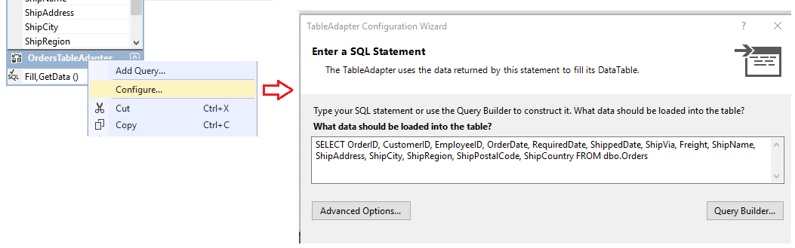

# Create and configure TableAdapters
[!INCLUDE[vs2017banner](../includes/vs2017banner.md)]

TableAdapters provide communication between your application and a database. They connect to the database, run queries or stored procedures, and either return a new data table or fill an existing <xref:System.Data.DataTable> with the returned data. TableAdapters can also send updated data from your application back to the database.

 TableAdapters are created for you when you perform one of the following actions:

- Run the [Data Source Configuration Wizard](https://msdn.microsoft.com/library/c4df7de5-5da0-4064-940c-761dd6d9e28f) and select either the **Database** or **Web Service** data source type.

- Drag database objects from [Server Explorer](https://msdn.microsoft.com/library/4ea29b3b-bbb2-45e4-9082-eaf635c41c4d) into the **Dataset Designer**.

  You can create a new TableAdapter and configure it with a data source by dragging a TableAdapter from the Toolbox to an empty region in the **Dataset Designer** surface.

  For an introduction to TableAdapters, see [Fill datasets by using TableAdapters](../data-tools/fill-datasets-by-using-tableadapters.md).

  [!INCLUDE[note_settings_general](../includes/note-settings-general-md.md)]

## Use the TableAdapter Configuration Wizard
 Run the **TableAdapter Configuration Wizard** to create or edit TableAdapters and their associated DataTables. You can configure an existing TableAdapter by right-clicking on it in the **Dataset Designer**.

 

 If you drag a new TableAdapter from the Toolbox when the **Dataset Designer** is in focus, the wizard  prompts you to specify which data source the TableAdapter should connect to, and what kind of commands it should use to communicate with the database, SQL statements, or stored procedures. You won't see this if you are configuring a TableAdapter that is already associated with a data source.

- Using the **Create methods to send updates directly to the database** option is equivalent to setting the `GenerateDBDirectMethods` property to true. The option is unavailable when the original SQL statement does not provide enough information or the query is not an updateable query. This situation can occur, for example, in **JOIN** queries and queries that return a single (scalar) value.

- You have the option to create a new stored procedure  in the underlying database if you have the correct permissions for the database. If you don't have these permissions,  this won't be an option.

- You can also  choose to run  existing stored procedures for the **SELECT**, **INSERT**, **UPDATE**, and **DELETE** commands of the TableAdapter. The stored procedure that's assigned to the **Update** command, for example, is run when the `TableAdapter.Update()` method is called.

     Map parameters from the selected stored procedure to the corresponding columns in the data table. For example, if your stored procedure accepts a parameter named `@CompanyName` that it passes to the `CompanyName` column in the table, set the **Source Column** of the `@CompanyName` parameter to `CompanyName`.

    > [!NOTE]
    > The stored procedure that's assigned to the SELECT command is run by calling the method of the TableAdapter that you name in the next step of the wizard. The default method is `Fill`, so the code that's typically used to run the SELECT procedure is `TableAdapter.Fill(tableName)`. If you change the default name from `Fill`, substitute `Fill` with the name you assign,  and replace "TableAdapter" with the actual name of the TableAdapter (for example, `CustomersTableAdapter`).

- The **Advanced Options** in the wizard enable you to generate INSERT, UPDATE, and DELETE statements based on the SELECT statement that's defined on the **Generate SQL statements** page. Use optimistic concurrency, and specify whether to refresh the data table after INSERT and UPDATE statements are run.

## Configure a TableAdapter's Fill method
 Sometimes you might want to change the schema of the TableAdapter's table. To do this, you modify the  TableAdapter's primary `Fill` method. TableAdapters are created with a primary `Fill` method that defines the schema of the associated data table. The primary `Fill` method is based on the query or stored procedure you entered when you originally configured the TableAdapter. It's the first (topmost) method under the data table in the DataSet Designer.

 

 Any changes that you make to the TableAdapter's main `Fill` method are reflected in the schema of the associated data table. For example, removing a column from the query in the main `Fill` method also removes the column from the associated data table. Additionally, removing the column from the main `Fill` method removes the column from any additional queries for that TableAdapter.

 You can use the TableAdapter Query Configuration Wizard to create and edit additional queries for the TableAdapter. These additional queries must conform to the table schema, unless they return a scalar value.  The additional queries have a names that you specify (for example, `CustomersTableAdapter.FillByCity(NorthwindDataSet.Customers, "Seattle")`.)

#### To start the TableAdapter Query Configuration Wizard with a new query

1. Open your dataset in the **Dataset Designer**.

2. If you are creating a new query, drag a **Query** object from the **DataSet** tab of the **Toolbox** onto a <xref:System.Data.DataTable>, or select **Add Query** from the TableAdapter's shortcut menu. You can also drag a **Query** object onto an empty area of the **Dataset Designer**, which creates a TableAdapter without an associated <xref:System.Data.DataTable>. These queries can only return single (scalar) values, or run UPDATE, INSERT, or DELETE commands against the database.

3. On the **Choose Your Data Connection** screen, select or create the connection that the query will use.

    > [!NOTE]
    > This screen only appears when the designer can't determine the proper connection to use, or when no connections are available.

4. On the **Choose a Command Type** screen, select from the following methods of fetching data from the database:

    - **Use SQL statements** enables you to type a SQL statement to select the data from your database.

    - **Create new stored procedure** enables you to have the wizard create a new stored procedure (in the database) based on the specified SELECT statement.

    - **Use existing stored procedures** enables you to run an existing stored procedure when running the query.

#### To start the TableAdapter Query Configuration wizard on an existing query

- If you are editing an existing TableAdapter query, right-click the query, and then choose **Configure** from the shortcut menu.

    > [!NOTE]
    > Right-clicking the main query of a TableAdapter reconfigures the TableAdapter and <xref:System.Data.DataTable> schema. Right-clicking an additional query on a TableAdapter, however,  configures the selected query only. The **TableAdapter Configuration Wizard** reconfigures the TableAdapter definition, while the TableAdapter Query Configuration Wizard reconfigures the selected query only.

#### To add a global  query to a TableAdapter

- *Global queries* are SQL queries that return either a single (scalar) value or no value. Typically, global functions perform database operations such as inserts, updates, deletes. They also aggregate information,  such as a count of customers in a table or the total charges for all items in a particular order.

     You add global queries by dragging a **Query** object from the **DataSet** tab of the **Toolbox** onto an empty area of the **Dataset Designer**.

- Provide a query that performs the desired task, for example, `SELECT COUNT(*) AS CustomerCount FROM Customers`.

    > [!NOTE]
    > Dragging a **Query** object directly onto the **Dataset Designer** creates a method that returns only a scalar (single) value. While the query or stored procedure you select might return more than a single value, the method that's created by the wizard  only returns a single value. For example, the query might return the first column of the first row of the returned data.

## See Also
 [Fill datasets by using TableAdapters](../data-tools/fill-datasets-by-using-tableadapters.md)
