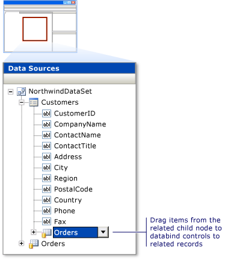

# Display related data in WPF applications
[!INCLUDE[vs2017banner](../includes/vs2017banner.md)]

In some applications, you might want to work with data that comes from multiple tables or entities that are related to each other in a parent-child relationship. For example, you might want to display a grid that displays customers from a `Customers` table. When the user selects a specific customer, another grid displays the orders for that customer from a related `Orders` table.

 You can create data-bound controls that display related data by dragging items from the **Data Sources** window to the WPF Designer.

## To create controls that display related records

1. On the **Data** menu, click **Show Data Sources** to open the **Data Sources** window.

2. Click **Add New Data Source**, and complete the **Data Source Configuration** wizard.

3. Open the WPF designer, and make sure that the designer contains a container that is a valid drop target for the items in the **Data Sources** window.

     For more information about valid drop targets, see [Bind WPF controls to data in Visual Studio](../data-tools/bind-wpf-controls-to-data-in-visual-studio1.md).

4. In the **Data Sources** window, expand the node that represents the parent table or object in the relationship. The parent table or object is on the "one" side of a one-to-many relationship.

5. Drag the parent node (or any individual items in the parent node) from the **Data Sources** window onto a valid drop target in the designer.

     Visual Studio generates XAML that creates new data-bound controls for each item that you drag. The XAML also adds a new <xref:System.Windows.Data.CollectionViewSource> for the parent table or object to the resources of the drop target. For some data sources, Visual Studio also generates code to load the data into the parent table or object. For more information, see [Bind WPF controls to data in Visual Studio](../data-tools/bind-wpf-controls-to-data-in-visual-studio1.md).

6. In the **Data Sources** window, locate the related child table or object. Related child tables and objects appear as expandable nodes at the bottom of the parent node's list of data.

7. Drag the child node (or any individual items in the child node) from the **Data Sources** window onto a valid drop target in the designer.

     Visual Studio generates XAML that creates new data-bound controls for each of the items you drag. The XAML also adds a new <xref:System.Windows.Data.CollectionViewSource> for the child table or object to the resources of the drop target. This new <xref:System.Windows.Data.CollectionViewSource> is bound to the property of the parent table or object that you just dragged to the designer. For some data sources, Visual Studio also generates code to load the data into the child table or object.

     The following figure demonstrates the related **Orders** table of the **Customers** table in a dataset in the **Data Sources** window.

     

## See Also
 [Bind WPF controls to data in Visual Studio](../data-tools/bind-wpf-controls-to-data-in-visual-studio1.md)
 [Bind WPF controls to data in Visual Studio](../data-tools/bind-wpf-controls-to-data-in-visual-studio2.md)
 [Create lookup tables in WPF applications](../data-tools/create-lookup-tables-in-wpf-applications.md)
 [Walkthrough: Displaying Related Data in a WPF Application](../data-tools/walkthrough-displaying-related-data-in-a-wpf-application.md)
