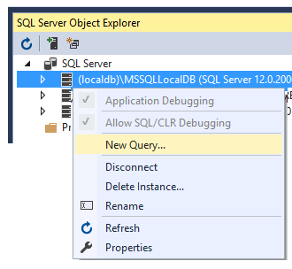
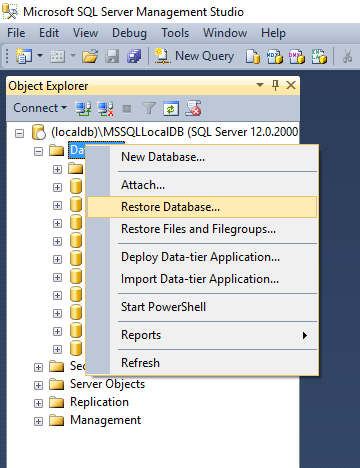

# Install SQL Server sample databases
[!INCLUDE[vs2017banner](../includes/vs2017banner.md)]

Sample databases are useful for experimenting with SQL and LINQ queries, databinding,  Entity Framework modeling, and so on.  Each database product has its own sample databases. Northwind and AdventureWorks are two popular SQL Server sample databases.

 **AdventureWorks** is the current sample database provided for SQL Server products. You can download it as an .mdf file from the [AdventureWorks page on Codeplex](https://archive.codeplex.com/?p=msftdbprodsamples). There are regular and lightweight (LT) versions of the database available here. For most scenarios, the LT version is preferred because it is less complex.

 **Northwind** is a relatively simple SQL Server database that has been used for many years. You can download it as a .bak file from the [Northwind database page on CodePlex](https://northwinddatabase.codeplex.com/). To avoid permissions issues, unzip the file into a new folder that is not under your user folder.

#### To restore a database from a .bak file in Visual Studio

1. When you back up a Microsoft SQL Server database, the result is a .bak file. To make the .bak file usable again as a database file, it must be *restored*. On the main menu, select **View** > **SQL Server Object Explorer**. If you don't see it, you might need to install it. Go to **Control Panel** > **Programs and Features**, find Microsoft Visual Studio 2015, and click the **Change** button. When the list of installed components appears in the installer window, select the **SQL Server Object Explorer** check box and then continue with the installation.

2. In SQL Server Object Explorer, right-click any SQL Server database engine(for example, localdb), and select**New Query**.

     

3. First, you need the logical names of the database and log files inside the .bak file. To get it, enter this query into the SQL Query Editor and then select the green **Run** button at the top of the window. Modify the file path if necessary to point to the .bak file.

    ```
    RESTORE FILELISTONLY
    FROM DISK = 'C:\nw\northwind.bak'
    GO
    ```

     Write down the logical names that appear in the results window.  For the Northwind database, the two logical names are Northwind and Northwind_log.

4. Now run this query to create the database. Substitute your own source and destination paths, logical database names, and physical file names for Northwind as appropriate. Keep the .mdf and .ldf file extensions.

    ```
    RESTORE DATABASE Northwind
    FROM DISK = 'c:\nw\northwind.bak'
    WITH MOVE 'Northwind' TO 'c:\nw\northwind.mdf',
    MOVE 'Northwind_log' TO 'c:\nw\northwind.ldf'
    ```

5. In SQL Server Object Explorer, right-click on the **Databases** node, and you should see the Northwind database node. If not, then right-click on Databases and select **Add New Database**. Enter the name and the location of the .mdf file that you just created.

6. The database is now ready to use as a data source in Visual Studio.

#### To restore a database from a .bak file in SQL Server Management Studio

1. Download SQL Server Management Studio from the download site.

2. In the SSMS **Object Explorer** window, right-click the **Databases** node, select**Restore Database**, and provide the location of the .bak file.

     
