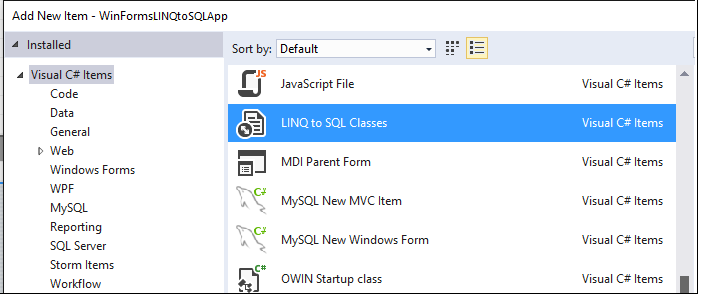
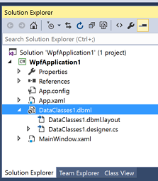
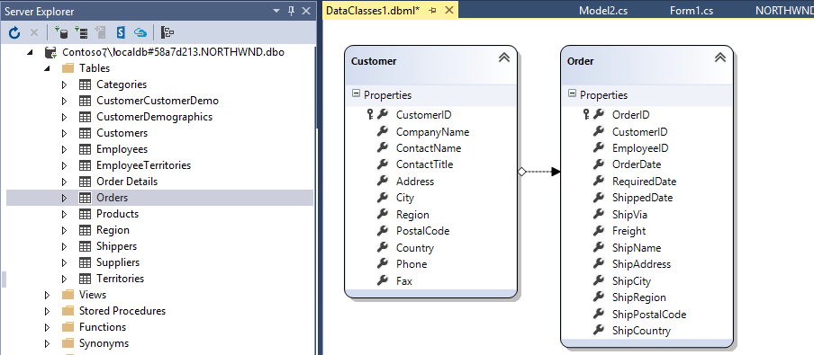

# LINQ to SQL Tools in Visual Studio
[!INCLUDE[vs2017banner](../includes/vs2017banner.md)]

LINQ to SQL was the first object-relational mapping technology released by Microsoft. It works well in basic scenarios and continues to be supported in Visual Studio, but it is no longer under active development. Use LINQ to SQL when maintaining a legacy application that is already using it, or in simple applications that use SQL Server and do not require multi-table mapping. In general, new applications should use the Entity Framework when an object-relational mapper layer is required.

 In Visual Studio, you create LINQ to SQL classes that represent SQL tables by using the [!INCLUDE[vs_ordesigner_short](../includes/vs-ordesigner-short-md.md)].

 The [!INCLUDE[vs_ordesigner_short](../includes/vs-ordesigner-short-md.md)] has two distinct areas on its design surface: the entities pane on the left, and the methods pane on the right. The entities pane is the main design surface that displays the entity classes, associations, and inheritance hierarchies. The methods pane is the design surface that displays the <xref:System.Data.Linq.DataContext> methods that are mapped to stored procedures and functions.

 The [!INCLUDE[vs_ordesigner_long](../includes/vs-ordesigner-long-md.md)] ([!INCLUDE[vs_ordesigner_short](../includes/vs-ordesigner-short-md.md)]) provides a visual design surface for creating [LINQ to SQL](https://msdn.microsoft.com/library/73d13345-eece-471a-af40-4cc7a2f11655) entity classes and associations (relationships) that are based on objects in a database. In other words, the [!INCLUDE[vs_ordesigner_short](../includes/vs-ordesigner-short-md.md)] is used to create an object model in an application that maps to objects in a database. It also generates a strongly-typed <xref:System.Data.Linq.DataContext> that is used to send and receive data between the entity classes and the database. The [!INCLUDE[vs_ordesigner_short](../includes/vs-ordesigner-short-md.md)] also provides functionality to map stored procedures and functions to <xref:System.Data.Linq.DataContext> methods for returning data and populating entity classes. Finally, the [!INCLUDE[vs_ordesigner_short](../includes/vs-ordesigner-short-md.md)] provides the ability to design inheritance relationships between entity classes.

## Opening the O/R Designer
 To add a LINQ to SQL entity model to your project, choose **Project &#124; Add New Item** and then choose  **LINQ to SQL Classes** from the list of project items:

 

 Visual Studio creates a .dbml file and adds it to your solution. This is the XML mapping file and its related code files.

 

 When you select the .dbml file, Visual Studio shows the O/R designer surface that enables you to visually create the model. The following illustration shows the designer after the Northwind Customers and Orders tables have been dragged from Server Explorer. Note the relationship between the tables.

 

> [!IMPORTANT]
> The [!INCLUDE[vs_ordesigner_short](../includes/vs-ordesigner-short-md.md)] is a simple object relational mapper because it supports only 1:1 mapping relationships. In other words, an entity class can have only a 1:1 mapping relationship with a database table or view. Complex mapping, such as mapping an entity class to a joined table, is not supported; use the Entity Framework for complex mapping. Additionally, the designer is a one-way code generator. This means that only changes that you make to the designer surface are reflected in the code file. Manual changes to the code file are not reflected in the [!INCLUDE[vs_ordesigner_short](../includes/vs-ordesigner-short-md.md)]. Any changes that you make manually in the code file are overwritten when the designer is saved and code is regenerated. For information about how to add user code and extend the classes generated by the [!INCLUDE[vs_ordesigner_short](../includes/vs-ordesigner-short-md.md)], see [How to: Extend Code Generated by the O/R Designer](../data-tools/how-to-extend-code-generated-by-the-o-r-designer.md).

## Creating and Configuring the DataContext
 After you add a **LINQ to SQL Classes** item to a project and open the [!INCLUDE[vs_ordesigner_short](../includes/vs-ordesigner-short-md.md)], the empty design surface represents an empty <xref:System.Data.Linq.DataContext> ready to be configured. the <xref:System.Data.Linq.DataContext> is configured with connection information provided by the first item that is dragged onto the design surface.. Therefore, the <xref:System.Data.Linq.DataContext> is configured by using connection information from the first item dropped onto the design surface. For more information about the <xref:System.Data.Linq.DataContext> class see, [DataContext Methods (O/R Designer)](../data-tools/datacontext-methods-o-r-designer.md).

## Creating Entity Classes That Map to Database Tables and Views
 You can create entity classes mapped to tables and views by dragging database tables and views from **Server Explorer**/**Database Explorer** onto the [!INCLUDE[vs_ordesigner_short](../includes/vs-ordesigner-short-md.md)]. As indicated in the previous section the <xref:System.Data.Linq.DataContext> is configured with connection information provided by the first item that is dragged onto the design surface. If a subsequent item that uses a different connection is added to the [!INCLUDE[vs_ordesigner_short](../includes/vs-ordesigner-short-md.md)], you can change the connection for the <xref:System.Data.Linq.DataContext>. For more information, see [How to: Create LINQ to SQL classes mapped to tables and views (O/R Designer)](../data-tools/how-to-create-linq-to-sql-classes-mapped-to-tables-and-views-o-r-designer.md).

## Creating DataContext Methods That Call Stored Procedures and Functions
 You can create <xref:System.Data.Linq.DataContext> methods that call (are mapped to) stored procedures and functions by dragging them from **Server Explorer**/**Database Explorer** onto the [!INCLUDE[vs_ordesigner_short](../includes/vs-ordesigner-short-md.md)]. Stored procedures and functions are added to the [!INCLUDE[vs_ordesigner_short](../includes/vs-ordesigner-short-md.md)] as methods of the <xref:System.Data.Linq.DataContext>.

> [!NOTE]
> When you drag stored procedures and functions from **Server Explorer**/**Database Explorer** onto the [!INCLUDE[vs_ordesigner_short](../includes/vs-ordesigner-short-md.md)], the return type of the generated <xref:System.Data.Linq.DataContext> method differs depending on where you drop the item. For more information, see [DataContext Methods (O/R Designer)](../data-tools/datacontext-methods-o-r-designer.md).

## Configuring a DataContext to Use Stored Procedures to Save Data Between Entity Classes and a Database
 As stated earlier, you can create <xref:System.Data.Linq.DataContext> methods that call stored procedures and functions. Additionally, you can also assign stored procedures that can be used for the default [!INCLUDE[vbtecdlinq](../includes/vbtecdlinq-md.md)] runtime behavior that performs Inserts, Updates, and Deletes. For more information, see [How to: Assign stored procedures to perform updates, inserts, and deletes (O/R Designer)](../data-tools/how-to-assign-stored-procedures-to-perform-updates-inserts-and-deletes-o-r-designer.md).

## Inheritance and the O/R Designer
 Like other objects, [!INCLUDE[vbtecdlinq](../includes/vbtecdlinq-md.md)] classes can use inheritance and be derived from other classes. In a database, inheritance relationships are created in several ways. The [!INCLUDE[vs_ordesigner_short](../includes/vs-ordesigner-short-md.md)] supports the concept of single-table inheritance as it is often implemented in relational systems. For more information, see [How to: Configure inheritance by using the O/R Designer](../data-tools/how-to-configure-inheritance-by-using-the-o-r-designer.md).

## LINQ to SQL Queries
 The entity classes created by the [!INCLUDE[vs_ordesigner_short](../includes/vs-ordesigner-short-md.md)] are designed for use with [LINQ (Language-Integrated Query)](https://msdn.microsoft.com/library/a73c4aec-5d15-4e98-b962-1274021ea93d). For more information, see [How to: Query for Information](https://msdn.microsoft.com/library/e538d288-2070-40ca-9da6-4fbc68cd6ad0).

## Separating the Generated DataContext and Entity Class Code into Different Namespaces
 The [!INCLUDE[vs_ordesigner_short](../includes/vs-ordesigner-short-md.md)] provides the **Context Namespace** and **Entity Namespace** properties on the <xref:System.Data.Linq.DataContext>. These properties determine what namespace the <xref:System.Data.Linq.DataContext> and entity class code is generated into. By default, these properties are empty and the <xref:System.Data.Linq.DataContext> and entity classes are generated into the application's namespace. To generate the code into a namespace other than the application's namespace, enter a value into the **Context Namespace** and/or **Entity Namespace** properties.

## In this section
 [DataContext Methods (O/R Designer)](../data-tools/datacontext-methods-o-r-designer.md)
 Explains what <xref:System.Data.Linq.DataContext> methods are and how to create them.

 [Data class inheritance (O/R Designer)](../data-tools/data-class-inheritance-o-r-designer.md)
 Describes the concept of single-table inheritance and how it is implemented in the [!INCLUDE[vs_ordesigner_short](../includes/vs-ordesigner-short-md.md)].

 [How to: Create LINQ to SQL classes mapped to tables and views (O/R Designer)](../data-tools/how-to-create-linq-to-sql-classes-mapped-to-tables-and-views-o-r-designer.md)
 Describes how to create entity classes that are mapped to tables and views in a database.

 [How to: Create an association (relationship) between LINQ to SQL classes (O/R Designer)](../data-tools/how-to-create-an-association-relationship-between-linq-to-sql-classes-o-r-designer.md)
 Describes how to create a relationship between [!INCLUDE[vbtecdlinq](../includes/vbtecdlinq-md.md)] entity classes.

 [How to: Create DataContext methods mapped to stored procedures and functions (O/R Designer)](../data-tools/how-to-create-datacontext-methods-mapped-to-stored-procedures-and-functions-o-r-designer.md)
 Describes how to create <xref:System.Data.Linq.DataContext> methods that run stored procedures or functions when they are called.

 [How to: Assign stored procedures to perform updates, inserts, and deletes (O/R Designer)](../data-tools/how-to-assign-stored-procedures-to-perform-updates-inserts-and-deletes-o-r-designer.md)
 Describes how to configure a <xref:System.Data.Linq.DataContext> to use stored procedures when saving data from entity classes back to a database.

 [How to: Change the return type of a DataContext method (O/R Designer)](../data-tools/how-to-change-the-return-type-of-a-datacontext-method-o-r-designer.md)
 Describes how to set the return type of a <xref:System.Data.Linq.DataContext> method to be the type of an entity class or an auto-generated type created by the O/R Designer.

 [How to: Add validation to entity classes](../data-tools/how-to-add-validation-to-entity-classes.md)
 Describes how to generate partial methods that enable the addition of code during property changes and entity class updates.

 [How to: Turn pluralization on and off (O/R Designer)](../data-tools/how-to-turn-pluralization-on-and-off-o-r-designer.md)
 Describes how to turn on and off the automatic renaming of classes that are added to the [!INCLUDE[vs_ordesigner_short](../includes/vs-ordesigner-short-md.md)].

 [How to: Configure inheritance by using the O/R Designer](../data-tools/how-to-configure-inheritance-by-using-the-o-r-designer.md)
 Describes how to configure entity classes using single-table inheritance with the [!INCLUDE[vs_ordesigner_short](../includes/vs-ordesigner-short-md.md)].

 [How to: Extend Code Generated by the O/R Designer](../data-tools/how-to-extend-code-generated-by-the-o-r-designer.md)
 Describes how and where to add code that will not be overwritten when changes to objects on the O/R Designer regenerate code.

 [Walkthrough: Creating LINQ to SQL Classes by Using Single-Table Inheritance (O/R Designer)](../data-tools/walkthrough-creating-linq-to-sql-classes-by-using-single-table-inheritance-o-r-designer.md)
 Provides step-by-step instructions for configuring entity classes using single-table inheritance with the [!INCLUDE[vs_ordesigner_short](../includes/vs-ordesigner-short-md.md)].

 [Walkthrough: Customizing the insert, update, and delete behavior of entity classes](../data-tools/walkthrough-customizing-the-insert-update-and-delete-behavior-of-entity-classes.md)
 Provides step-by-step instructions for configuring a <xref:System.Data.Linq.DataContext> to use stored procedures when saving data from entity classes back to a database.

## Reference content
 <xref:System.Linq>

 <xref:System.Data.Linq>

## See Also
 [Visual Studio data tools for .NET](../data-tools/visual-studio-data-tools-for-dotnet.md)
 [Frequently Asked Questions](https://msdn.microsoft.com/library/252ed666-0679-4eea-b71b-2f14117ef443)
 [LINQ to SQL](https://msdn.microsoft.com/library/73d13345-eece-471a-af40-4cc7a2f11655)
 [Accessing data in Visual Studio](../data-tools/accessing-data-in-visual-studio.md)
