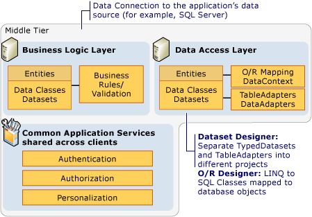
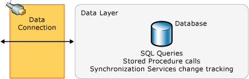

# N-Tier Data Applications Overview
[!INCLUDE[vs2017banner](../includes/vs2017banner.md)]

N-tier* data applications are data applications that are separated into multiple *tiers*. Also called "distributed applications" and "multitier applications," n-tier applications separate processing into discrete tiers that are distributed between the client and the server. When you develop applications that access data, you should have a clear separation between the various tiers that make up the application.

 A typical n-tier application includes a presentation tier, a middle tier, and a data tier. The easiest way to separate the various tiers in an n-tier application is to create discrete projects for each tier that you want to include in your application. For example, the presentation tier might be a Windows Forms application, whereas the data access logic might be a class library located in the middle tier. Additionally, the presentation layer might communicate with the data access logic in the middle tier through a service such as a service. Separating application components into separate tiers increases the maintainability and scalability of the application. It does this by enabling easier adoption of new technologies that can be applied to a single tier without the requirement to redesign the whole solution. In addition, n-tier applications typically store sensitive information in the middle-tier, which maintains isolation from the presentation tier.

 Visual Studio contains several features to help developers create n-tier applications:

- The DataSet Designer provides a **DataSet Project** property that enables you to separate the dataset (data entity layer) and `TableAdapter`s (data access layer) into discrete projects.

- The [LINQ to SQL Tools in Visual Studio](../data-tools/linq-to-sql-tools-in-visual-studio2.md) provides settings to generate the DataContext and data classes into separate namespaces. This enables logical separation of the data access and data entity tiers.

- [LINQ to SQL](https://msdn.microsoft.com/library/73d13345-eece-471a-af40-4cc7a2f11655) provides the <xref:System.Data.Linq.Table%601.Attach%2A> method that enables you to bring together the DataContext from different tiers in an application. For more information, see [N-Tier and Remote Applications with LINQ to SQL](https://msdn.microsoft.com/library/854a1cdd-53cb-45f5-83ca-63962a9b3598).

## Presentation Tier
 The *presentation tier* is the tier in which users interact with an application. It often contains additional application logic also. Typical presentation tier components include the following:

- Data binding components, such as the <xref:System.Windows.Forms.BindingSource> and <xref:System.Windows.Forms.BindingNavigator>.

- Object representations of data, such as [LINQ to SQL](https://msdn.microsoft.com/library/73d13345-eece-471a-af40-4cc7a2f11655) entity classes for use in the presentation tier.

  The presentation tier typically accesses the middle tier by using a service reference (for example, a [Windows Communication Foundation Services and WCF Data Services in Visual Studio](../data-tools/windows-communication-foundation-services-and-wcf-data-services-in-visual-studio.md) application). The presentation tier does not directly access the data tier. The presentation tier communicates with the data tier by way of the data access component in the middle tier.

## Middle Tier
 The *middle tier* is the layer that the presentation tier and the data tier use to communicate with each other. Typical middle tier components include the following:

- Business logic, such as business rules and data validation.

- Data access components and logic, such as the following:

  - [TableAdapters](https://msdn.microsoft.com/library/09416de9-134c-4dc7-8262-6c8d81e3f364) and [DataAdapters and DataReaders](https://msdn.microsoft.com/library/cc952ca2-ec19-46ab-9189-15174b52cb74).

  - Object representations of data, such as [LINQ to SQL](https://msdn.microsoft.com/library/73d13345-eece-471a-af40-4cc7a2f11655) entity classes.

  - Common application services, such as authentication, authorization, and personalization.

  The following illustration shows features and technologies that are available in Visual Studio and where they might fit in to the middle tier of an n-tier application.

  
  Middle tier

  The middle tier typically connects to the data tier by using a data connection. This data connection is typically stored in the data access component.

## Data Tier
 The *data tier* is basically the server that stores an application's data (for example, a server running [!INCLUDE[ssNoVersion](../includes/ssnoversion-md.md)]).

 The following illustration shows features and technologies that are available in Visual Studio and where they might fit in to the data tier of an n-tier application.

 
Data tier

 The data tier cannot be accessed directly from the client in the presentation tier. Instead, the data access component in the middle tier is used for communication between the presentation and data tiers.

## Help for N-Tier Development
 The following topics provide information about working with n-tier applications:

 [Separate datasets and TableAdapters into different projects](../data-tools/separate-datasets-and-tableadapters-into-different-projects.md)

 [Walkthrough: Creating an N-Tier Data Application](../data-tools/walkthrough-creating-an-n-tier-data-application.md)

 [Walkthrough: Adding Validation to an N-Tier Data Application](https://msdn.microsoft.com/library/b35d072c-31f0-49ba-a225-69177592c265)

 [N-Tier and Remote Applications with LINQ to SQL](https://msdn.microsoft.com/library/854a1cdd-53cb-45f5-83ca-63962a9b3598)

## See Also
 <xref:System.Data.Linq.ITable.Attach%2A>
 [Walkthrough: Creating an N-Tier Data Application](../data-tools/walkthrough-creating-an-n-tier-data-application.md)
 [Hierarchical update](../data-tools/hierarchical-update.md)
 [Dataset tools in Visual Studio](../data-tools/dataset-tools-in-visual-studio.md)
 [Accessing data in Visual Studio](../data-tools/accessing-data-in-visual-studio.md)
