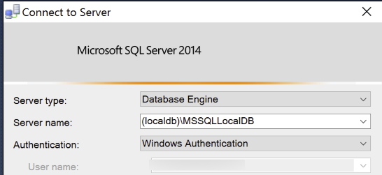

# Visual Studio data tools for C++
[!INCLUDE[vs2017banner](../includes/vs2017banner.md)]

Native C++ can often provide the fastest performance when you are accessing data sources. However, data tooling for C++ applications in Visual Studio is not as rich as it is for .NET applications. For example, the data sources windows cannot be used to drag and drop data sources onto a C++ design surface. If you need an object-relational layer, you will have to write your own, or use a third-party product.  The same is true for data-binding functionality, although applications that use the Microsoft Foundation Class library can use some database classes, together with documents and views, to store data in memory and display it to the user. For more information, see [Data Access in Visual C++](https://msdn.microsoft.com/library/7wtdsdkh.aspx) .

 To connect to SQL databases, native C++ applications can use the ODBC and OLE DB drivers and the ADO provider that are included with Windows.     These can connect to any database that supports those interfaces. The ODBC driver is the standard. OLE DB is provided for backward compatibility. For more information on those data technologies, see [Windows Data Access Components](https://msdn.microsoft.com/library/windows/desktop/aa968814\(v=vs.85\).aspx)

 To take advantage of custom functionality in SQL Server 2005 and later, use the [SQL Server Native Client](https://msdn.microsoft.com/sqlserver/aa937733). The native client also contains the SQL Server ODBC driver and the SQL Server OLE DB provider in one native dynamic link library (DLL). These support applications using native-code APIs (ODBC, OLE DB and ADO) to Microsoft SQL Server.  SQL Server Native Client installs with SQL Server Data Tools. The programming guide is here: [SQL Server Native Client Programming](https://msdn.microsoft.com/library/ms130892.aspx).

## To connect to localDB through ODBC and SQL Native Client from a C++ application

1. Install SQL Server Data Tools.

2. If you need a sample SQL database to connect to, download the Northwind database and unzip it to a new location.

3. Use SQL Server Management Studio to attach the unzipped Northwind.mdf file to localDB. When SQL Server Management Studio starts, connect to (localdb)\MSSQLLocalDB.

    

    Then right-click on the localdb node in the left pane, and choose **Attach**.

    

4. Download the ODBC Windows SDK Sample, and unzip it to a new location. This sample shows the basic ODBC commands that are used to connect to a database and issue queries and commands. You can learn more about those functions in the [Microsoft Open Database Connectivity (ODBC)](https://msdn.microsoft.com/library/windows/desktop/ms710252\(v=vs.85\).aspx). When you first load the solution (it's in the C++ folder), Visual Studio will offer to upgrade the solution to the current version of Visual Studio. Click **Yes**.

5. To use the native client, you need its header file and lib file. These files contain functions and definitions specific to SQL Server, beyond the ODBC functions defined in sql.h. In **Project** > **Properties** > **VC++ Directories**, add the following include directory:

   **\<system drive>:\Program Files\Microsoft SQL Server\110\SDK\Include**     And this library directory:

   **c:\Program Files\Microsoft SQL Server\110\SDK\Lib**

6. Add these lines in odbcsql.cpp. The #define prevents irrelevant OLE DB definitions from being compiled.

   ```
   #define _SQLNCLI_ODBC_
   #include <sqlncli.h>
   ```

    Note that the sample does not actually use any of the native client functionality, so the preceding steps are not necessary for it to compile and run. But the project is now configured for you to use this functionality. For more information, see [SQL Server Native Client Programming](https://msdn.microsoft.com/library/ms130892\(v=sql.130\).aspx).

7. Specify which driver to use in the ODBC subsystem. The sample passes the DRIVER connection string attribute in as a command line argument. In **Project** > **Properties** > **Debugging**, add this command argument:

   ```
   DRIVER="SQL Server Native Client 11.0"
   ```

8. Press F5 to build and run the application. You should see a dialog box from the driver that prompts you to enter a database. Enter `(localdb)\MSSQLLocalDB`, and check **Use Trusted Connection**. Press **OK**. You should see a console with messages that indicate a successful connection. You should also see a command prompt where you can type in a SQL statement. The following screen shows an example query and the results:

    

## See Also
 [Accessing data in Visual Studio](../data-tools/accessing-data-in-visual-studio.md)
