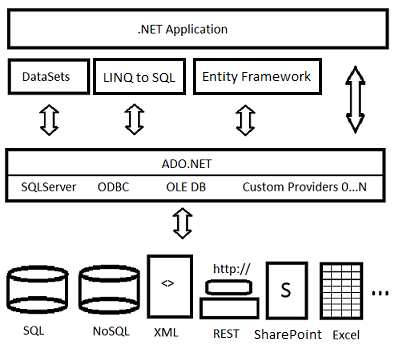

# Visual Studio data tools for .NET
[!INCLUDE[vs2017banner](../includes/vs2017banner.md)]

Visual Studio and the .NET Framework together provide extensive API and tooling support for connecting to databases, modeling data in memory, and displaying the data in the user interface.  The .NET Framework classes that provide data-access functionality are known as [ADO.NET](https://msdn.microsoft.com/library/e80y5yhx\(v=vs.110\).aspx). ADO.NET, along with the data tooling in Visual Studio, was originally designed primarily to support relational databases and XML. These days,  many NoSQL database vendors, or third parties, offer ADO.NET providers.

 Visual Studio 2015 Update 2 includes the latest updates of            [SQL Server Data Tools](https://msdn.microsoft.com/library/hh272686\(v=vs.103\).aspx), which enable support for the latest features in Azure [SQL Database](https://azure.microsoft.com/services/sql-database/) and [SQL Server 2016](https://www.microsoft.com/sql-server/sql-server-2016). [.NET Core](https://www.dotnetfoundation.org/projects?searchquery=dotnet+core&type=project) supports ADO.NET, except for datasets and related types. If you are targeting .NET Core and require an object-relational mapping (ORM) layer, use [Entity Framework Core](https://msdn.microsoft.com/data/ef.aspx).

 The following diagram shows a simplified view of  the basic architecture:

 

 The typical workflow is this:

1. Install a development or test database on your local machine. See [Installing database systems, tools, and samples](../data-tools/installing-database-systems-tools-and-samples.md). If you are using an Azure data service, this step is not necessary.

2. Test the connection to the database (or service or local file) in Visual Studio. See [Add new connections](../data-tools/add-new-connections.md).

3. (Optional) Use the tools to generate and configure a new model. Models based on Entity Framework are the default recommendation for new applications. The model, whichever one you use,  is the data source that the application interacts with. The model sits logically between the database or service and the application.  See [Add new data sources](../data-tools/add-new-data-sources.md).

4. Drag the data source from the **Data Sources** window onto a Windows Forms, ASP.NET, or Windows Presentation Foundation design surface to generate the data-binding code that will display the data to the user in the way that you specify. See [Bind controls to data in Visual Studio](../data-tools/bind-controls-to-data-in-visual-studio.md).

5. Add custom code for things like business rules, search, and data validation, or to take advantage of custom functionality that the underlying database exposes.

   You can skip step 3 and program a .NET application to issue commands directly to a database, rather than using a model. In this case, you will find the relevant documentation here: [ADO.NET](https://msdn.microsoft.com/library/e80y5yhx\(v=vs.110\).aspx). Note that you still can use the   Data Source Configuration Wizard and designers to generate data-binding code when you populate your own objects in memory and then data-bind UI controls to those objects.

## In this section

- [Create a simple data application by using ADO.NET](../data-tools/create-a-simple-data-application-by-using-adonet.md)

- [Add new connections](../data-tools/add-new-connections.md)

- [Add new data sources](../data-tools/add-new-data-sources.md)

- [Entity Data Model Tools in Visual Studio](../data-tools/entity-data-model-tools-in-visual-studio.md)

- [Dataset tools in Visual Studio](../data-tools/dataset-tools-in-visual-studio.md)

- [LINQ to SQL Tools in Visual Studio](../data-tools/linq-to-sql-tools-in-visual-studio2.md)

- [Bind controls to data in Visual Studio](../data-tools/bind-controls-to-data-in-visual-studio.md)

- [Additional resources for troubleshooting data access errors](../data-tools/additional-resources-for-troubleshooting-data-access-errors.md)

- [Windows Communication Foundation Services and WCF Data Services in Visual Studio](../data-tools/windows-communication-foundation-services-and-wcf-data-services-in-visual-studio.md)

- [Creating and managing databases and data-tier applications in Visual Studio](../data-tools/creating-and-managing-databases-and-data-tier-applications-in-visual-studio.md)

- [Additional resources for troubleshooting data access errors](../data-tools/additional-resources-for-troubleshooting-data-access-errors.md)

## See Also
 [Accessing data in Visual Studio](../data-tools/accessing-data-in-visual-studio.md)
