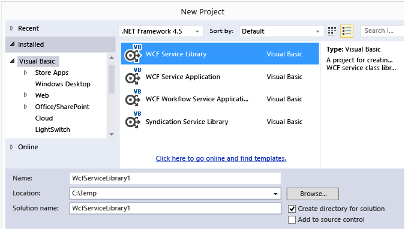
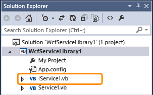
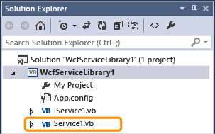
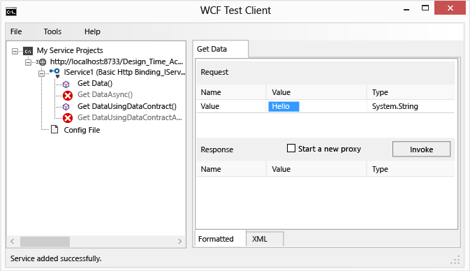
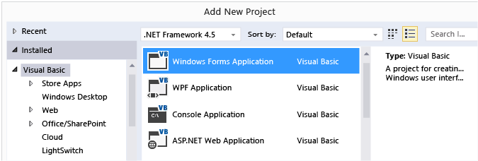
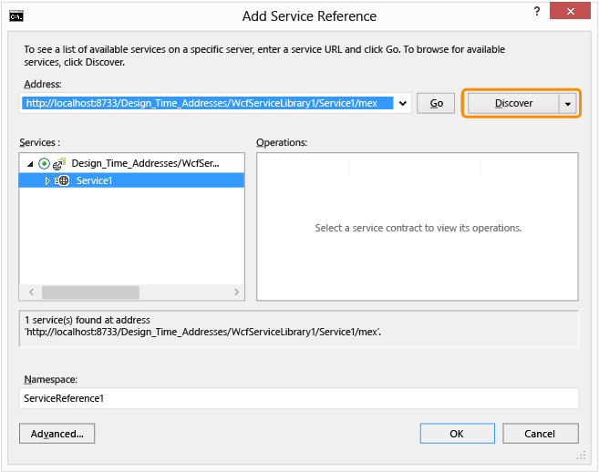
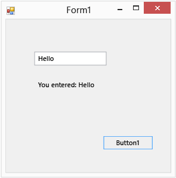

# Walkthrough: Creating a simple WCF Service in Windows Forms
[!INCLUDE[vs2017banner](../includes/vs2017banner.md)]

This walkthrough demonstrates how to create a simple [!INCLUDE[vsindigo](../includes/vsindigo-md.md)] service, test it, and then access it from a Windows Forms application.

 [!INCLUDE[note_settings_general](../includes/note-settings-general-md.md)]

## Creating the Service

#### To create a WCF service

1. On the **File** menu, point to **New** and then click **Project**.

2. In the **New Project** dialog box, expand the **Visual Basic** or **Visual C#** node and click **WCF**, followed by **WCF Service Library**. Click **OK** to open the project.

     

    > [!NOTE]
    > This creates a working service that can be tested and accessed. The following two steps demonstrate how you might modify the default method to use a different data type. In a real application, you would also add your own functions to the service.

3. 

     In **Solution Explorer**, double-click IService1.vb or IService1.cs and find the following line:

     [!code-csharp[WCFWalkthrough#4](../snippets/csharp/VS_Snippets_VBCSharp/wcfwalkthrough/cs/iservice1_2.cs#4)]
     [!code-vb[WCFWalkthrough#4](../snippets/visualbasic/VS_Snippets_VBCSharp/wcfwalkthrough/vb/iservice1_2.vb#4)]

     Change the type for the `value` parameter to `String`:

     [!code-csharp[WCFWalkthrough#1](../snippets/csharp/VS_Snippets_VBCSharp/wcfwalkthrough/cs/iservice1.cs#1)]
     [!code-vb[WCFWalkthrough#1](../snippets/visualbasic/VS_Snippets_VBCSharp/wcfwalkthrough/vb/iservice1.vb#1)]

     In the above code, note the `<OperationContract()>` or `[OperationContract]` attributes. These attributes are required for any method exposed by the service.

4. 

     In **Solution Explorer**, double-click Service1.vb or Service1.cs and find the following line:

     [!code-csharp[WCFWalkthrough#5](../snippets/csharp/VS_Snippets_VBCSharp/wcfwalkthrough/cs/service1_2.cs#5)]
     [!code-vb[WCFWalkthrough#5](../snippets/visualbasic/VS_Snippets_VBCSharp/wcfwalkthrough/vb/service1_2.vb#5)]

     Change the type for the value parameter to `String`:

     [!code-csharp[WCFWalkthrough#2](../snippets/csharp/VS_Snippets_VBCSharp/wcfwalkthrough/cs/service1.cs#2)]
     [!code-vb[WCFWalkthrough#2](../snippets/visualbasic/VS_Snippets_VBCSharp/wcfwalkthrough/vb/service1.vb#2)]

## Testing the Service

#### To test a WCF service

1. Press **F5** to run the service. A **WCF Test Client** form will be displayed and it will load the service.

2. In the **WCF Test Client** form, double-click the **GetData()** method under **IService1**. The **GetData** tab will be displayed.

     

3. In the **Request** box, select the **Value** field and type `Hello`.

     

4. Click the **Invoke** button. If a **Security Warning** dialog box is displayed, click **OK**. The result will be displayed in the **Response** box.

     

5. On the **File** menu, click **Exit** to close the test form.

## Accessing the Service

#### To reference a WCF service

1. On the **File** menu, point to **Add** and then click **New Project**.

2. In the **New Project** dialog box, expand the **Visual Basic** or **Visual C#** node and select **Windows**, and then select **Windows Forms Application**. Click **OK** to open the project.

     

3. Right-click **WindowsApplication1** and click **Add Service Reference**. The **Add Service Reference** dialog box will appear.

4. In the **Add Service Reference** dialog box, click **Discover**.

     

     **Service1** will be displayed in the **Services** pane.

5. Click **OK** to add the service reference.

#### To build a client application

1. In **Solution Explorer**, double-click **Form1.vb** or **Form1.cs** to open the Windows Forms Designer if it is not already open.

2. From the **Toolbox**, drag a `TextBox` control, a `Label` control, and a `Button` control onto the form.

     

3. Double-click the `Button`, and add the following code in the `Click` event handler:

     [!code-csharp[WCFWalkthrough#3](../snippets/csharp/VS_Snippets_VBCSharp/wcfwalkthrough/cs/form1.cs#3)]
     [!code-vb[WCFWalkthrough#3](../snippets/visualbasic/VS_Snippets_VBCSharp/wcfwalkthrough/vb/form1.vb#3)]

4. In **Solution Explorer**, right-click **WindowsApplication1** and click **Set as StartUp Project**.

5. Press **F5** to run the project. Enter some text and click the button. The label will display "You entered:" and the text that you entered.

     

## See Also
 [Windows Communication Foundation Services and WCF Data Services in Visual Studio](../data-tools/windows-communication-foundation-services-and-wcf-data-services-in-visual-studio.md)
