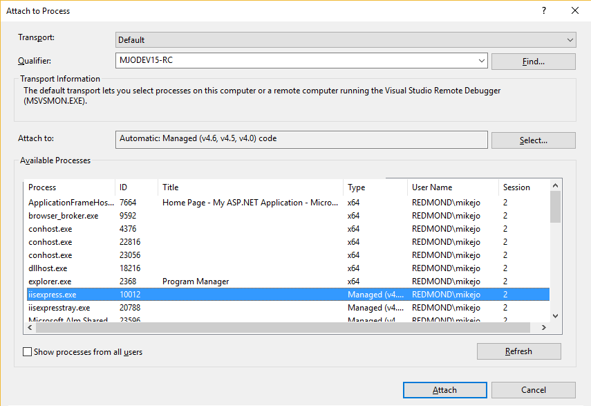

# Attach to Running Processes with the Visual Studio Debugger
[!INCLUDE[vs2017banner](../includes/vs2017banner.md)]

You can attach the Visual Studio debugger to a running process on a local or remote computer. After the process is running, click **Debug / Attach to Process** (or press **CTRL+ALT+P**) to open the **Attach to Process** dialog box.

You can use this capability to debug apps that are running on a local or remote computer, debug multiple processes simultaneously, or debug an application that was not created in Visual Studio. It is often useful when you want to debug an app, but (for whatever reason) you did not start the app from Visual Studio with the debugger attached. For example, if you are running the app without the debugger and hit an exception, you might then attach to the process running the app to begin debugging.

> [!TIP]
> Not sure whether you need to use **Attach to Process** for your debugging scenario? See [Common debugging scenarios](#BKMK_Scenarios). If you want to debug ASP.NET applications that have been deployed to IIS, see [Remote Debugging ASP.NET on a remote IIS computer](../debugger/remote-debugging-aspnet-on-a-remote-iis-7-5-computer.md).

##  Attach to a running process on the local machine
 In order to attach to a process, you must know the name of the process (see [Common debugging scenarios](#BKMK_Scenarios) for a few common process names).

1. In Visual Studio, select **Debug / Attach to Process** (or press **CTRL+ALT+P**).

2. In the **Attach to Process** dialog box, find the program that you want to attach to from the **Available Processes** list.

     To quickly select the process you want, type the first letter of the process name. If you don't know the process name, see [Common debugging scenarios](#BKMK_Scenarios).

     

     If the process is running under a different user account, select the **Show processes from all users** check box.

3. In the **Attach to** box, make sure that the type of code you will debug is listed. The default **Automatic** setting tries to determine what type of code you want to debug. To set the type of code manually, do the following

    1. In the **Attach to** box, click **Select**.

    2. In the **Select Code Type** dialog box, click **Debug these code types** and select the types to debug.

    3. Click **OK**.

4. Click **Attach**.

##  Attach to a process on a remote computer
 In order to attach to a process, you must know the name of the process (see [Common debugging scenarios](#BKMK_Scenarios) for a few common process names). For more complete guidance for ASP.NET apps that have been deployed to IIS, see [Remote Debugging ASP.NET on a remote IIS computer](../debugger/remote-debugging-aspnet-on-a-remote-iis-7-5-computer.md). For other apps, you may be able to find the name of the process in the Task Manager.

 When you use the **Attach to Process** dialog box, you can select another computer that has been set up for remote debugging. For more information, see [Remote Debugging](https://msdn.microsoft.com/library/90f45630-0d26-4698-8c1f-63f85a12db9c). When you have selected a remote computer, you can view a list of available processes running on that computer and attach to one or more of the processes for debugging.

 **To select a remote computer:**

1. In Visual Studio, select **Debug / Attach to Process** (or press **CTRL+ALT+P**).

2. In the **Attach to Process** dialog box, select the appropriate connection type from the **Transport** list. **Default** is the correct setting for most cases.

   The **Transport** setting persists between debugging sessions.

3. Use the **Qualifier** list box to choose the remote computer name by one of the following methods:

   1. Type the name in the **Qualifier** list box.

      > [!NOTE]
      > If, in later steps, you can't connect using the remote computer name, use the IP address. (The port number may appear automatically after selecting the process. You can also enter it manually. In the illustration below, 4020 is the default port for the remote debugger.)

   2. Click the drop-down arrow attached to the **Qualifier** list box and select the computer name from the drop-down list.

   3. Click the **Find** button next to the **Qualifier** list to open the **Select Remote Debugger Connection** dialog box. The **Select Remote Debugger Connection** dialog box lists all the devices that are on your local sub-net, and any device that is directly attached to your computer through an Ethernet cable. Click the computer or device that you want, and then click **Select**.

      The **Qualifier** setting persists between debugging sessions only if a successful debugging connection occurs with that qualifier.

4. Click **Refresh**.

     The **Available Processes** list is displayed automatically when you open the **Processes** dialog box. Processes can start and stop in the background while the dialog box is open. However, the contents are not always current. You can refresh the list at any time to see the current list of processes by clicking **Refresh**.

5. In the **Attach to Process** dialog box, find the program that you want to attach to from the **Available Processes** list.

    If the process is running under a different user account, select the **Show processes from all users** check box.

6. Click **Attach**.

## Additional info

You can be attached to multiple programs when you are debugging, but only one program is active in the debugger at any time. You can set the active program in the **Debug Location** toolbar or the **Processes** window. For more information, see [How to: Set the Current Program](https://msdn.microsoft.com/7e1d7fa5-0e40-44cf-8c41-d3dba31c969e).

If you try to attach to a process owned by an untrusted user account, a security warning dialog box confirmation will appear. For more information see [Security Warning: Attaching to a process owned by an untrusted user can be dangerous. If the following information looks suspicious or you are unsure, do not attach to this process](/visualstudio/debugger/security-warning-attaching-to-a-process-owned-by-an-untrusted-user?view=vs-2015).

In some cases, when you debug in a Remote Desktop (Terminal Services) session, the **Available Processes** list will not display all available processes. If you are running Visual Studio as a user who has a limited user account, the **Available Processes** list will not show processes that are running in Session 0, which is used for services and other server processes, including w3wp.exe. You can solve the problem by running [!INCLUDE[vsprvs](../includes/vsprvs-md.md)] under an administrator account or by running [!INCLUDE[vsprvs](../includes/vsprvs-md.md)] from the server console instead of a Terminal Services session. If neither of those workarounds is possible, a third option is to attach to the process by running `vsjitdebugger.exe -p` *ProcessId* from the Windows command line. You can determine the process id using tlist.exe. To obtain tlist.exe, download and install Debugging Tools for Windows, available at  [WDK and WinDbg downloads](https://go.microsoft.com/fwlink/?LinkId=168279).

##  Common debugging scenarios

To help you identify whether you need to use **Attach to process** and what process to attach to, a few common debugging scenarios are shown here (the list is not exhaustive). Where more instructions are available, we provide links.

For some app types (like Windows Store apps), you don't attach directly to a process name, but use the **Debug Installed App Package** menu option instead (see table).

> [!NOTE]
> For information about basic debugging in Visual Studio, see [Getting started with the debugger](../debugger/getting-started-with-the-debugger.md).

|Scenario|Debug Method|Process Name|Notes and Links|
|-|-|-|-|
|Debug a managed or native app on the local machine|Use attach to process or [standard debugging](../debugger/getting-started-with-the-debugger.md)|*appname*.exe|To quickly access the dialog box, use **CTRL+ALT+P** and then type the first letter of the process name.|
|Debug ASP.NET apps on the local machine after starting the app without the debugger|Use attach to process|iiexpress.exe|This may be helpful to make your app load faster, such as (for example) when profiling. |
|Remote debug ASP.NET 4 or 4.5 on an IIS server|Use remote tools and attach to process|w3wp.exe|See [Remote Debugging ASP.NET on a remote IIS computer](../debugger/remote-debugging-aspnet-on-a-remote-iis-7-5-computer.md)|
|Remote debug ASP.NET Core on an IIS server|Use remote tools and attach to process|dnx.exe|For app deployment, see [Publish to IIS](https://docs.asp.net/en/latest/publishing/iis.html). For debugging, see [Remote Debugging ASP.NET on a remote IIS computer](../debugger/remote-debugging-aspnet-on-a-remote-iis-7-5-computer.md)|
|Debug other supported app types on a server process|Use remote tools (if server is remote) and attach to process|iexplore.exe or other processes|If necessary, use Task Manager to help identify the process. See [Remote Debugging](../debugger/remote-debugging.md) and later sections in this topic|
|Remote debug a Windows desktop app|Remote Tools and F5|N/A| See [Remote Debugging](../debugger/remote-debugging.md)|
|Remote debug a Windows Universal (UWP), OneCore, HoloLens, or IoT app|Debug installed app package|N/A|Use **Debug / Other Debug Targets / Debug Installed App Package** instead of **Attach to process**|
|Debug a Windows Universal (UWP), OneCore, HoloLens, or IoT app that you didn't start from Visual Studio|Debug installed app package|N/A|Use **Debug / Other Debug Targets / Debug Installed App Package** instead of **Attach to process**|

> [!WARNING]
> To attach to a Windows Universal app that is written in JavaScript, you must first enable debugging for the app. See [Attach the debugger](../debugger/start-a-debugging-session-for-store-apps-in-visual-studio-javascript.md#BKMK_Attach_the_debugger) in the Windows Dev Center.

> [!NOTE]
> For the debugger to attach to code written in C++, the code needs to emit `DebuggableAttribute`. You can add this to your code automatically by linking with the [/ASSEMBLYDEBUG](https://msdn.microsoft.com/library/94443af3-470c-41d7-83a0-7434563d7982) linker option.

## What debugger features can I use?

To use the full features of the Visual Studio debugger (like hitting breakpoints) when attaching to a process, the executable must exactly match your local source and symbols (that is, the debugger must be able to load the correct [symbol (.pbd) files](../debugger/specify-symbol-dot-pdb-and-source-files-in-the-visual-studio-debugger.md)). By default, this requires a debug build.

For remote debugging scenarios, you must have the source code (or a copy of the source code) already open in Visual Studio. The compiled app binaries on the remote machine must come from the same build as on the local machine.

In some local debugging scenarios, you can debug in Visual Studio with no access to the source if the correct symbol files are present with the app (by default, this requires a debug build). For more info, see [Specify Symbol and Source Files](../debugger/specify-symbol-dot-pdb-and-source-files-in-the-visual-studio-debugger.md).

##  Troubleshoot attach errors
 When the debugger attaches to a running process, the process can contain one or more types of code. The code types the debugger can attach to are displayed and selected in the **Select Code Type** dialog box.

 Sometimes, the debugger can successfully attach to one code type, but not to another code type. This might occur if you are trying to attach to a process that is running on a remote computer. The remote computer might have remote debugging components installed for some code types but not for others. It can also occur if you try to attach to two or more processes for direct database debugging. SQL debugging supports attaching to a single process only.

 If the debugger is able to attach to some, but not all, code types, you will see a message identifying which types failed to attach.

 If the debugger successfully attaches to at least one code type, you can proceed to debug the process. You will be able to debug only the code types that were successfully attached. The preceding example message shows that the script code type failed to attach. Therefore, you would not be able to debug script code within the process. The script code in the process would still run, but you would not be able to set breakpoints, view data, or perform other debugging operations in the Script.

 If you want more specific information about why the debugger failed to attach to a code type, you can try to reattach to only that code type.

 **To obtain specific information about why a code type failed to attach**

1. Detach from the process. On the **Debug** menu, click **Detach All**.

2. Reattach to the process, selecting only a single code type.

   1. In the **Attach to Process** dialog box, select the process in the **Available Processes** list.

   2. Click **Select**.

   3. In the **Select Code Type** dialog box, select **Debug these code types** and the code type that failed to attach. Clear any other code.

   4. Click **OK**. The **Select Code Type** dialog box closes.

   5. In the **Attach to Process** dialog box, click **Attach**.

      This time, the attach will fail completely, and you will get a specific error message.

## See Also
 [Debug Multiple Processes](../debugger/debug-multiple-processes.md)
 [Just-In-Time Debugging](../debugger/just-in-time-debugging-in-visual-studio.md)
 [Remote Debugging](../debugger/remote-debugging.md)
