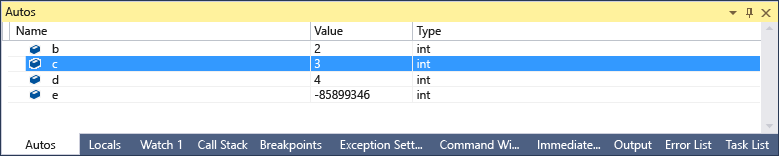
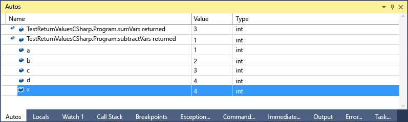
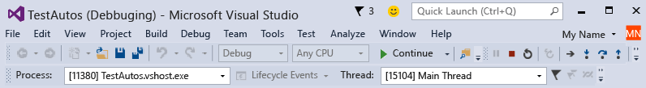

# Autos and Locals Windows
[!INCLUDE[vs2017banner](../includes/vs2017banner.md)]

The **Autos** window (while debugging, **CTRL+ALT+V, A**, or **Debug / Windows / Autos**) and the **Locals** window (while debugging, **CTRL+ALT+V, L**, or **Debug / Windows / Locals**) are quite useful when you want to see variable values while you are debugging. The **Locals** window displays variables that are defined in the local  scope, which is generally the function or method that is currently being executed. The **Autos** window displays variables used around the current line (the place where the debugger is stopped). Exactly which variables displayed is different in different languages. See What variables appear in the Autos Window? below.  
  
 If you need more information about basic debugging, see [Getting Started with the Debugger](../debugger/getting-started-with-the-debugger.md).  
  
## Looking at objects in the Autos and Locals windows  
 Arrays and objects are displayed in the Autos and Locals windows as tree controls. Click on the arrow to the left of the variable name to expand the view to show fields and properties. Here is an example of a <xref:System.IO.FileStream> object in the **Locals** window:  
  
   
  
## What variables appear in the Autos window?  
 You can use the **Autos** window in C#, Visual Basic, and C++ code. The **Autos** window does not support JavaScript or F#.  
  
 In C# and Visual Basic, the **Autos** window displays any  variable used on the current or preceding line. For example, if you declare four variables and set them as follows:  
  
```csharp  
public static void Main()  
{  
    int a, b, c, d;  
    a = 1;  
    b = 2;  
    c = 3;  
    d = 4;  
}  
```  
  
 If you set a breakpoint on the line `c = 3`; and run the debugger, when execution stops the **Autos** window will look like this:  
  
   
  
 Note that the value of `c` is 0, because the line `c = 3` has not yet been executed.  
  
 In C++ the **Autos** window displays the variables used at least three lines before the current line (the line at which execution is stopped). If you declare six variables:  
  
```cpp  
void main() {  
    int a, b, c, d, e, f;  
    a = 1;  
    b = 2;  
    c = 3;  
    d = 4;  
    e = 5;  
    f = 6;  
}  
```  
  
 If you set a breakpoint on the line `e = 5;` and run the debugger, when execution stops the **Autos** window will look like this:  
  
   
  
 Note that the variable e is uninitialized because the code on the line `e = 5;` has not yet been executed.  
  
 You can also see the return values of functions and methods in certain circumstances. See [View return values of method calls](#bkmk_returnValue) below.  
  
## <a name="bkmk_returnValue"></a> View return values of method calls  
 In .NET and C++ code you can examine return values when you step over or out of a method call. This functionality is useful when the result of a method call is not stored in a local variable, for example when a method is used as a parameter or as a return value of another    method.  
  
 The following C# code adds the return values of two functions:  
  
```csharp  
static void Main(string[] args)  
{  
    int a, b, c, d;  
    a = 1;  
    b = 2;  
    c = 3;  
    d = 4;  
    int x = sumVars(a, b) + subtractVars(c, d);  
}  
  
private static int sumVars(int i, int j)  
{  
    return i + j;  
}  
  
private static int subtractVars(int i, int j)  
{  
    return j - i;  
}  
  
```  
  
 Set a breakpoint on the int `x = sumVars(a, b) + subtractVars(c, d);` line.  
  
 Start debugging, and when execution breaks at the first breakpoint, press **F10 (Step Over)**. You should see the following in the **Autos** window:  
  
   
  
## Why are variable values sometimes red in Locals and Autos windows?  
 You may notice that the value of a variable is sometimes red in the **Locals** and **Autos** windows. These are variable values that have been changed since the last evaluation. The change could be from a previous debugging session, or because the value was changed in the window.  
  
## Changing the numeric format of a variable window  
 The default numeric format is decimal, but you can change it to hexadecimal. Right-click inside a **Locals** or **Autos** window and select **Hexadecimal Display**. The change affects all debugger windows.  
  
## Editing a Value in a Variable Window  
 You can edit the values of most variables that appear in the **Autos**, **Locals**, **Watch**, and **QuickWatch** windows. For information about **Watch** and **QuickWatch** windows, see [Watch and QuickWatch Windows](../debugger/watch-and-quickwatch-windows.md). Just double-click the value you want to change and add the new the value.  
  
 You can enter an expression for a value, for example `a + b`. The debugger accepts most valid language expressions.  
  
 In native C++ code, you might have to qualify the context of a variable name. For more information, see [Context Operator (C++)](../debugger/context-operator-cpp.md).  
  
 However, you should exercise caution when changing values. Here are some possible issues:  
  
- Evaluating some expressions can change the value of a variable or otherwise affect the state of your program. For example, evaluating `var1 = ++var2` changes the value of `var1` and `var2`.  
  
     Expressions that change data are said to have [side effects](https://en.wikipedia.org/wiki/Side_effect_\(computer_science\)), which can produce unexpected results if you are not aware of them. Make sure you understand the consequences of such a change before you make it.  
  
- Editing floating-point values can result in minor inaccuracies because of decimal-to-binary conversion of fractional components. Even a seemingly harmless edit can result in changes to some of the least significant bits in the floating-point variable.  
  
## Debug Location toolbar  
 You can use the **Debug Location** toolbar to select the desired function, thread, or process. Set a breakpoint and start debugging. (If you do not see this toolbar, you can enable it by clicking in an empty part of the toolbar area. You should see a list of toolbars; select **Debug Location**). When the breakpoint is hit, execution stops and you can see the Debug Location toolbar, which is the bottom row of the following graphic:  
  
   
  
 You can also change the context to different function calls, threads, or processes by  double-clicking the element in the **Call Stack** window, the **Threads** window, or the **Processes** window.  
  
## See Also  
 [Debugger Windows](../debugger/debugger-windows.md)
