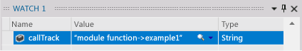
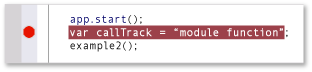
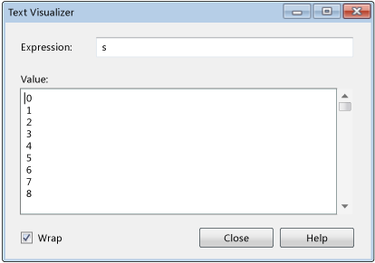
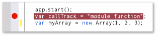
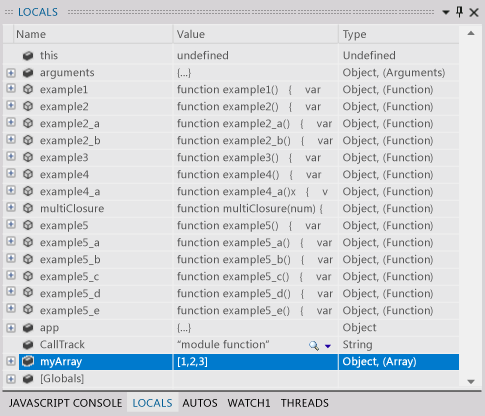
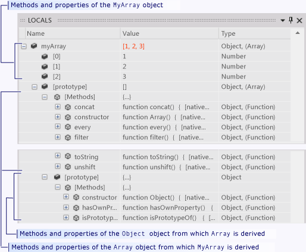
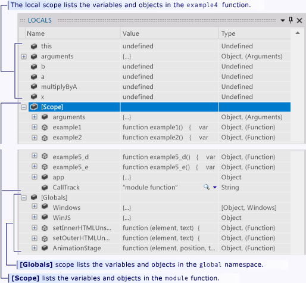
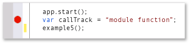
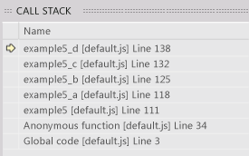

# Control execution of a Store app in a Visual Studio debug session for Windows Store apps (JavaScript)
[!INCLUDE[vs2017banner](../includes/vs2017banner.md)]

This quick start demonstrates how to navigate in the Visual Studio debugger and how to view the program state in a session.

 This quick start is for developers who are new to debugging with Visual Studio and for developers who want to learn more about navigating in a Visual Studio debug session. It does not teach the art of debugging itself. The functions in the sample code are designed only to demonstrate the debugging procedures described in this topic. The functions do not employ best practices of app or function design. In fact, you will quickly discover that the functions, and the app itself, do not do much of anything at all.

 The sections of this quick start were designed to be as independent as possible, so you can skip any section that includes information that you are already familiar with. You also aren't required to create a sample app. However, we do recommend it and have made the process as easy as possible.

 **Debugger keyboard shortcuts.** Navigation in the Visual Studio debugger is optimized both for the mouse and the keyboard. Many of the steps in this topic include the keyboard accelerator or shortcut key in a parenthetical remark. For example, (Keyboard: F5) indicates that typing the key F5 starts or continues execution of the debugger.

> [!NOTE]
> **The Module pattern**
>
> Windows Store apps often use the JavaScript *Module pattern* to encapsulate data and functions in a page. The Module pattern uses a single, self-executing, and anonymous closure to keep the page functionality separate from the global namespace. In this topic, we call that function the *module*.

## In this topic
 You can learn how to:

 [Create the sample app](#BKMK_Create_the_sample_app)

 [Set and run to a breakpoint, step into a function, and examine program data](#BKMK_Set_and_run_to_a_breakpoint__step_into_a_function__and_examine_program_data)

 [Step into, over, and out of functions](#BKMK_Step_into__over__and_out_of_functions)

 [Set a conditional breakpoint, run to the cursor, and visualize a variable](#BKMK_Set_a_conditional_breakpoint__run_to_the_cursor__and_visualize_a_variable)

 [View variable data in the Locals window](#BKMK_View_variable_data_in_the_Locals_window)

- [View variable data and the prototype chain of an object](#BKMK_View_variable_data_and_the_prototype_chain_of_an_object)

- [Examine scope chain data](#BKMK_Examine_scope_chain_data)

  [Navigate to code by using the Call Stack window](#BKMK_Navigate_to_code_by_using_the_Call_Stack_window)

##  Create the sample app
 Debugging is about code, so the sample app uses the framework of the Windows Store app only to create a source file in which you can see how navigating a debug session works and how to examine program state. All of the code that you will invoke is called from the `module` function of the default.js file. No controls are added and no events are handled.

1. **Create a blank JavaScript Windows Store app.** Open Visual Studio. On the home page, choose the **New Project** link. On the **New Project** dialog box, choose **JavaScript** in the **Installed** list and then choose **Windows Store**. In the list of project templates, choose **Blank Application**. Visual Studio creates a new solution and project and displays the default.htm file in the code editor.

    Note the script files that are loaded into the page.

   - The `base.js` and `ui.js` files create the **Windows Library for JavaScript**. The Windows Library for JavaScript is a set of JavaScript and CSS files that make it easier to create Windows Store apps using JavaScript. You use it together with HTML, CSS, and the Windows Runtime to create your app.

   - Your code starts in the `default.js`  file.

2. **Open the default.js source file.** In Solution Explorer, open the **js** node and choose `default.js`.

3. **Replace the page contents with the sample code.** Delete all contents from the `default.js` file. Follow this link: [Debugger navigation sample code (JavaScript)](../debugger/debugger-navigation-sample-code-javascript.md), and then copy the code listed in the JavaScript section to the clipboard. (Choose **Back** in the browser or help viewer to return to this quick start page.) In the Visual Studio editor, paste the code into the now empty `default.js`. Choose **Ctrl+ S** to save the file.

   You can now follow along with the examples in this topic.

##  Set and run to a breakpoint, step into a function, and examine program data
 The most common way to start a debug session is to choose **Start Debugging** from the **Debug** menu (Keyboard: F5). The app starts and continues executing until a breakpoint is reached, you manually suspend execution, an exception occurs, or the app ends.

 When execution is suspended in the debugger, you can view the value of an active variable in a data tip by pausing the mouse on the variable.

 After you suspend execution of the app (which is also called breaking into the debugger), you control the way the rest of the program code executes. You can continue line by line, moving from a function call into the function itself, or you can execute a called function in a single step. These procedures are called stepping through the app. You can also resume the standard execution of the app, running to the next breakpoint that you have set, or to the line where you positioned your cursor. You can stop the debug session at any time. The debugger is designed to perform the necessary clean-up operations and exit execution.

###  Example 1
 In this example, you set a breakpoint in the body of the `module` function in `default.js` as it calls the first of our user statements. You then step into the function, view variable values in debugger data tips, and then stop debugging.

1. **Set a breakpoint.** Set a breakpoint at the statement `callTrack = "module function";` that occurs right after the call to `app.start()`. Choose the line in the shaded gutter of the source code editor (Keyboard: Position the cursor on the line and choose the **F9** key).

    

    The breakpoint icon appears in the gutter.

2. **Run to the breakpoint.** Start the debug session by choosing **Start Debugging** on the **Debug** menu (Keyboard: F5).

    The app begins executing and suspends execution immediately before the statement at which you set the breakpoint. The current line icon in the gutter identifies your location and the current statement is highlighted.

    

    You are now in control of the execution of the app and can examine the program state as you step through the program statements.

3. **Step into the function.** On the **Debug** menu, choose **Step Into** (Keyboard: **F11**).

    

    Note that the debugger moves to the next line, which is a call to the `example1` function. Choose **Step Into** again. The debugger moves to the first code line of the `example1` function. The highlighted line has not been executed, but the function has been loaded on the call stack and the memory for local variables has been allocated.

4. When you step into a line of code, the debugger performs one of the following actions:

   - If the next statement is not a call to a function in your solution, the debugger executes the statement, moves to the next statement, and then suspends execution.

   - If the statement is a call to a function in your solution, the debugger moves to the first line of the called function and then suspends execution.

     Continue to step into the statements of `example1` until you have reached the exit point. The debugger highlights the closing curly brace of the function.

5. **View variable values in data tips.** Continue to step into the statements of `example1` until you have reached the exit point. The debugger highlights the closing curly brace of the function. When you pause the mouse on a variable name, the name and value of the variable are displayed in a data tip.

    

6. **Add a watch for the callTrack variable.** The `callTrack` variable is used throughout this quick start to show the functions called in the examples. To make it easier to view the value of the variable, add it to a Watch window. Select the variable name in the editor and then choose **Add Watch** from the shortcut menu.

    

    You can watch multiple variables in a watch window. The values of watched variables, like values in data tip windows, are updated whenever execution is suspended. Your watched variables are saved across debug sessions.

7. **Stop debugging.** On the **Debug** menu, choose **Stop Debugging** (Keyboard: **Shift+F5**). This ends your debug session.

##  Step into, over, and out of functions
 In contrast to stepping into a function called by a parent function, stepping over a function executes the child function and then suspends execution in the calling function as the parent resumes. You might step over a function when you are familiar with the way the function works and are sure that its execution will not affect the issue that you are investigating.

 Stepping over a line of code that doesn't contain a function call executes the line just like stepping into the line.

 Stepping out of a child function continues execution of the function and then suspends execution after the function returns to its calling function. You might step out of a long function when you have determined that the rest of the function is not significant.

 Both stepping over and stepping out of a function execute the function.

 

###  Example 2
 In this example, you step into, over, and out of functions.

1. **Call the example2 function in the module function.** Edit the `module` function and replace the line following `var callTrack = "module function"` with `example2();`.

     

2. **Run to the breakpoint.** Start the debug session by choosing **Start Debugging** on the **Debug** menu (Keyboard: F5). The debugger suspends execution at the breakpoint.

3. **Step over the line of code.** On the **Debug** menu, choose **Step Over** (Keyboard: F10). The debugger executes the `var callTrack = "module function"` statement in the same manner as stepping into the statement.

4. **Step into example2 and example2_a.** Choose the **F11** key to step into the `example2` function. Continue to step into the `example2` statements until you reach the line `var x = example2_a();`. Again, step into this line to move to the entry point of `example2_a`. Continue to step into each statement of `example2_a` until you return to `example2`.

     

5. **Step over a function.** Note that the next line in `example2`, `var y = example2_a();` is basically the same as the previous line. You can safely step over this line. Choose the **F10** key to move from the resumption of `example2` to this second call to `example2_a`. Note that the `callTrack` string indicates the `example2_a` function was executed twice.

6. **Step out of a function.** Choose the **F11** key to step into the `example2_b` function. Note that `example2_b` is not very different from `example2_a`. To step out of the function, choose **Step Out** on the **Debug** menu (Keyboard: **Shift+F11**). Note that the `callTrack` variable indicates that `example2_b` was executed and that the debugger has returned to the point where `example2` resumes.

7. **Stop debugging.** On the **Debug** menu, choose **Stop Debugging** (Keyboard: **Shift+F5**). This ends your debug session.

##  Set a conditional breakpoint, run to the cursor, and visualize a variable
 A conditional breakpoint specifies a condition that causes the debugger to suspend execution. The condition is specified by any code expression that can be evaluated as true or false. For example, you might use a conditional breakpoint to examine the program state in a frequently called function only when a variable reaches a certain value.

 Running to the cursor is like setting a one-time breakpoint. When execution is suspended, you can select a line in the source and resume execution until the selected line is reached. For example, you might be stepping through a loop in a function and determine that the code in the loop is performing correctly. Rather than stepping through every iteration of the loop, you can run to the cursor that is positioned after the loop is executed.

 Sometimes, it's difficult to view a variable value in the row of a data tip or other data window. The debugger can display strings, HTML, and Xml in a text visualizer that presents a formatted view of the value in a scrollable window.

###  Example 3
 In this example, you set a conditional breakpoint to break at a specific iteration of a loop, then run to the cursor that is positioned after the loop. You also view the value of a variable in a text visualizer.

1. **Call the example3 function in the module function.** Edit the `module` function and replace the line following `var callTrack = "module function";` with the line `example3();`.

     

2. **Run to the breakpoint.** Start the debug session by choosing **Start Debugging** on the **Debug** menu (Keyboard: **F5**). The debugger suspends execution at the breakpoint in the `module` function.

3. **Step into the example3 function.** Choose **Step Into** on the **Debug** menu (Keyboard: **F11**) to move to the entry point of the `example3` function. Continue stepping into the function until you have iterated one or two loops of the `for` block. Note that it would take you a long time to step through all 1000 iterations.

4. **Set a conditional breakpoint.** In the left gutter of the code window, right-click the line `s += i.toString() + "\n";` and then choose **Condition** on the shortcut menu.

     Select the **Condition** check box, and then type `i == 500;` in the text box. Choose the **Is true** option and choose **OK**. The breakpoint allows you to check the value at the 500th iteration of the `for` loop. You can identify a conditional breakpoint icon by its white cross.

     

5. **Run to the breakpoint.** On the **Debug** menu, choose **Continue** (Keyboard: **F5**). Pause on the `i` to confirm that the current value of `i` is 500. Also note that the variable `s` is represented as single line and is much longer than the data tip window.

6. **Visualize a string variable.** Click the magnifying glass icon in the data tip of the `s`.

     The Text Visualizer window appears and the value of the string is presented as a multi-line string.

     

7. **Run to the cursor.** Select the line `callTrack += "->example3";` and then choose **Run to Cursor** on the shortcut menu (Keyboard: **Ctrl+F10**). The debugger completes the loop iterations and then suspends execution at the line.

8. **Stop debugging.** On the **Debug** menu, choose **Stop Debugging** (Keyboard: **Shift+F5**). This ends your debug session.

###  Use Run to Cursor to return to your code and delete a breakpoint
 Running to the cursor can be very useful when you have stepped into library code from Microsoft or a third party. While stepping through library code can be informative, it often can take a long time. And usually, you are far more interested in your own code. This exercise shows you how to do it.

1. **Set a breakpoint at the app.start call.** In the `module` function, set a breakpoint at the line `app.start()`

2. **Run to the breakpoint and step into the library function.**

     When you step into `app.start()`, the editor displays the code in `base.js`. Step into a few more lines.

3. **Step over and out of functions.** As you step over (**F10**) and step out of (**SHIFT+F11**) code in `base.js`, you might come to the conclusion that examining the complexity and length of the start function is not what you want to be doing.

4. **Set the cursor to your code and run to it.** Switch back to the `default.js` file in the code editor. Select the first line of code after `app.start()` (You can't run to a comment or a blank line). Choose **Run to Cursor** from the shortcut menu. The debugger continues execution of the app.start function and suspends execution at the breakpoint.

##  View variable data in the Locals window
 The Locals windows is a tree view of the parameters and variables in the scope chain of the currently executing function.

###  View variable data and the prototype chain of an object

1. **Add an array object the module function.** Edit the `module` function and replace the line following `var callTrack = "module function"` with `var myArray = new Array(1, 2, 3);`

     

2. **Run to the breakpoint.** Start the debug session by choosing **Start Debugging** on the **Debug** menu (Keyboard: **F5**). The debugger suspends execution at the breakpoint. Step into to the line.

3. **Open the Locals window.** On the **Debug** menu, point to **Windows**, and then choose **Locals**. (Keyboard: Alt+4).

4. **Examine the local variables in the module function** The Locals windows displays the variables of the currently executing function (the `module` function) as top level nodes of the tree. When you enter a function, JavaScript creates all the variables and gives them a value of `undefined`. Functions that are defined in the function have their text as a value.

     

5. **Step through the callTrack and myArray definitions.** Find the callTrack and myArray variables in the Locals window. Step over (**F10**) the two definitions and notice that the **Value** and **Type** fields are changed. The Locals window highlights the values of variables that have changed since the last break.

6. **Examine the myArray object** Expand the `myArray` variable. Each element of the array is listed The **[prototype]** node that contains the inheritance hierarchy of the `Array` object. Expand this node.

     

    - The **Methods** node lists all the methods of the `Array` object.

    - The **[prototype]** node contains the prototype of the `Object` object from which `Array` is derived. **[prototype]** nodes can be recursive. Each parent object in an object hierarchy is described in the **[prototype]** node of its child.

7. **Stop debugging.** On the **Debug** menu, choose **Stop Debugging** (Keyboard: Shift+F5). This ends your debug session.

##  Examine scope chain data
 The *scope chain* of a function includes all variables that are active and reachable by the function. Global variables are part of the scope chain, as are any objects (including functions) that are defined in the function that defines the currently executing function. For example, the `callTrack` variable that is defined in the `module` function of `default.js` is reachable by any function that is defined in the `module` function. Each scope is listed separately in the Locals window.

- The variables of the currently executing function are listed at the top of the window.

- The variables of each function scope in the scope chain are listed under a **[Scope]** node for the function. The scope functions are listed by their order in the chain, from the function that defines the current function to the outermost function of the chain.

- The **[Globals]** node lists the global objects that are defined outside of any function.

  Scope chains can be confusing and are best illustrated by example. In the following example, you can see how the `module` function creates its own scope, and how you can create another level of scope by creating a closure.

###  Example 4

1. **Call the example4 function from the module function.** Edit the `module` function and replace the line following `var callTrack = "module function"` with the `example4()`:

     

2. **Run to the breakpoint.** Start the debug session by choosing **Start Debugging** on the **Debug** menu (Keyboard: **F5**). The debugger suspends execution at the breakpoint.

3. **Open the Locals window.** If necessary, on the **Debug** menu, point to **Windows**, and then choose **Locals**. (Keyboard: **Alt+4**). Note that the window lists all the variables and functions in the `module` function, and also contains a **[Globals]** node.

4. **Examine the global variables.** Expand the **[Globals]** node. The objects and variables in the Global were set by the Windows Library for JavaScript. You can add your own variables to the global scope.

5. **Step into example4 and examine its local and scope variables** Step into (Keyboard: **F11**) the `example4` function. Because `example4` is defined in the `module` function, the `module` function becomes the parent scope. `example4` can call any of functions in the `module` function and access its variables. Expand the **[Scope]** node in the Locals window and note that it contains the same and variables of the `module` function.

     

6. **Step into example4_a and examine its local and scope variables** Continue to step into `example4` and into the call to `example4_a`. Note that the local variables are now from `example4_a`, and that the **[Scope]** node continues to hold the variables of the `module` function. Even though the variables of `example4` are active, they cannot be reached by `example4_a` and are no longer part of the scope chain.

7. **Step into multiplyByA and examine its local and scope variables** Step through the rest of `example4_a` and into the line `var x = multiplyByA(b);`.

     The function variable `multiplyByA` has been set to the `multiplyClosure` function which is a *closure*. `multiplyClosure` defines and returns an inner function, `multiplyXby`, and captures (closes over) its parameter and variable. In a closure, the returned inner function has access to the data of the outer function and so creates its own level of scope.

     When you step into `var x = multiplyByA(b);`, you move to the `return a * b;` line in the `multiplyXby` inner function.

8. In the Locals window, only the parameter `b` is listed as a local variable in `multiplyXby`, but a new **[Scope]** level has been added. Expanding this node, you see that it contains the parameters, functions, and variables of `multiplyClosure`, including the `a` variable called in the first line of `multiplyXby`. A quick check of the second **[Scope]** node reveals the module function variables, which `multiplyXby` accesses in its next line.

9. **Stop debugging.** On the **Debug** menu, choose **Stop Debugging** (Keyboard: **Shift+F5**). This ends your debug session.

##  Navigate to code by using the Call Stack window
 The call stack is a data structure that contains information about the functions that are executing in the current thread of the application. When you hit a breakpoint, the Call Stack window displays a list of all of the functions that are active on the stack. The currently executing function is at the top of the Call Stack window list. The function that initiates the thread is at the bottom of the list. The functions in between show the call path from the initiating function to the current function.

 In addition to showing the call path to the currently executing function, the Call Stack window can be used to navigate to code in the code editor. This functionality can be valuable when you are working with multiple files and you want to quickly move to a particular function.

###  Example 5
 In this example, you step into a call path that contains five user-defined functions.

1. **Call the example5 function in the module function.** Edit the `module` function and replace the line following `var callTrack = "module function";` with the line `example5();`.

     

2. **Run to the breakpoint.** Start the debug session by choosing **Start Debugging** on the **Debug** menu (Keyboard: **F5**). The debugger suspends execution at the breakpoint in the module function.

3. **Open the Call Stack window.** On the **Debug** menu, choose **Windows**, and then choose **Call Stack** (Keyboard: Alt+7). Note that the Call Stack window shows two functions:

    - **Global code** is the entry point of the `module` function at the bottom of the call stack.

    - **Anonymous function** shows the line in the `module` function where execution is suspended. This is the top of the call stack.

4. **Step into functions to reach the example5_d function.** Choose **Step Into** on the **Debug** menu (Keyboard: **F11**) to execute the calls in the call path until you reach the entry point of the example5_d function. Note that each time that a function calls a function, the line number of the calling function is saved and the called function is placed at the top of the stack. The line number of the calling function is the point at which the calling function has suspended execution. A yellow arrow points to the currently executing function.

     

5. **Use the Call Stack window to navigate to the example5_a code and set a breakpoint.** In the Call Stack window, select the `example5_a` list item and then choose **Go to Source** on the shortcut menu. The code editor sets its cursor at the return line of the function. Set a breakpoint on this line. Note that the current execution line is not changed. Only the editor cursor has moved.

6. **Step into functions and then run to the breakpoint.** Continue stepping into `example5_d`. Note that when you return from the function, it is taken off the call stack. Press **F5** to continue the program execution. You stop at the breakpoint created in the previous step.

7. **Stop debugging.** On the **Debug** menu, choose **Stop Debugging** (Keyboard: **Shift+F5**). This ends your debug session.

## See Also
 [Start a debug session  (JavaScript)](../debugger/start-a-debugging-session-for-store-apps-in-visual-studio-javascript.md)
 [Quickstart: Debugger navigation (JavaScript)](../debugger/control-execution-of-a-store-app-in-a-visual-studio-debug-session-for-windows-store-apps-javascript.md)
 [Quickstart: Debug HTML and CSS](../debugger/quickstart-debug-html-and-css.md)
 [Trigger suspend, resume, and background events for Windows Store)](../debugger/how-to-trigger-suspend-resume-and-background-events-for-windows-store-apps-in-visual-studio.md)
 [Debug apps in Visual Studio](../debugger/debug-store-apps-in-visual-studio.md)
