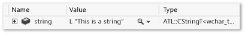
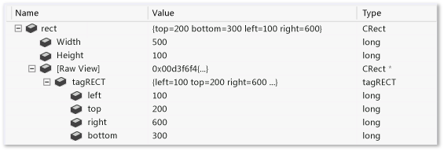
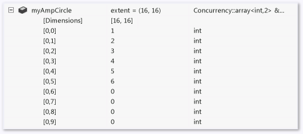
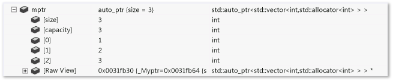

# Create Custom Views of Native Objects
[!INCLUDE[vs2017banner](../includes/vs2017banner.md)]

The Visual Studio Natvis framework lets you customize the way Visual Studio displays native types in debugger variable windows (for example, the **Watch**, **Locals**, and **Data Tips** windows.  

 Natvis supersedes the **autoexp.dat** file that was used in earlier versions of Visual Studio and offers XML syntax, better diagnostics, versioning, and multiple file support.  

> [!NOTE]
> You cannot use the Natvis framework for visualizations when:  
> 
> - You are debugging a C++ Windows desktop project with debugger type set to **mixed**.  
>   - You are doing mixed mode debugging in a Windows desktop application in managed compatibility mode (**Tools / Options / Debugging / General / Use Managed Compatibility Mode**).  
>   - You are debugging in a Windows desktop application in native compatibility mode (**Tools / Options / Debugging / General / Use Native Compatibility Mode**).  

## <a name="BKMK_Why_create_visualizations_"></a> Why create Natvis visualizations?  
 You can use the Natvis framework to create visualization rules for the types you create so developers can see them easily during debugging.  

 For example, the image below shows a variable of type [Windows::UI::Xaml::Controls::TextBox](https://go.microsoft.com/fwlink/?LinkId=258422) that is displayed in the debugger without any custom visualizations applied.  

   

 The highlighted row shows the `Text` property of the `TextBox` class. The complex class hierarchy makes it difficult to find this value; moreover, the debugger doesn’t know how to interpret the custom string type used by the object, so you cannot see the string held inside the textbox.  

 The same `TextBox` looks much simpler n the variable window when custom visualization rules are applied. The important members of the class can be viewed together, and the debugger shows the underlying string value of the custom string type.  

   

## <a name="BKMK_Using_Natvis_files"></a> Using Natvis files  
 .natvis files are XML files with a .natvis extension. The schema is defined in **%VSINSTALLDIR%\Xml\Schemas\natvis.xsd**.  

 The basic structure of a .natvis file is one or more `Type` elements, where each `Type` element represents a visualization entry for a type whose fully qualified name is specified in the `Name` attribute.  

```xml  

<?xml version="1.0" encoding="utf-8"?>  
<AutoVisualizer xmlns="http://schemas.microsoft.com/vstudio/debugger/natvis/2010">  
  <Type Name="MyNamespace::CFoo">  
    .  
    .  
  </Type>  

  <Type Name="...">  
    .  
    .  
  </Type>  
</AutoVisualizer>  
```  

 Visual Studio provides some .natvis files in **%VSINSTALLDIR%\Common7\Packages\Debugger\Visualizers** folder. These files contain visualization rules for many common types and can serve as examples when you are writing visualizations for new types.  

## Adding .natvis files to your projects  
 You can add .natvis files to any C++ project.  

 To add a new .natvis file, with an open C++ project, select the project node in the **Solution Explorer**, and click **Add / New item / Visual C++ / Utility / Debugger visualization file (.natvis)**. The debugger will load Natvis files from C++ projects automatically. By default, Natvis files in your project are also inserted into the .pdb file built by the project. This means that if you debug the binary built by this project, the debugger loads the Natvis file from the .pdb even if you do not have the project open. If you do not want the .natvis file to be included in the .pdb, right-click the .natvis file in the **Solution Explorer**, and in the **Configuration Properties** window set **Excluded from Build** to **Yes**.  

 It is recommended that you edit Natvis files using Visual Studio Any changes you make while debugging take effect automatically when you save the file. You also get an improved editing experience from IntelliSense.  

 Natvis files that are loaded from a .pdb apply only to types in the module to which the pdb refers. For example, if Module1.pdb defines an entry for a type named `Test`, this entry only applied to the **Test** class in Module1.dll. If another module also defines a class named **Test**, Module1.pdb’s natvis entry does not apply to it.  

## <a name="BKMK_natvis_location"></a> Deploying .natvis files  
 If your .natvis file applies only to the types you are creating in a Visual Studio project, you don’t have to do anything; the .natvis is included in the .pdb. You can, however, add .natvis files to your user directory or to a system directory if you want them to apply to multiple projects.  

 The order in which .natvis files are evaluated is as follows:  

1. .natvis files embedded in a .pdb you are debugging (unless a file of the same name exists in a loaded project)  

2. .natvis files that are part of a loaded C++ projects or a top-level solution item. This includes all loaded C++ projects, including class libraries, but it does not include projects of other languages (e.g. you can’t load a .natvis file from a C# project). For executable projects, you should use the solution items to host any .natvis files that are not already present in a .pdb, since there is no C++ project available.  

3. The user-specific natvis directory (**%USERPROFILE%\My Documents\Visual Studio 2015\Visualizers**  

4. The system-wide Natvis directory (**%VSINSTALLDIR%\Common7\Packages\Debugger\Visualizers**). This is where .natvis files that are installed with Visual Studio are copied. You can add other files to this directory as well if you have administrator permissions.  

## Modifying .natvis files while debugging  
 You can modify a .natvis file in the IDE while debugging the project in which it is included. Open the file in the IDE (using the same instance of Visual Studio that you are debugging with), modify it, and save it. As soon as the file is saved, the **Watch** and **Locals** windows should be updated to reflect the change. If you modify the .natvis file outside the IDE, the changes do not take effect automatically. To update the windows, you can evaluate the **.natvisreload** command in the **Watch** window. This causes the changes to take effect without restarting the debug session.  

 You can also add or delete .natvis files to a solution you are debugging, and Visual Studio will add or remove the relevant visualizations.  

 You cannot modify a .natvis file while you are debugging if it is embedded in a .pdb.  

 Use the **.natvisreload** command when you are upgrading the natvis file to a newer version (for example, if it’s checked into source control and you want to pick up recent changes that somebody else made to the file). It is recommended that you edit natvis files using the Visual Studio xml editor.  

## <a name="BKMK_Expressions_and_formatting"></a> Expressions and formatting  
 Natvis visualizations use C++ expressions to specify the data items to display. In addition to the enhancements and limitations of C++ expressions in the debugger that are described in [Context Operator (C++)](../debugger/context-operator-cpp.md), you should be aware of the following differences:  

- Natvis expressions are evaluated in the context of the object being visualized, not the current stack frame. For example, if you use `x` in a Natvis expression, this refers to the field named `x` in the object being visualized, not to a local variable named `x` in the currently-executing function. You cannot access local variables in Natvis expressions, although you can access global variables.  

- Natvis expressions do not allow function evaluation or side effects. This means that function calls and assignment operators are ignored. Because [debugger intrinsic functions](../debugger/expressions-in-the-debugger.md#BKMK_Using_debugger_intrinisic_functions_to_maintain_state) are side-effect free, they may be freely called from any Natvis expression, even though other function calls are disallowed.  

  To control how an expression is displayed in a variable window, you can use any of the format specifiers that are described in the [Format Specifiers](../debugger/format-specifiers-in-cpp.md#BKMK_Visual_Studio_2012_format_specifiers) section of the [Format Specifiers in C++](../debugger/format-specifiers-in-cpp.md) topic. Note that format specifiers are ignored when the virtualization entry is used internally by Natvis, such as the `Size` expression in an ArrayItems expansion.  

## Natvis views  
 Natvis views allow you to see any type in more than one way. For example, you can define a view named **simple** that gives you a simplified view of a type. For example, here is the visualization of `std::vector`:  

```xml  
<Type Name="std::vector&lt;*&gt;">  
    <DisplayString>{{ size={_Mylast - _Myfirst} }}</DisplayString>  
    <Expand>  
        <Item Name="[size]" ExcludeView="simple">_Mylast - _Myfirst</Item>  
        <Item Name="[capacity]" ExcludeView="simple">_Myend - _Myfirst</Item>  
        <ArrayItems>  
            <Size>_Mylast - _Myfirst</Size>  
            <ValuePointer>_Myfirst</ValuePointer>  
        </ArrayItems>  
    </Expand>  
</Type>  
```  

 The `DisplayString` and the `ArrayItems` elements are used in the default view and the simple view, while the `[size]` and `[capacity]` items are excluded from the simple view. You can use the **,view** format specifier to specify an alternate view. In the **Watch** window, you specify the simple view as **vec,view(simple)**:  

   

## <a name="BKMK_Diagnosing_Natvis_errors"></a> Diagnosing Natvis errors  
 You can use Natvis diagnostics to troubleshoot syntax and parse errors. When the debugger encounters errors in a visualization entry, it ignores the errors and either displays the type in its raw form or picks another suitable visualization. To understand why a certain visualization entry is ignored and to see what the underlying errors are, you can turn on Natvis diagnostics **Tools / Options / Debugging / Output Window / Natvis diagnostic messages (C++ only)** option. The errors are displayed in the **Output** window.  

## <a name="BKMK_Syntax_reference"></a> Natvis syntax reference  

### <a name="BKMK_AutoVisualizer"></a> AutoVisualizer element  
 The `AutoVisualizer`  element is the root node of the .natvis file and contains the namespace `xmlns:` attribute.  

```xml  
<?xml version="1.0" encoding="utf-8"?>  
<AutoVisualizer xmlns="http://schemas.microsoft.com/vstudio/debugger/natvis/2010">  
.  
.  
</AutoVisualizer>  
```  

### <a name="BKMK_Type"></a> Type element  
 A basic Type looks like this:  

```xml  
<Type Name="[fully qualified type name]">  
  <DisplayString Condition="[Boolean expression]">[Display value]</DisplayString>  
  <Expand>  
    ...  
  </Expand>  
</Type>  

```  

 It specifies:  

1. What type this visualization should be used for (the `Type Name` attribute).  

2. What the value of an object of that type should look like (the `DisplayString` element).  

3. What the members of the type should look like when the user expands it in a variable window (the `Expand` node).  

   **Templated classes** The `Name` attribute of the `Type` element accepts an asterisk `*` as a wildcard character that can be used for templated class names:  

```xml  
<Type Name="ATL::CAtlArray&lt;*&gt;">  
    <DisplayString>{{Count = {m_nSize}}}</DisplayString>  
</Type>  

```  

 In this example, the same visualization will be used whether the object is a `CAtlArray<int>` or a `CAtlArray<float>`. If there is a specific visualization entry for a `CAtlArray<float>` then it takes precedence over the generic one.  

 Note that template parameters can be referenced in the visualization entry by using macros $T1, $T2, and so forth. To find examples of these macros, see the .natvis files shipped with Visual Studio.  

#### <a name="BKMK_Visualizer_type_matching"></a> Visualizer type matching  
 If a visualization entry fails to validate, then the next available visualization is used.  

#### Inheritable attribute  
 You can specify whether a visualization applies only to a base type or to a base type and all derived types with the optional `Inheritable` attribute. In the following, the visualization applies only to the `BaseClass` type:  

```xml  
<Type Name="Namespace::BaseClass" Inheritable="true">  
    <DisplayString>{{Count = {m_nSize}}}</DisplayString>  
</Type>  
```  

 The default value of `Inheritable` is `true`.  

#### Priority attribute  
 The `Priority` attribute specifies the order in which alternate definitions are used if a definition fails to parse. The possible values of `Priority` are: `Low`, `MediumLow`,`Medium`, `MediumHigh`, and `High`, and the default value is `Medium`.  

 The priority attribute should only be used to distinguish between priorities within the same .natvis file, not between different files.  

 In the following example, we will first parse the entry that matches the 2015 STL, and if that fails to parse, we will use the alternate entry for the 2013 version of the STL:  

```xml  
<!-- VC 2013 -->  
<Type Name="std::reference_wrapper&lt;*&gt;" Priority="MediumLow">  
     <DisplayString>{_Callee}</DisplayString>  
    <Expand>  
        <ExpandedItem>_Callee</ExpandedItem>  
    </Expand>  
</Type>  

<!-- VC 2015 -->  
<Type Name="std::reference_wrapper&lt;*&gt;">  
    <DisplayString>{*_Ptr}</DisplayString>  
    <Expand>  
        <Item Name="[ptr]">_Ptr</Item>  
    </Expand>  
</Type>  
```  

#### <a name="BKMK_Versioning"></a> Version element  
 Use the `Version` element to scope visualizations to specific modules and their versions so that name collisions can be minimized and different visualizations can be used for different versions of the types. For example:  

```xml  
<Type Name="DirectUI::Border">  
  <Version Name="Windows.UI.Xaml.dll" Min="1.0" Max="1.5"/>  
  <DisplayString>{{Name = {*(m_pDO->m_pstrName)}}}</DisplayString>  
  <Expand>  
    <ExpandedItem>*(CBorder*)(m_pDO)</ExpandedItem>  
  </Expand>  
</Type>  
```  

 In this example, the visualization is applicable only for the `DirectUI::Border` type found in the `Windows.UI.Xaml.dll` from version 1.0 to 1.5. Note that adding version elements scopes the visualization entry to a particular module and version and reduces inadvertent mismatches, but if a type is defined in a common header file that is used by different modules, the versioned visualization is not applied when the type is not in the specified module.  

#### Optional attribute  
 The `Optional` attribute can appear on any node. If any sub-expression inside an optional node fails to parse, that node is ignored, but the rest of the Type element is still valid. In the following type, `[State]` is non-optional, but `[Exception]` is optional.  This means that if `MyNamespace::MyClass` contains a field named _`M_exceptionHolder`, you will still both `[State]` node and the `[Exception]` node, but if the `_M_exceptionHolder` is missing, you will see only the `[State]` node.  

```xml  
<Type Name="MyNamespace::MyClass">  
    <Expand>  
      <Item Name="[State]">_M_State</Item>  
      <Item Name="[Exception]" Optional="true">_M_exceptionHolder</Item>  
    </Expand>  
</Type>  
```  

### <a name="BKMK_Condition_attribute"></a> Condition attribute  
 The optional `Condition` attribute is available for many visualization elements and specifies when a visualization rule should be used. If the expression inside the condition attribute resolves to `false`, then the visualization rule specified by the element is not applied. If it evaluates to true, or if there is no `Condition` attribute, then the visualization rule is applied to the type. You can use this attribute for `if-else` logic in the visualization entries. For example, the visualization below has two `DisplayString` elements for a smart pointer type:  

```xml  
<Type Name="std::auto_ptr&lt;*&gt;">  
  <DisplayString Condition="_Myptr == 0">empty</DisplayString>  
  <DisplayString>auto_ptr {*_Myptr}</DisplayString>  
  <Expand>  
    <ExpandedItem>_Myptr</ExpandedItem>  
  </Expand>  
</Type>  

```  

 When the `_Myptr` member is `null`, the condition of the first `DisplayString` element resolves to `true`, so that form is displayed. When the `_Myptr` member is not `null`, the condition evaluates to `false`, and the second `DisplayString` element is displayed.  

### IncludeView and ExcludeView attributes  
 These attributes specify elements that are to be displayed or not displayed in different views. For example, given the Natvis specification of `std::vector`:  

```xml  
<Type Name="std::vector&lt;*&gt;">  
    <DisplayString>{{ size={_Mylast - _Myfirst} }}</DisplayString>  
    <Expand>  
        <Item Name="[size]" ExcludeView="simple">_Mylast - _Myfirst</Item>  
        <Item Name="[capacity]" ExcludeView="simple">_Myend - _Myfirst</Item>  
        <ArrayItems>  
            <Size>_Mylast - _Myfirst</Size>  
            <ValuePointer>_Myfirst</ValuePointer>  
        </ArrayItems>  
    </Expand>  
</Type>  
```  

 The simple view does not display the [size] and [capacity] items in the simple view. If we had used `IncludeView="simple"` instead of `ExcludeView`, the `[size]` and `[capacity]` items would be shown in the simple view rather than in the default view.  

 You can use the `IncludeView` and `ExcludeView` attributes on types as well as on individual members.  

### <a name="BKMK_DisplayString"></a> DisplayString  
 A `DisplayString` element specifies the string to be shown as the value of the variable. It accepts arbitrary strings mixed with expressions. Everything inside curly braces is interpreted as an expression. For instance, a `DisplayString` entry like this:  

```xml  
<Type Name="CPoint">  
  <DisplayString>{{x={x} y={y}}}</DisplayString>   
</Type>  

```  

 Means that variables of type `CPoint` are displayed like this:  

   

 In the `DisplayString` expression, `x` and `y`, which are members of `CPoint`, are inside curly braces and so their values are evaluated. The expression also shows how you can escape a curly brace by using double curly braces ( `{{` or `}}` ).  

> [!NOTE]
> The `DisplayString` element is the only element that accepts arbitrary strings and curly brace syntax. All other visualization elements accept only expressions that are evaluated by the debugger.  

### <a name="BKMK_StringView"></a> StringView  
 The `StringView` element defines the expression whose value is going to be sent to the built-in text visualizer. For example, suppose we have the following visualization for the `ATL::CStringT` type:  

```xml  
<Type Name="ATL::CStringT&lt;wchar_t,*&gt;">  
  <DisplayString>{m_pszData,su}</DisplayString>  
</Type>  

```  

 The `CStringT` object looks like:  

   

 The visualization displays a `CStringT` object in a variable window like this:  

 Adding a `StringView` element will indicate to the debugger that this value can be viewed by a text visualization:  

```xml
<Type Name="ATL::CStringT&lt;wchar_t,*&gt;">  
  <DisplayString>{m_pszData,su}</DisplayString>  
  <StringView>m_pszData,su</StringView>  
</Type>  
```  

 Notice the magnifying glass icon shown next to the value below. Choosing the icon will launch the text visualizer which will display the string that `m_pszData` points to.  

   

> [!NOTE]
> Note that the expression `{m_pszData,su}` includes a C++ format specifier `su` to display the value as a Unicode string. See [Format Specifiers in C++](../debugger/format-specifiers-in-cpp.md) for more information.  

### <a name="BKMK_Expand"></a> Expand  
 The `Expand` node is used to customize the children of the visualized type when the user expands it in the variable windows. It accepts a list of child nodes that define the child elements.  

 The `Expand` node is optional.  

- If an `Expand` node is not specified in a visualization entry, Visual Studio’s default expansion rules are used.  

- If an `Expand` node is specified with no child nodes under it, the type won’t be expandable in the debugger windows.  

#### <a name="BKMK_Item_expansion"></a> Item expansion  
 The `Item` element is the most basic and the most common element to be used in an `Expand` node. `Item` defines a single child element. For example, suppose that you have a `CRect` class with `top`, `left`, `right`, and `bottom` as its fields and the following visualization entry:  

```xml  
<Type Name="CRect">  
  <DisplayString>{{top={top} bottom={bottom} left={left} right={right}}}</DisplayString>  
  <Expand>  
    <Item Name="Width">right - left</Item>  
    <Item Name="Height">bottom - top</Item>  
  </Expand>  
</Type>  

```  

 The `CRect` type will look like this:  

   

 The expressions specified in `Width` and `Height` elements are evaluated and shown in the value column. The `[Raw View]` node is automatically created by the debugger whenever a custom expansion is used. It is expanded in the screenshot above to show how the raw view of the object is different from its visualization. The Visual Studio default expansion creates a subtree for the base class and lists all the data members of the base class as children.  

> [!NOTE]
> If the expression of the item element points to a complex type, the `Item` node itself is expandable.  

#### <a name="BKMK_ArrayItems_expansion"></a> ArrayItems expansion  
 Use the `ArrayItems` node to have the Visual Studio debugger interpret the type as an array and display its individual elements. The visualization for `std::vector` is a good example:  

```xml  
<Type Name="std::vector&lt;*&gt;">  
  <DisplayString>{{size = {_Mylast - _Myfirst}}}</DisplayString>  
  <Expand>  
    <Item Name="[size]">_Mylast - _Myfirst</Item>  
    <Item Name="[capacity]">(_Myend - _Myfirst)</Item>  
    <ArrayItems>  
      <Size>_Mylast - _Myfirst</Size>  
      <ValuePointer>_Myfirst</ValuePointer>  
    </ArrayItems>  
  </Expand>  
</Type>  

```  

 A `std::vector` shows its individual elements when expanded in the variable window:  

   

 At a minimum, the `ArrayItems` node must have:  

1. A `Size` expression (which must evaluate to an integer) for the debugger to understand the length of the array  

2. A `ValuePointer` expression that should point to the first element (which must be a pointer of an element type that is not `void*`).  

   The default value of the array lower bound is 0. The value can be overridden by using a `LowerBound` element (examples can be found in the .natvis files shipped with Visual Studio).  

   You can now use the `[]` operator with an `ArrayItems` expansion, for example `vector[i]`. The [] operator can be used with any visualization of a single-dimensional array that uses `ArrayItems` or `IndexListItems`, even if the type itself does not allow this operator (for example `CATLArray`).  

   Multi-dimensional arrays can also be specified. The debugger needs just a little bit more information to properly display child elements in that case:  

```xml  
<Type Name="Concurrency::array&lt;*,*&gt;">  
  <DisplayString>extent = {_M_extent}</DisplayString>  
  <Expand>  
    <Item Name="extent">_M_extent</Item>  
    <ArrayItems Condition="_M_buffer_descriptor._M_data_ptr != 0">  
      <Direction>Forward</Direction>  
      <Rank>$T2</Rank>  
      <Size>_M_extent._M_base[$i]</Size>  
      <ValuePointer>($T1*) _M_buffer_descriptor._M_data_ptr</ValuePointer>  
    </ArrayItems>  
  </Expand>  
</Type>  

```  

 `Direction` specifies whether the array is row-major or column-major order. `Rank` specifies the rank of the array. The `Size` element accepts the implicit `$i` parameter which it substitutes with the dimension index to find the length of the array in that dimension. For example, in the previous example, above the expression `_M_extent.M_base[0]` should give the length of the 0th dimension, `_M_extent._M_base[1]` the 1st and so on.  

 Here’s how a two dimensional `Concurrency::array` object looks in the debugger:  

   

#### <a name="BKMK_IndexListItems_expansion"></a> IndexListItems expansion  
 You can use the `ArrayItems` expansion, only if the array elements are laid out contiguously in memory. The debugger gets to the next element by simply incrementing its pointer to the current element. To support cases where you need to manipulate the index to the value node, `IndexListItems` nodes can be used. Here’s a visualization using `IndexListItems` node:  

```xml  
<Type Name="Concurrency::multi_link_registry&lt;*&gt;">  
  <DisplayString>{{size = {_M_vector._M_index}}}</DisplayString>  
  <Expand>  
    <Item Name="[size]">_M_vector._M_index</Item>  
    <IndexListItems>  
      <Size>_M_vector._M_index</Size>  
      <ValueNode>*(_M_vector._M_array[$i])</ValueNode>  
    </IndexListItems>  
  </Expand>  
</Type>  

```  

 You can now use the `[]` operator with an `IndexListItems` expansion, for example `vector[i]`. The `[]` operator can be used with any visualization of a single-dimensional array that uses `ArrayItems` or `IndexListItems`, even if the type itself does not allow this operator (for example `CATLArray`).  

 The only difference between `ArrayItems` and `IndexListItems` is that the `ValueNode` expects the full expression to the i<sup>th</sup> element with the implicit `$i` parameter.  

#### <a name="BKMK_LinkedListItems_expansion"></a> LinkedListItems expansion  
 If the visualized type represents a linked list, the debugger can display its children by using a `LinkedListItems` node. Here’s the visualization for the `CAtlList` type using this feature:  

```xml  
<Type Name="ATL::CAtlList&lt;*,*&gt;">  
  <DisplayString>{{Count = {m_nElements}}}</DisplayString>  
  <Expand>  
    <Item Name="Count">m_nElements</Item>  
    <LinkedListItems>  
      <Size>m_nElements</Size>  
      <HeadPointer>m_pHead</HeadPointer>  
      <NextPointer>m_pNext</NextPointer>  
      <ValueNode>m_element</ValueNode>  
    </LinkedListItems>  
  </Expand>  
</Type>  

```  

 The `Size` element refers to the length of the list. `HeadPointer` points to the first element, `NextPointer` refers to the next element, and `ValueNode` refers to the value of the item.  

- The `NextPointer` and `ValueNode` expressions are evaluated in the context of the linked list node element and not the parent list type. In the example above, `CAtlList` has a `CNode` class (found in `atlcoll.h`) that represents a node of the linked list. `m_pNext` and `m_element` are fields of that `CNode` class and not of `CAtlList` class.  

- The `ValueNode` can be left empty or have `this` to refer to the linked list node itself.  

#### CustomListItems expansion  
 The `CustomListItems` expansion allows you to write custom logic for traversing a data structure such as a hashtable. You should use `CustomListItems` to visualize data structures in which everything you need to evaluate is expressible via C++ expressions, but don’t quite fit the mold for `ArrayItems`, `TreeItems`, or `LinkedListItems.`  

 The visualizer for CAtlMap is an excellent example of where `CustomListItems` is appropriate.  

```xml  
<Type Name="ATL::CAtlMap&lt;*,*,*,*&gt;">  
    <AlternativeType Name="ATL::CMapToInterface&lt;*,*,*&gt;"/>  
    <AlternativeType Name="ATL::CMapToAutoPtr&lt;*,*,*&gt;"/>  
    <DisplayString>{{Count = {m_nElements}}}</DisplayString>  
    <Expand>  
      <CustomListItems MaxItemsPerView="5000" ExcludeView="Test">  
        <Variable Name="iBucket" InitialValue="-1" />  
        <Variable Name="pBucket" InitialValue="m_ppBins == nullptr ? nullptr : *m_ppBins" />  
        <Variable Name="iBucketIncrement" InitialValue="-1" />  

        <Size>m_nElements</Size>  
        <Exec>pBucket = nullptr</Exec>  
        <Loop>  
          <If Condition="pBucket == nullptr">  
            <Exec>iBucket++</Exec>  
            <Exec>iBucketIncrement = __findnonnull(m_ppBins + iBucket, m_nBins - iBucket)</Exec>  
            <Break Condition="iBucketIncrement == -1" />  
            <Exec>iBucket += iBucketIncrement</Exec>  
            <Exec>pBucket = m_ppBins[iBucket]</Exec>  
          </If>  
          <Item>pBucket,na</Item>  
          <Exec>pBucket = pBucket->m_pNext</Exec>  
        </Loop>  
      </CustomListItems>  
    </Expand>  
</Type>  
```  

#### <a name="BKMK_TreeItems_expansion"></a> TreeItems expansion  
 If the visualized type represents a tree, the debugger can walk the tree and display its children by using a `TreeItems` node. Here’s the visualization for the `std::map` type using this feature:  

```xml  
<Type Name="std::map&lt;*&gt;">  
  <DisplayString>{{size = {_Mysize}}}</DisplayString>  
  <Expand>  
    <Item Name="[size]">_Mysize</Item>  
    <Item Name="[comp]">comp</Item>  
    <TreeItems>  
      <Size>_Mysize</Size>  
      <HeadPointer>_Myhead->_Parent</HeadPointer>  
      <LeftPointer>_Left</LeftPointer>  
      <RightPointer>_Right</RightPointer>  
      <ValueNode Condition="!((bool)_Isnil)">_Myval</ValueNode>  
    </TreeItems>  
  </Expand>  
</Type>  

```  

 The syntax is very similar to the `LinkedListItems` node. `LeftPointer`, `RightPointer`, and `ValueNode` are evaluated under the context of the tree node class, and `ValueNode` can be left empty or have `this` to refer to the tree node itself.  

#### <a name="BKMK_ExpandedItem_expansion"></a> ExpandedItem expansion  
 The `ExpandedItem` element can be used to generate an aggregated child view by displaying properties of base classes or data members as if they were children of the visualized type. The specified expression is evaluated and the child nodes of the result are appended to the child list of the visualized type. For example, suppose we have a smart pointer type `auto_ptr<vector<int>>` which will typically be displayed as:  

   

 To see the values of the vector, you have to drill down two levels in the variable window passing through _Myptr member. By adding an `ExpandedItem` element, you can eliminate the `_Myptr` variable from the hierarchy and directly view the vector elements::  

```xml  
<Type Name="std::auto_ptr&lt;*&gt;">  
  <DisplayString>auto_ptr {*_Myptr}</DisplayString>  
  <Expand>  
    <ExpandedItem>_Myptr</ExpandedItem>  
  </Expand>  
</Type>  

```  

   

 The example below shows how to aggregate properties from the base class in a derived class. Suppose the `CPanel` class derives from `CFrameworkElement`. Instead of repeating the properties that come from the base `CFrameworkElement` class, the `ExpandedItem` node allows those properties to be appended to the child list of the `CPanel` class. The **nd** format specifier which turns off visualization matching for the derived class is necessary here. Otherwise, the expression `*(CFrameworkElement*)this` will cause the `CPanel` visualization to be applied again because the default visualization type matching rules consider it the most appropriate one. Using the **nd** format specifier instructs the debugger to use the base class visualization or the base class default expansion if the base class doesn’t have a visualization.  

```xml  
<Type Name="CPanel">  
  <DisplayString>{{Name = {*(m_pstrName)}}}</DisplayString>  
  <Expand>  
    <Item Name="IsItemsHost">(bool)m_bItemsHost</Item>  
    <ExpandedItem>*(CFrameworkElement*)this,nd</ExpandedItem>  
  </Expand>  
</Type>  

```  

#### <a name="BKMK_Synthetic_Item_expansion"></a> Synthetic Item expansion  
 Where the `ExpandedItem` element provides a flatter view of data by eliminating hierarchies, the `Synthetic` node does the opposite. It allows you to create an artificial child element (that is, a child element that is not a result of an expression). This child element can contain children elements of its own. In the following example, the visualization for the `Concurrency::array` type uses a `Synthetic` node to show a diagnostic message to the user:  

```xml  
<Type Name="Concurrency::array&lt;*,*&gt;">  
  <DisplayString>extent = {_M_extent}</DisplayString>  
  <Expand>  
    <Item Name="extent" Condition="_M_buffer_descriptor._M_data_ptr == 0">_M_extent</Item>  
    <ArrayItems Condition="_M_buffer_descriptor._M_data_ptr != 0">  
      <Rank>$T2</Rank>  
      <Size>_M_extent._M_base[$i]</Size>  
      <ValuePointer>($T1*) _M_buffer_descriptor._M_data_ptr</ValuePointer>  
    </ArrayItems>  
    <Synthetic Name="Array" Condition="_M_buffer_descriptor._M_data_ptr == 0">  
      <DisplayString>Array members can be viewed only under the GPU debugger</DisplayString>  
    </Synthetic>  
  </Expand>  
</Type>  

```  

   

### <a name="BKMK_HResult"></a> HResult  
 The `HResult` element enables you to customize the information that is displayed for an HRESULT in debugger windows. The `HRValue` element must contain the 32-bit value of the HRESULT that is to be customized. The `HRDescription` element contains the information that is displayed in the debugger.  

```  

<HResult Name="MY_E_COLLECTION_NOELEMENTS">  
  <HRValue>0xABC0123</HRValue>  
  <HRDescription>No elements in the collection.</HRDescription>  
</HResult>  
```  

### <a name="BKMK_UIVisualizer"></a> UIVisualizer  
 A `UIVisualizer` element registers a graphical visualizer plug-in with the debugger. A graphical visualizer plug-in creates a dialog box or another interface to display a variable or object in a manner that is appropriate to its data type. The visualizer plug-in must be authored as a [VSPackage](../extensibility/internals/vspackages.md) and needs to expose a service that can be consumed by the debugger. The .natvis file contains registration information for the plug-in such as its name, the GUID of the service exposed, and also the types it can visualize.  

 Here's an example of a UIVisualizer element:  

```xml  

<?xml version="1.0" encoding="utf-8"?>  
<AutoVisualizer xmlns="http://schemas.microsoft.com/vstudio/debugger/natvis/2010">  
    <UIVisualizer ServiceId="{5452AFEA-3DF6-46BB-9177-C0B08F318025}"   
        Id="1" MenuName="Vector Visualizer"/>  
    <UIVisualizer ServiceId="{5452AFEA-3DF6-46BB-9177-C0B08F318025}"   
        Id="2" MenuName="List Visualizer"/>  
.  
.  
</AutoVisualizer>  
```  

 A `UIVisualizer` is identified by a `ServiceId` - `Id` attribute pair. `ServiceId` is the GUID of the service exposed by the visualizer package, `Id` is a unique identifier that can be used to differentiate visualizers if a service provides more than one visualizer. In the example above, the same visualizer service provides two visualizers.  

 The `MenuName` attribute is what the users see as the name of the visualizer when they open the drop-down menu next to the magnifying glass icon in the debugger variable windows, for example:  

   

 Each type defined in the .natvis file must explicitly list the UI visualizers that can display them. The debugger matches the visualizer references in the type entries to match types with the registered visualizers. For example, the following type entry for `std::vector` references the UIVisualizer in our example above.  

```xml
<Type Name="std::vector&lt;int,*&gt;">  
  <UIVisualizer ServiceId="{5452AFEA-3DF6-46BB-9177-C0B08F318025}" Id="1" />  
</Type>  
```  

 You can see an example of the UIVisualizer in the Image Watch extension used to view in-memory bitmaps: [ImageWatch](https://visualstudiogallery.msdn.microsoft.com/e682d542-7ef3-402c-b857-bbfba714f78d)  

### CustomVisualizer element  
 `CustomVisualizer` is an extensibility point that specifies a VSIX extension that you can write to control the visualization in code that runs in Visual Studio. For more information about writing VSIX extensions, see [Visual Studio SDK](../extensibility/visual-studio-sdk.md). Writing a custom visualizer is a lot more work than writing an XML natvis definition, but you are free from constraints about what natvis supports or doesn’t support. Custom visualizers have access to the full set of debugger extensibility APIs, which can be used to query and modify the debuggee process or communicate with other parts of Visual Studio.  

 You can use the `Condition`, `IncludeView`, and `ExcludeView` attributes on CustomVisualizer elements.
