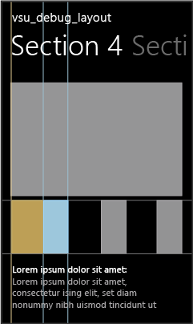
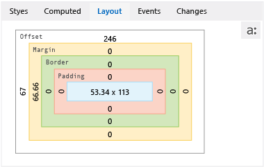

# Debug layout using DOM Explorer
[!INCLUDE[vs2017banner](../includes/vs2017banner.md)]

Applies to Windows and Windows Phone](../Image/windows_and_phone_content.png "windows_and_phone_content")  
  
 The **Layout** tab of DOM Explorer shows the [CSS box model](https://go.microsoft.com/fwlink/?LinkID=238778) for the selected element in a [!INCLUDE[win8_appname_long](../includes/win8-appname-long-md.md)] app, Windows Phone Store app, or an app created using Visual Studio Tools for Apache Cordova. You can use this visual representation of the box model to identify and modify layout-related values that affect the appearance of elements.  
  
> [!TIP]
> Changes you make in the **Layout** tab aren't permanent. You can make permanent changes to your source code, and then refresh your app by using the **Refresh Windows app** button (Windows Store and Windows Phone Store apps only) on the Debug toolbar. This way, you can avoid restarting the debugger.  
  
 To use DOM Explorer to modify aspects of layout that aren’t shown in the box model, see [Quickstart: Debug HTML and CSS](../debugger/quickstart-debug-html-and-css.md) and [Debug CSS styles using DOM Explorer](../debugger/debug-css-styles-using-dom-explorer.md).  
  
## Example of fixing a layout issue  
 This example shows how to select a list element in the Hub/Pivot template, interpret the box model values that are on the **Layout** tab, and then change one of the property values to fix a layout issue.  
  
#### To fix the layout issue  
  
1. In Visual Studio, create a new Store app that uses the Hub/Pivot project template.  
  
2. In the shared pages\hub folder, open hub.css.  
  
3. Replace the following CSS code:  
  
    ```css  
    .hubpage .hub .section4 .sub-image-row img {  
        height: 95px;  
        width: 130px;  
    }  
    ```  
  
     with this CSS code:  
  
    ```css  
    .hubpage .hub .section4 .sub-image-row img {  
        height: 95px;  
        width: 130px;  
        margin-left: 5em;  
    }  
    ```  
  
4. Select either the appName.WindowsPhone project or the appName.Windows project in Solution Explorer, and then choose **Set as Startup Project** from the shortcut menu for the project.  
  
5. Depending on your startup project, choose either **Emulator 8.1 WVGA 4 inch 512MB** or **Simulator** in the drop-down list on the Debug toolbar (**Local Machine** is the default value).  
  
       
  
6. Press F5 to run your app in debug mode.  
  
7. Open Section 4 by scrolling or flicking.  
  
    > [!TIP]
    > Position the Phone Emulator or Simulator right next to the Visual Studio window, so you can immediately see the results of your selections and changes you make to CSS styles.  
  
     When Section 4 loads, you can see that the lower images don't look right. Each item image appears cut in half (with the left half missing).  
  
8. Switch to Visual Studio and choose **Select Element** in DOM Explorer (or press Ctrl+B). This changes the selection mode so that you can select an item by clicking it, and brings the app into the foreground. The mode reverts back after a single click.  
  
    > [!TIP]
    > You can also use arrow keys or other methods to select HTML elements directly in DOM Explorer. For more info on selecting elements, see [Quickstart: Debug HTML and CSS](../debugger/quickstart-debug-html-and-css.md).  
  
9. In the Phone Emulator or Simulator, select the gray right half of one of the images that are cut in half. Highlighting appears around the selected element, as shown here in the Windows Phone Emulator:  
  
       
  
    > [!TIP]
    > The Simulator supports hovering over elements to show box highlighting around DOM elements before you select one. The Windows Phone Emulator does not support this.  
  
     When you select a DOM element, the DOM Explorer automatically selects the corresponding IMG element in Visual Studio. The element selected in DOM Explorer looks like this:  
  
    ```html  
       
    </img>  
    ```  
  
10. Click the **Layout** tab. This tab shows the box model of the selected element, as shown here in the Windows Phone Emulator.  
  
       
  
     This view provides some useful information about the element:  
  
    - Colors correspond to the box highlighting that appears in the Simulator when hovering over elements. The blue color represents the \ element dimensions. The tan color represents margin values.  
  
    - The left margin (margin-left) is set, which hints at the cause of the problem because it matches the symptom (black on the left side of images).  
  
    - The boxes that show values of 0 pixels (for example, Border and Padding) suggest that the corresponding CSS properties are probably not set.  
  
11. To see how the margin-left rule is applied, choose the **Computed** tab and look under the margin-left rule. You can see that this rule is set with a 5em value, but the computed value is either 66.66px or 146.66px, depending on your target device.  
  
    > [!TIP]
    > The **Computed** tab shows that the margin-left rule is set in the `..hubpage .hub. section4 .sub-image-row img` CSS selector, found in hub.css. In this demo app, that is where you need to make the fix.  
  
     You can also use the **Layout** tab to test modifications to layout values.  
  
12. In the **Layout** tab, choose either **66.66** or **146.66**, which appears in the **Margin** box, on the left side of the box.  
  
13. Type `0` and press Enter. (You can also use the Up Arrow and Down Arrow keys to change the value.)  
  
14. Select the other \ elements in DOM Explorer and change their margin-left values to 0.  
  
15. Switch to the Phone Emulator or the Simulator. The updated margin-left values have been applied to the Section 4 images. These values are also updated in the **Computed** tab under the margin-left rule.  
  
## See Also  
 [Quickstart: Debug HTML and CSS](../debugger/quickstart-debug-html-and-css.md)   
 [Debug CSS styles using DOM Explorer](../debugger/debug-css-styles-using-dom-explorer.md)   
 [View DOM event listeners](../debugger/view-dom-event-listeners.md)
